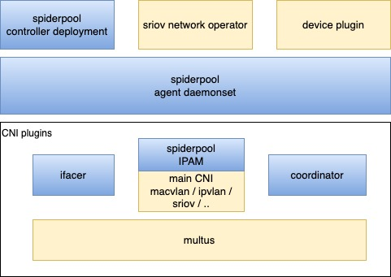

# Spiderpool

[**English**](./README.md) | **简体中文**

Spiderpool 是 [CNCF Landscape 项目](https://landscape.cncf.io/card-mode?category=cloud-native-network&grouping=category).

## Spiderpool 介绍

Spiderpool 是一个 kubernetes 的 underlay 网络解决方案，它提供了丰富的 IPAM 和 CNI 整合能力，强大了开源社区中的现有 CNI 项目，让多 CNI 协同工作可真正地可落，它使得 underlay CNI 能够完美地运行在**裸金属、虚拟机、任意公有云等环境下**。

为什么希望研发 Spiderpool ?  当前开源社区中并未提供全面、友好、智能的 underlay 网络解决方案，Spiderpool 因此提供了很多创新的功能：

* 丰富的 IPAM 能力。提供共享、独享的 IP 池，支持应用固定 IP 地址，自动化管理独享的 IP 池，实现固定 IP 地址的动态创建、扩容、缩容和回收等。

* overlay CNI 和 underlay CNI 协同，POD 具备多种 CNI 网卡。Spiderpool 能够定制多个 underlay CNI 网卡的 IP 地址，调协所有网卡之间的策略路由，以确保请求向和回复向数据路径一致而避免丢包。多 CNI 协同能有效降低集群节点的硬件一致要求。

* 增强了开源社区中的 underlay CNI，如[Macvlan CNI](https://github.com/containernetworking/plugins/tree/main/plugins/main/macvlan),
  [ipvlan CNI](https://github.com/containernetworking/plugins/tree/main/plugins/main/ipvlan),
  [SR-IOV CNI](https://github.com/k8snetworkplumbingwg/sriov-cni),
  [ovs CNI](https://github.com/k8snetworkplumbingwg/ovs-cni) 等等，打通 Pod 和宿主机的连通性，使得 clusterIP 访问、应用本地健康检测等通信成功，并且支持 Pod 的 IP 冲突检测、网关可达性检测等。

* 不仅限于应用在数据中心的裸金属环境，同时也为 openstack、vmware 和各种公有云场景，提供了统一的 underlay CNI 解决方案。

## underlay CNI

云原生网络中出现了两种技术类别，" overlay 网络方案 " 和 " underlay网络方案 "，
云原生网络对于它们没有严格的定义，我们可以从很多 CNI 项目的实现原理中，简单抽象出这两种技术流派的特点，它们可以满足不同场景下的需求。

[文章](./docs/concepts/solution-zh_CN.md) 对两种方案的 IPAM 和网络性能做了简单比较，能够更好说明 Spiderpool 的特点和使用场景。

为什么需要 underlay 网络解决方案？存在很多应用场景：

* 高性能网络需求的应用，underlay 网络方案能比 overlay 网络方案提供低网络延时、高吞吐量的优势。

* 传统的主机应用，通过主机 IP 来直接暴露服务，不能接受 NAT 映射，或者业务已经基于 VLAN 子网进行了分离。它们在上云初期，underlay 网络方案能够提供较低的云化网络迁移成本。

* 网络安全的管控需求，例如基于防火墙、VLAN 隔离等手段实施网络安全管控，例如使用传统的网络观测手段实施集群网络监控。

* underlay 网络方案能够灵活定制应用接入的 VLAN 子网，不同业务的应用因此可实施独立的子网规划，保障底层子网的业务带宽隔离，适用于如 [kubevirt](https://github.com/kubevirt/kubevirt) 、CSI 存储项目、日志采集项目等。

## 架构

Spiderpool 架构如上所示，包含了以下组件：

* Spiderpool controller: 是一组 deployment，实施了对各种 CRD 校验、状态更新、IP 回收、自动 IP 池的管理等

* Spiderpool agent：是一组 daemonset，其帮助 Spiderpool plugin 实施 IP 分配，帮助 coordinator plugin 实施信息同步

* Spiderpool plugin：在每个主机上的二进制插件，供 CNI 调用，实施 IP 分配

* coordinator plugin：在每个主机上的二进制插件，供 CNI 调用，实施多网卡路由调协、IP 冲突检查、宿主机联通等

* ifacer plugin：在每个主机上的二进制插件，帮助 macvlan 、ipvlan 等 CNI 动态创建 bond 和 vlan 子接口

除了以上 Spiderpool 自身的组件以外，还需要配合某个开源的 underlay CNI 来给 Pod 分配网卡，可配合 [Multus CNI](https://github.com/k8snetworkplumbingwg/multus-cni) 来实施多网卡和 CNI 配置管理。

任何支持第三方 IPAM 插件的 CNI 项目，都可以配合 Spiderpool，例如：
[Macvlan CNI](https://github.com/containernetworking/plugins/tree/main/plugins/main/macvlan), 
[vlan CNI](https://github.com/containernetworking/plugins/tree/main/plugins/main/vlan), 
[ipvlan CNI](https://github.com/containernetworking/plugins/tree/main/plugins/main/ipvlan), 
[SR-IOV CNI](https://github.com/k8snetworkplumbingwg/sriov-cni), 
[ovs CNI](https://github.com/k8snetworkplumbingwg/ovs-cni), 
[Multus CNI](https://github.com/k8snetworkplumbingwg/multus-cni)
[Calico CNI](https://github.com/projectcalico/calico), 
[Weave CNI](https://github.com/weaveworks/weave)

## 应用场景：一个或多个 underlay CNI 协同

如上所示，Spiderpool 工作在 underlay 模式下，可配合 underlay CNI （例如 [Macvlan CNI](https://github.com/containernetworking/plugins/tree/main/plugins/main/macvlan), [SR-IOV CNI](https://github.com/k8snetworkplumbingwg/sriov-cni) ）实现:

* 为 underlay CNI 提供丰富的 IPAM 能力,包括共享/固定 IP、多网卡 IP 分配、双栈支持等

* 为 Pod 接入一个或者多个 underlay 网卡，并能调协多个 underlay CNI 网卡间的路由，以实现请求向和回复向数据路径一致，确保网络通信畅通

* 通过额外接入 veth 网卡和路由控制，帮助开源 underlay CNI 联通宿主机，实现 clusterIP 访问、应用的本地健康检测等

当一个集群中存在多种基础设置时，如何使用单一的 underlay CNI 来部署容器呢？

* 在一个集群中，部分节点是虚拟机，例如未打开混杂转发模式的 vmware 虚拟机，而部分节点是裸金属，接入了传统交换机网络。因此在两类节点上部署什么 CNI 方案呢 ？

* 在一个集群中，部分裸金属节点只具备一张 SR-IOV 高速网卡，但只能提供 64 个 VF，如何在一个节点上运行更多的 Pod？

* 在一个集群中，部分裸金属节点具备 SR-IOV 高速网卡，可以运行低延时应用，部分节点不具备 SR-IOV 高速网卡，可以运行普通应用。但在两类节点部署上什么 CNI 方案呢 ？

结合 multus 的 CNI 配置管理和 Spiderpool IPAM 的通用性，可同时运行多种 underlay CNI，充分整合集群中各种基础设施节点的资源，来解决以上问题。

例如上图所示，在同一个集群下具备不同网络能力的节点， 有的节点具备 SR-IOV 网卡，可运行 SR-IOV CNI，有的节点具备普通的网卡，可运行 Macvlan CNI ，有的节点网络访问受限（例如二层网络转发受限的 vmware 虚拟机），可运行 ipvlan CNI。

## 应用场景：underlay CNI 与 overlay CNI 协同

如上所示，Spiderpool 工作在 overlay 模式下，使用 multus 同时为 Pod 插入一张 overlay 网卡（例如 [Calico](https://github.com/projectcalico/calico), [Cilium](https://github.com/cilium/cilium) ）和若干张 underlay 网卡（例如 [Macvlan CNI](https://github.com/containernetworking/plugins/tree/main/plugins/main/macvlan), [SR-IOV CNI](https://github.com/k8snetworkplumbingwg/sriov-cni) ），可实现:

* 为 underlay CNI 提供丰富的 IPAM 能力,包括共享/固定 IP、多网卡 IP 分配、双栈支持等

* 为 Pod 的多个 underlay CNI 网卡和 overlay 网卡调协路由，以实现请求向和回复向数据路径一致，确保网络通信畅通

* 以 overlay 网卡作为缺省网卡，并调协路由，通过 overlay 网卡联通本地宿主机，实现 clusterIP 访问、应用的本地健康检测、overlay 网络流量通过 overlay 网络转发，而 underlay 网络流量通过 underlay 网卡转发。

结合 multus 的 CNI 配置管理和 Spiderpool IPAM 的通用性，可同时运行一种 overlay CNI 和 多种 underlay CNI。例如，在同一个集群下具备不同网络能力的节点， 裸金属节点上的 Pod 同时接入 overlay CNI 和 underlay CNI 网卡，虚拟机节点上的 Pod 只提供集群东西向服务，只接入 overlay CNI 网卡。
带来了如下好处：

* 把提供东西向服务的应用只接入 overlay 网卡，提供南北向服务的应用同时接入 overlay 和 underlay 网卡，在保障集群内 Pod 连通性基础上，能够降低 underlay IP 资源的用量，减少相应的人工运维成本

* 充分整合虚拟机和裸金属节点资源

## 应用场景 ：underlay CNI 运行在公有云环境和虚拟机

在公有云、openstack、vmvare 等环境下实施 underlay CNI，通常只能使用特定环境的厂商 CNI 插件，因为这些环境通常有如下限制：

* IAAS 网络基础设施对虚拟机网卡发出的数据包，实施了二层报头中的 MAC 限制，一方面，对源 MAC 进行安全检查，以确保源 MAC 地址与虚拟机网卡 MAC 相同，不支持未知目的 MAC 。另一方面，对目的 MAC 做了限制，只支持转发 IAAS 中所有虚拟机网卡的 MAC，不支持未知目的 MAC 。
    通常的 CNI 插件，POD 分配的网卡的 MAC 地址是新生成的，这使得 POD 通信失败。

* IAAS 网络基础设施对虚拟机网卡发出的数据包，实施了三层报头的 IP 限制，只有数据包的目的和源 IP 是在 IAAS 中分配给了虚拟机网卡时，数据包才能得到转发。
    通常的 CNI 插件，给 POD 分配的 IP 地址不符合 IAAS 设置，这使得 POD 通信失败。

spiderpool 提供了节点拓扑的 IP 池功能，与虚拟机的相同 IP 分配设置对齐，再配合 ipvlan CNI，从而能够为各种公有云环境提供 underlay CNI 解决方案

## 快速开始

快速搭建 Spiderpool，启动一个应用，可参考 [快速搭建](./docs/usage/install.md).

## 功能

* 对于有固定 IP 需求的应用，可以通过设置 IP 池有限的的 IP 地址集合和应用亲和性来支持。可参考 [例子](./docs/usage/spider-subnet.md)

    对于没有固定 IP 需求的应用，它们可以通过共享一个 IP 池，可参考 [例子](./docs/usage/ippool-affinity-pod.md#shared-ippool).

* 对于 statefulset 应用，spiderpool 支持自动为每一个 POD 固定 IP 地址，也可控制应用所有 POD 所使用的 IP 范围。[例子](./docs/usage/statefulset.md)

* Subnet 功能，一方面，能够实现基础设施管理员和应用管理员的职责分离。

    另一方面，能够为有固定 IP 需求的应用自动管理 IP 池，包括自动创建、扩缩容 IP、删除 固定 IP 池，这能够减少大量的运维负担，可参考 [例子](./docs/usage/spider-subnet.md)。该功能除了支持 K8S 原生的应用控制器，同时支持基于 operator 实现的第三方应用控制器. 可参考 [例子](./docs/usage/third-party-controller.md)

* 对于一个跨子网部署的应用，支持为其不同副本分配不同子网的 IP 地址。可参考 [例子](./docs/usage/ippool-affinity-node.md)

* 支持为 POD 多网卡分配不同子网的 IP 地址，并帮助所有网卡之间协调策略路由，以确保请求向和回复向数据路径一致，避免丢包。

    对于 POD 具备多个 underlay CNI 网卡场景，可参考 [例子](./docs/usage/multi-interfaces-annotation.md)

    对于 POD 具备一个 overlay 网卡和多个 underlay CNI 网卡场景，可参考 [例子](./docs/usage/install/overlay/get-started-calico.md)

* 可以设置集群级别的默认 IP 池，也可租户级别的默认 IP 池。同时，IP 池既可以被整个集群共享，也可被限定为被一个租户使用。可参考 [例子](./docs/usage/ippool-affinity-namespace.md)

* 对于开源的 [Macvlan CNI](https://github.com/containernetworking/plugins/tree/main/plugins/main/macvlan),
  [vlan CNI](https://github.com/containernetworking/plugins/tree/main/plugins/main/vlan),
  [ipvlan CNI](https://github.com/containernetworking/plugins/tree/main/plugins/main/ipvlan),
  [SR-IOV CNI](https://github.com/k8snetworkplumbingwg/sriov-cni),
  [ovs CNI](https://github.com/k8snetworkplumbingwg/ovs-cni)等，可帮助解决 ClusterIP 访问、Pod 宿主机健康检查等问题，可参考 [例子](./docs/usage/get-started-macvlan.md)。

  并且，能够帮助实施 IP 地址冲突检测、网关可达性检测，以保证 Pod 通信正常，可参考 [例子](./docs/usage/coodinator.md)。

* 基于节点拓扑的 IP 池功能，支持运行在裸金属[例子](./docs/usage/install/underlay/get-started-cloud-zh_CN.md)、
  vmware 虚拟机[例子](./docs/usage/install/underlay/get-started-vmware-zh_CN.md)、
  openstack 虚拟机[例子](./docs/usage/install/underlay/get-started-openstack-zh_CN.md)、
  公有云[例子](./docs/usage/install/underlay/get-started-cloud-zh_CN.md)等场景。

* 在 POD 启动时，能够在宿主机上动态创建 BOND 接口和 VLAN 子接口，以帮助 [Macvlan CNI](https://github.com/containernetworking/plugins/tree/main/plugins/main/macvlan) 和 [ipvlan CNI](https://github.com/containernetworking/plugins/tree/main/plugins/main/ipvlan) 准备 master 接口。可参考 [例子](./docs/usage/ifcacer.md).

* 可以通过 IP 池和 POD annotaiton 等多种方式定制自定义路由，可参考 [例子](./docs/usage/route.md)

* 以最佳实践的 CNI 配置来便捷地生成 [Multus](https://github.com/k8snetworkplumbingwg/multus-cni) NetworkAttachmentDefinition 实例，并且保证其正确的 JSON 格式来提高使用体验。[例子](./docs/concepts/mulltus-zh_CN.md)

* 应用可设置多个 IP 池，实现 IP 资源的备用效果。可参考 [例子](./docs/usage/ippool-multi.md)

* 设置全局的预留 IP ，让 IPAM 不分配出这些 IP 地址，这样能避免与集群外部的已用 IP 冲突。可参考 [例子](./docs/usage/reserved-ip.md)

* 分配和释放 IP 地址的高效性能，[报告](./docs/usage/performance-zh_CH.md)

* 合理的 IP 回收机制设计，使得集群或应用在故障恢复过程中，能够及时分配到 IP 地址。可参考 [例子](./docs/usage/gc.md)

* 所有的功能，都能够在 ipv4-only、ipv6-only、dual-stack 场景下工作. [例子](./docs/usage/ipv6.md)。

* 支持 AMD64 和 ARM64

* [指标](./docs/concepts/metrics.md)

## License

Spiderpool is licensed under the Apache License, Version 2.0. See [LICENSE](./LICENSE) for the full license text.
