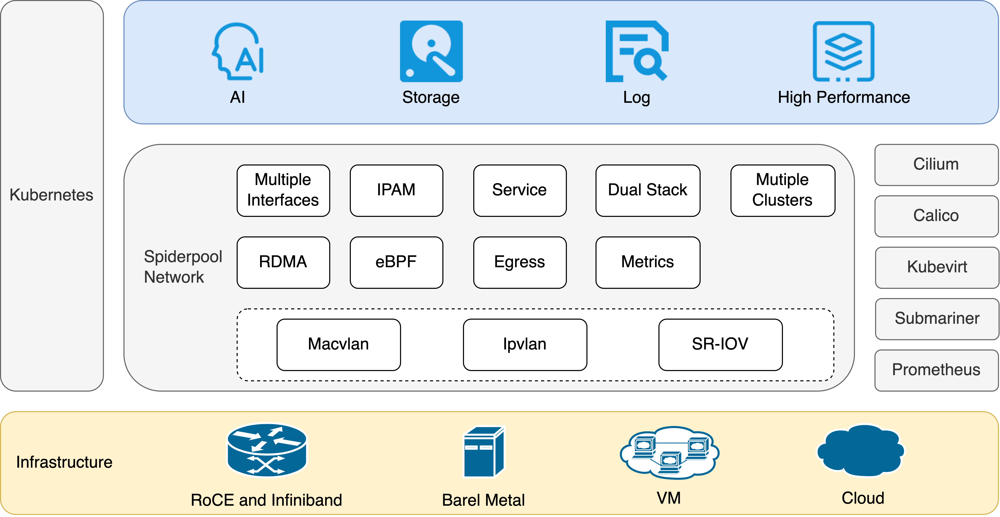

#

**English** | [**简体中文**](./README-zh_CN.md)

We are a [Cloud Native Computing Foundation](https://www.cncf.io) [sandbox project](https://landscape.cncf.io/card-mode?category=cloud-native-network&grouping=category).

Spiderpool is the underlay and RDMA network solution of the Kubernetes, for bare metal, VM and any public cloud.

## Introduction

Spiderpool is an underlay and RDMA network solution for the Kubernetes. It enhances the capabilities of [Macvlan CNI](https://github.com/containernetworking/plugins/tree/main/plugins/main/macvlan),
[ipvlan CNI](https://github.com/containernetworking/plugins/tree/main/plugins/main/ipvlan),
[SR-IOV CNI](https://github.com/k8snetworkplumbingwg/sriov-cni), fulfills various networking needs, and supports to run on **bare metal, virtual machine, and public cloud environments**. Spiderpool delivers exceptional network performance, particularly benefiting network I/O-intensive and low-latency applications like **storage, middleware, and AI**.
It could refer to [website](https://spidernet-io.github.io/spiderpool/) for more details.

## Stable Releases

The Spiderpool community maintains minor stable releases for the last three minor Spiderpool versions. Older Spiderpool stable versions from minor releases prior to that are considered EOL.

For upgrades to new minor releases please consult the [Spiderpool Upgrade Guide](./docs/usage/install/upgrade.md).

Listed below are the release notes for the currently maintained release branches and their latest released patches:

|                         release branches                             |                               Release Notes                                       |
| -------------------------------------------------------------------- | --------------------------------------------------------------------------------- |
| [release-v0.9](https://github.com/spidernet-io/spiderpool/tree/release-v0.9) | [Release Notes](https://github.com/spidernet-io/spiderpool/releases/tag/v0.9.4)   |
| [release-v0.8](https://github.com/spidernet-io/spiderpool/tree/release-v0.8) | [Release Notes](https://github.com/spidernet-io/spiderpool/releases/tag/v0.8.7)   |
| [release-v0.7](https://github.com/spidernet-io/spiderpool/tree/release-v0.7)    | [Release Notes](https://github.com/spidernet-io/spiderpool/releases/tag/v0.7.3)   |

## The Advantages Of Underlay CNI

The underlay CNI is mainly including macvlan, ipvlan, and SR-IOV, which cloud access the layer 2 network of the node. It has some advantages:

* macvlan, ipvlan, and SR-IOV is crucial for supporting RDMA network acceleration. RDMA significantly enhances performance for AI applicaitons, latency-sensitive and network I/O-intensive applications, surpassing overlay network solutions in terms of network performance.

* Unlike CNI solutions based on veth virtual interfaces, underlay networks eliminate layer 3 network forwarding on the host, avoiding tunnel encapsulation overhead. This translates to excellent network performance with high throughput, low latency, and reduced CPU utilization for network forwarding.

* Connecting seamlessly with underlay layer 2 VLAN networks enables both layer 2 and layer 3 communication for applications. It supports multicast and broadcast communication, while allowing packets to be controlled by firewalls.

* Data packages carry the actual IP addresses of Pods, enabling direct north-south communication based on Pod IPs. This connectivity across multi-cloud networks enhances flexibility and ease of use.

* Underlay CNI can create virtual interfaces using different parent network interfaces on the host, providing isolated subnets for applications with high network overhead, such as storage and observability.

## Major Features

* Simplified installation and usage

    Through eliminating the need for manually installing multiple components such as [Multus CNI](https://github.com/k8snetworkplumbingwg/multus-cni) , RDMA and SR-IOV, Spiderpool simplifies the installation process and decreases the number of running PODs. It provides streamlined installation procedures, encapsulates relevant CRDs, and offers comprehensive documentation for easy setup and management.

* CRD-based dual-stack IPAM

    Spiderpool provides exclusive and shared IP address pools, supporting various affinity settings. It supports to assign static IP addresses for stateful applications such as [mysql](https://www.mysql.com), [redis](https://github.com/redis/redis), [kubevirt](https://github.com/kubevirt/kubevirt), while enabling fixed IP address ranges for stateless ones. Spiderpool automates the management of exclusive IP pools, ensuring excellent IP reclamation to avoid IP leakage. In additions, it provides [wonderful IPAM performance](./docs/concepts/ipam-performance.md).

    The IPAM of Spiderpool could be available for any main CNI supporting third-party IPAM plugin, not only including [Macvlan CNI](https://github.com/containernetworking/plugins/tree/main/plugins/main/macvlan), [ipvlan CNI](https://github.com/containernetworking/plugins/tree/main/plugins/main/ipvlan), and [SR-IOV CNI](https://github.com/k8snetworkplumbingwg/sriov-cni), but also [calico](https://github.com/projectcalico/calico) and [weave](https://github.com/weaveworks/weave) as static IP usage.

* Multiple network interfaces from underlay and overlay CNI

    Spiderpool enables scenarios where Pods can have multiple underlay CNI interfaces or a combination of overlay and underlay CNI interfaces. It ensures proper IP addressing for each CNI interface and effectively manages policy routing to maintain consistent data paths, eliminating packet loss concerns. It could strengthen [cilium](https://github.com/cilium/cilium), [calico](https://github.com/projectcalico/calico), and [kubevirt](https://github.com/kubevirt/kubevirt).

* Enhanced network connectivity

    As we know, native CNI of macvlan ipvlan SR-IOV has lots of communication limits. However, Spiderpool establishes seamless connectivity between Pods and host machines, ensuring smooth functioning of Pod health checks. It enables Pods to access services through kube-proxy or eBPF-based kube-proxy replacement. Additionally, it supports advanced features like IP conflict detection and gateway reachability checks. The network of Multi-cluster could be connected by a same underlay network, or [Submariner](https://github.com/submariner-io/submariner).

* eBPF enhancements

    The eBPF-based kube-proxy replacement significantly accelerates service access, while socket short-circuiting technology improves local Pod communication efficiency within the same node. Compared with kube-proxy manner, [the improvement of the performance is Up to 25% on network delay, up to 50% on network throughput](./docs/concepts/io-performance.md).

* RDMA support

    Spiderpool offers RDMA solutions based on RoCE and InfiniBand technologies. POD could use the RDMA device in shared or exclusive mode, and it is fit for AI workloads.

* Dual-stack network support

    Spiderpool supports IPv4-only, IPv6-only, and dual-stack environments.

* Good network performance of latency and throughput

    Spiderpool performs better than overlay CNI on network latency and throughput, referring to [performance report](./docs/concepts/io-performance.md).

* Metrics

## Application Scenarios

Spiderpool, powered by underlay CNI, offers unparalleled network performance compared to overlay CNI solutions, as evidenced in [I/O Performance](./docs/concepts/io-performance.md). It can be effectively applied in various scenarios, including:

* Support to deploy on the environments of bare metal, virtual machine, and public cloud, especially offer an unified underlay CNI solution for hybrid cloud.

* Traditional host applications. They hope to directly use the underlay network, with the reasons such as direct access to the underlay multi-subnet, multicast, multicast, layer 2 network communication, etc. They cannot accept the NAT of the overlay network and hope to seamlessly migrate to Kubernetes.

* Network I/O-intensive applications such as middleware, data storage, log observability, and AI training.

* Applications which needs a separate network bandwidth.

* Latency-sensitive application.

## Quick Start

* Refer to [Quick start](./docs/usage/install/get-started-kind.md) to explore Spiderpool quickly.

* Refer to [Usage Index](./docs/usage/readme.md) for usage details.

* Refer to [Spiderpool Architecture](./docs/concepts/arch.md) for more detailed information

## Roadmap

| Features                         | macvlan    | ipvlan            | SR-IOV      |
|----------------------------------|------------|-------------------|-------------|
| Service By Kubeproxy             | Beta       | Beta              | Beta        |
| Service By Kubeproxy Replacement | Alpha      | Alpha             | Alpha       |
| Network Policy                   | In-plan    | Alpha             | In-plan     |
| Bandwidth                        | In-plan    | Alpha             | In-plan     |
| RDMA                             | Alpha      | Alpha             | Alpha       |
| IPAM                             | Beta       | Beta              | Beta        |
| Multi-Cluster                    | Alpha      | Alpha             | Alpha       |
| Egress Policy                    | Alpha      | Alpha             | Alpha       |
| Multiple NIC And Routing Coordination | Beta  | Beta              | Beta        |
| Scenarios                        | Bare metal | Bare metal and VM | Bare metal  |

For detailed information about all the planned features, please refer to the [roadmap](./docs/develop/roadmap.md).

## Blogs

Refer to [Blogs](./docs/concepts/blog.md).

## Governance

The project is governed by a group of [Maintainers and Committers](./AUTHORS). How they are selected and govern is outlined in our [Governance Document](https://github.com/spidernet-io/community/blob/main/GOVERNANCE-maintainer.md).

## Adopters

A list of adopters who are deploying Spiderpool in production, and of their use cases, can be found in [file](./docs/USERS.md).

## Contribution

Refer to [Contribution](./docs/develop/contributing.md) to join us for developing Spiderppol.

## Community

The Spiderpool community is committed to fostering an open and welcoming environment, with several ways to engage with other users and developers.
You can find out more information by visiting our [community repository](https://github.com/spidernet-io/community).

If you have any questions, please feel free to reach out to us through the following channels:

* Slack: join the [#Spiderpool](https://cloud-native.slack.com/messages/spiderpool) channel on CNCF Slack by requesting an **[invitation](https://slack.cncf.io/)** from CNCF Slack. Once you have access to CNCF Slack, you can join the Spiderpool channel.

* Email: refer to the [MAINTAINERS.md](https://github.com/spidernet-io/spiderpool/blob/main/MAINTAINERS.md)  to find the email addresses of all maintainers. Feel free to contact them via email to report any issues or ask questions.

* Community Meeting: Welcome to our [community meeting](https://docs.google.com/document/d/1tpNzxRWOz9-jVd30xGS2n5X02uXQuvqJAdNZzwBLTmI/edit?usp=sharing) held on the 1st of every month. Feel free to join and discuss any questions or topics related to Spiderpool.

* WeChat group: scan the QR code below to join the Spiderpool technical discussion group and engage in further conversations with us.

## License

Spiderpool is licensed under the Apache License, Version 2.0.
See [LICENSE](./LICENSE) for the full license text.

## Others

Copyright The Spiderpool Authors

We are a [Cloud Native Computing Foundation](https://www.cncf.io) [sandbox project](https://landscape.cncf.io/?item=runtime--cloud-native-network--spiderpool).

The Linux Foundation® (TLF) has registered trademarks and uses trademarks. For a list of TLF trademarks, see [Trademark Usage](https://www.linuxfoundation.org/legal/trademark-usage).

&nbsp
  

