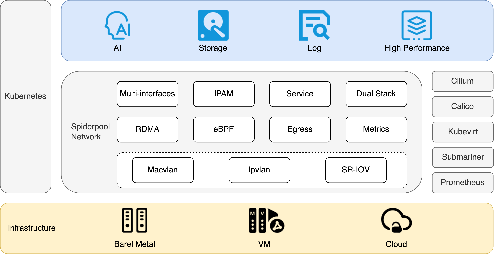

# Spiderpool

***

**English** | [**简体中文**](./README-zh_CN.md)

**As a [CNCF Landscape Level Project](https://landscape.cncf.io/card-mode?category=cloud-native-network&grouping=category), Spiderpool is the underlay and RDMA network solution of the Kubernetes, for bare metal, VM and any public cloud**

## Introduction

Spiderpool is a Kubernetes underlay network solution that enhances the capabilities of [Macvlan CNI](https://github.com/containernetworking/plugins/tree/main/plugins/main/macvlan),
[ipvlan CNI](https://github.com/containernetworking/plugins/tree/main/plugins/main/ipvlan),
[SR-IOV CNI](https://github.com/k8snetworkplumbingwg/sriov-cni).It fulfills various networking needs and enables the utilization of underlay network solutions in **bare metal, virtual machine, and public cloud environments**. Spiderpool delivers exceptional network performance, particularly benefiting network I/O-intensive and low-latency applications like **storage, middleware, and AI**.
It could refer to [website](https://spidernet-io.github.io/spiderpool/) for more details.

**Why does Spiderpool select macvlan, ipvlan, and SR-IOV as datapaths?**

* macvlan, ipvlan, and SR-IOV is crucial for supporting RDMA network acceleration. RDMA significantly enhances performance for AI applicaitons, latency-sensitive and network I/O-intensive applications, surpassing overlay network solutions in terms of network performance.

* Unlike CNI solutions based on veth virtual interfaces, underlay networks eliminate layer 3 network forwarding on the host, avoiding tunnel encapsulation overhead. This translates to excellent network performance with high throughput, low latency, and reduced CPU utilization for network forwarding.

* Connecting seamlessly with underlay layer 2 VLAN networks enables both layer 2 and layer 3 communication for applications. It supports multicast and broadcast communication, while allowing packets to be controlled by firewalls.

* Data packages carry the actual IP addresses of Pods, enabling direct north-south communication based on Pod IPs. This connectivity across multi-cloud networks enhances flexibility and ease of use.

* Underlay CNI can create virtual interfaces using different parent network interfaces on the host, providing isolated subnets for applications with high network overhead, such as storage and observability.

  

**What enhancements does Spiderpool provide for macvlan, ipvlan, and SR-IOV CNI?**

* Simplified installation and usage

    Spiderpool simplifies the installation process by eliminating the need for manually installing multiple components like [Multus CNI](https://github.com/k8snetworkplumbingwg/multus-cni). It provides streamlined installation procedures, encapsulates relevant CRDs, and offers comprehensive documentation for easy setup and management.

* CRD-based dual-stack IPAM capability

    Spiderpool provides exclusive and shared IP address pools, supporting various affinity settings. It allows configuring specific IP addresses for stateful applications like middleware and kubevirt, while enabling fixed IP address ranges for stateless ones. Spiderpool automates the management of exclusive IP pools, ensuring excellent IP reclamation to avoid IP leakage. In additions, it owns [wonderful IPAM performance](./docs/concepts/ipam-performance.md) .

* Multiple network interface access for Pods

    Spiderpool enables scenarios where Pods can have multiple underlay CNI interfaces or a combination of overlay and underlay CNI interfaces. It ensures proper IP addressing for each CNI interface and effectively manages policy routing to maintain consistent data paths, eliminating packet loss concerns. It could strengthen [cilium](https://github.com/cilium/cilium), [calico](https://github.com/projectcalico/calico), [kubevirt](https://github.com/kubevirt/kubevirt) .

* Enhanced network connectivity

    Spiderpool establishes seamless connectivity between Pods and host machines, ensuring smooth functioning of Pod health checks. It enables Pods to access services through kube-proxy or eBPF-based kube-proxy replacement. Additionally, it supports advanced features like IP conflict detection and gateway reachability checks.

* eBPF enhancements

    The eBPF-based kube-proxy replacement significantly accelerates service access, while socket short-circuiting technology improves local Pod communication efficiency within the same node. Compared with kube-proxy manner, [the improvement of the performance is Up to 25% on network delay, up to 50% on network throughput]((./docs/concepts/io-performance.md)).

* RDMA support

    Spiderpool provides RDMA solutions based on RoCE and InfiniBand technologies.

* Dual-stack network support

    Spiderpool supports IPv4-only, IPv6-only, and dual-stack environments.

* Good network performance of latency and throughput

    Spiderpool performs better than overlay CNI on network latency and throughput, referring to [performance report](./docs/concepts/io-performance.md)

* Metrics

**Which scenarios can Spiderpool be applied in?**

Spiderpool, powered by underlay CNI, offers unparalleled network performance compared to overlay CNI solutions, as evidenced in [I/O Performance](./docs/concepts/io-performance.md). It can be effectively applied in various scenarios, including:

* Provide a unified underlay CNI solution for bare metal, virtual machine, and public cloud environments.

* Traditional host applications.

* Network I/O-intensive applications such as middleware, data storage, log observability, and AI training.

* Latency-sensitive application.

## Quick start

Refer to [Quick start](./docs/usage/install/get-started-kind.md) to explore Spiderpool quickly.

## Spiderpool Architecture

Spiderpool features a well-designed and comprehensive architecture that caters to various application scenarios, including:

* Pods have multiple underlay CNI network interfaces to establish connections with underlay networks.

* Pods have an underlay CNI and multiple underlay CNI network interfaces, enabling dual-network connectivity.

* Underlay CNIs run in public cloud environments or virtual machines.

* Leverage RDMA for efficient network transmission.

For more detailed information, please refer to [Spiderpool Architecture](./docs/concepts/arch.md).

## Major Features

| Features                               | macvlan    | ipvlan | SR-IOV      |
|----------------------------------|------------|--|-------------|
| Service by kubeproxy             | Beta       |  Beta | Beta        |
| Service by kubeproxy replacement | Alpha      |  Alpha | Alpha       |
| Network policy                   | In-plan    |  Alpha | In-plan     |
| Bandwidth                        | In-plan    | Alpha | In-plan     |
| RDMA                             | Alpha      | Alpha | Alpha       |
| IPAM                             | Beta       | Beta | Beta        |
| Egress policy                    | Alpha      | Alpha | Alpha       |
| Multiple NIC and routing coordination                         | Beta       | Beta | Beta        |
| Applied scenarios                             | Bare metal | Bare metal and VM | Bare metal  |

For detailed information about all the planned features, please refer to the [roadmap](./docs/develop/roadmap.md).

## Blogs

Refer to [Blogs](./docs/concepts/blog.md)

## Governance

The project is governed by a group of [Maintainers and Committers](./AUTHORS). How they are selected and govern is outlined in our [governance document](./docs/develop/CODE-OF-CONDUCT.md).

## Adopters

A list of adopters who are deploying Spiderpool in production, and of their use cases, can be found in [file](./docs/USERS.md).

## Contribution

Refer to [Contribution](./docs/develop/contributing.md) to join us for developing Spiderppol.

## Contact Us

If you have any questions, please feel free to reach out to us through the following channels:

* Slack: join the [#Spiderpool](https://cloud-native.slack.com/messages/spiderpool) channel on CNCF Slack by requesting an **[invitation](https://slack.cncf.io/)** from CNCF Slack. Once you have access to CNCF Slack, you can join the Spiderpool channel.

* Email: refer to the [MAINTAINERS.md](https://github.com/spidernet-io/spiderpool/blob/main/MAINTAINERS.md)  to find the email addresses of all maintainers. Feel free to contact them via email to report any issues or ask questions.

* WeChat group: scan the QR code below to join the Spiderpool technical discussion group and engage in further conversations with us.

## License

Spiderpool is licensed under the Apache License, Version 2.0.
See [LICENSE](./LICENSE) for the full license text.

&nbsp;&nbsp;
  
Spiderpool enriches the <a href="https://landscape.cncf.io/?selected=spiderpool">CNCF Cloud Native Landscape</a>.

