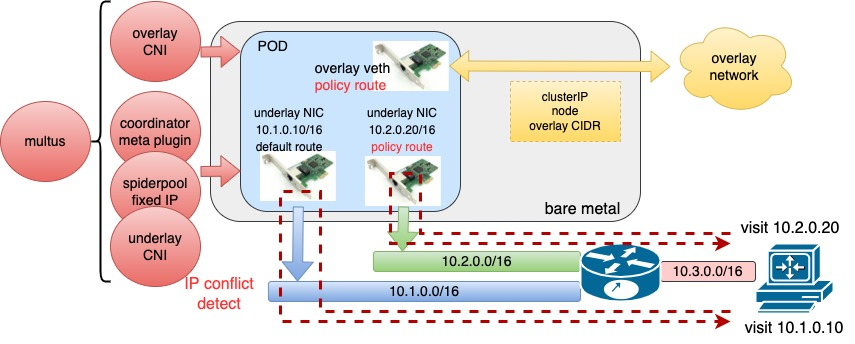
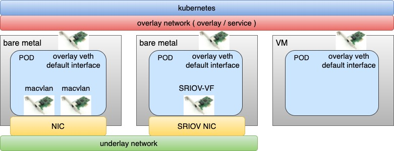
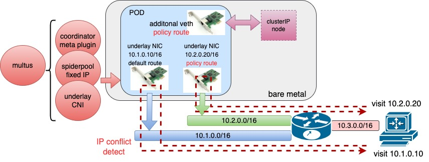
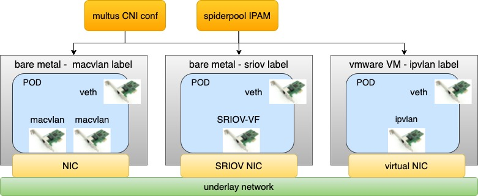

# 架构

**简体中文** | [**English**](./arch.md)

## 架构介绍

Spiderpool 架构如上所示，包含了以下组件：

* Spiderpool-controller

    一组 deployment，与 API-Server 交互, 管理多个 CRD 资源: 如 [SpiderIPPool](../reference/crd-spiderippool.md)、[SpiderSubnet](../reference/crd-spidersubnet.md)、[SpiderMultusConfig](../reference/crd-spidermultusconfig.md) 等, 实施这些 CRD 的校验、创建、状态。 并且响应来自 Spiderpool-agent Pod 的请求，分配、释放、回收、自动IP 池等功能。

* Spiderpool-agent

    一组 daemonset，运行在每个节点。帮助安装 Multus、Coordinator、IPAM、CNI 等插件到每个节点。并响应 CNI 创建 Pod 时分配 IP 的请求，并与 Spiderpool-controller 交互，完成 Pod IP 的分配与释放。同时与 Coordinator 交互, 的其帮助 Spiderpool plugin 实施 IP 分配，帮助 coordinator plugin 实施配置同步。

* CNI plugins，它们包括如下：

    Spiderpool IPAM plugin：供 main CNI 调用，实施 IP 分配。参考 [IPAM plugin](../reference/plugin-ipam.md)

    coordinator plugin：作为 chain plugin，实施多网卡路由调谐、IP 冲突检查、宿主机联通、MAC 地址固定等。参考 [coordinator](../concepts/coordinator-zh_CN.md)

    ifacer plugin：作为 chain plugin，可自动创建 bond、vlan 虚拟接口，作为 macvlan、ipvlan 等插件的父接口使用。参考 [Ifacer 插件](../reference/plugin-ifacer.md)

    [Multus CNI](https://github.com/k8snetworkplumbingwg/multus-cni): CNI plugin 的调度器

    CNI plugins: 包括 [Macvlan CNI](https://github.com/containernetworking/plugins/tree/main/plugins/main/macvlan),
          [vlan CNI](https://github.com/containernetworking/plugins/tree/main/plugins/main/vlan),
          [ipvlan CNI](https://github.com/containernetworking/plugins/tree/main/plugins/main/ipvlan),
          [SR-IOV CNI](https://github.com/k8snetworkplumbingwg/sriov-cni),
          [ovs CNI](https://github.com/k8snetworkplumbingwg/ovs-cni),
          [Calico CNI](https://github.com/projectcalico/calico),
          [Weave CNI](https://github.com/weaveworks/weave),
          [Cilium CNI](https://github.com/cilium/cilium) 等。

* SR-IOV 组件：

    [SR-IOV network operator](https://github.com/k8snetworkplumbingwg/sriov-network-operator): 便于安装和配置使用 sriov-cni，更多参考 [sriov-cni 使用](../usage/install/underlay/get-started-sriov-zh_CN.md)

* RDMA 组件:

    [RDMA shared device plugin](https://github.com/Mellanox/k8s-rdma-shared-dev-plugin): 用于发现主机上的共享 RDMA 设备，并上报给 Kubelet, 以供 RDMA CNI 使用

    [RDMA CNI](https://github.com/k8snetworkplumbingwg/rdma-cni): 实现 RDMA 网卡的网络命名空间隔离

    [SR-IOV network operator](https://github.com/k8snetworkplumbingwg/sriov-network-operator): 便于安装和配置使用 sriov-cni

## 应用场景：Pod 接入一个 overlay CNI 和若干个 underlay CNI 网卡

如上所示，Spiderpool 工作在 overlay 模式下，使用 multus 同时为为 Pod 插入一张 overlay 网卡（例如 [calico](https://github.com/projectcalico/calico), [cilium](https://github.com/cilium/cilium) ）和若干张 underlay 网卡（例如 [macvlan CNI](https://github.com/containernetworking/plugins/tree/main/plugins/main/macvlan), [sriov CNI](https://github.com/k8snetworkplumbingwg/sriov-cni) ），可实现:

* 为 underlay CNI 提供丰富的 IPAM 能力,包括共享/固定 IP、多网卡 IP 分配、双栈支持等

* 为 Pod 的多个 underlay CNI 网卡和 overlay 网卡调谐路由，以实现请求向和回复向数据路径一致，确保网络通信畅通

* 以 overlay 网卡作为缺省网卡，并调谐路由，通过 overlay 网卡联通本地宿主机，实现 clusterIP 访问、应用的本地健康检测、overlay 网络流量通过 overlay 网络转发，而 underlay 网络流量通过 underlay 网卡转发。

结合 multus 的 CNI 配置管理和 Spiderpool IPAM 的通用性，可同时运行一种 overlay CNI 和 多种 underlay CNI。例如，在同一个集群下具备不同网络能力的节点， 裸金属节点上的 Pod 同时接入 overlay CNI 和 underlay CNI 网卡，虚拟机节点上的 Pod 只提供集群东西向服务，只接入 overlay CNI 网卡。
带来了如下好处：

* 把提供东西向服务的应用只接入 overlay 网卡，提供南北向服务的应用同时接入 overlay 和 underlay 网卡，在保障集群内 Pod 连通性基础上，能够降低 underlay IP 资源的用量，减少相应的人工运维成本

* 充分整合虚拟机和裸金属节点资源

## 应用场景：Pod 接入若干个 underlay CNI 网卡

如上所示，Spiderpool 工作在 underlay 模式下，可配合 underlay CNI （例如 [macvlan CNI](https://github.com/containernetworking/plugins/tree/main/plugins/main/macvlan), [SR-IOV CNI](https://github.com/k8snetworkplumbingwg/sriov-cni) ）实现:

* 为 underlay CNI 提供丰富的 IPAM 能力,包括共享/固定 IP、多网卡 IP 分配、双栈支持等

* 为 Pod 接入一个或者多个 underlay 网卡，并能调谐多个 underlay CNI 网卡间的路由，以实现请求向和回复向数据路径一致，确保网络通信畅通

* 通过额外接入 veth 网卡和路由控制，帮助开源 underlay CNI 联通宿主机，实现 clusterIP 访问、应用的本地健康检测等

当一个集群中存在多种基础设置时，如何使用单一的 underlay CNI 来部署容器呢？

* 在一个集群中，部分节点是虚拟机，例如未打开混杂转发模式的 vmware 虚拟机，而部分节点是裸金属，接入了传统交换机网络。因此在两类节点上部署什么 CNI 方案呢 ？

* 在一个集群中，部分裸金属节点只具备一张 SRIOV 高速网卡，但只能提供 64 个 VF，如何在一个节点上运行更多的 Pod ？

* 在一个集群中，部分裸金属节点具备 SRIOV 高速网卡，可以运行低延时应用，部分节点不具备 SRIOV 高速网卡，可以运行普通应用。但在两类节点部署上什么 CNI 方案呢 ？

结合 multus 的 CNI 配置管理和 Spiderpool IPAM 的通用性，可同时运行多种 underlay CNI，充分整合集群中各种基础设施节点的资源，来解决以上问题。

例如上图所示，在同一个集群下具备不同网络能力的节点， 有的节点具备 SR-IOV 网卡，可运行 SR-IOV CNI，有的节点具备普通的网卡，可运行 macvlan CNI ，有的节点网络访问受限（例如二层网络转发受限的 vmware 虚拟机），可运行 ipvlan CNI。

## 应用场景 ：underlay CNI 运行在公有云环境和虚拟机

在公有云、OpenStack、vmvare 等环境下实施 underlay CNI，通常只能使用特定环境的厂商 CNI 插件，因为这些环境通常有如下限制：

* IAAS 网络基础设施对虚拟机网卡发出的数据包，实施了二层报头中的 MAC 限制，一方面，对源 MAC 进行安全检查，
  以确保源 MAC 地址与虚拟机网卡 MAC 相同，不支持未知目的 MAC。另一方面，对目的 MAC 做了限制，只支持转发
  IAAS 中所有虚拟机网卡的 MAC，不支持未知目的 MAC。通常的 CNI 插件，Pod 分配的网卡的 MAC 地址是新生成的，这使得 Pod 通信失败。

* IAAS 网络基础设施对虚拟机网卡发出的数据包，实施了三层报头的 IP 限制，只有数据包的目的和源 IP 是在 IAAS
  中分配给了虚拟机网卡时，数据包才能得到转发。通常的 CNI 插件，给 Pod 分配的 IP 地址不符合 IAAS 设置，这使得 Pod 通信失败。

Spiderpool 提供了节点拓扑的 IP 池功能，与虚拟机的相同 IP 分配设置对齐，再配合 ipvlan CNI，
从而能够为各种公有云环境提供 underlay CNI 解决方案。

## 应用场景 ：使用 RDMA 进行网络传输的应用

RDMA 功能使得网卡能够直接读写内存，降低了 CPU 的负担和内核协议栈的处理，是一种网络协议栈 offload 到网卡的技术，它能有效降低网络传输延时、提高吞吐量。

当前，RDMA 技术在 AI 计算、存储等应用上得到了广泛的应用。Macvlan、IPvlan 和 SR-IOV CNI，它们能够在 kubernetes 平台下把 RDMA 网卡透传给 Pod 使用，Spiderpool 增强了这些 CNI 能力，包括 IPAM、宿主机联通、ClusterIP 访问等，并且简化了社区中的依赖组件安装流程和使用步骤，极大提高了易用性。
