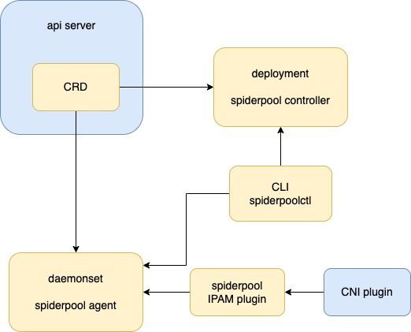

# Architecture

## IPAM for underlay and overlay network

There are two technologies in cloud-native networking: "overlay network" and "underlay network".
Despite no strict definition for underlay and overlay networks in cloud-native networking, we can simply abstract their characteristics from many CNI projects. The two technologies meet the needs of different scenarios.
Spiderpool is designed for underlay networks, and the following comparison of the two solutions can better illustrate the features and usage scenarios of Spiderpool.

### Overlay network solution

These solutions implement the decoupling of POD network and host network, such as [Calico](https://github.com/projectcalico/calico), [Cilium](https://github.com/cilium/cilium) and other CNI plugins. Typically, They use tunnel technology such as vxlan to build an overlay network plane, and use NAT technology for north-south traffic.

These IPAM solutions has some characteristics:

1. divide pod subnet into node-based IP block

   In terms of a smaller subnet mask, the pod subnet is divided into smaller IP blocks, and each node is assigned one or more IP blocks depending on the actual IP allocation account.

   First, since the IPAM plugin on each node only needs to allocate and release IP addresses in the local IP block, there is no IP allocation conflict with IPAM on other nodes, and achieve more efficient allocation.
   Second, a specific IP address follows an IP block and is allocated within one node all the time, so it cannot be assigned on other nodes together with a bound POD.

2. Sufficient IP address resources

   subnets not overlapping with any CIDR, could be used by the cluster, so the cluster have enough IP address resources as long as NAT technology is used in an appropriate manner. As a result, IPAM components face less pressure to reclaim abnormal IP address.

3. No requirement for static IP addresses

   For the static IP address requirement, there is a difference between stateless application and stateful application. Regarding stateless application like deployment, the POD's name will change when the POD restarts, the business logic of the application itself is stateless, so static IP addresses means that all the POD replicas are fixed in a set of IP addresses; for stateful applications such as statefulset, considering both the fixed information including POD's names and stateful business logic, the strong binding of one POD and one specific IP address needs to be implemented for static IP addresses.

   The "overlay network solution" mostly exposes the ingress and source addresses of services to the outside of the cluster with the help of NAT technology, and realizes the east-west communication through DNS, clusterIP and other technologies.
   In addition, although the IP block of IPAM fixes the IP to one node, it does not guarantee the application replicas to follow the scheduling.Therefore, there is no scope for the static IP address capability. Most of the mainstream CNIs in the community have not yet supported "static IP addressed", or support it in a rough way.

The advantage of the "overlay network solution" is that the CNI plugins are highly compatible with any underlying network environment, and can provide independent subnets with sufficient IP addresses for PODs.

### Underlay network solution

This solution shares node's network for PODs, which means PODs can directly obtain IP addresses in the node network. Thus, applications can directly use their own IP addresses for east-west and north-south communications.

There are two typical scenarios for underlay network solutions：clusters deployed on a "legacy network" and clusters deployed on an IAAS environment, such as a public cloud. The following summarizes the IPAM characteristics of the "legacy network scenario":

1. An IP address able to be assigned to any node

   As the number of network devices in the data center increases and multi-cluster technology evolves, IPv4 address resources become scarce, thus requiring IPAM to improve the efficiency of IP usage.
   As the POD replicas of the applications requiring "static IP addresses" could be scheduled to any node in the cluster and drift between nodes, IP addresses might drift together.

   Therefore, an IP address should be able to be allocated to a POD on any node.

2. Different replicas within one application could obtain IP addresses across subnets

   Take as an example one node could access subnet 172.20.1.0/24 while another node just only access subnet 172.20.2.0/24. In this case, when the replicas within one application need be deployed across subnets, IPAM is required to be able to assign subnet-matched IP addresses to the application on different nodes.

3. Static IP addresses

   For some traditional applications, the source IPs or destination IPs needs to be sensed in the microservice. And network admins are used to enabling fine-grained network security control via firewalls and other means.

   Therefore, in order to reduce the transformation chores after the applications move to the kubernetes, applications need static IP address.

4. Pods with Multiple NICs need IP addresses of different underlay subnets

   Since the POD is connected to an underlay network, it has the need for multiple NICs to reach different underlay subnets.

5. IP conflict

   Underlay networks are more prone to IP conflicts. For instance, PODs conflict with host IPs outside the cluster, or conflict with other clusters under the same subnet. But it is difficult for IPAM to discover these conflicting IP addresses externally unless CNI plugins are involved for real-time IP conflict detection.

6. Release and recover IP addresses

   Because of the scarcity of IP addresses in underlay networks and the static IP address requirements of applications, a newly launched POD may fail due to the lack of IP addresses owing to some IP addresses not released by abnormal Pods.
   This requires IPAMs to have a more accurate, efficient and timely IP recovery mechanism.

The advantages of the underlay network solution include: no need for network NAT mapping, which makes cloud-based network transformation for applications way more convenient; the underlying network firewall and other devices can achieve relatively fine control of POD communication; no tunneling technology contributes to improved throughput and latency performance of network communications.

## Architecture

Spiderpool consists of following components:

* Spiderpool IPAM plugin, a binary installed on each host. It is called by a CNI plugin to assign and release IP for a pod.

* spiderpool-agent, deployed as a daemonset. It receives IPAM requests from the IPAM plugin, assigns and releases IP from the ippool resource.

* spiderpool-controller, deployed as a deployment.

  * It takes charge of reclaiming IP resource in ippool, to prevent IP from leaking after the pod does not take it. Refer to [Resource Reclaim](./gc.md) for details.

  * It uses a webhook to watch the ippool resource, help the administrator to validate creation, modification, and deletion.

* spiderpoolctl, a CLI tool for debugging.

## CRDs

Spiderpool supports for the following CRDs:

* SpiderSubnet CRD. It is used to represent a collection of IP addresses from which Spiderpool expects SpiderIPPool IPs to be assigned. Refer to [SpiderSubnet](./spidersubnet.md) for detail.

* SpiderReservedIP CRD. It is used to represent a collection of IP addresses that Spiderpool expects not to be allocated. Refer to [SpiderReservedIP](./spiderreservedip.md) for detail.

* SpiderIPPool CRD. It is used to represent a collection of IP addresses from which Spiderpool expects endpoint IPs to be assigned. Refer to [SpiderIPPool](./spiderippool.md) for detail.

* SpiderEndpoint CRD. It is used to represent IP address allocation details for a specific endpoint object. Refer to [SpiderEndpoint](./spiderendpoint.md) for detail.
