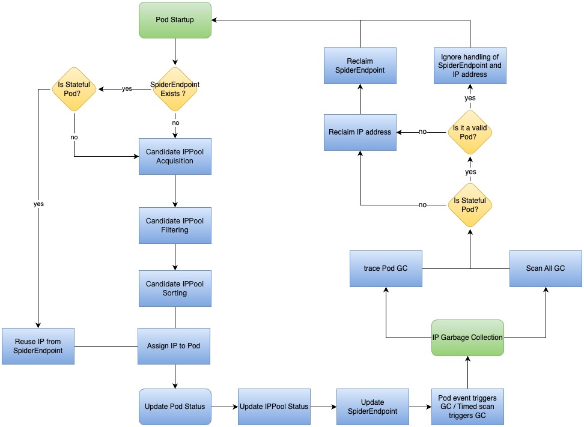

# IPAM

**English** | [**简体中文**](./ipam-des-zh_CN.md)

## IPAM for Underlay and Overlay Network Solutions

There are two technologies in cloud-native networking: "overlay network" and "underlay network". Despite no strict definition for underlay and overlay networks in cloud-native networking, we can simply abstract their characteristics from many CNI projects. The two technologies meet the needs of different scenarios.

Spiderpool is designed for underlay networks, and the following comparison of the two solutions can better illustrate the features and usage scenarios of Spiderpool.

### IPAM for Overlay Networks

These solutions implement the decoupling of the Pod network and host network, such as [Calico](https://github.com/projectcalico/calico), [Cilium](https://github.com/cilium/cilium), and other CNI plugins. Typically, they use tunnel technology such as vxlan to build an overlay network plane and use NAT technology for north-south traffic.

These IPAM solutions have the following characteristics:

1. **Divide Pod subnets into node-based IP blocks**

   In terms of a smaller subnet mask, the Pod subnet is divided into smaller IP blocks, and each node is assigned one or more IP blocks depending on the actual IP allocation account.

   - Since the IPAM plugin on each node only needs to allocate and release IP addresses in the local IP block, there is no IP allocation conflict with IPAM on other nodes, achieving more efficient allocation.
   - A specific IP address follows an IP block and is allocated within one node all the time, so it cannot be assigned on other nodes together with a bound Pod.

2. **Sufficient IP address resources**

   Subnets not overlapping with any CIDR could be used by the cluster, so the cluster has enough IP address resources as long as NAT technology is used in an appropriate manner. As a result, IPAM components face less pressure to reclaim abnormal IP addresses.

3. **No requirement for static IP addresses**

   For the static IP address requirement, there is a difference between a stateless application and a stateful application. Regarding stateless applications like deployment, the Pod's name will change when the Pod restarts, and the business logic of the application itself is stateless. Thus, static IP addresses mean that all the Pod replicas are fixed in a set of IP addresses. For stateful applications such as statefulset, considering both the fixed information including Pod's names and stateful business logic, the strong binding of one Pod and one specific IP address needs to be implemented for static IP addresses.

   The "overlay network solution" mostly exposes the ingress and source addresses of services to the outside of the cluster with the help of NAT technology and realizes the east-west communication through DNS, clusterIP, and other technologies. In addition, although the IP block of IPAM fixes the IP to one node, it does not guarantee the application replicas follow the scheduling. Therefore, there is no scope for the static IP address capability. Most of the mainstream CNIs in the community have not yet supported "static IP addresses" or support it in a rough way.

The advantage of the "overlay network solution" is that the CNI plugins are highly compatible with any underlying network environment and can provide independent subnets with sufficient IP addresses for Pods.

### IPAM for Underlay Networks

These solutions share the node's network for Pods, which means Pods can directly obtain IP addresses in the node network. Thus, applications can directly use their own IP addresses for east-west and north-south communications.

There are two typical scenarios for underlay network solutions: clusters deployed on a "legacy network" and clusters deployed on an IAAS environment, such as a public cloud. The following summarizes the IPAM characteristics of the "legacy network scenario":

1. **An IP address able to be assigned to any node**

   As the number of network devices in the data center increases and multi-cluster technology evolves, IPv4 address resources become scarce, thus requiring IPAM to improve the efficiency of IP usage. As the Pod replicas of the applications requiring "static IP addresses" could be scheduled to any node in the cluster and drift between nodes, IP addresses might drift together.

   Therefore, an IP address should be able to be allocated to a Pod on any node.

2. **Different replicas within one application could obtain IP addresses across subnets**

   Take as an example one node could access subnet 172.20.1.0/24 while another node just only access subnet 172.20.2.0/24. In this case, when the replicas within one application need to be deployed across subnets, IPAM is required to be able to assign subnet-matched IP addresses to the application on different nodes.

3. **Static IP addresses**

   For some traditional applications, the source IPs or destination IPs need to be sensed in the microservice. And network admins are used to enabling fine-grained network security control via firewalls and other means.

   Therefore, in order to reduce the transformation chores after the applications move to Kubernetes, applications need static IP addresses.

4. **Pods with Multiple NICs need IP addresses of different underlay subnets**

   Since the Pod is connected to an underlay network, it has the need for multiple NICs to reach different underlay subnets.

5. **IP conflict**

   Underlay networks are more prone to IP conflicts. For instance, Pods conflict with host IPs outside the cluster, or conflict with other clusters under the same subnet. But it is difficult for IPAM to discover these conflicting IP addresses externally unless CNI plugins are involved for real-time IP conflict detection.

6. **Release and recover IP addresses**

   Because of the scarcity of IP addresses in underlay networks and the static IP address requirements of applications, a newly launched Pod may fail due to the lack of IP addresses owing to some IP addresses not being released by abnormal Pods. This requires IPAMs to have a more accurate, efficient, and timely IP recovery mechanism.

The advantages of the underlay network solution include: no need for network NAT mapping, which makes cloud-based network transformation for applications way more convenient; the underlying network firewall and other devices can achieve relatively fine control of Pod communication; no tunneling technology contributes to improved throughput and latency performance of network communications.

## Spiderpool IPAM

Any CNI project compatible with third-party IPAM plugins can work well with Spiderpool IPAM, such as:

- [Macvlan CNI](https://github.com/containernetworking/plugins/tree/main/plugins/main/macvlan)
- [Vlan CNI](https://github.com/containernetworking/plugins/tree/main/plugins/main/vlan)
- [Ipvlan CNI](https://github.com/containernetworking/plugins/tree/main/plugins/main/ipvlan)
- [SR-IOV CNI](https://github.com/k8snetworkplumbingwg/sriov-cni)
- [OVS CNI](https://github.com/k8snetworkplumbingwg/ovs-cni)
- [Multus CNI](https://github.com/k8snetworkplumbingwg/multus-cni)
- [Calico CNI](https://github.com/projectcalico/calico)
- [Weave CNI](https://github.com/weaveworks/weave)

Spiderpool IPAM is primarily divided into two major modules: allocation and recovery; the overall process is as follows:

1. When a Pod starts, Spiderpool checks if the corresponding Pod's `SpiderEndpoint` object exists. If it exists, for StatefulSet applications that have a fixed Pod name and require a fixed IP, Spiderpool will continue to use the IP address recorded in SpiderEndpoint for allocation. For Deployment applications that are stateless, because the Pod name changes with each Pod restart, Spiderpool can only fix the IP within a certain range and will reassign an IP address to the Pod through an allocation algorithm, synchronizing the updated Pod information to the IP pool and SpiderEndpoint. If it does not exist, Spiderpool will allocate an IP address to the Pod through an allocation algorithm (getting candidate pools -> filtering candidate pools -> sorting candidate pools), and simultaneously create a `SpiderEndpoint` object corresponding to the Pod, which records the IP address, UID, and other information used by the Pod. It will also carry a finalizer and be set as an `OwnerReference` along with the Pod.

2. Spiderpool ensures the robustness of IP addresses through two methods. First, Spiderpool's Informer mechanism tracks the lifecycle of Pods. Second, it periodically scans the IP status of IPPool within the global default interval. For StatefulSet applications that require fixed IP addresses, as long as their Pod replicas are valid, Spiderpool will not reclaim their IP addresses and SpiderEndpoint objects, allowing them to consistently obtain the same IP address. For invalid StatefulSet applications and Deployment applications that are stateless, their IP addresses and SpiderEndpoint objects will be reclaimed.

### IP Allocation Algorithm

When creating a Pod, it will follow the steps below to get IP allocations. The lifecycle of IP allocation involves three major stages: `candidate pool acquisition`, `candidate pool filtering`, and `candidate pool sorting`.

- **Candidate pool acquisition**: Spiderpool follows a strict rule of selecting pools from **high to low priority**. It identifies all pools that match **the high priority rules** and marks them as candidates for further consideration.

- **Candidate pool filtering**: Spiderpool applies filtering mechanisms such as affinity to carefully select the appropriate candidate pools from the available options. This ensures that specific requirements or complex usage scenarios are satisfied.

- **Candidate pool sorting**: In cases where multiple candidate pools exist, Spiderpool sorts them based on the priority rules defined in the SpiderIPPool object. IP addresses are then allocated sequentially, starting from the pool with available addresses.

#### Candidate Pool Acquisition

Spiderpool offers a variety of pool selection rules when assigning IP addresses to Pods. The selection process strictly adheres to a **high to low priority** order. The following rules are listed in **descending order of priority**, and if multiple rules apply at the same time, the preceding rule will **overwrite** the subsequent one.

1. **The 1st priority: SpiderSubnet annotation**

   The SpiderSubnet resource represents a collection of IP addresses. When an application requires a fixed IP address, the application administrator needs to inform their platform counterparts about the available IP addresses and routing attributes. However, as they belong to different operational departments, this process becomes cumbersome, resulting in complex workflows for creating each application. To simplify this, Spiderpool's SpiderSubnet feature automatically allocates IP addresses from subnets to IPPool and assigns fixed IP addresses to applications. This greatly reduces operational costs. When creating an application, you can use the `ipam.spidernet.io/subnets` or `ipam.spidernet.io/subnet` annotation to specify the Subnet. This allows for the automatic creation of an IP pool by randomly selecting IP addresses from the subnet, which can then be allocated as fixed IPs for the application. For more details, please refer to [SpiderSubnet](../usage/spider-subnet.md).

2. **The 2nd priority: SpiderIPPool annotation**

   Different IP addresses within a Subnet can be stored in separate instances of IPPool (Spiderpool ensures that there is no overlap between the address sets of IPPools). The size of the IP collection in SpiderIPPool can vary based on requirements. This design feature is particularly beneficial when dealing with limited IP address resources in the Underlay network. When creating an application, the SpiderIPPool annotation `ipam.spidernet.io/ippools` or `ipam.spidernet.io/ippool` can be used to bind different IPPools or share the same IPPool. This allows all applications to share the same Subnet while maintaining "micro-isolation". For more details, please refer to [SpiderIPPool annotation](../reference/annotation.md).

3. **The 3rd priority: Namespace default IP pool**

   By setting the annotation `ipam.spidernet.io/default-ipv4-ippool` or `ipam.spidernet.io/default-ipv6-ippool` in the namespace, you can specify the default IP pool. When creating an application within that tenant, if there are no other higher-priority pool rules, it will attempt to allocate an IP address from the available candidate pools for that tenant. For more details, please refer to [Namespace Annotation](../reference/annotation.md).

4. **The 4th priority: CNI configuration file**

   The global CNI default pool can be set by configuring the `default_ipv4_ippool` and `default_ipv6_ippool` fields in the CNI configuration file. Multiple IP pools can be defined as alternative pools. When an application uses this CNI configuration network and invokes Spiderpool, each application replica is sequentially assigned an IP address according to the order of elements in the "IP pool array". In scenarios where nodes belong to different regions or data centers, if the node where an application replica is scheduled matches the node affinity rule of the first IP pool, the Pod obtains an IP from that pool. If it doesn't meet the criteria, Spiderpool attempts to assign an IP from the alternative pools until all options have been exhausted. For more information, please refer to [CNI Configuration](../reference/plugin-ipam.md).

5. **The 5th priority: Cluster's default IP pool**

   Within the SpiderIPPool CR object, setting the **spec.default** field to `true` designates the pool as the cluster's default IP pool (default value is `false`). For more information, please refer to [Cluster's Default IP Pool](../reference/crd-spiderippool.md).

#### Candidate Pool Filtering

To determine the availability of candidate IP pools for IPv4 and IPv6, Spiderpool filters them using the following rules:

- IP pools in the `terminating` state are filtered out.
- The `spec.disable` field of an IP pool indicates its availability. A value of `true` means the IP pool is not usable.
- Check if the `IPPool.Spec.NodeName` and `IPPool.Spec.NodeAffinity` match the Pod's scheduling node. Mismatching values result in filtering out the IP pool.
- Check if the `IPPool.Spec.NamespaceName` and `IPPool.Spec.NamespaceAffinity` match the Pod's namespace. Mismatching values lead to filtering out the IP pool.
- Check if the `IPPool.Spec.NamespaceName` matches the Pod's `matchLabels`. Mismatching values lead to filtering out the IP pool.
- Check if the `IPPool.Spec.MultusName` matches the current NIC Multus configuration of the Pod. If there is no match, the IP pool is filtered out.
- Check if all IPs within the IP pool are included in the IPPool instance's `exclude_ips` field. If it is, the IP pool is filtered out.
- Check if all IPs in the pool are reserved in the ReservedIP instance. If it is, the IP pool is filtered out.
- An IP pool will be filtered out if its available IP resources are exhausted.

#### Candidate Pool Sorting

After filtering the candidate pools, Spiderpool may have multiple pools remaining. To determine the order of IP address allocation, Spiderpool applies custom priority rules to sort these candidates. IP addresses are then selected from the pools with available IPs in the following manner:

- IP pool resources with the `IPPool.Spec.PodAffinity` property are given the highest priority.
- IPPool resources with either the `IPPool.Spec.NodeName` or `IPPool.Spec.NodeAffinity` property are given the secondary priority. The `NodeName` takes precedence over `NodeAffinity`.
- Following that, IP pool resources with either the `IPPool.Spec.NamespaceName` or `IPPool.Spec.NamespaceAffinity` property maintain the third-highest priority. The `NamespaceName` takes precedence over `NamespaceAffinity`.
- IP pool resources with the `IPPool.Spec.MultusName` property receive the lowest priority.

> Here are some simple instances to describe this rule.
>
> 1. *IPPoolA* with properties `IPPool.Spec.PodAffinity` and `IPPool.Spec.NodeName` has higher priority than *IPPoolB* with a single affinity property `IPPool.Spec.PodAffinity`.
> 2. *IPPoolA* with a single property `IPPool.Spec.PodAffinity` has higher priority than *IPPoolB* with properties `IPPool.Spec.NodeName` and `IPPool.Spec.NamespaceName`.
> 3. *IPPoolA* with properties `IPPool.Spec.PodAffinity` and `IPPool.Spec.NodeName` has higher priority than *IPPoolB* with properties `IPPool.Spec.PodAffinity`, `IPPool.Spec.NamespaceName`, and `IPPool.Spec.MultusName`.
>
> If a Pod belongs to StatefulSet, IP addresses that meet the aforementioned rules will be allocated with priority. When a Pod is restarted, it will attempt to reuse the previously assigned IP address.

## IP Garbage Collection

### Context

When a pod is normally deleted, the CNI plugin will be called to clean IP on a pod interface and make IP free on the IPAM database. This can make sure all IPs are managed correctly and no IP leakage issue occurs.

But in some cases, it may go wrong and the IP of the IPAM database is still marked as used by a nonexistent pod.

When some errors happen, the CNI plugin is not called correctly when pod deletion. This could happen in cases like:

- When a CNI plugin is called, its network communication goes wrong and fails to release IP.
- The container runtime goes wrong and fails to call the CNI plugin.
- A node breaks down and then always cannot recover, the api-server makes pods of the breakdown node to be in `deleting` status, but the CNI plugin fails to be called.

BTW, this fault could be simply simulated by removing the CNI binary on a host when pod deletion.

This issue will make a bad result:

- The new pod may fail to run because the expected IP is still occupied.
- The IP resource is exhausted gradually although the actual number of pods does not grow.

Some CNI or IPAM plugins could not handle this issue. For some CNIs, the administrator self needs to find the IP with this issue and use a CLI tool to reclaim them. For some CNIs, it runs an interval job to find the IP with this issue and not reclaim them in time. For some CNIs, there is not any mechanism at all to fix the IP issue.

### Solution

For some CNIs, its IP CIDR is big enough, so the leaked IP issue is not urgent. For Spiderpool, all IP resources are managed by the administrator, and an application will be bound to a fixed IP, so the IP reclaim can be finished in time.

### SpiderIPPool Garbage Collection

To prevent IP from leaking when the ippool resource is deleted, Spiderpool has some rules:

- For an ippool, if IP is still taken by pods, Spiderpool uses webhook to reject the deleting request of the ippool resource.
- For a deleting ippool, the IPAM plugin will stop assigning IP from it but could release IP from it.
- The ippool sets a finalizer by the spiderpool controller once it is created. After the ippool goes to `deleting` status, the spiderpool controller will remove the finalizer when all IPs in the ippool are free, then the ippool object will be deleted.
- When a pod is deleted, Spiderpool will release its IPs with the recorded data by a corresponding `SpiderEndpoint` object, then the spiderpool controller will remove the `Current` data of the SpiderEndpoint object and remove its finalizer. (For the StatefulSet `SpiderEndpoint`, Spiderpool will delete it directly if its `Current` data was cleaned up)

### SpiderIPPool Garbage Collection Algorithm

In Kubernetes, garbage collection (GC for short) is crucial for recycling IP addresses. The availability of IP addresses is critical to whether a Pod can start successfully. The GC mechanism can automatically reclaim these unused IP addresses, avoiding waste of resources and exhaustion of IP addresses. The IP information assigned to the Pod will be recorded in IPAM, but when these Pods no longer exist in the Kubernetes cluster, these IPs that are still recorded in IPAM can be called `zombie IPs`. Spiderpool has the following two recycling methods for `zombie IPs`:

1. Real-time tracking of Pod events to determine whether the IP address and its corresponding SpiderEndpoint object need to be recycled.
2. Periodically scan the robustness of the IP pool based on the interval defined by the environment variable `SPIDERPOOL_GC_DEFAULT_INTERVAL_DURATION` (the default is 10 minutes).

The above complete IP recovery algorithm can ensure the correct recovery of IP addresses in all scenarios, including the following special scenarios:

- When `deleting Pod` in the cluster, but due to problems such as `network exception` or `cni binary crash`, the call to `cni delete` fails, resulting in the IP address not being reclaimed by cni.

  - In failure scenarios such as `cni delete failure`, if a Pod that has been assigned an IP is destroyed, but the IP address is still recorded in the IPAM, a phenomenon of zombie IP is formed. For this kind of problem, Spiderpool will automatically recycle these zombie IP addresses based on the cycle and event scanning mechanism.

  - In some accidents, the **stateless** Pod is in a constant `Terminating` phase, Spiderpool will automatically release its IP address after the Pod's `spec.terminationGracePeriodSecond` + [spiderpool-controller ENV](./../reference/spiderpool-controller.md#env) `SPIDERPOOL_GC_ADDITIONAL_GRACE_DELAY` periods. This feature can be controlled by the environment variable `SPIDERPOOL_GC_STATELESS_TERMINATING_POD_ON_READY_NODE_ENABLED`. This capability can be used to solve the failure scenario of `unexpected Pod downtime with Node ready`.

- After a node goes down unexpectedly, the Pod in the cluster is permanently in the `Terminating` phase, and the IP address occupied by the Pod cannot be released.

  - For the **stateless** Pod in the `Terminating` phase, Spiderpool will automatically release its IP address after the Pod's `spec.terminationGracePeriodSecond`. This feature can be controlled by the environment variable `SPIDERPOOL_GC_STATELESS_TERMINATING_POD_ON_NOT_READY_NODE_ENABLED`. This capability can be used to solve the failure scenario of `unexpected node downtime`.
