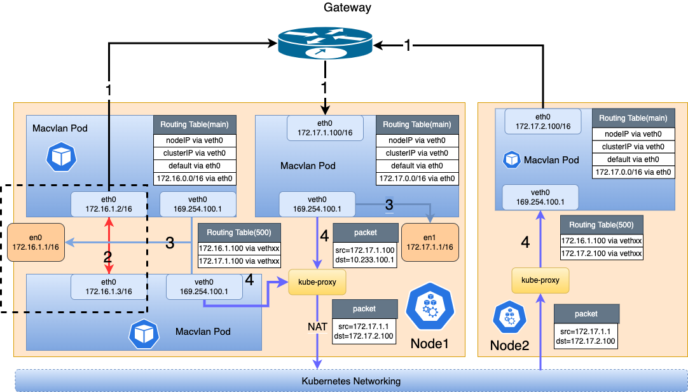
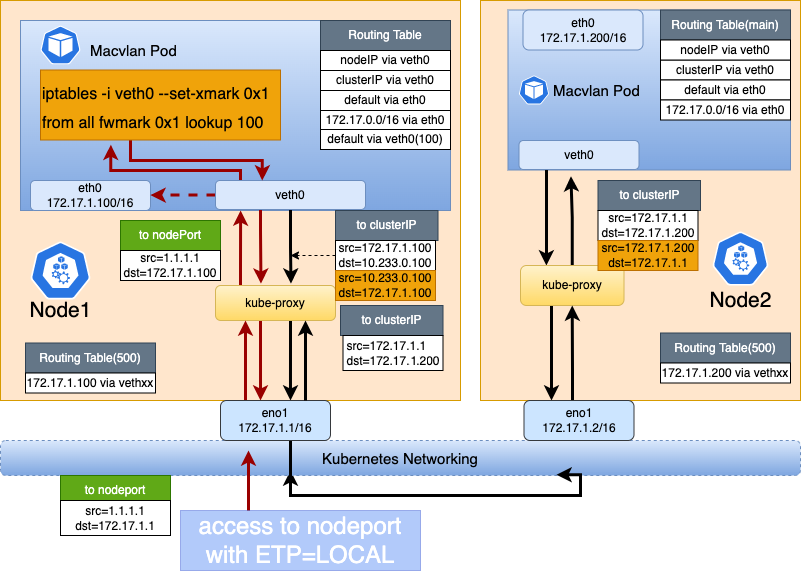
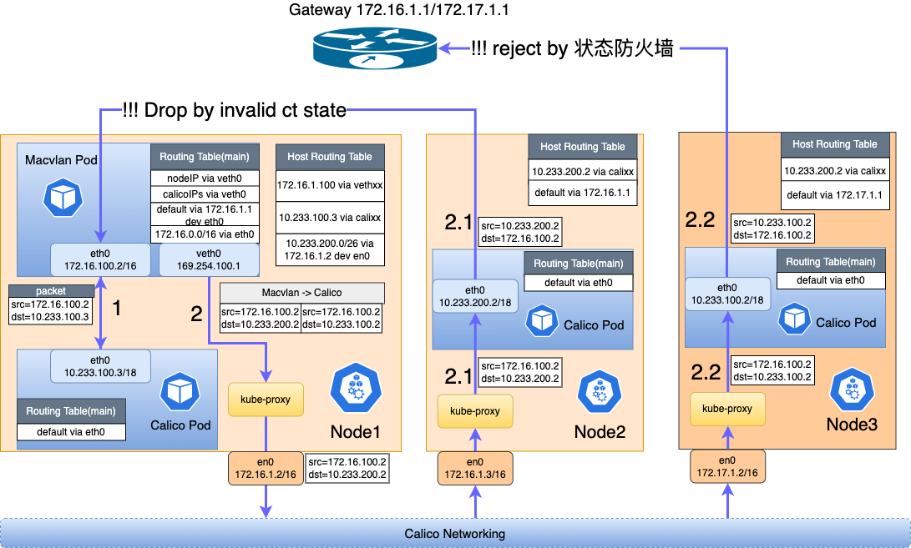
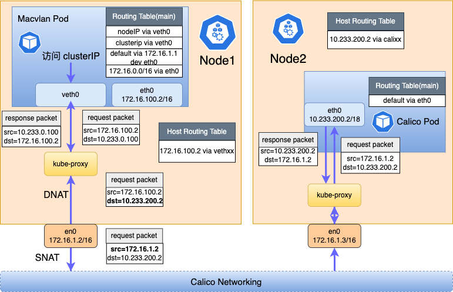
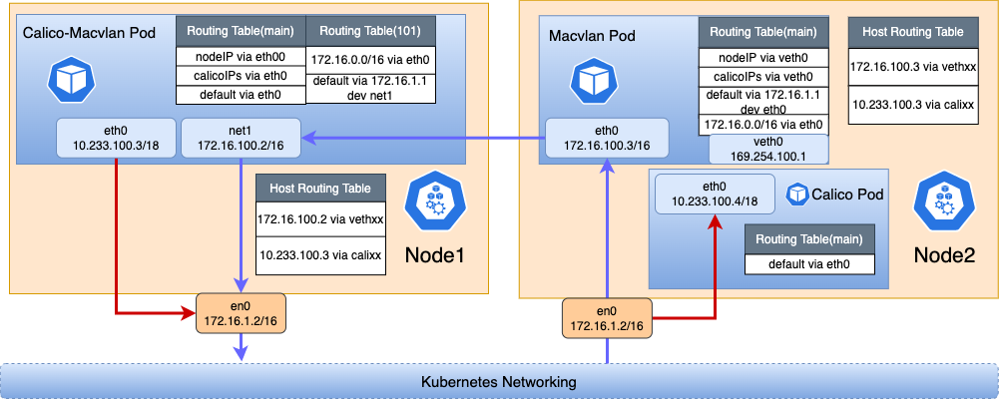
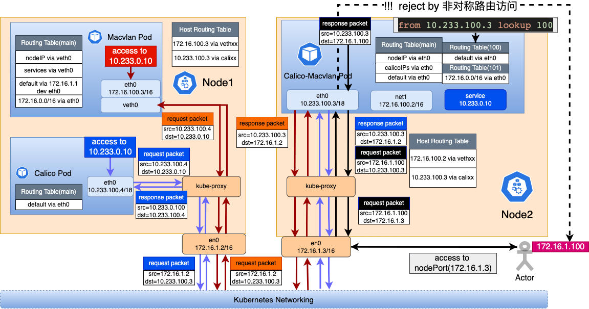

# Calico + Macvlan Multi-CNI Data Forwarding Process

**English** | [**简体中文**](./multi_cni_coexist-zh_CN.md)

## Background

CNIs are important components of a Kubernetes cluster. Typically, one CNI (e.g. Calico) is deployed and is responsible for the connectivity of the cluster network. In some cases, customers may use multiple types of CNIs in the cluster based on performance, security, etc., such as Macvlan CNIs of the Underlay type, and then there may be multiple Pods of different CNI types in a cluster, and different types of Pods are suitable for different scenarios:

* Pod with a single Calico NIC: System components such as CoreDNS do not have the need for a fixed IP, nor do they need to communicate with north-south traffic, but only need to communicate with east-west traffic in the cluster.
* Pods with a single Macvlan card: For applications with special requirements for performance and security, or for traditional up-cloud applications that require direct north-south traffic with the Pod IP.
* Multi-Card Pod with Calico and Macvlan cards: A combination of both. Both need to access cluster north-south traffic with a fixed Pod IP and cluster east-west traffic (e.g., with a Calico Pod or Service).

In addition, when multiple CNI pods exist in a cluster, there are actually two different data forwarding schemes in the cluster: Underlay and Overlay. this can lead to a number of other issues:

* Pods using the Underlay network cannot access the cluster's north-south traffic.
* Pods using Underlay networks cannot communicate directly with Pods using Overlay networks in the cluster: Due to inconsistent forwarding paths, Overlay networks often need to go through nodes for secondary forwarding, whereas Underlay networks are generally forwarded directly through the underlying gateway. Therefore, when they access each other, packet loss may occur because the underlying switch does not synchronize the routes of the cluster subnet.
* Using two network modes for a cluster may increase the complexity of use and operation, such as IP address management.

Spiderpool is a complete Underlay network solution that solves the interoperability problem when there are multiple CNIs in a cluster and reduces the IP address operation and maintenance burden. The following section describes the data forwarding process between them.

## Quick start

* Calico + Macvlan multi-network card quickstart can be found in [get-stared-calico](../usage/install/overlay/get-started-calico.md)
* For a single Macvlan card see [get-started-macvlan](../usage/install/underlay/get-started-macvlan.md).
* Underlay CNI Access Service See [underlay_cni_service](../usage/underlay_cni_service.md)

## Serval Data forwarding Flow

Below are several typical communication scenarios:

* [Macvlan Accessing Macvlan Pods](#data-forwarding-process-between-macvlan-pods)

* [Macvlan Pod Accessing Service](#macvlan-pod-access-to-service)

* [Macvlan Accessing Calico Pods](#macvlan-access-to-calico-pod)

* [Macvlan Pod Accessing Calico Pod's Service](#macvlan-pod-accessing-calico-pods-service)
* [Calico+Macvlan Multi-NIC Pods Accessing Calico and Macvlan Pods](#calicomacvlan-multi-nic-pod-accessing-calico-and-macvlan-pods)
* [Calico+Macvlan Multi-NIC Pods Accessing Service](#calicomacvlan-multi-nic-pod-accessing-service)
* [Accessing NodePort of Calico-Macvlan Multi-NIC Pods](#accessing-nodeport-of-calico-macvlan-multi-nic-pod-as-shown-by-the-black-arrow-in-figure-5)

### Data Forwarding Process Between Macvlan Pods

#### Macvlan Access to Pods in the Same Subnet

As shown in `Figure 1` `Label 2`, Macvlan Pod1(172.16.1.3) directly accesses Macvlan Pod2(172.16.1.2) through the Macvlan Bridge mode mechanism. Whether on the same node or different nodes, gateway forwarding is not required.

#### Macvlan Access to Pods in Different Subnets

As shown in `Figure 1` `Label 1`, Macvlan Pod1(172.16.1.2) accesses cross-segment and cross-node Macvlan Pod2(172.16.2.100) or cross-segment but same-node Macvlan Pod3(172.17.1.100). Due to different network segments, gateway forwarding is required.

#### Macvlan Pod Access to Local Node

As shown in `Figure 1` `Label 3`: Due to the Macvlan bridge mechanism, Macvlan sub-interfaces cannot communicate directly with the Master interface. Therefore, we created a veth network card in the Macvlan Pod (e.g., 172.17.1.100) and set up routes in both Pod and node to solve the communication issue. The node(172.17.1.1) accesses Macvlan Pod(172.17.1.100) according to the route in node table500, forwarding from vethxxx to the Pod's network namespace.

        # pod network namespace
        ~# ip r 
        172.17.1.1 dev veth0 
        # host network namespace
        ~# ip r show table 500
        172.17.1.100 dev vethxxx

### Macvlan Pod Access to Service

*Accessing ClusterIP (as shown by the black line in `Figure 2`)*:

* Macvlan Pod(172.17.1.100) accessing ClusterIP(10.233.0.100) matches Pod internal routing and forwards packets through veth0 network card to the node

        # pod network namespace
        ~# ip r 
        10.233.0.0/18 dev veth0 

* Through the Service DNAT rules set by node Kube-proxy, ClusterIP(10.233.0.100) is resolved to target Macvlan Pod(172.17.1.200), and packets are forwarded to 172.17.1.200 through inter-node network. At this point, the source address has been SNAT'd to node IP: 172.17.1.1.
* Upon reaching Node2(172.17.1.2), packets are forwarded to target Pod(172.17.1.100) through vethxx via the host's table500 routing table.
* When the target Pod(172.17.1.100) sends response packets, its destination address is Node1's address: 172.17.1.1, so response packets are sent from veth0 through the node network back to Node1. Through Node1's Kube-proxy iptables rules, the source address is restored to ClusterIP(10.233.0.100) and destination address to Macvlan Pod(172.17.1.100)
* Through the host's table500 routing table, response packets are forwarded via vethxx network card to source Pod(172.17.1.100), completing the access process.

Accessing NodePort Service:

as shown by the red line in `Figure 2`:

> Focus on the scenario where NodePort Service is configured with ExternalTrafficPolicy=Local.

* An external client: 1.1.1.1 accesses NodePort: 172.17.1.1:32456. Packets first reach node Node1(172.17.1.1) through external routing
* Through the host's Kube-proxy configured iptables DNAT rules, the destination address is rewritten to Macvlan Pod(172.17.1.100), and through the host's table500 routing table, packets are forwarded via vethxx to the target Pod.
* When the Pod sends response packets, seeing destination address 1.1.1.1, it matches the Pod's default route and forwards from eth0, causing communication failure. Spiderpool solves this by setting the following iptables rules and policy routing in the Pod's network namespace, ensuring NodePort traffic received by veth0 is still forwarded to the node via veth0.

        # pod network namespace
        iptables -i veth0 --set-xmark 0x1 ...
        ~# ip rule 
        from all fwmark 0x1 lookup 500
        ~# ip r show table 500
        default dev veth0

* Through the node's network protocol stack, the packet's source address is changed to the node's IP(172.17.1.1), then through external cluster routing, packets are sent to the client(1.1.1.1), completing the access process.

### Macvlan Access to Calico Pod

There are three main scenarios:

Macvlan Pod accessing Calico Pod on the same node (as shown in `Figure 3 Path 1`):

* Macvlan Pod(172.16.100.2) accessing Calico Pod(10.233.100.3/18), packets match Pod routing(`10.233.64.0/18 via veth0`), forwarding packets from veth0 network card to the node.
* Packets match on the node: Calico's virtual route(`10.233.100.3 dev calixxx`) forwards packets through Calico virtual network card to Calico Pod(10.233.100.3).
* Response packets are sent to the node through Calico virtual network card(calixxx), and since the destination address is Macvlan Pod(172.16.100.2), matching route(`172.16.100.2 dev vethxxx table 500`) forwards to Macvlan Pod, completing the access.

Macvlan Pod accessing Calico Pod across nodes (nodes in same subnet, as shown in Figure 3: 2->2.1):

* Macvlan Pod(172.16.100.2) accessing Calico Pod(10.233.200.2/18), packets match Pod routing(`10.233.64.0/18 via veth0`), forwarding packets from veth0 network card to the node.
* Through inter-node Calico routing, packets are forwarded to peer node(172.16.1.3). Since the destination address is 10.233.200.2, matching node's Calico route(`10.233.100.2 dev calixxx`) forwards packets through Calico virtual network card to Calico Pod(10.233.100.2).
* Since the original source address is Macvlan Pod(172.16.100.2), Calico Pod will forward response packets first to its local node(172.16.1.3), then directly forward response packets to Macvlan Pod(172.16.100.2) without going through node forwarding, causing inconsistent packet forwarding paths. This may cause the kernel to mark the packet's conntrack state as invalid, leading to packet drop by a kube-proxy iptables rule:

          ~# iptables-save  -t filter | grep '--ctstate INVALID -j DROP'
          iptables -A FORWARD -m conntrack --ctstate INVALID -j DROP

This rule was originally implemented to solve the issue raised in [#Issue 74839](https://github.com/kubernetes/kubernetes/issues/74839), where some TCP packets exceeding window limits were marked as invalid conntrack state by the kernel, causing the entire TCP connection to reset. The k8s community addressed this by implementing this rule, but it may affect scenarios with inconsistent packet paths. Related community issues include: [#Issue 117924](https://github.com/kubernetes/kubernetes/issues/117924), [#Issue 94861](https://github.com/kubernetes/kubernetes/issues/94861), [#Issue 177](https://github.com/spidernet-io/cni-plugins/issues/177).

We helped resolve this issue through community collaboration, ultimately fixed in [only drop invalid cstate packets if non liberal](https://github.com/kubernetes/kubernetes/pull/120412) for kubernetes version v1.29. We need to ensure each node's sysctl parameter is set: `sysctl -w net.netfilter.nf_conntrack_tcp_be_liberal=1`, and restart Kube-proxy. This prevents kube-proxy from implementing the drop rule, avoiding impact on communication between single Macvlan pod and single Calico pod.

After execution, check if the drop rule still exists on the node. No output indicates normal operation. Otherwise, check if sysctl is correctly set and if kube-proxy has been restarted.

        ~# iptables-save -t filter | grep '--ctstate INVALID -j DROP'

> Note: Must ensure k8s version is greater than v1.29. If your k8s version is below v1.29, this issue cannot be avoided.

### Macvlan Pod Accessing Calico Pod's Service

* Macvlan Pod(172.16.100.2) inserts a route to intercept service traffic, making Pod access to ClusterIP(10.233.0.100) forward packets through veth0 network card to node Node1(172.16.1.2).

        ～# ip r
        10.233.0.0/18 via 10.7.168.71 dev eth0 src 10.233.100.2

* After packets are forwarded to node Node1(172.16.1.2), the host network stack's kube-proxy converts clusterip to Calico Pod's IP: 10.233.200.2. Then through Calico's tunnel routing forwards to node Node2(172.16.1.3). Note that when request packets are sent from node3, their source address is SNAT'd to Node1's IP(172.16.1.2). This ensures response packets can return via the same path, avoiding inconsistent routing paths when Macvlan Pod accesses Calico Pod. After request packets are forwarded to host Node2, they are forwarded to Calico Pod(10.233.200.2) through the node's calixxx virtual network card.

* Calico Pod(10.233.200.2) forwards response packets to node Node2. At this point, the response packet's destination address is node Node1(172.16.1.2), so it's forwarded to Node1 through node routing. Then through Kube-proxy, the destination address is rewritten to Macvlan Pod's IP: 172.16.100.2, and source address to ClusterIP(10.233.0.100). Then matching the host's route table500(`172.16.100.2 dev vethxxx table 500`), packets are sent to Macvlan Pod, completing the access.

### Calico+Macvlan Multi-NIC Pod Accessing Calico and Macvlan Pods

As shown in `Figure 4`: Node1 runs a Calico-Macvlan Pod (with both calico and macvlan network cards), while Node2 runs a Macvlan Pod (with only macvlan network card) and a Calico Pod (with only calico network card).

Calico + Macvlan Multi-NIC Pod Accessing Calico Pod:

as shown by red line in Figure 4:

* Calico-Macvlan Pod has two network cards, Spiderpool coordinates routing between multiple cards, enabling Pod to access both Overlay and Underlay networks.

        ~# # all routing-table of eth0(calico)
        ~# ip route show table main
        172.16.1.2 dev eth0
        10.233.64.0/18 dev eth0
        172.16.0.0/16 dev net1
        default via 169.254.1.1 dev eth0
        ~# # all routing-table of net1(macvlan)
        ~# ip route show table 101
        default via 172.16.0.1 dev net1
        172.16.0.0/16 dev net1

* When Calico-Macvlan Pod accesses Calico Pod(10.233.100.4), it matches Pod routing(`10.233.64.0/18 dev eth0`) and sends packets through eth0 to node Node1(172.16.1.1), with source address being Calico network card's IP(10.233.100.3). Since the destination address is 10.233.100.4, packets are forwarded through inter-node Calico network to node Node2(172.16.1.2), and finally to Calico Pod.
* When Calico Pod sends response packets, the destination address is Calico-Macvlan Pod's calico network card IP(10.233.100.3). This process is similar to communication between Calico Pods, forwarding response packets through Calico node routing to Node1, then through Calico's virtual routing to Calico-Macvlan Pod, completing the access.

Calico + Macvlan Multi-NIC Pod Accessing Macvlan Pod

as shown by black line in Figure 4:

* Calico-Macvlan Pod has two network cards, Spiderpool coordinates routing between multiple cards, enabling Pod to access both Overlay and Underlay networks simultaneously.

        ~# # all routing-table of eth0(calico)
        ~# ip route show table main
        172.16.1.2 dev eth0
        10.233.64.0/18 dev eth0
        default via 169.254.1.1 dev eth0
        172.16.0.0/16 dev net1
        ～# ip route show table 101
        ~# # all routing-table of net1(macvlan)
        ~# ip route show table 101
        default via 172.16.0.1 dev net1
        172.16.0.0/16 dev net1

* When Calico-Macvlan Pod accesses Macvlan Pod(172.16.100.3), packets match routing(`172.16.0.0/16 dev net1`) and are sent through Pod's macvlan network card `net1`.
* Packets are forwarded directly through Underlay network to Node2's Macvlan Pod(172.16.100.3)
* When Macvlan Pod(172.16.100.3) sends response packets, since the destination address is 172.16.100.2, packets are sent back to Calico-Macvlan Pod through Underlay network, completing the access.

### Calico+Macvlan Multi-NIC Pod Accessing Service

Node1 runs a Macvlan Pod (with only one Macvlan network card: 172.16.100.3) and a Calico Pod (with only one Calico network card: 10.233.100.4).

Calico-Macvlan Multi-NIC Pod Accessing ClusterIP (endpoint using Calico network)

As shown by the blue arrow in `Figure 5`:

* According to the routing in the Pod, traffic accessing ClusterIP is forwarded through eth0 to node Node2. Then, the kube-proxy on the node resolves the target clusterip address to the Calico Pod's IP: 10.233.100.4, and forwards it through the node's routing to the target host Node1, finally forwarding it to the Calico Pod through the calixxx virtual network card.
* Response packets are forwarded through eth0 to node Node1, with the destination address being the Calico-Macvlan Pod's Calico network card IP: 10.233.100.3. They are then forwarded through inter-node Calico routing to Node2. Subsequently, Node2's kube-proxy rewrites the source address to the clusterip address, and then sends it to the Calico-Macvlan Pod through the calixxx virtual network card, completing the access.

Calico-Macvlan Multi-NIC Pod Accessing ClusterIP (endpoint using Macvlan network)

As shown by the red arrow in `Figure 5`:

* According to the routing in the Pod, traffic accessing ClusterIP is forwarded through eth0 to node Node2. Then, the kube-proxy on the node resolves the target clusterip address to the Macvlan Pod's IP: 172.16.100.3, and forwards it through inter-node routing to the target host Node1. Note that when packets are sent from Node2, their source address has already been SNAT'd to: 172.16.1.3.
* Upon reaching Node1, packets are forwarded through the vethxxx virtual network card, ultimately reaching the Macvlan Pod.
* When response packets are sent, since the destination address is Node2's IP, the packets are directly forwarded through eth0 to Node2. After passing through Node2's kube-proxy, the source address is rewritten to the clusterip address, and the destination address is changed to the Calico-Macvlan Pod's Calico IP (10.233.100.3). Finally, the packets are sent to the Calico-Macvlan Pod through the calixxx virtual network card, completing the access.

### Accessing NodePort of Calico-Macvlan Multi-NIC Pod (as shown by the black arrow in `Figure 5`)

* An external client (172.16.1.100) accesses NodePort Service (172.16.1.3:32567). The packets are routed externally to Node2 (172.16.1.3), and through the iptables DNAT rules set by Kube-proxy, the destination address is changed to: 10.233.100.3 (the Calico network card IP of the Pod), and then forwarded to the Pod through the calixxx virtual network card.
* When the Pod sends response packets, the destination address is: 172.16.1.100. The response packets are sent directly through net1 (the IP of the Pod's Macvlan network card) to 172.16.1.100. The client receives the packets and finds that the five-tuple does not match, so it discards the packets.
* To resolve this issue caused by asymmetric routing, Spiderpool tunes the policy routing in the Pod to ensure that the response packets to NodePort are sent out from eth0.

        ~# ip rule
        ...
        from 10.233.100.3 lookup 100
        ~# ip route show table 100
        default via 169.254.1.1 dev eth0

* After tuning the policy routing, response packets are sent from eth0 to Node2, and through Kube-proxy, the source address is changed to Node2's IP (172.16.1.3), with the destination address being: 172.16.1.100. The response packets are routed externally to 172.16.1.100, completing the access.

> Note: The issue of asymmetric routing when accessing NodePort only exists when the default route of the multi-NIC Pod is on eth0. If the default route is on net1, this issue does not occur.

## Conclusion

We have summarized some communication scenarios when these three types of Pods exist in a cluster as follows.

| Source\Target | Calico Pod | Macvlan Pod | Calico + Macvlan Multi-NIC Pod | Service for Calico Pod | Service for Macvlan Pod | Service for Calico + Macvlan Multi-NIC Pod |
|- |- |- |- |- |- |-|
| Calico Pod | ✅ | ✅ | ✅ | ✅ | ✅ | ✅ |
| Macvlan Pod |  requires kube-proxy version greater than v1.29. | ✅ | ✅  | ✅ | ✅ | ✅ |
| Calico + Macvlan Multi NIC Pod | ✅ |  ✅ | ✅  | ✅ | ✅ | ✅ |
