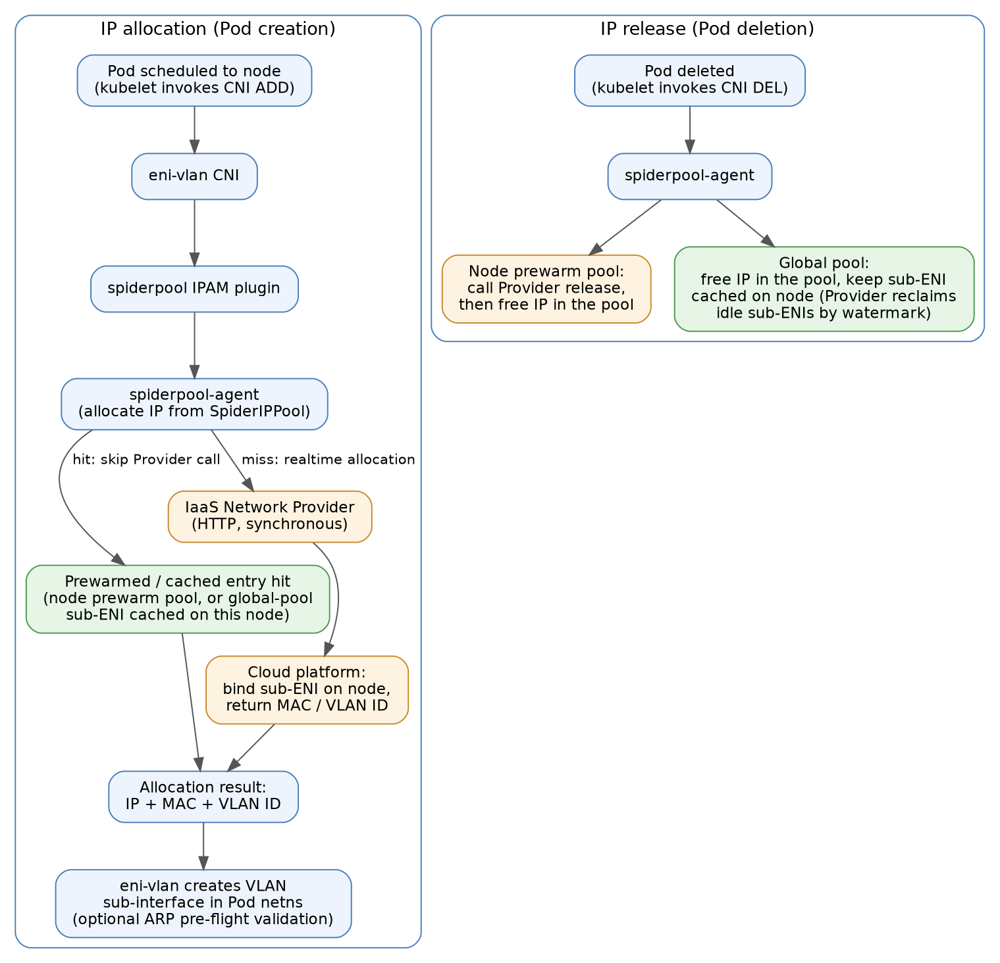

# IaaS Network Provider

[**English**](./iaas-network-provider.md) | **简体中文**

## 背景

在公有云或私有云环境中，Spiderpool 分配出的 IP 地址往往还需要在云网络系统中完成注册、绑定或转发面配置后，Pod 才能正常通信。为此，Spiderpool 支持对接通用的 IaaS Network Provider：一个实现 Spiderpool 通用 API 契约的 HTTP 服务，不绑定任何具体云厂商。Spiderpool 在分配或释放 Pod IP 时调用该 Provider，在云平台侧完成 sub-ENI 资源的绑定或解绑。

该模式支持 IPv4-only 和 IPv4/IPv6 双栈分配（双栈通过 `ipam.spidernet.io/pair-pool` 注解将 v4/v6 池配对，配对地址原子化绑定到同一个 sub-ENI），暂不支持 IPv6-only。

核心能力：

* **为 Pod 分配云端 sub-ENI**：调用 Provider 在云平台创建/绑定 sub-ENI，并把云端下发的 MAC 地址、VLAN ID 通过 [eni-vlan](https://github.com/spidernet-io/eni-vlan) CNI 配置到 Pod 的 VLAN 子接口上；Pod 删除时同步释放云侧绑定。
* **两种池分配模式**：节点预热池（Provider 按节点提前预热 IP 资源，Pod 秒级启动）与全局池（实时分配 + 粘性 sub-ENI 缓存），详见[容器网络配置](#容器网络配置)。
* **网络资源调度**：按节点 sub-ENI 容量（如 `spidernet.io/prewarm-sub-eni`）和 master 物理网卡存在性（`spidernet.io/<master>-nic`）约束 Pod 调度，避免 Pod 被调度到无资源可用的节点。

关于池分配模式的内部机制、候选池类别排他、请求超时与时间预算、Provider API 契约等设计细节，参见 [IaaS Network Provider 设计](../concepts/iaas-network-provider-zh_CN.md)。

术语约定：

* ENI 指弹性网卡（Elastic Network Interface）
* Sub-ENI 指辅助弹性网卡（Secondary Elastic Network Interface）
* VLAN 指虚拟局域网（Virtual Local Area Network）。

## 工作流程



分配流程：

1. Pod 调度到节点后，kubelet 发起 CNI ADD；eni-vlan CNI 调用 spiderpool IPAM 插件，向本节点的 spiderpool-agent 申请 IP。
2. spiderpool-agent 从 SpiderIPPool 中选取地址：若命中预热/缓存条目（节点预热池中已就绪的地址，或全局池在该节点缓存的 sub-ENI），直接复用其 MAC/VLAN，**跳过** Provider 调用；否则同步调用 Provider，在云平台侧绑定 sub-ENI 并取回 MAC 地址和 VLAN ID。
3. IPAM 将 IP + MAC + VLAN 写入分配结果返回给 eni-vlan，由其在 Pod 网络命名空间中创建 VLAN 子接口（可选 ARP 预检校验）。

释放流程：Pod 删除时，节点预热池的地址会先调用 Provider 释放接口、成功后再释放池内 IP（先云侧后池内，避免云侧未接受释放前重新分配同一 IP）；全局池的地址只释放池内 IP，云侧 sub-ENI 保留在节点上作为缓存，由 Provider 按水位线回收空闲子网卡。

## 安装与配置

### 前置条件

* **先安装 IaaS Network Provider**：Spiderpool 安装/升级时 Helm 会 lookup Provider 的 TLS Secret 并复制其中的 `ca.crt`，因此 Provider 必须先于 Spiderpool 安装。
* **IaaS 侧准备**：
  * 创建 VPC 子网并绑定到节点弹性网卡。例如，将 VPC 子网 `172.91.0.0/24` 绑定到节点的物理网卡 `eth1`。后续创建的 SpiderIPPool `subnet` 字段必须与该 VPC 子网一致。
  * 确认每个节点可绑定的辅助 ENI 数量上限，用于设置资源广告的 `defaultMaxCount`。
  * 建议节点的扩展弹性网卡不配置 IP 地址，避免回程路径不一致导致的通信问题。
* **节点规划**：建议按用途给节点分组打 label，节点预热池和全局池分别使用不同的节点组，例如：

    ```bash
    kubectl label node worker-1 worker-2 iaas-pool-mode=prewarm
    kubectl label node worker-3 worker-4 iaas-pool-mode=global
    ```

    该 label 既可用于资源广告规则的 `nodeSelector`，也可用于工作负载的 `nodeSelector`，将节点池/全局池工作负载固定到对应节点组。
* **网卡名称统一**：候选节点上父物理网卡（`master`）名称应尽量统一（如都为 `eth1`）；如果无法统一，请启用 master NIC 网卡名称调度，避免工作负载被调度到不具备该网卡的节点。更多网络资源调度能力参见 [Spiderpool Device Plugin](./spiderpool-device-plugin-zh_CN.md)。

### 安装 Spiderpool

准备 `iaas-network-provider-values.yaml`，一次性完成 Provider 对接、eni-vlan 插件安装和网络资源调度配置：

```yaml
ipam:
  enableGatewayDetection: false
  enableIPConflictDetection: false
plugins:
  installEniVlanCNI: true
iaasNetworkProvider:
  service:
    name: "iaas-network-provider"
    namespace: "iaas-network-provider-system"
    port: 8443
  tls:
    caSecret: "iaas-network-provider-tls"
  httpRequestTimeout: "50s"
spiderpoolController:
  podResourceInject:
    enabled: true
spiderpoolAgent:
  networkResourcePlugin:
    enabled: true
    kubeletRootDir: /var/lib/kubelet
    resourceAdvertisement:
      masterNIC:
        rules:
          - defaultMaxCount: 10000
            includeInterfaces:
              - "eth1"
            nodeSelector:
              matchExpressions:
                - key: iaas-pool-mode
                  operator: In
                  values: ["prewarm", "global"]
      subENI:
        rules:
          - resourceName: spidernet.io/prewarm-sub-eni
            defaultMaxCount: 256
            nodeSelector:
              matchLabels:
                iaas-pool-mode: prewarm
          - resourceName: spidernet.io/global-sub-eni
            defaultMaxCount: 256
            nodeSelector:
              matchLabels:
                iaas-pool-mode: global
```

```bash
helm upgrade --install spiderpool spiderpool/spiderpool \
  --namespace kube-system \
  --values iaas-network-provider-values.yaml \
  --wait
```

配置项说明：

* `iaasNetworkProvider.service`：Provider 的 Kubernetes Service（name/namespace/port）。`service.name` 为空时 Spiderpool 不会调用 Provider。连接采用单向 TLS：Helm 安装时 lookup `service.namespace` 下的 `iaasNetworkProvider.tls.caSecret`，只复制其中的 `ca.crt` 到本地 Secret `iaas-provider-ca`。GitOps 或 `helm template` 场景（lookup 不可用）需显式设置 `iaasNetworkProvider.tls.ca`（base64 PEM CA bundle），它优先于 lookup；`insecureSkipVerify=true` 会跳过证书校验，仅作为灰度回退。Provider 被卸载重装（生成新 CA）后，需对 Spiderpool 重新执行 `helm upgrade` 刷新 CA 快照。
* `iaasNetworkProvider.httpRequestTimeout`：单次 Provider HTTP 调用（分配或释放）的超时时间，默认 `50s`。取值约束和完整的时间预算模型参见[请求超时与时间预算](../concepts/iaas-network-provider-zh_CN.md#请求超时与时间预算)。
* `plugins.installEniVlanCNI`：必须为 `true`（默认 `false`），在每个节点上安装 eni-vlan CNI 插件。
* `ipam.enableGatewayDetection` / `ipam.enableIPConflictDetection`：必须关闭。此模式先调用 IPAM 获取 IaaS IP 信息、再由 CNI 完成 Pod 网络设置，与传统顺序相反，IPAM 阶段的网关可达性检测和 IP 冲突检测无法工作；连通性校验可改由 eni-vlan 在配置 Pod IP 前完成（见[容器网络配置](#容器网络配置)的 `validateIaasNetConfig`）。
* `spiderpoolAgent.networkResourcePlugin`：启用 Spiderpool Device Plugin 资源广告。示例中的规则复用了[前置条件](#前置条件)里给节点打的 `iaas-pool-mode` label：`subENI` 拆成两条规则，节点池组和全局池组分别上报**不同的资源名**（`spidernet.io/prewarm-sub-eni` 和 `spidernet.io/global-sub-eni`），使两种模式的工作负载在 resources 中声明各自的资源、互不挤占；`masterNIC` 规则由两个节点组共用，上报 `spidernet.io/eth1-nic`。其余节点不匹配任何规则、不受影响。`subENI.rules[].defaultMaxCount` 是节点向调度器暴露的辅助 ENI 总容量，生产环境应按节点实际可用容量设置；`masterNIC.rules[]` 按 `includeInterfaces`/`excludeInterfaces` 通配符选择要广告的物理网卡。字段详解和排障参见 [Spiderpool Device Plugin](./spiderpool-device-plugin-zh_CN.md)。
* `spiderpoolController.podResourceInject.enabled`：webhook 为引用了 eni-vlan SpiderMultusConfig 的 Pod 自动注入 `spidernet.io/<master>-nic` 资源。sub-ENI 资源**不会**被自动注入，必须由用户在 Pod resources 中显式声明，否则调度器不会做 ENI 容量约束。

### 检查功能是否已启用

1. **查看 ConfigMap**：

    ```bash
    kubectl get configmap spiderpool-conf -n kube-system -o yaml | grep iaasNetworkProvider
    ```

    如果输出中包含 `iaasNetworkProvider.service.name` 且值非空，说明功能已启用。

2. **查看 agent 启动日志**：

    ```bash
    kubectl logs spiderpool-agent-xxx -n kube-system | grep -E "IaaS client created successfully|IaaS provider configuration validation failed"
    ```

    看到 `IaaS client created successfully` 说明 agent 已成功初始化 IaaS client；看到 `IaaS provider configuration validation failed` 则需检查 `iaasNetworkProvider.service` 和 `iaasNetworkProvider.tls` 配置。

3. **查看节点资源广告**：确认打了 `iaas-pool-mode` label 的两个节点组分别上报了各自的 sub-ENI 资源和共用的 master 网卡资源：

    ```bash
    kubectl get nodes -o custom-columns='NAME:.metadata.name,POOL-MODE:.metadata.labels.iaas-pool-mode,PREWARM_SUB_ENI:.status.allocatable.spidernet\.io/prewarm-sub-eni,GLOBAL_SUB_ENI:.status.allocatable.spidernet\.io/global-sub-eni,MASTER_NIC:.status.allocatable.spidernet\.io/eth1-nic'
    ```

    示例输出（两节点测试集群，一个节点属于节点池组、一个属于全局池组）：

    ```text
    NAME       POOL-MODE   PREWARM_SUB_ENI   GLOBAL_SUB_ENI   MASTER_NIC
    worker-1   prewarm     256               <none>           10k
    worker-3   global      <none>            256              10k
    ```

    每个节点只上报本组的 sub-ENI 资源。也可以直接查看 node 的 `status.allocatable`：

    ```bash
    kubectl get node worker-1 -o jsonpath='{.status.allocatable}' | jq 'with_entries(select(.key | startswith("spidernet")))'
    ```

    ```json
    {
      "spidernet.io/eth1-nic": "10k",
      "spidernet.io/prewarm-sub-eni": "256"
    }
    ```

    未打 `iaas-pool-mode` label 的节点不匹配任何规则，对应资源显示 `<none>`。这些 allocatable 资源就是后续 [创建测试应用](#创建测试应用) 时 Pod resources 中声明/注入的调度依据。

## 容器网络配置

SpiderIPPool 通过 `ipam.spidernet.io/iaas-provider: "<vendor>"` 注解标记为 IaaS 管理。`<vendor>` 为厂商标识，其取值对 Spiderpool 透明——只有注解的存在与否生效；mutating webhook 会自动同步一个同名 label，供 Provider 按 label selector watch 池对象。

IaaS 池有两种模式，由池的形态推导，且在池的生命周期内不可变（validating webhook 拒绝在已创建的 IaaS 池上增删 `spec.nodeName`）：

| 模式 | 形态 | 行为 | `parent-nic` 注解 |
| --- | --- | --- | --- |
| **节点预热池** | 设置 `spec.nodeName`（仅一个节点） | Provider 提前在该节点预热 IP 资源，分配直接使用就绪地址，跳过同步 Provider 调用 | 必填 |
| **全局池** | 不设置 `spec.nodeName` | 实时分配 + 粘性 sub-ENI 缓存，服务跨多节点的工作负载 | 可选（缺省时从 SpiderMultusConfig 的 `master` 接口解析父网卡） |

`ipam.spidernet.io/parent-nic` 指定池的单个 guest-OS 父网卡名，池覆盖的所有节点上父网卡须同名。两类池可混用作为同一 Pod 网卡的候选池：预热池排序在前，全局池作为兜底；IaaS 池不可与普通静态池混用（详见[候选池类别排他](../concepts/iaas-network-provider-zh_CN.md#候选池类别排他)）。双栈场景需为 v4/v6 各建一个池并用 `ipam.spidernet.io/pair-pool` 注解互相配对。

每种池模式各配置一套「IP 池 + SpiderMultusConfig」：SpiderMultusConfig 使用 [eni-vlan](https://github.com/spidernet-io/eni-vlan) CNI 为 Pod 创建 VLAN 子接口，并通过 `ippools` 字段把对应模式的池声明为默认候选池，工作负载引用相应的网卡配置即可，无需逐个 Pod 指定池。

### 节点预热池配置

#### 创建节点预热池

按节点创建，每个节点一个池：

```yaml
apiVersion: spiderpool.spidernet.io/v2beta1
kind: SpiderIPPool
metadata:
  name: worker-1-pool
  annotations:
    ipam.spidernet.io/iaas-provider: "<vendor>"
    ipam.spidernet.io/parent-nic: eth1
spec:
  ipVersion: 4
  subnet: 172.91.0.0/24
  gateway: 172.91.0.1
  ips:
    - 172.91.0.100-172.91.0.119
  nodeName:
    - worker-1
---
apiVersion: spiderpool.spidernet.io/v2beta1
kind: SpiderIPPool
metadata:
  name: worker-2-pool
  annotations:
    ipam.spidernet.io/iaas-provider: "<vendor>"
    ipam.spidernet.io/parent-nic: eth1
spec:
  ipVersion: 4
  subnet: 172.91.0.0/24
  gateway: 172.91.0.1
  ips:
    - 172.91.0.120-172.91.0.139
  nodeName:
    - worker-2
```

创建后观察池的 status，确认预热完成：

```bash
kubectl get spiderippool worker-1-pool -o yaml
```

```yaml
status:
  parentNic:          # 池所在节点的 spiderpool-agent 解析并发布
    name: eth1
    mac: fa:16:3e:11:22:33
  ipMetaData:         # Provider 预热完成后写入
    observedGeneration: 1
    readyIPCount: 20  # 已预热就绪的地址数
    unreadyIPCount: 0
    metadata: '...'   # 每个地址的 MAC/VLAN 元数据
  totalIPCount: 20
  allocatedIPCount: 0
```

`readyIPCount` 大于 0 即表示已经有 IP 预热完成；只有已就绪的地址才会被分配给 Pod。

#### 配置节点预热池 SpiderMultusConfig

创建引用所有节点池的 eni-vlan SpiderMultusConfig：

```yaml
apiVersion: spiderpool.spidernet.io/v2beta1
kind: SpiderMultusConfig
metadata:
  name: iaas-prewarm-config
  namespace: spiderpool
spec:
  cniType: eni-vlan
  enivlan:
    master:
      - eth1
    ippools:
      ipv4:
        - worker-*-pool
    validateIaasNetConfig: true
    validationRetries: 3
    validationTimeoutMs: 500
```

字段说明：

* `master`：父物理网卡名称，必须与目标节点上的物理网卡一致，并与安装时 `masterNIC.rules[].includeInterfaces` 选中的网卡匹配（本例 `eth1`）。
* `ippools`：默认候选池。节点池按节点逐一创建，推荐使用通配符（支持 `*`、`?`、`[]`）一次匹配所有节点池——本例 `worker-*-pool` 覆盖 `worker-1-pool`、`worker-2-pool` 等，新增节点池无需修改 SpiderMultusConfig；IPAM 分配时会按 Pod 所在节点自动过滤出匹配的节点池。
* `validateIaasNetConfig`（默认 `false`）：开启 ARP 预检校验。eni-vlan 在配置 Pod IP 之前，使用云端下发的真实 IP/MAC 通过 ARP 探测网关，校验 IP/VLAN/MAC 三元组的连通性，校验失败则 fail-closed，替代被关闭的 IPAM 阶段网关检测。
* `validationRetries`（默认 `3`）/ `validationTimeoutMs`（默认 `500`）：预检校验的重试次数和单次超时（毫秒）。

> eni-vlan CNI 没有 `vlanID` 配置字段：VLAN ID 和 MAC 地址由 IaaS Network Provider 动态分配，并通过 spiderpool IPAM 插件在分配结果中下发。不要将社区静态 `vlan` CNI 用于 IaaS 池：其静态 `vlanID` 语义与云端动态 VLAN 分配冲突，Spiderpool 会直接拒绝该组合。

### 全局池配置

#### 创建全局池

同样带 `iaas-provider` 注解，但**不**设置 `spec.nodeName`：

```yaml
apiVersion: spiderpool.spidernet.io/v2beta1
kind: SpiderIPPool
metadata:
  name: app-global-pool
  annotations:
    ipam.spidernet.io/iaas-provider: "<vendor>"
    ipam.spidernet.io/parent-nic: eth1
spec:
  ipVersion: 4
  subnet: 172.92.0.0/24
  gateway: 172.92.0.1
  ips:
    - 172.92.0.100-172.92.0.200
```

全局池无需预热：首个落到某节点的 Pod 触发同步 Provider 调用创建/挂载 sub-ENI；Pod 删除后 sub-ENI 保留在节点上作为缓存，同节点后续 Pod 直接命中缓存。空闲 sub-ENI 的回收由 Provider 按水位线负责（回收保护机制见[设计文档](../concepts/iaas-network-provider-zh_CN.md#iaas-池分配模式)）。

#### 配置全局池 SpiderMultusConfig

为全局池单独创建一个 SpiderMultusConfig，字段含义与[节点预热池的配置](#配置节点预热池-spidermultusconfig)相同，仅 `ippools` 直接引用全局池：

```yaml
apiVersion: spiderpool.spidernet.io/v2beta1
kind: SpiderMultusConfig
metadata:
  name: iaas-global-config
  namespace: spiderpool
spec:
  cniType: eni-vlan
  enivlan:
    master:
      - eth1
    ippools:
      ipv4:
        - app-global-pool
    validateIaasNetConfig: true
    validationRetries: 3
    validationTimeoutMs: 500
```

## 创建测试应用

无论使用哪种池模式，工作负载都应在 resources 中显式声明本组的 sub-ENI 资源（节点池组 `spidernet.io/prewarm-sub-eni`、全局池组 `spidernet.io/global-sub-eni`），使调度器按节点 ENI 容量约束调度；`spidernet.io/<master>-nic`（本例 `spidernet.io/eth1-nic`）由 webhook 自动注入，无需声明。候选池已由各模式的 SpiderMultusConfig `ippools` 提供；如需为个别工作负载覆盖候选池，可使用 `ipam.spidernet.io/ippool` Pod 注解。

### 节点预热池模式

引用节点预热池的网卡配置 `iaas-prewarm-config`，并通过 `nodeSelector` 固定到预热节点组，Spiderpool 会按 Pod 所在节点自动过滤出匹配的节点池：

```yaml
apiVersion: apps/v1
kind: Deployment
metadata:
  name: prewarm-app
spec:
  replicas: 2
  selector:
    matchLabels:
      app: prewarm-app
  template:
    metadata:
      labels:
        app: prewarm-app
      annotations:
        k8s.v1.cni.cncf.io/networks: spiderpool/iaas-prewarm-config
    spec:
      nodeSelector:
        iaas-pool-mode: prewarm
      containers:
        - name: demo
          image: busybox:1.36
          command: ["sh", "-c", "sleep 3600"]
          resources:
            requests:
              spidernet.io/prewarm-sub-eni: "1"
            limits:
              spidernet.io/prewarm-sub-eni: "1"
```

验证：Pod 应秒级 Running（分配命中预热地址，不经过同步 Provider 调用），且 IP 来自 Pod 所在节点对应的池：

```bash
kubectl get pod -l app=prewarm-app -o wide
kubectl get spiderippool worker-1-pool worker-2-pool -o custom-columns='NAME:.metadata.name,ALLOCATED:.status.allocatedIPCount'
```

### 全局池模式

固定到全局节点组，引用全局池的网卡配置 `iaas-global-config`：

```yaml
apiVersion: apps/v1
kind: Deployment
metadata:
  name: global-app
spec:
  replicas: 3
  selector:
    matchLabels:
      app: global-app
  template:
    metadata:
      labels:
        app: global-app
      annotations:
        k8s.v1.cni.cncf.io/networks: spiderpool/iaas-global-config
    spec:
      nodeSelector:
        iaas-pool-mode: global
      containers:
        - name: demo
          image: busybox:1.36
          command: ["sh", "-c", "sleep 3600"]
          resources:
            requests:
              spidernet.io/global-sub-eni: "1"
            limits:
              spidernet.io/global-sub-eni: "1"
```

验证：分布在不同节点上的副本均从 `app-global-pool` 拿到 IP；删除并重建某个副本，若新 Pod 仍落在原节点，会命中该节点缓存的 sub-ENI 而快速启动：

```bash
kubectl get pod -l app=global-app -o wide
kubectl get spiderippool app-global-pool -o custom-columns='NAME:.metadata.name,ALLOCATED:.status.allocatedIPCount'
```

### 连通性与调度验证

* **网关连通性**：在 Pod 内 ping 池的网关，确认云端下发的 IP/MAC/VLAN 配置正确、VLAN 子接口通信正常：

    ```bash
    POD=$(kubectl get pod -l app=prewarm-app -o jsonpath='{.items[0].metadata.name}')
    kubectl exec "${POD}" -- ping -c 2 172.91.0.1
    ```

* **调度约束**：确认用户声明的 sub-ENI 请求和 webhook 注入的母网卡资源均已生效：

    ```bash
    kubectl get pod "${POD}" -o jsonpath='{.spec.containers[0].resources.requests}'
    ```

    预期输出同时包含 `"spidernet.io/prewarm-sub-eni":"1"`（全局池模式则为 `"spidernet.io/global-sub-eni":"1"`）和 `"spidernet.io/eth1-nic":"1"`。当请求总量超过节点容量时，超出的 Pod 保持 `Pending`，Events 中出现 `FailedScheduling` 和 `Insufficient spidernet.io/prewarm-sub-eni`（或 `global-sub-eni`/`eth1-nic`）。

* **排障**：
  * Pod 未注入 `<master>-nic`：检查 `podResourceInject.enabled` 以及 Pod 是否引用了 eni-vlan SpiderMultusConfig。
  * 节点 allocatable 无对应 sub-ENI 资源/`<master>-nic`：检查 `networkResourcePlugin` 的规则、`nodeSelector` 和 `includeInterfaces`，并在目标节点执行 `ip link show` 确认 `master` 网卡存在。
  * 分配失败：查看 spiderpool-agent 日志中的 Provider 调用错误；超时类错误的含义参见[请求超时与时间预算](../concepts/iaas-network-provider-zh_CN.md#请求超时与时间预算)。

## 异常场景处理

Spiderpool 会将以下情况视为失败：

* HTTP 请求失败。
* HTTP 响应状态码不是 `2xx`。
* 分配响应 JSON 无法解析。
* 分配响应中包含 Spiderpool 未请求的 IP。

当释放失败时，Spiderpool 可能根据触发释放的路径，在后续清理流程中进行重试。因此 Provider 的释放接口应支持幂等重试。

Provider 侧的实现要求（分配必须同步成功、释放幂等、释放最终一致、父网卡 MAC 缺失容忍）和完整的 API 契约，参见 [IaaS Network Provider 设计](../concepts/iaas-network-provider-zh_CN.md)。
