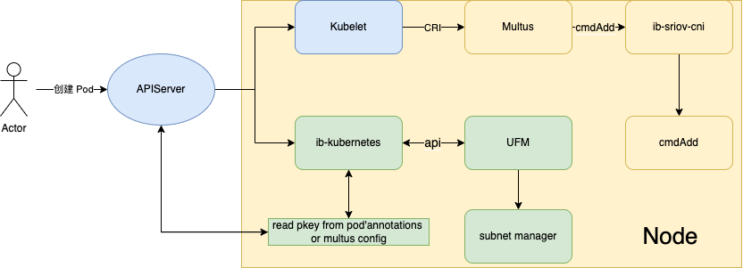

# UFM and ib-kubernetes 

**English** | [**简体中文**](./ib-kubernetes-zh_CN.md)

## Introduction

[UFM](https://docs.nvidia.com/networking/display/ufmenterpriseqsgv6160/ufm+installation+steps) is Nvidia's software for managing Infiniland's network, which manages Infiniband's switches as well as hosts. It has the ability to:

* Discover and manage network devices such as hosts, switches, cables, and gateways in the Infiniband network, and perform basic management such as device discovery, topology display, software upgrade, and log collection.
* Implement network configurations including PKEY
* Network device status monitoring, network real-time traffic telemetry, network self-check, and alarm implementation
* OpenSM manages network devices

> Note: The UFM software runs as a server on a host with an Infiniband network card and requires a license to be purchased.

[ib-kubernetes](https://github.com/Mellanox/ib-kubernetes) is an open-source Infiniband plugin for Kubernetes from Mellanox, which is compatible with [ib-sriov-cni](https://github.com/k8snetworkplumbingwg/ib-sriov-cni). [Multus-cni](https://github.com/k8snetworkplumbingwg/multus-cni) Collaboration: Complete the setting of the Pkey and GUID, and advertise it to the UFM plug-in, and then UFM completes the subnet management under the Infiniband network.

Here's how UFM and ib-kubernetes work together and some use cases.

## Workflow

As can be seen from the above figure, ib-kubernetes will read its multus configuration or annotations when the pod is created, so as to read the pkey or guid (if there is a configuration, it will be automatically generated), and pass the pkey and guid information to the UFM plugin by calling the API of the UFM plugin. UFM will then complete subnet management of the pod based on both information.

## How to use

You need to install the UFM plugin in the environment in advance, let's install ib-kubernetes as follows:

1. Prepare the plugin configuration, the following configuration is used to help you log in to the UFM management platform.

        apiVersion: v1
        kind: Secret
        metadata:
          name: ib-kubernetes-ufm-secret
          namespace: kube-system
        stringData:
          UFM_USERNAME: "admin" # UFM username
          UFM_PASSWORD: "123456" # UFM password
          UFM_ADDRESS: "" # UFM admin address 
          UFM_HTTP_SCHEMA: ""    # http/https. Default: https
          UFM_PORT: ""           # UFM REST API port. Defaults: 443(https), 80(http)
        string:
          UFM_CERTIFICATE: ""    # UFM Certificate in base64 format. (if not provided client will not

2. To log in to UFM, you need to use a certificate, and you need to generate a certificate file on the UFM host first:

        $ openssl req -x509 -newkey rsa:4096 -keyout ufm.key -out ufm.crt -days 365 -subj '/CN=<UFM hostname>'

        Copy the certificate file to the UFM certificate location:
        $ cp ufm.key /etc/pki/tls/private/ufmlocalhost.key
        $ cp ufm.crt /etc/pki/tls/certs/ufmlocalhost.crt

        Restart UFM:
        $ docker restart ufm

        If deployed as bare metal:
        $ systemctl restart ufmd

3. Create a certificate key file for UFM:

        $ kubectl create secret generic ib-kubernetes-ufm-secret --namespace="kube-system" --from-literal=UFM_USER="admin" --from-literal=UFM_PASSWORD="12345" --from-literal=UFM_ ADDRESS="127.0.0.1" --from-file=UFM_CERTIFICATE=ufmlocalhost.crt --dry-run -o yaml > ib-kubernetes-ufm-secret.yaml
        $ kubectl create -f ./ib-kubernetes-ufm-secret.yaml 

4. Install ib-kubernetes:

        $ git clone https://github.com/Mellanox/ib-kubernetes.git && cd ib-kubernetes
        $ $ kubectl create -f deployment/ib-kubernetes-configmap.yaml
        $ kubectl create -f deployment/ib-kubernetes-ufm-secret.yaml
        $ kubectl create -f deployment/ib-kubernetes.yaml 

## Install Spiderpool

Refer to [rdma-ib](./rdma-ib.md) to install and use Spiderpool, we only need to pay attention to specifying the pkey when creating SpiderMultusConfig:

        apiVersion: spiderpool.spidernet.io/v2beta1
        kind: SpiderMultusConfig
        metadata:
          name: ib-sriov
          namespace: kube-system
        spec:
          cniType: ib-sriov
          ibsriov:
            resourceName: spidernet.io/mellanoxibsriov
            pkey: 1000
            ippools:
              ipv4: ["v4-91"]

## Conclusion

ib-kubernetes can be integrated with UFM software to help UFM complete the subnet management of the Infiniband network under Kubernetes.
