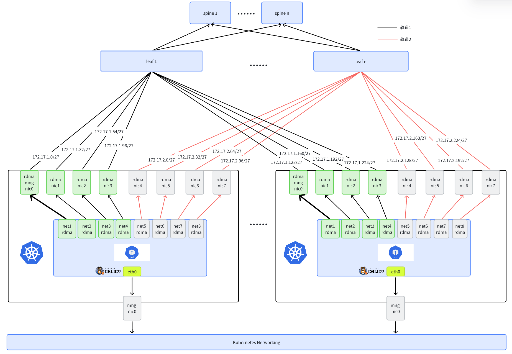

# Different RDMA Zone AI Cluster With SR-IOV 

[**English**] | [**简体中文**](./different-rdma-rail-ai-zh_CN.md)

## Introduction

[AI Cluster With SR-IOV](./get-started-sriov.md) introduces how to use Spiderpool and SR-IOV components to configure large-scale AI cluster networks. This document applies to scenarios where all nodes in an AI cluster use the same subnet for the same rail NICs. In such scenarios, the entire AI cluster needs multiple subnets. For example, if nodes have 8 rail NICs, then 8 independent subnets are required. In some large-scale AI clusters, due to IP address resource limitations, it's not possible to provide so many subnets. Limited subnets can only be split for use by different rail NICs on different nodes, so in this scenario, the same rail NICs on different nodes are often assigned to different subnets.

Assuming we have a 16-bit mask IP network segment, each node's each rail NIC can have 32 addresses, then the mask is 27 bits. With each node having 8 rail NICs, we can support at most 256 nodes (each node with 8 rail NICs, each rail NIC with 32 addresses).

For example, node1's rail 1 NIC might use the 172.16.1.0/27 subnet, while node2's rail 1 NIC might use the 172.16.1.32/27 subnet.

This mode has the following characteristics:

- **High configuration complexity**: Need to create independent IP pool resources for each node's each rail NIC, ensuring that when Pods are scheduled to nodes, they can be correctly assigned to the matching IP pool for that node.
- **RDMA traffic path**: The first RDMA NIC is used for RDMA control plane communication, not the default management NIC, while other NICs are used to carry AI computation RDMA traffic.

Spiderpool supports **automatically assigning matching IP pools to Pods based on host RDMA rail subnets** functionality, enabling this AI network solution to work perfectly.

## Solution Architecture



As shown in Figure 1, the cluster's network planning is as follows:

1. Each node has 8 RDMA rail NICs, each rail NIC can be allocated 32 IP addresses with a 27-bit mask, and each node's 8 rail NICs use different subnets
2. Each node's nic0 NIC runs calico CNI to carry kubernetes traffic. AI workloads will be assigned a calico default NIC for control plane communication.
3. Nodes use Mellanox ConnectX5 NICs with RDMA capability to carry AI computation RDMA traffic, with NICs connected to rail optimized networks. AI workloads will be additionally assigned SR-IOV virtualized interfaces for all RDMA NICs to ensure high-speed network communication for GPUs. Note: The first RDMA NIC is used for RDMA control plane communication, while other NICs are used to carry AI computation RDMA traffic.

## Installation Requirements

- Refer to [Spiderpool Installation Requirements](./../system-requirements.md)

- Prepare Helm binary on the host

- Install Kubernetes cluster with kubelet working on the host eth0 NIC shown in Figure 1

- In Infiniband network scenarios, ensure OpenSM subnet manager is working properly

- Install Calico as the cluster's default CNI, using the host's eth0 NIC as calico's traffic forwarding NIC.
    If not installed, refer to [official documentation](https://docs.tigera.io/calico/latest/getting-started/kubernetes/) or use the following commands for installation:

    ```shell
    $ kubectl apply -f https://github.com/projectcalico/calico/blob/master/manifests/calico.yaml
    $ kubectl wait --for=condition=ready -l k8s-app=calico-node  pod -n kube-system 
    # set calico to work on host eth0 
    $ kubectl set env daemonset -n kube-system calico-node IP_AUTODETECTION_METHOD=kubernetes-internal-ip
    # set calico to work on host eth0 
    $ kubectl set env daemonset -n kube-system calico-node IP6_AUTODETECTION_METHOD=kubernetes-internal-ip  
    ```

## Host Preparation

1. Install RDMA NIC drivers, then restart the host (so that NICs can be seen)

    For Mellanox NICs, download [NVIDIA OFED official drivers](https://network.nvidia.com/products/infiniband-drivers/linux/mlnx_ofed/) for host installation, execute the following installation commands

    ```shell
    mount /root/MLNX_OFED_LINUX-24.01-0.3.3.1-ubuntu22.04-x86_64.iso   /mnt
    /mnt/mlnxofedinstall --all
    ```

    For Mellanox NICs, you can also use containerized installation to batch install drivers for all Mellanox NICs on cluster hosts. Run the following commands. Note that this process requires internet access to obtain some installation packages. When all ofed pods enter ready state, it indicates that OFED driver installation has been completed on the host

    ```shell
    $ helm repo add spiderchart https://spidernet-io.github.io/charts
    $ helm repo update
    $ helm search repo ofed

    # please replace the following values with your actual environment
    # for china user, it could set `--set image.registry=nvcr.m.daocloud.io` to use a domestic registry
    $ helm install ofed-driver spiderchart/ofed-driver -n kube-system \
            --set image.OSName="ubuntu" \
            --set image.OSVer="22.04" \
            --set image.Arch="amd64"
    ```

    > If you want the RDMA system to work in exclusive mode, at least one of the following conditions must be met: (1) Based on Linux kernel version 5.3.0 or newer, RDMA modules loaded in the system, rdma core package provides a method to automatically load related modules at system startup (2) Requires Mellanox OFED version 4.7 or newer. In this case, there's no need to use kernel version 5.3.0 or newer.

2. For SRIOV scenarios, please set the RDMA subsystem on the host to exclusive mode, so that containers can independently use RDMA device processes and avoid sharing with other containers

    ```shell
    # Check the current operating mode (the Linux RDMA subsystem operates in shared mode by default):
    $ rdma system
       netns shared copy-on-fork on

    # Persist the exclusive mode to remain effective after a reboot
    $ echo "options ib_core netns_mode=0" >> /etc/modprobe.d/ib_core.conf

    # Switch the current operating mode to exclusive mode. If the setting fails, please reboot the host
    $ rdma system set netns exclusive

    # Verify the successful switch to exclusive mode
    $ rdma system
       netns exclusive copy-on-fork on
    ```

3. Set NIC RDMA working mode (Infiniband or ethernet)

    3.1 Confirm the working modes supported by the NIC: In this example environment, mellanox ConnectX 5 VPI NICs are connected to the host. Query RDMA devices to confirm NIC driver installation completion

    ```shell
    $ rdma link
      link mlx5_0/1 state ACTIVE physical_state LINK_UP netdev ens6f0np0
      link mlx5_1/1 state ACTIVE physical_state LINK_UP netdev ens6f1np1
      ....... 
    ```

    Confirm the NIC's working mode. The following output indicates the NIC is working in Ethernet mode and can achieve RoCE communication

    ```shell
    $ ibstat mlx5_0 | grep "Link layer"
       Link layer: Ethernet
    ```

    The following output indicates the NIC is working in Infiniband mode and can achieve Infiniband communication

    ```shell
    $ ibstat mlx5_0 | grep "Link layer"
       Link layer: InfiniBand
    ```

    If the NIC is not working in the expected mode, please enter the following commands to confirm the NIC supports configuring LINK_TYPE parameters. If this parameter is not available, please replace with a supported NIC model

    ```shell
    $ mst start

    # check the card's PCIE 
    $ lspci -nn | grep Mellanox
          86:00.0 Infiniband controller [0207]: Mellanox Technologies MT27800 Family [ConnectX-5] [15b3:1017]
          86:00.1 Infiniband controller [0207]: Mellanox Technologies MT27800 Family [ConnectX-5] [15b3:1017]
          ....... 

    # check whether the network card supports parameters LINK_TYPE 
    $ mlxconfig -d 86:00.0  q | grep LINK_TYPE
          LINK_TYPE_P1                                IB(1)
    ```

    3.2 Batch set NIC working mode: Get the [batch setting script](https://github.com/spidernet-io/spiderpool/blob/main/tools/scripts/setNicRdmaMode.sh), after setting as follows, please restart the host

    ```shell
    $ chmod +x ./setNicRdmaMode.sh

    # Batch query all rdma NICs working in ib or eth mode
    $ ./setNicRdmaMode.sh q

    # Switch all rdma NICs to eth mode
    $ RDMA_MODE="roce" ./setNicRdmaMode.sh

    # Switch all rdma NICs to ib mode
    $ RDMA_MODE="infiniband" ./setNicRdmaMode.sh
    ```  

4. For all RDMA NICs, set IP addresses, MTU and policy routing, etc.

    > In RDMA scenarios, usually both switches and host NICs work with larger MTU parameters to improve performance
    >
    > Because Linux hosts have only one default route by default, in multi-NIC scenarios, different NICs need to be set with policy default routes to ensure tasks in hostnetwork mode can run All-to-All and other communications normally
    >
    > The host needs to configure an RDMA subnet route to ensure RDMA control-plane traffic is properly transmitted

    Get the [ubuntu NIC configuration script](https://github.com/spidernet-io/spiderpool/blob/main/tools/scripts/setNicAddr.sh), execute the following reference commands
    
    ```shell
    $ chmod +x ./setNicAddr.sh

    # Set NIC and configure RDMA subnet route for the first RDMA NIC
    $ INTERFACE="eno3np2" ENABLE_RDMA_DEFAULT_ROUTE="true" RDMA_SUBNET="172.16.0.0/16" IPV4_GATEWAY="172.16.0.1" ./setNicAddr.sh

    # For non-first NICs, only set NIC IP, MTU and policy routing
    $ INTERFACE="eno3np3" IPV4_IP="172.16.1.10/24"  IPV4_GATEWAY="172.16.1.1" \
          MTU="4200" ENABLE_POLICY_ROUTE="true" ./setNicAddr.sh

    # View NIC IP and MTU
    $ ip a s eno3np2
      4: eno3np2: <BROADCAST,MULTICAST,UP,LOWER_UP> mtu 4200 qdisc mq state UP group default qlen 1000
        link/ether 38:68:dd:59:44:4a brd ff:ff:ff:ff:ff:ff
        altname enp8s0f2np2
        inet 172.16.0.10/24 brd 172.16.0.255 scope global eno3np2
          valid_lft forever preferred_lft forever
        inet6 fe80::3a68:ddff:fe59:444a/64 scope link proto kernel_ll
          valid_lft forever preferred_lft forever 

    # View policy routing
    $ ip rule
    0:  from all lookup local
    32763:  from 172.16.0.10 lookup 152 proto static
    32766:  from all lookup main
    32767:  from all lookup default

    $ ip rou show table 152
    default via 172.16.0.1 dev eno3np2 proto static

    # View RDMA default route
    $ ip r | grep 172.16
    172.16.0.0/16 via 172.16.0.1 dev eno3np2
    ```  

5. Configure host RDMA lossless network

    In high-performance network scenarios, RDMA networks are very sensitive to packet loss. Once packet loss and retransmission occur, performance will drop dramatically. Therefore, to ensure RDMA network performance is not affected, the packet loss rate must be guaranteed to be below 1e-05 (one in one hundred thousand), preferably zero packet loss. For RoCE networks, PFC + ECN mechanisms can be used to ensure no packet loss during network transmission.

    Refer to [Configure RDMA Lossless Network](../../roce-qos.md)

    > Configuring lossless networks requires RDMA RoCE network environment, not Infiniband
    > Configuring lossless networks requires switches to support PFC + ECN mechanisms and be configured to align with the host side, otherwise it won't work

6. Enable [GPUDirect RDMA](https://docs.nvidia.com/cuda/gpudirect-rdma/) functionality

    During installation or use of [gpu-operator](https://github.com/NVIDIA/gpu-operator)

    a. Enable helm installation option: `--set driver.rdma.enabled=true --set driver.rdma.useHostMofed=true`, gpu-operator will install [nvidia-peermem](https://network.nvidia.com/products/GPUDirect-RDMA/) kernel module, enable GPUDirect RDMA functionality, and accelerate forwarding performance between GPU and RDMA NICs. You can enter the following command on the host to confirm successful kernel module installation

    ```shell
    $ lsmod | grep nvidia_peermem
      nvidia_peermem         16384  0
    ```

    b. Enable helm installation option: `--set gdrcopy.enabled=true`, gpu-operator will install [gdrcopy](https://developer.nvidia.com/gdrcopy) kernel module to accelerate forwarding performance between GPU memory and CPU memory. You can enter the following command on the host to confirm successful kernel module installation

    ```shell
    $ lsmod | grep gdrdrv
      gdrdrv                 24576  0
    ```

## Install and Configure Spiderpool

For installing and configuring SRIOV components, refer to [AI-Cluster With SR-IOV](./get-started-sriov.md). The following is for configuring IP pools:

1. Configure Docker runtime support (if using Docker)

If the cluster uses Docker as container runtime, you need to configure `hostPID: true` for spiderpool-agent:

```shell
kubectl patch daemonset spiderpool-agent -n spiderpool -p '{"spec":{"template":{"spec":{"hostPID":true}}}}'
```

2. Create IP pools, configure RDMA subnet default routes for each node's first RDMA NIC:

> Note on naming convention: It's recommended to name IP pools as `<interface>-rail<number>-<node>`, where `<interface>` is the NIC name, `rail<number>` is the rail name, and `<node>` is the node name. This allows Spiderpool to automatically identify and match IP pools based on the node and NIC name.

```yaml
apiVersion: spiderpool.spidernet.io/v2beta1
kind: SpiderIPPool
metadata:
  name: eno3np1-rail1-node1
spec:
  ipVersion: ipv4
  subnet: 172.16.1.0/27
  gateway: 172.16.1.1
  ips:
    - 172.16.1.2-172.16.1.32
  routes:
    - to: 172.16.0.0/16
      via: 172.16.1.1
```

Create IP pools for each RDMA NIC of all nodes in sequence. For example, the other 7 rails of node1:

```shell
# IP pools for the remaining rails of node1
cat <<EOF | kubectl apply -f -
apiVersion: spiderpool.spidernet.io/v2beta1
kind: SpiderIPPool
metadata:
  name: eno3np2-rail2-node1
spec:
  ipVersion: ipv4
  subnet: 172.16.1.32/27
  gateway: 172.16.1.33
  ips:
    - 172.16.1.34-172.16.1.64
---
apiVersion: spiderpool.spidernet.io/v2beta1
kind: SpiderIPPool
metadata:
  name: eno3np3-rail3-node1
spec:
  ipVersion: ipv4
  subnet: 172.16.1.64/27
  gateway: 172.16.1.65
  ips:
    - 172.16.1.66-172.16.1.96
---
apiVersion: spiderpool.spidernet.io/v2beta1
kind: SpiderIPPool
metadata:
  name: eno3np4-rail4-node1
spec:
  ipVersion: ipv4
  subnet: 172.16.1.96/27
  gateway: 172.16.1.97
  ips:
    - 172.16.1.98-172.16.1.128
---
apiVersion: spiderpool.spidernet.io/v2beta1
kind: SpiderIPPool
metadata:
  name: eno3np5-rail5-node1
spec:
  ipVersion: ipv4
  subnet: 172.16.1.128/27
  gateway: 172.16.1.129
  ips:
    - 172.16.1.130-172.16.1.160
---
apiVersion: spiderpool.spidernet.io/v2beta1
kind: SpiderIPPool
metadata:
  name: eno3np6-rail6-node1
spec:
  ipVersion: ipv4
  subnet: 172.16.1.160/27
  gateway: 172.16.1.161
  ips:
    - 172.16.1.162-172.16.1.192
---
apiVersion: spiderpool.spidernet.io/v2beta1
kind: SpiderIPPool
metadata:
  name: eno3np7-rail7-node1
spec:
  ipVersion: ipv4
  subnet: 172.16.1.192/27
  gateway: 172.16.1.193
  ips:
    - 172.16.1.194-172.16.1.224
---
apiVersion: spiderpool.spidernet.io/v2beta1
kind: SpiderIPPool
metadata:
  name: eno3np8-rail8-node1
spec:
  ipVersion: ipv4
  subnet: 172.16.1.224/27
  gateway: 172.16.1.225
  ips:
    - 172.16.1.226-172.16.1.256
EOF
```

> **Note**: To simplify the example, only the configuration for node1 Rail1-Rail8 is shown here. In actual environments, IP pools need to be created for each RDMA NIC of all nodes.

4. Create SpiderMultusConfig with automatic subnet matching support, taking `eno3np1` as an example:

```shell
cat <<EOF | kubectl apply -f -
apiVersion: spiderpool.spidernet.io/v2beta1
kind: SpiderMultusConfig
metadata:
  name: sriov-eno3np1
  namespace: kube-system
spec:
  cniType: sriov
  sriov:
    resourceName: "spidernet.io/eno3np1"
    rdmaIsolation: true
    mtu: 4200
    ippools:
      ipv4: 
      - eno3np1-rail1*
    matchMasterSubnet: true
EOF
```

```shell
# Automatic subnet matching configuration for Rail2 track
cat <<EOF | kubectl apply -f -
apiVersion: spiderpool.spidernet.io/v2beta1
kind: SpiderMultusConfig
metadata:
  name: sriov-eno3np2
  namespace: kube-system
spec:
  cniType: sriov
  sriov:
    resourceName: "spidernet.io/eno3np2"
    enableRdma: true
    mtu: 4200
    ippools:
      ipv4: 
      - eno3np2-rail2*
    matchMasterSubnet: true
EOF
```

**Notes**:

> The `resourceName` needs to match the corresponding `resourceName` in `sriovNodePolicy`.
>
> `ippools.ipv4` uses wildcard `eno3np1-rail1*`. When allocating IPs, Spiderpool will filter from all IP pools starting with `eno3np1-rail1`, which yields the IP pools for rail-1 NICs on all nodes.
>
> With `matchMasterSubnet: true`, when Spiderpool allocates IPs for a Pod, it will check whether the filtered pools contain a subnet that matches the Pod interface's master NIC on the current node. If yes, an IP is allocated; otherwise allocation fails.

## Create Test Applications

1. Create a set of DaemonSet applications on specified nodes to test the availability of SR-IOV devices on specified nodes. In the following example, the annotation `v1.multus-cni.io/default-network` specifies the calico default interface for control-plane communication, and the annotation `k8s.v1.cni.cncf.io/networks` attaches 8 VF interfaces of GPU-affinity NICs for RDMA communication, with 8 RDMA resources configured.

> Note: It supports automatically injecting RDMA network resources for applications. Refer to [Webhook-based automatic injection of RDMA network resources](#基于-webhook-自动注入-rdma-网络资源)

```shell
$ helm repo add spiderchart https://spidernet-io.github.io/charts
$ helm repo update
$ helm search repo rdma-tools
  
# run daemonset on worker1 and worker2
$ cat <<EOF > values.yaml
# for china user , it could add these to use a domestic registry
#image:
#  registry: ghcr.m.daocloud.io

# just run daemonset in nodes 'worker1' and 'worker2'
affinity:
  nodeAffinity:
    requiredDuringSchedulingIgnoredDuringExecution:
      nodeSelectorTerms:
      - matchExpressions:
        - key: kubernetes.io/hostname
          operator: In
          values:
          - worker1
          - worker2

# sriov interfaces
extraAnnotations:
  k8s.v1.cni.cncf.io/networks: |-
    [{"name":"sriov-eno3np1","namespace":"spiderpool"},
    {"name":"sriov-eno3np2","namespace":"spiderpool"},
    {"name":"sriov-eno3np3","namespace":"spiderpool"},
    {"name":"sriov-eno3np4","namespace":"spiderpool"},
    {"name":"sriov-eno3np5","namespace":"spiderpool"},
    {"name":"sriov-eno3np6","namespace":"spiderpool"},
    {"name":"sriov-eno3np7","namespace":"spiderpool"},
    {"name":"sriov-eno3np8","namespace":"spiderpool"}]

# sriov resource
resources:
  limits:
    spidernet.io/eno3np1: 1
    spidernet.io/eno3np2: 1
    spidernet.io/eno3np3: 1
    spidernet.io/eno3np4: 1
    spidernet.io/eno3np5: 1
    spidernet.io/eno3np6: 1
    spidernet.io/eno3np7: 1
    spidernet.io/eno3np8: 1
    #nvidia.com/gpu: 1
EOF

$ helm install rdma-tools spiderchart/rdma-tools -f ./values.yaml
```

During the container network namespace creation process, Spiderpool will perform connectivity tests to gateways on sriov interfaces. If all Pods in the application above start successfully, it indicates that the connectivity of VF devices on each node is successful and normal RDMA communication can be performed.

<a id="checking-pod-network"></a>

2. View the container's network namespace status

Enter any Pod's network namespace to confirm there are 9 NICs, and check whether the IP addresses of Pod interfaces net1-net8 belong to the IP ranges of the node's eno3np1-eno3np8:

```shell
$ kubectl exec -it rdma-tools-4v8t8  bash
kubectl exec [POD] [COMMAND] is DEPRECATED and will be removed in a future version. Use kubectl exec [POD] -- [COMMAND] instead.
root@rdma-tools-4v8t8:/# ip a
   1: lo: <LOOPBACK,UP,LOWER_UP> mtu 65536 qdisc noqueue state UNKNOWN group default qlen 1000
       link/loopback 00:00:00:00:00:00 brd 00:00:00:00:00:00
       inet 127.0.0.1/8 scope host lo
          valid_lft forever preferred_lft forever
       inet6 ::1/128 scope host
          valid_lft forever preferred_lft forever
   2: tunl0@NONE: <NOARP> mtu 1480 qdisc noop state DOWN group default qlen 1000
       link/ipip 0.0.0.0 brd 0.0.0.0
   3: eth0@if356: <BROADCAST,MULTICAST,UP,LOWER_UP> mtu 1480 qdisc noqueue state UP group default qlen 1000
       link/ether ca:39:52:fc:61:cd brd ff:ff:ff:ff:ff:ff link-netnsid 0
       inet 10.233.119.164/32 scope global eth0
          valid_lft forever preferred_lft forever
       inet6 fe80::c839:52ff:fefc:61cd/64 scope link
          valid_lft forever preferred_lft forever
   269: net1: <BROADCAST,MULTICAST,UP,LOWER_UP> mtu 1500 qdisc mq state UP group default qlen 1000
       link/ether 3a:97:49:35:79:95 brd ff:ff:ff:ff:ff:ff
       inet 172.16.1.10/27 brd 10.1.19.255 scope global net1
          valid_lft forever preferred_lft forever
       inet6 fe80::3897:49ff:fe35:7995/64 scope link
          valid_lft forever preferred_lft forever
   239: net2: <BROADCAST,MULTICAST,UP,LOWER_UP> mtu 1500 qdisc mq state UP group default qlen 1000
       link/ether 1e:b6:13:0e:2a:d5 brd ff:ff:ff:ff:ff:ff
       inet 172.16.1.40/27 brd 10.1.19.255 scope global net1
          valid_lft forever preferred_lft forever
       inet6 fe80::1cb6:13ff:fe0e:2ad5/64 scope link
          valid_lft forever preferred_lft forever
   .....
```

View routing configuration. Spiderpool will automatically tune policy routing for each NIC to ensure that external requests received on each NIC will return reply traffic from that NIC:

```shell
root@rdma-tools-4v8t8:/# ip rule
0:  from all lookup local
32762:  from 172.16.11.230 lookup 107
32763:  from 172.16.12.200 lookup 106
32764:  from 172.16.13.176 lookup 105
32765:  from 172.16.14.138 lookup 104
32765:  from 172.16.15.106 lookup 103
32765:  from 172.16.1.74 lookup 102
32765:  from 172.16.1.42 lookup 101
32765:  from 172.16.1.10 lookup 100
32766:  from all lookup main
32767:  from all lookup default

root@rdma-tools-4v8t8:/# ip route show table 100
    default via 172.16.1.1 dev net1
```

In the main routing table, ensure that calico network traffic, ClusterIP traffic, local host communication and other traffic are forwarded from the calico interface, and check RDMA subnet routing to ensure the Pod accesses RDMA control-plane traffic from the first RDMA NIC (net1):

```shell
root@rdma-tools-4v8t8:/# ip r show table main
    default via 169.254.1.1 dev eth0
    172.16.0.0/16 via 172.16.1.1 dev net1
    172.16.1.0/27 dev net1 proto kernel scope link src 172.16.1.10
    172.16.1.32/27 dev net2 proto kernel scope link src 172.16.1.42
    172.16.1.64/27 dev net3 proto kernel scope link src 172.16.1.74
    172.16.1.96/27 dev net4 proto kernel scope link src 172.16.1.106
    172.16.1.128/27 dev net5 proto kernel scope link src 172.16.1.138
    172.16.1.160/27 dev net6 proto kernel scope link src 172.16.1.176
    172.16.1.192/27 dev net7 proto kernel scope link src 172.16.1.200
    172.16.1.224/27 dev net8 proto kernel scope link src 172.16.1.234
    10.233.0.0/18 via 10.1.20.4 dev eth0 src 10.233.119.164
    10.233.64.0/18 via 10.1.20.4 dev eth0 src 10.233.119.164
    10.233.119.128 dev eth0 scope link src 10.233.119.164
    169.254.0.0/16 via 10.1.20.4 dev eth0 src 10.233.119.164
    169.254.1.1 dev eth0 scope link
```

Confirm there are 8 RDMA devices:

```shell
root@rdma-tools-4v8t8:/# rdma link
    link mlx5_27/1 state ACTIVE physical_state LINK_UP netdev net2
    link mlx5_54/1 state ACTIVE physical_state LINK_UP netdev net1
    link mlx5_67/1 state ACTIVE physical_state LINK_UP netdev net4
    link mlx5_98/1 state ACTIVE physical_state LINK_UP netdev net3
    .....
```

3. Verify RDMA send/receive across Pods

Open one terminal, enter a Pod and start a service:

```shell
# see 8 RDMA devices assigned to the Pod
$ rdma link

# Start an RDMA service
$ ib_read_lat
```

Open another terminal, enter another Pod and access the service:

```shell
# You should be able to see all RDMA network cards on the host
$ rdma link
        
# Successfully access the RDMA service of the other Pod
$ ib_read_lat 172.91.0.115
```

Observe RDMA traffic statistics by entering the container to execute `rdma statistic`, or refer to [RDMA Metrics](../../rdma-metrics.md).

## Summary

The functionality of automatically assigning matching IP pools based on host RDMA rail subnets provides an elegant solution for large-scale RDMA Zone scenarios, greatly simplifying network configuration and management for large-scale RDMA Zones, improving operational efficiency and system reliability.
