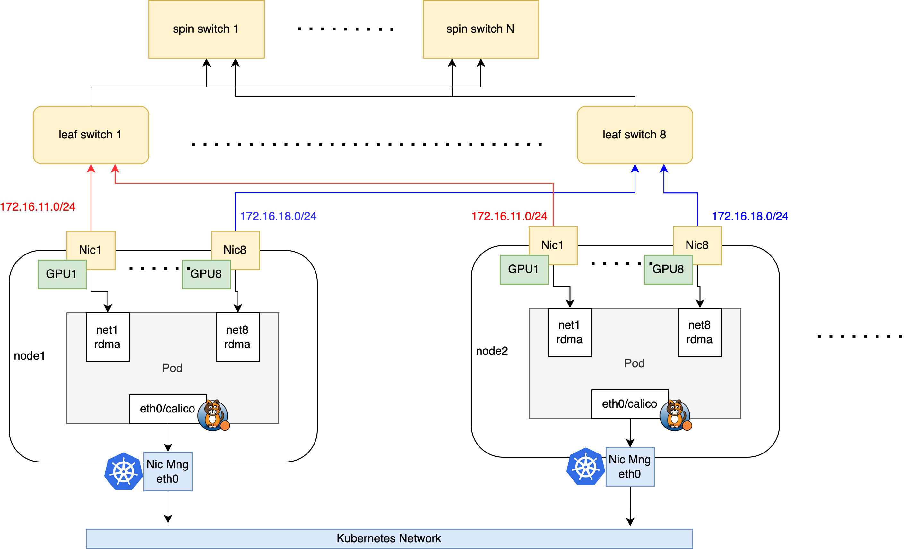

# AI Cluster With SR-IOV

**简体中文** | [**English**](./get-started-sriov.md)

## 介绍

本节介绍在建设 AI 集群场景下，如何基于 SR-IOV 技术给容器提供 RDMA 通信能力，它适用在 RoCE 和 Infiniband 网络场景下。

Spiderpool 使用了 [sriov-network-operator](https://github.com/k8snetworkplumbingwg/sriov-network-operator) 为容器提供了基于 SR-IOV 接口的 RDMA 设备：

- Linux 的 RDMA 子系统，可两种在共享模式或独占模式下：

    1. 共享模式，容器中会看到 PF 接口的所有 VF 设备的 RDMA 设备，但只有分配给本容器的 VF 才具备从 0 开始的 GID Index。

    2. 独占模式，容器中只会看到分配给自身 VF 的 RDMA 设备，不会看见 PF 和 其它 VF 的 RDMA 设备。

- 在不同的网络场景下，使用了不同的 CNI

    1. Infiniband 网络场景下，使用 [IB-SRIOV CNI](https://github.com/k8snetworkplumbingwg/ib-sriov-cni) 给 POD 提供 SR-IOV 网卡。

    2. RoCE 网络场景下， 使用了 [SR-IOV CNI](https://github.com/k8snetworkplumbingwg/sriov-cni) 来暴露宿主机上的 RDMA 网卡给 Pod 使用，暴露 RDMA 资源。可额外使用 [RDMA CNI](https://github.com/k8snetworkplumbingwg/rdma-cni) 来完成 RDMA 设备隔离。

## 方案

本文将以如下典型的 AI 集群拓扑为例，介绍如何搭建 Spiderpool


图1 AI 集群拓扑

集群的网络规划如下：

1. 在节点的 eth0 网卡上运行 calico CNI，来承载 kubernetes 流量。AI workload 将会被分配一个 calico 的缺省网卡，进行控制面通信。

2. 节点上使用具备 RDMA 功能的 Mellanox ConnectX5 网卡来承载 AI 计算的 RDMA 流量，网卡接入到 rail optimized 网络中。AI workload 将会被额外分配所有 RDMA 网卡的 SR-IOV 虚拟化接口，确保 GPU 的高速网络通信。

## 安装要求

- 参考 [Spiderpool安装要求](./../system-requirements-zh_CN.md)

- 主机上准备好 Helm 二进制

- 安装好 Kubernetes 集群，kubelet 工作在图 1 中的主机 eth0 网卡上

- 在 Infiniband 网络场景下，确保 OpenSM 子网管理器工作正常

- 安装 Calico 作为集群的缺省 CNI，使用主机的 eth0 网卡作为 calico 的流量转发网卡。
    如果未安装，可参考 [官方文档](https://docs.tigera.io/calico/latest/getting-started/kubernetes/) 或参考以下命令安装:

    ```shell
    $ kubectl apply -f https://github.com/projectcalico/calico/blob/master/manifests/calico.yaml
    $ kubectl wait --for=condition=ready -l k8s-app=calico-node  pod -n kube-system 
    # set calico to work on host eth0 
    $ kubectl set env daemonset -n kube-system calico-node IP_AUTODETECTION_METHOD=kubernetes-internal-ip
    # set calico to work on host eth0 
    $ kubectl set env daemonset -n kube-system calico-node IP6_AUTODETECTION_METHOD=kubernetes-internal-ip  
    ```

## 主机准备

1. 安装 RDMA 网卡驱动

    对于 Mellanox 网卡，可下载 [NVIDIA OFED 官方驱动](https://network.nvidia.com/products/infiniband-drivers/linux/mlnx_ofed/) 进行主机安装，执行如下安装命令

    ```
    mount /root/MLNX_OFED_LINUX-24.01-0.3.3.1-ubuntu22.04-x86_64.iso   /mnt
    /mnt/mlnxofedinstall --all
    ```

    对于 Mellanox 网卡，也可基于容器化安装，实现对集群主机上所有 Mellanox 网卡批量安装驱动，运行如下命令，注意的是，该运行过程中需要访问因特网获取一些安装包。当所有的 ofed pod 进入 ready 状态，表示主机上已经完成了 OFED driver 安装

    ```shell
    $ helm repo add spiderchart https://spidernet-io.github.io/charts
    $ helm repo update
    $ helm search repo ofed

    # pelase replace the following values with your actual environment
    # for china user, it could set `--set image.registry=nvcr.m.daocloud.io` to use a domestic registry
    $ helm install ofed-driver spiderchart/ofed-driver -n kube-system \
            --set image.OSName="ubuntu" \
            --set image.OSVer="22.04" \
            --set image.Arch="amd64"
    ```

    > 若希望 RDMA 系统工作在独占模式下，必须至少满足以下条件之一： (1） 基于 5.3.0 或更新版本的 Linux 内核，系统中加载的 RDMA 模块，rdma 核心包提供了在系统启动时自动加载相关模块的方法 (2） 需要 Mellanox OFED 4.7 版或更新版本。在这种情况下，不需要使用基于 5.3.0 或更新版本的内核。

2. 确认网卡支持 Infiniband 或 Ethernet 工作模式

    本示例环境中，宿主机上接入了 mellanox ConnectX 5 VPI 网卡，查询 RDMA 设备，确认网卡驱动安装完成

    ```
    $ rdma link
      link mlx5_0/1 state ACTIVE physical_state LINK_UP netdev ens6f0np0
      link mlx5_1/1 state ACTIVE physical_state LINK_UP netdev ens6f1np1
      ....... 
    ```

    确认网卡的工作模式，如下输出表示网卡工作在 Ethernet 模式下，可实现 RoCE 通信

    ```
    $ ibstat mlx5_0 | grep "Link layer"
       Link layer: Ethernet
    ```

    如下输出表示网卡工作在 Infiniband 模式下，可实现 Infiniband 通信

    ```
    $ ibstat mlx5_0 | grep "Link layer"
       Link layer: InfiniBand
    ```

    如果网卡没有工作在预期的模式下，请输入如下命令，确认网卡支持配置 LINK_TYPE 参数，如果没有该参数，请更换支持的网卡型号

    ```
    $ mst start

    # check the card's PCIE 
    $ lspci -nn | grep Mellanox
          86:00.0 Infiniband controller [0207]: Mellanox Technologies MT27800 Family [ConnectX-5] [15b3:1017]
          86:00.1 Infiniband controller [0207]: Mellanox Technologies MT27800 Family [ConnectX-5] [15b3:1017]
          ....... 

    # check whether the network card supports parameters LINK_TYPE 
    $ mlxconfig -d 86:00.0  q | grep LINK_TYPE
          LINK_TYPE_P1                                IB(1)
    ```

3. 开启 [GPUDirect RMDA](https://docs.nvidia.com/cuda/gpudirect-rdma/) 功能

    在安装或使用 [gpu-operator](https://github.com/NVIDIA/gpu-operator) 过程中

    a. 开启 helm 安装选项: `--set driver.rdma.enabled=true --set driver.rdma.useHostMofed=true`，gpu-operator 会安装 [nvidia-peermem](https://network.nvidia.com/products/GPUDirect-RDMA/) 内核模块，启用 GPUDirect RMDA 功能，加速 GPU 和 RDMA 网卡之间的转发性能。可在主机上输入如下命令，确认安装成功的内核模块

    ```
    $ lsmod | grep nvidia_peermem
      nvidia_peermem         16384  0
    ```

    b. 开启 helm 安装选项: `--set gdrcopy.enabled=true`，gpu-operator 会安装 [gdrcopy](https://developer.nvidia.com/gdrcopy) 内核模块，加速 GPU 显存 和 CPU 内存 之间的转发性能。可在主机上输入如下命令，确认安装成功的内核模块

    ```
    $ lsmod | grep gdrdrv
      gdrdrv                 24576  0
    ```

4. 若希望 RDMA 系统工作在独占模式下，请设置主机上的 RDMA 子系统为 exclusive 模式，使得容器能够独立使用 RDMA 设备过程，避免与其他容器共享

    ```
    # Check the current operating mode (the Linux RDMA subsystem operates in shared mode by default):
    $ rdma system
       netns shared copy-on-fork on

    # Persist the exclusive mode to remain effective after a reboot
    $ echo "options ib_core netns_mode=0" >> /etc/modprobe.d/ib_core.conf

    # Switch the current operating mode to exclusive mode. If the setting fails, please reboot the host
    $ rdma system set netns exclusive

    # Verify the successful switch to exclusive mode
    $ rdma system
       netns exclusive copy-on-fork on
    ```

## 安装 Spiderpool

1. 使用 helm 安装 Spiderpool，并启用 SR-IOV 组件

    ```
    helm repo add spiderpool https://spidernet-io.github.io/spiderpool
    helm repo update spiderpool
    kubectl create namespace spiderpool
    helm install spiderpool spiderpool/spiderpool -n spiderpool --set sriov.install=true
    ```

    > 如果您是中国用户，可以指定参数 `--set global.imageRegistryOverride=ghcr.m.daocloud.io` 来使用国内的镜像源。

    完成后，安装的组件如下

    ```
    $ kubectl get pod -n spiderpool
        operator-webhook-sgkxp                         1/1     Running     0          1m
        spiderpool-agent-9sllh                         1/1     Running     0          1m
        spiderpool-agent-h92bv                         1/1     Running     0          1m
        spiderpool-controller-7df784cdb7-bsfwv         1/1     Running     0          1m
        spiderpool-sriov-operator-65b59cd75d-89wtg     1/1     Running     0          1m
        spiderpool-init                                0/1     Completed   0          1m
        sriov-network-config-daemon-8h576              1/1     Running     0          1m
        sriov-network-config-daemon-n629x              1/1     Running     0          1m
    ```

2. 配置 SR-IOV operator, 在每个主机上创建出 VF 设备

    使用如下命令，查询主机上网卡设备的 PCIE 信息。确认如下输出的设备号 [15b3:1017] 出现在 [sriov-network-operator 支持网卡型号范围](https://github.com/k8snetworkplumbingwg/sriov-network-operator/blob/master/deployment/sriov-network-operator-chart/templates/configmap.yaml)

    ```
    $ lspci -nn | grep Mellanox
        86:00.0 Infiniband controller [0207]: Mellanox Technologies MT27800 Family [ConnectX-5] [15b3:1017]
        86:00.1 Infiniband controller [0207]: Mellanox Technologies MT27800 Family [ConnectX-5] [15b3:1017]
        ....
    ```

    SRIOV VF 数量决定了一个网卡能同时为多少个 POD 提供网卡，不同型号的网卡的有不同的最大 VF 数量上限，Mellanox 的 ConnectX 网卡常见型号的最大 VF 上限是 127 。
    如下示例，设置每个节点上的 GPU1 和 GPU2 的网卡，每个网卡配置出 12 个 VF 设备。请参考如下，为主机上每个亲和 GPU 的网卡配置 SriovNetworkNodePolicy，这样，将有 8 个 SRIOV resource 以供使用。

    ```
    # 对于 ethernet 网络，设置 LINK_TYPE=eth， 对于 Infiniband 网络，设置 LINK_TYPE=ib
    $ LINK_TYPE=eth
    $ cat <<EOF | kubectl apply -f -
    apiVersion: sriovnetwork.openshift.io/v1
    kind: SriovNetworkNodePolicy
    metadata:
      name: gpu1-nic-policy
      namespace: spiderpool
    spec:
          nodeSelector:
            kubernetes.io/os: "linux"
          resourceName: gpu1sriov
          priority: 99
          numVfs: 12
          nicSelector:
              deviceID: "1017"
              vendor: "15b3"
              rootDevices:
              - 0000:86:00.0
          linkType: ${LINK_TYPE}
          deviceType: netdevice
          isRdma: true
    ---
    apiVersion: sriovnetwork.openshift.io/v1
    kind: SriovNetworkNodePolicy
    metadata:
      name: gpu2-nic-policy
      namespace: spiderpool
    spec:
          nodeSelector:
            kubernetes.io/os: "linux"
          resourceName: gpu2sriov
          priority: 99
          numVfs: 12
          nicSelector:
              deviceID: "1017"
              vendor: "15b3"
              rootDevices:
              - 0000:86:00.0
          linkType: ${LINK_TYPE}
          deviceType: netdevice
          isRdma: true
    EOF
    ```

    创建 SriovNetworkNodePolicy 配置后，每个节点上将会启动 sriov-device-plugin ，负责上报 VF 设备资源

    ```
    $ kubectl get pod -n spiderpool
        operator-webhook-sgkxp                         1/1     Running     0          2m
        spiderpool-agent-9sllh                         1/1     Running     0          2m
        spiderpool-agent-h92bv                         1/1     Running     0          2m
        spiderpool-controller-7df784cdb7-bsfwv         1/1     Running     0          2m
        spiderpool-sriov-operator-65b59cd75d-89wtg     1/1     Running     0          2m
        spiderpool-init                                0/1     Completed   0          2m
        sriov-device-plugin-x2g6b                      1/1     Running     0          1m
        sriov-device-plugin-z4gjt                      1/1     Running     0          1m
        sriov-network-config-daemon-8h576              1/1     Running     0          1m
        sriov-network-config-daemon-n629x              1/1     Running     0          1m
        .......
    ```

    创建 SriovNetworkNodePolicy 配置后，SR-IOV operator 会顺序地在每一个节点上驱逐 POD，配置网卡驱动中的 VF 设置，然后重启主机。因此，会观测到集群中的节点会顺序进入 SchedulingDisabled 状态，并被重启。

    ```
    $ kubectl get node
        NAME           STATUS                     ROLES                  AGE     VERSION
        ai-10-1-16-1   Ready                      worker                 2d15h   v1.28.9
        ai-10-1-16-2   Ready,SchedulingDisabled   worker                 2d15h   v1.28.9
        .......
    ```

    所有节点完成 VF 配置的过程，可能需要数分钟，可以观察 sriovnetworknodestates 中的 status 是否进入 Succeeded 状态，表示配置完成

    ```
    $ kubectl get sriovnetworknodestates -A
        NAMESPACE        NAME           SYNC STATUS   DESIRED SYNC STATE   CURRENT SYNC STATE   AGE
        spiderpool       ai-10-1-16-1   Succeeded     Idle                 Idle                 4d6h
        spiderpool       ai-10-1-16-2   Succeeded     Idle                 Idle                 4d6h
        .......
    ```

    对于配置成功的节点，可查看 node 的可用资源，包含了上报的 SR-IOV 设备资源

    ```
    $ kubectl get no -o json | jq -r '[.items[] | {name:.metadata.name, allocable:.status.allocatable}]'
        [
          {
            "name": "ai-10-1-16-1",
            "allocable": {
              "cpu": "40",
              "pods": "110",
              "spidernet.io/gpu1sriov": "12",
              "spidernet.io/gpu2sriov": "12",
              ...
            }
          },
          ...
        ]
    ```

3. 创建 CNI 配置和对应的 ippool 资源

   (1) 对于 Infiniband 网络，请为所有的 GPU 亲和的 SR-IOV 网卡配置 [IB-SRIOV CNI](https://github.com/k8snetworkplumbingwg/ib-sriov-cni) 配置，并创建对应的 IP 地址池 。 如下例子，配置了 GPU1 亲和的网卡和 IP 地址池

    ```shell
    $ cat <<EOF | kubectl apply -f -
    apiVersion: spiderpool.spidernet.io/v2beta1
    kind: SpiderIPPool
    metadata:
      name: gpu1-net11
    spec:
      gateway: 172.16.11.254
      subnet: 172.16.11.0/16
      ips:
        - 172.16.11.1-172.16.11.200
    ---
    apiVersion: spiderpool.spidernet.io/v2beta1
    kind: SpiderMultusConfig
    metadata:
      name: gpu1-sriov
      namespace: spiderpool
    spec:
      cniType: ib-sriov
      ibsriov:
        resourceName: spidernet.io/gpu1sriov
        rdmaIsolation: true
        ippools:
          ipv4: ["gpu1-net91"]
    EOF
    ```

   (2) 对于 Ethernet 网络，请为所有的 GPU 亲和的 SR-IOV 网卡配置 [SR-IOV CNI](https://github.com/k8snetworkplumbingwg/sriov-cni) 配置，并创建对应的 IP 地址池 。 如下例子，配置了 GPU1 亲和的网卡和 IP 地址池

    ```
    $ cat <<EOF | kubectl apply -f -
    apiVersion: spiderpool.spidernet.io/v2beta1
    kind: SpiderIPPool
    metadata:
      name: gpu1-net11
    spec:
      gateway: 172.16.11.254
      subnet: 172.16.11.0/16
      ips:
        - 172.16.11.1-172.16.11.200
    ---
    apiVersion: spiderpool.spidernet.io/v2beta1
    kind: SpiderMultusConfig
    metadata:
      name: gpu1-sriov
      namespace: spiderpool
    spec:
      cniType: sriov
      sriov:
        resourceName: spidernet.io/gpu1sriov
        enableRdma: true
        ippools:
          ipv4: ["gpu1-net11"]
    EOF
    ```

## 创建测试应用

1. 在指定节点上创建一组 DaemonSet 应用，测试指定节点上的 SR-IOV 设备的可用性
    如下例子，通过 annotations `v1.multus-cni.io/default-network` 指定使用 calico 的缺省网卡，用于进行控制面通信，annotations `k8s.v1.cni.cncf.io/networks` 接入 8 个 GPU 亲和网卡的 VF 网卡，用于 RDMA 通信，并配置 8 种 RDMA resources 资源

    > 注：支持自动为应用注入 RDMA 网络资源，参考 [基于 Webhook 自动为应用注入 RDMA 网络资源](#基于-webhook-自动注入-rdma-网络资源)

    ```
    $ helm repo add spiderchart https://spidernet-io.github.io/charts
    $ helm repo update
    $ helm search repo rdma-tools
   
    # run daemonset on worker1 and worker2
    $ cat <<EOF > values.yaml
    # for china user , it could add these to use a domestic registry
    #image:
    #  registry: ghcr.m.daocloud.io

    # just run daemonset in nodes 'worker1' and 'worker2'
    affinity:
      nodeAffinity:
        requiredDuringSchedulingIgnoredDuringExecution:
          nodeSelectorTerms:
          - matchExpressions:
            - key: kubernetes.io/hostname
              operator: In
              values:
              - worker1
              - worker2

    # sriov interfaces
    extraAnnotations:
      k8s.v1.cni.cncf.io/networks: |-
        [{"name":"gpu1-sriov","namespace":"spiderpool"},
        {"name":"gpu2-sriov","namespace":"spiderpool"},
        {"name":"gpu3-sriov","namespace":"spiderpool"},
        {"name":"gpu4-sriov","namespace":"spiderpool"},
        {"name":"gpu5-sriov","namespace":"spiderpool"},
        {"name":"gpu6-sriov","namespace":"spiderpool"},
        {"name":"gpu7-sriov","namespace":"spiderpool"},
        {"name":"gpu8-sriov","namespace":"spiderpool"}]

    # sriov resource
    resources:
      limits:
        spidernet.io/gpu1sriov: 1
        spidernet.io/gpu2sriov: 1
        spidernet.io/gpu3sriov: 1
        spidernet.io/gpu4sriov: 1
        spidernet.io/gpu5sriov: 1
        spidernet.io/gpu6sriov: 1
        spidernet.io/gpu7sriov: 1
        spidernet.io/gpu8sriov: 1
        #nvidia.com/gpu: 1
    EOF

    $ helm install rdma-tools spiderchart/rdma-tools -f ./values.yaml
    
    ```

    在容器的网络命名空间创建过程中，Spiderpool 会对 sriov 接口上的网关进行连通性测试，如果如上应用的所有 POD 都启动成功，说明了每个节点上的 VF 设备的连通性成功，可进行正常的 RDMA 通信。

2. 查看容器的网络命名空间状态

    可进入任一一个 POD 的网络命名空间中，确认具备 9 个网卡

    ```
    $ kubectl exec -it rdma-tools-4v8t8  bash
    kubectl exec [POD] [COMMAND] is DEPRECATED and will be removed in a future version. Use kubectl exec [POD] -- [COMMAND] instead.
    root@rdma-tools-4v8t8:/# ip a
       1: lo: <LOOPBACK,UP,LOWER_UP> mtu 65536 qdisc noqueue state UNKNOWN group default qlen 1000
           link/loopback 00:00:00:00:00:00 brd 00:00:00:00:00:00
           inet 127.0.0.1/8 scope host lo
              valid_lft forever preferred_lft forever
           inet6 ::1/128 scope host
              valid_lft forever preferred_lft forever
       2: tunl0@NONE: <NOARP> mtu 1480 qdisc noop state DOWN group default qlen 1000
           link/ipip 0.0.0.0 brd 0.0.0.0
       3: eth0@if356: <BROADCAST,MULTICAST,UP,LOWER_UP> mtu 1480 qdisc noqueue state UP group default qlen 1000
           link/ether ca:39:52:fc:61:cd brd ff:ff:ff:ff:ff:ff link-netnsid 0
           inet 10.233.119.164/32 scope global eth0
              valid_lft forever preferred_lft forever
           inet6 fe80::c839:52ff:fefc:61cd/64 scope link
              valid_lft forever preferred_lft forever
       269: net1: <BROADCAST,MULTICAST,UP,LOWER_UP> mtu 1500 qdisc mq state UP group default qlen 1000
           link/ether 3a:97:49:35:79:95 brd ff:ff:ff:ff:ff:ff
           inet 172.16.11.10/24 brd 10.1.19.255 scope global net1
              valid_lft forever preferred_lft forever
           inet6 fe80::3897:49ff:fe35:7995/64 scope link
              valid_lft forever preferred_lft forever
       239: net2: <BROADCAST,MULTICAST,UP,LOWER_UP> mtu 1500 qdisc mq state UP group default qlen 1000
           link/ether 1e:b6:13:0e:2a:d5 brd ff:ff:ff:ff:ff:ff
           inet 172.16.12.10/24 brd 10.1.19.255 scope global net1
              valid_lft forever preferred_lft forever
           inet6 fe80::1cb6:13ff:fe0e:2ad5/64 scope link
              valid_lft forever preferred_lft forever
       .....
    ```

    查看路由配置，Spiderpool 会自动为每个网卡调谐策略路由，确保每个网卡上收到的外部请求都会从该网卡上返回回复流量

    ```shell
    root@rdma-tools-4v8t8:/# ip rule
    0:  from all lookup local
    32762:  from 172.16.11.10 lookup 107
    32763:  from 172.16.12.10 lookup 106
    32764:  from 172.16.13.10 lookup 105
    32765:  from 172.16.14.10 lookup 104
    32765:  from 172.16.15.10 lookup 103
    32765:  from 172.16.16.10 lookup 102
    32765:  from 172.16.17.10 lookup 101
    32765:  from 172.16.18.10 lookup 100
    32766:  from all lookup main
    32767:  from all lookup default

    root@rdma-tools-4v8t8:/# ip route show table 100
        default via 172.16.11.254 dev net1
    ```

    main 路由中，确保了 calico 网络流量、ClusterIP 流量、本地宿主机通信等流量都会从 calico 网卡转发

    ```
    root@rdma-tools-4v8t8:/# ip r show table main
        default via 169.254.1.1 dev eth0
        172.16.11.0/24 dev net1 proto kernel scope link src 172.16.11.10
        172.16.12.0/24 dev net2 proto kernel scope link src 172.16.12.10
        172.16.13.0/24 dev net3 proto kernel scope link src 172.16.13.10
        172.16.14.0/24 dev net4 proto kernel scope link src 172.16.14.10
        172.16.15.0/24 dev net5 proto kernel scope link src 172.16.15.10
        172.16.16.0/24 dev net6 proto kernel scope link src 172.16.16.10
        172.16.17.0/24 dev net7 proto kernel scope link src 172.16.17.10
        172.16.18.0/24 dev net8 proto kernel scope link src 172.16.18.10
        10.233.0.0/18 via 10.1.20.4 dev eth0 src 10.233.119.164
        10.233.64.0/18 via 10.1.20.4 dev eth0 src 10.233.119.164
        10.233.119.128 dev eth0 scope link src 10.233.119.164
        169.254.0.0/16 via 10.1.20.4 dev eth0 src 10.233.119.164
        169.254.1.1 dev eth0 scope link
    ```

    确认具备 8 个 RDMA 设备

    ```
    root@rdma-tools-4v8t8:/# rdma link
        link mlx5_27/1 state ACTIVE physical_state LINK_UP netdev net2
        link mlx5_54/1 state ACTIVE physical_state LINK_UP netdev net1
        link mlx5_67/1 state ACTIVE physical_state LINK_UP netdev net4
        link mlx5_98/1 state ACTIVE physical_state LINK_UP netdev net3
        .....
    ```

3. 在跨节点的 Pod 之间，确认 RDMA 收发数据正常

   开启一个终端，进入一个 Pod 启动服务

    ```
    # see 8 RDMA devices assigned to the Pod
    $ rdma link

    # Start an RDMA service
    $ ib_read_lat
    ```

   开启一个终端，进入另一个 Pod 访问服务：

    ```
    # You should be able to see all RDMA network cards on the host
    $ rdma link
        
    # Successfully access the RDMA service of the other Pod
    $ ib_read_lat 172.91.0.115
    ```

## （可选）Infiniband 网络下对接 UFM

对于使用了 Infiniband 网络的集群，如果网络中有 [UFM 管理平台](https://www.nvidia.com/en-us/networking/infiniband/ufm/)，可使用 [ib-kubernetes](https://github.com/Mellanox/ib-kubernetes) 插件，它以 daemonset 形式运行，监控所有使用 SRIOV 网卡的容器，把 VF 设备的 Pkey 和 GUID 上报给 UFM 。

1. 在 UFM 主机上创建通信所需要的证书：

    ```
    # replace to right address
    $ UFM_ADDRESS=172.16.10.10
    $ openssl req -x509 -newkey rsa:4096 -keyout ufm.key -out ufm.crt -days 365 -subj '/CN=${UFM_ADDRESS}'

    # Copy the certificate files to the UFM certificate directory:
    $ cp ufm.key /etc/pki/tls/private/ufmlocalhost.key
    $ cp ufm.crt /etc/pki/tls/certs/ufmlocalhost.crt

    # For containerized UFM deployment, restart the container service
    $ docker restart ufm

    # For host-based UFM deployment, restart the UFM service
    $ systemctl restart ufmd
    ```

2. 在 kubernetes 集群上，创建 ib-kubernetes 所需的通信证书。把 UFM 主机上生成的 ufm.crt 文件传输至 kubernetes 节点上，并使用如下命令创建证书

    ```
    # replace to right user
    $ UFM_USERNAME=admin

    # replace to right password
    $ UFM_PASSWORD=12345

    # replace to right address
    $ UFM_ADDRESS="172.16.10.10"
    $ kubectl create secret generic ib-kubernetes-ufm-secret --namespace="kube-system" \
                 --from-literal=UFM_USER="${UFM_USERNAME}" \
                 --from-literal=UFM_PASSWORD="${UFM_PASSWORD}" \
                 --from-literal=UFM_ADDRESS="${UFM_ADDRESS}" \
                 --from-file=UFM_CERTIFICATE=ufm.crt 
    ```

3. 在 kubernetes 集群上安装 ib-kubernetes

    ```
    git clone https://github.com/Mellanox/ib-kubernetes.git && cd ib-kubernetes
    $ kubectl create -f deployment/ib-kubernetes-configmap.yaml
    kubectl create -f deployment/ib-kubernetes.yaml 
    ```

4. 在 Infiniband 网络下，创建 Spiderpool 的 SpiderMultusConfig 时，可配置 pkey，使用该配置创建的 POD 将生效 pkey 配置，且被 ib-kubernetes 同步给 UFM

    ```
    $ cat <<EOF | kubectl apply -f -
    apiVersion: spiderpool.spidernet.io/v2beta1
    kind: SpiderMultusConfig
    metadata:
      name: ib-sriov
      namespace: spiderpool
    spec:
          cniType: ib-sriov
          ibsriov:
            pkey: 1000
            ...
    EOF
    ```

    > Note: Each node in an Infiniband Kubernetes deployment may be associated with up to 128 PKeys due to kernel limitation

## 基于 Webhook 自动注入 RDMA 网络资源

Spiderpool 为了简化 AI 应用配置多网卡的复杂度，支持通过 labels(`cni.spidernet.io/rdma-resource-inject`) 对一组网卡配置分类。用户只需要为 Pod 添加相同的注解。这样 Spiderpool 会通过 webhook 自动为 Pod 注入所有具有相同 label 的对应的网卡和网络资源。

  > 该功能仅支持 [ macvlan,ipvlan,sriov,ib-sriov, ipoib ] 这几种 cniType 的网卡配置。

1. 使用 webhook 自动注入 RDMA 网络资源，需要安装 Spiderpool 时指定开启 webhook 自动注入网络资源功能：

    ```shell
    helm install spiderpool spiderchart/spiderpool --set spiderpoolController.podResourceInject.enabled=true
    ```

    > - 默认关闭 webhook 自动注入网络资源功能，需要用户手动开启。
    > - 您可以通过 `spiderpoolController.podResourceInject.namespacesExclude` 指定不注入的命名空间，通过 `spiderpoolController.podResourceInject.namespacesInclude` 指定注入的命名空间。
    > - 安装 Spiderpool 后，您可以通过更新 spiderpool-config configMap 中 podResourceInject 字段更新配置。

2. 创建 SpiderMultusConfig 时指定 labels，并配置 RDMA 相关配置：

   (1) 对于 Infiniband 网络，请为所有的 GPU 亲和的 SR-IOV 网卡配置 [IB-SRIOV CNI](https://github.com/k8snetworkplumbingwg/ib-sriov-cni) 配置，并创建对应的 IP 地址池 。 如下例子，配置了 GPU1 亲和的网卡和 IP 地址池

    ```shell
    $ cat <<EOF | kubectl apply -f -
    apiVersion: spiderpool.spidernet.io/v2beta1
    kind: SpiderIPPool
    metadata:
      name: gpu1-net11
    spec:
      gateway: 172.16.11.254
      subnet: 172.16.11.0/16
      ips:
        - 172.16.11.1-172.16.11.200
    ---
    apiVersion: spiderpool.spidernet.io/v2beta1
    kind: SpiderMultusConfig
    metadata:
      name: gpu1-sriov
      namespace: spiderpool
      labels:
        cni.spidernet.io/rdma-resource-inject: gpu-ibsriov
    spec:
      cniType: ib-sriov
      ibsriov:
        resourceName: spidernet.io/gpu1sriov
        rdmaIsolation: true
        ippools:
          ipv4: ["gpu1-net91"]
    EOF
    ```

    > - `cni.spidernet.io/rdma-resource-inject: gpu-ibsriov` 固定的 key，value 为用户自定义。具有相同 Label 和 Value 的一组网卡配置要求 cniType 必须一致。
    > - `resourceName` 和 `ippools` 必须配置，否则 Pod 无法成功注入网络资源。

   (2) 对于 Ethernet 网络，请为所有的 GPU 亲和的 SR-IOV 网卡配置 [SR-IOV CNI](https://github.com/k8snetworkplumbingwg/sriov-cni) 配置，并创建对应的 IP 地址池 。 如下例子，配置了 GPU1 亲和的网卡和 IP 地址池

    ```
    $ cat <<EOF | kubectl apply -f -
    apiVersion: spiderpool.spidernet.io/v2beta1
    kind: SpiderIPPool
    metadata:
      name: gpu1-net11
    spec:
      gateway: 172.16.11.254
      subnet: 172.16.11.0/16
      ips:
        - 172.16.11.1-172.16.11.200
    ---
    apiVersion: spiderpool.spidernet.io/v2beta1
    kind: SpiderMultusConfig
    metadata:
      name: gpu1-sriov
      namespace: spiderpool
      labels:
        cni.spidernet.io/rdma-resource-inject: gpu-sriov
    spec:
      cniType: sriov
      sriov:
        resourceName: spidernet.io/gpu1sriov
        enableRdma: true
        ippools:
          ipv4: ["gpu1-net11"]
    EOF
    ```

    > - `cni.spidernet.io/rdma-resource-inject: gpu-sriov` 固定的 key，value 为用户自定义。具有相同 Label 和 Value 的一组网卡配置要求 cniType 必须一致。
    > - `resourceName` 和 `ippools` 必须配置，否则 Pod 无法成功注入网络资源。

3. 创建应用时，添加注解: `cni.spidernet.io/rdma-resource-inject: gpu-sriov`，这样 Spiderpool 自动为 Pod 添加  8 个 GPU 亲和网卡的网卡，用于 RDMA 通信，并配置 8 种 RDMA resources 资源:

    > 注意：使用 webhook 自动注入网络资源功能时，不能为应用添加其他网络配置注解(如 `k8s.v1.cni.cncf.io/networks` 和 `ipam.spidernet.io/ippools`等)，否则会影响资源自动注入功能。

    ```shell
    $ helm repo add spiderchart https://spidernet-io.github.io/charts
    $ helm repo update
    $ helm search repo rdma-tools
   
    # run daemonset on worker1 and worker2
    $ cat <<EOF > values.yaml
    # for china user , it could add these to use a domestic registry
    #image:
    #  registry: ghcr.m.daocloud.io

    # just run daemonset in nodes 'worker1' and 'worker2'
    affinity:
      nodeAffinity:
        requiredDuringSchedulingIgnoredDuringExecution:
          nodeSelectorTerms:
          - matchExpressions:
            - key: kubernetes.io/hostname
              operator: In
              values:
              - worker1
              - worker2

    # macvlan interfaces
    extraAnnotations:
      cni.spidernet.io/rdma-resource-inject: gpu-sriov
    EOF

    $ helm install rdma-tools spiderchart/rdma-tools -f ./values.yaml
    ```

    当 Pod 成功 Running，检查 Pod 是否成功注入 8 个 RDMA 网卡的 annotations 和 8 种 RDMA 资源。

    ```shell
    # pod annotations
    extraAnnotations:
      k8s.v1.cni.cncf.io/networks: |-
        [{"name":"gpu1-sriov","namespace":"spiderpool"},
        {"name":"gpu2-sriov","namespace":"spiderpool"},
        {"name":"gpu3-sriov","namespace":"spiderpool"},
        {"name":"gpu4-sriov","namespace":"spiderpool"},
        {"name":"gpu5-sriov","namespace":"spiderpool"},
        {"name":"gpu6-sriov","namespace":"spiderpool"},
        {"name":"gpu7-sriov","namespace":"spiderpool"},
        {"name":"gpu8-sriov","namespace":"spiderpool"}]

    # sriov resource
    resources:
      limits:
        spidernet.io/gpu1sriov: 1
        spidernet.io/gpu2sriov: 1
        spidernet.io/gpu3sriov: 1
        spidernet.io/gpu4sriov: 1
        spidernet.io/gpu5sriov: 1
        spidernet.io/gpu6sriov: 1
        spidernet.io/gpu7sriov: 1
        spidernet.io/gpu8sriov: 1
        #nvidia.com/gpu: 1
    ```
