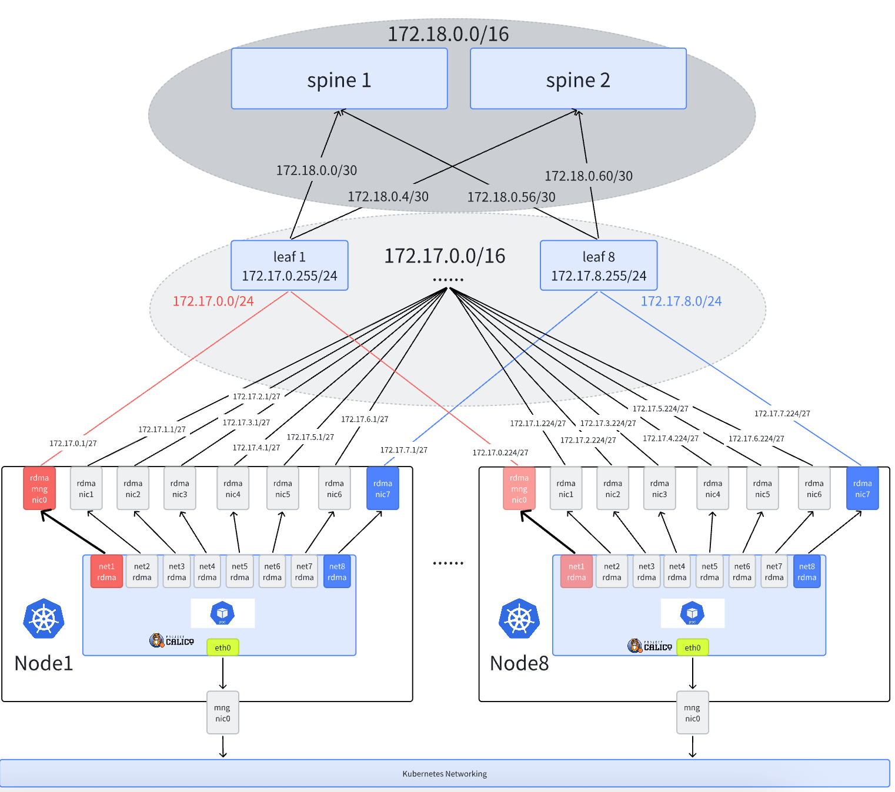

# AI Cluster With SR-IOV

**English** | [**简体中文**](./get-started-sriov-zh_CN.md)

## Introduction

This section describes how to provide RDMA communication capabilities to containers based on SR-IOV technology in AI cluster scenarios, which is applicable to both RoCE and InfiniBand network environments.

Spiderpool uses [sriov-network-operator](https://github.com/k8snetworkplumbingwg/sriov-network-operator) to provide RDMA devices based on SR-IOV interfaces for containers:

- Linux RDMA subsystem, which can operate in two modes:

  1. **Shared Mode**: Containers can see all VF devices of the PF interface, but only the VFs assigned to the container will have GID Index starting from 0.

  2. **Exclusive Mode**: Containers can only see the RDMA devices of the VFs assigned to them, and cannot see the PF and other VFs' RDMA devices.

- Different CNIs are used in different network scenarios:

  1. In InfiniBand networks, [IB-SRIOV CNI](https://github.com/k8snetworkplumbingwg/ib-sriov-cni) is used to provide SR-IOV network interfaces to Pods.

  2. In RoCE networks, [SR-IOV CNI](https://github.com/k8snetworkplumbingwg/sriov-cni) is used to expose the host's RDMA network cards to Pods and expose RDMA resources. [RDMA CNI](https://github.com/k8snetworkplumbingwg/rdma-cni) can be additionally used for RDMA device isolation.

> Note:
>
> - Providing RDMA communication capabilities to containers based on SR-IOV technology is only applicable to bare-metal environments, not virtual machine environments.

## Comparison with Macvlan CNI RDMA Solution

| Dimension         | Macvlan Shared RDMA Solution                | SR-IOV CNI Isolated RDMA Solution         |
|-------------------|--------------------------------------------|------------------------------------------|
| Network Isolation | All containers share RDMA devices, poor isolation | Containers have dedicated RDMA devices, better isolation |
| Performance       | High performance                           | Optimal performance with hardware passthrough |
| Resource Utilization | High resource utilization                  | Lower, limited by hardware-supported VFs |
| Configuration Complexity | Relatively simple configuration          | More complex, requires hardware support and configuration |
| Compatibility     | Good compatibility, works in most environments | Hardware-dependent, limited compatibility |
| Use Cases         | Suitable for most scenarios including bare-metal, VMs, etc. | Only for bare-metal, not for VMs |
| Cost              | Lower cost, no additional hardware required | Higher cost, requires SR-IOV capable hardware |
| RDMA Protocol Support | Supports RoCE, not InfiniBand          | Supports both RoCE and InfiniBand          |

## Solution 1

This document will use the following typical AI cluster topology as an example to explain how to set up Spiderpool:


Figure 1: AI Cluster Topology

The network planning for the cluster is as follows:

1. The calico CNI runs on the node's eth0 network card to handle Kubernetes traffic. AI workloads will be assigned a default calico network card for control plane communication.

2. The node uses Mellanox ConnectX5 network cards with RDMA capabilities to handle AI computing RDMA traffic, connected to a rail-optimized network. AI workloads will be additionally assigned SR-IOV virtualized interfaces for all RDMA network cards to ensure high-speed network communication for GPUs.

## Solution 2

Solution 1 is suitable for AI clusters where the same rail network cards on all nodes use the same subnet. In this scenario, the entire AI cluster requires multiple subnets. For example, if nodes have 8 rail network cards, 8 independent subnets are needed. In some large-scale AI clusters, due to IP address resource limitations, it's not possible to provide so many subnets. Limited subnets need to be allocated to different rail network cards on different nodes, so in this scenario, the same rail network cards on different nodes are often assigned to different subnets.

Assuming we have a 16-bit mask IP address segment, each rail network card on each node can have 32 addresses, with a 27-bit mask. For nodes with 8 rail network cards, we can support up to 256 nodes (each node has 8 rail network cards, each with 32 addresses).

For example, rail network card 1 on node1 might use the 172.16.1.0/27 subnet, while rail network card 1 on node2 might use the 172.16.1.32/27 subnet.



As shown in Figure 1, the network planning for the cluster is as follows:

1. Each node has 8 RDMA rail network cards, each with 32 IP addresses (27-bit mask). The 8 rail network cards on each node use different subnets.
2. The nic0 network card on each node runs calico CNI to handle Kubernetes traffic. AI workloads will be assigned a default calico network card for control plane communication.
3. The node uses Mellanox ConnectX5 network cards with RDMA capabilities to handle AI computing RDMA traffic, connected to a rail-optimized network. AI workloads will be additionally assigned SR-IOV virtualized interfaces for all RDMA network cards to ensure high-speed network communication for GPUs. Note: The first RDMA network card is used for RDMA control plane communication, while other network cards are used for AI computing RDMA traffic.

## Installation Requirements

- Refer to [Spiderpool Installation Requirements](./../system-requirements.md)

- Ensure the Helm binary is installed on the host

- A working Kubernetes cluster with kubelet running on the host's eth0 network card (as shown in Figure 1)

- For InfiniBand networks, ensure the OpenSM subnet manager is working properly

- Install Calico as the default CNI for the cluster, using the host's eth0 network card as the forwarding interface.
  If not installed, refer to the [official documentation](https://docs.tigera.io/calico/latest/getting-started/kubernetes/) or use the following commands:

  ```shell
  $ kubectl apply -f https://github.com/projectcalico/calico/blob/master/manifests/calico.yaml
  $ kubectl wait --for=condition=ready -l k8s-app=calico-node pod -n kube-system 
  # Set calico to work on host eth0 
  $ kubectl set env daemonset -n kube-system calico-node IP_AUTODETECTION_METHOD=kubernetes-internal-ip
  # Set calico to work on host eth0 
  $ kubectl set env daemonset -n kube-system calico-node IP6_AUTODETECTION_METHOD=kubernetes-internal-ip  
  ```

- For Solution 2, if the cluster uses Docker as the container runtime, you need to configure `hostPID: true` for spiderpool-agent so that Spiderpool-agent can access the Pod's network namespace and enable the Pod to allocate IP addresses based on the host's network card subnet.

```shell
kubectl patch daemonset spiderpool-agent -n spiderpool -p '{"spec":{"template":{"spec":{"hostPID":true}}}}'
```

## Host Preparation

1. Install the RDMA network card driver, then reboot the host (required for the network card to be recognized)

   For Mellanox network cards, download the [NVIDIA OFED official driver](https://network.nvidia.com/products/infiniband-drivers/linux/mlnx_ofed/) and install it on the host using the following commands:

   ```shell
   mount /root/MLNX_OFED_LINUX-24.01-0.3.3.1-ubuntu22.04-x86_64.iso /mnt
   /mnt/mlnxofedinstall --all
   ```

   For Mellanox network cards, you can also use containerized installation to install drivers on all Mellanox network cards in the cluster. Note that this process requires internet access to download some installation packages. When all ofed pods enter the ready state, it means the OFED driver installation is complete on the host.

   ```shell
   $ helm repo add spiderchart https://spidernet-io.github.io/charts
   $ helm repo update
   $ helm search repo ofed

   # Please replace the following values with your actual environment
   # For users in China, you can set `--set image.registry=nvcr.m.daocloud.io` to use a domestic registry
   $ helm install ofed-driver spiderchart/ofed-driver -n kube-system \
           --set image.OSName="ubuntu" \
           --set image.OSVer="22.04" \
           --set image.Arch="amd64"
   ```

   > For RDMA system to work in exclusive mode, at least one of the following conditions must be met:
   > 1. Linux kernel version 5.3.0 or later, with RDMA modules loaded. The rdma-core package provides methods to automatically load related modules at system startup.
   > 2. Mellanox OFED version 4.7 or later. In this case, a kernel version of 5.3.0 or later is not required.

2. For SR-IOV scenarios, set the RDMA subsystem on the host to exclusive mode to allow containers to use RDMA devices independently, avoiding sharing with other containers.

   ```shell
   # Check the current operating mode (the Linux RDMA subsystem operates in shared mode by default):
   $ rdma system
      netns shared copy-on-fork on

   # Persist the exclusive mode to remain effective after a reboot
   $ echo "options ib_core netns_mode=0" >> /etc/modprobe.d/ib_core.conf

   # Switch the current operating mode to exclusive mode. If the setting fails, please reboot the host
   $ rdma system set netns exclusive

   # Verify the successful switch to exclusive mode
   $ rdma system
      netns exclusive copy-on-fork on
   ```

3. Set the RDMA operating mode for the network card (Infiniband or Ethernet)

   3.1 Check the supported operating modes of the network card: In this example, the host has Mellanox ConnectX 5 VPI network cards. Query the RDMA devices to confirm the network card driver is installed.

   ```shell
   $ rdma link
     link mlx5_0/1 state ACTIVE physical_state LINK_UP netdev ens6f0np0
     link mlx5_1/1 state ACTIVE physical_state LINK_UP netdev ens6f1np1
     ....... 
   ```

   Check the operating mode of the network card. The following output indicates the network card is operating in Ethernet mode, enabling RoCE communication:

   ```shell
   $ ibstat mlx5_0 | grep "Link layer"
      Link layer: Ethernet
   ```

   The following output indicates the network card is operating in InfiniBand mode, enabling InfiniBand communication:

   ```shell
   $ ibstat mlx5_0 | grep "Link layer"
      Link layer: InfiniBand
   ```

   If the network card is not in the expected mode, run the following command to check if the network card supports the LINK_TYPE parameter. If this parameter is not available, you may need to use a different network card model.

   ```shell
   $ mst start

   # Check the card's PCIE 
   $ lspci -nn | grep Mellanox
          86:00.0 Infiniband controller [0207]: Mellanox Technologies MT27800 Family [ConnectX-5] [15b3:1017]
          86:00.1 Infiniband controller [0207]: Mellanox Technologies MT27800 Family [ConnectX-5] [15b3:1017]
          ....... 

   # Check if the network card supports the LINK_TYPE parameter
   $ mlxconfig -d 86:00.0 q | grep LINK_TYPE
          LINK_TYPE_P1                                IB(1)
   ```

   3.2 Batch set the operating mode of network cards: Download the [batch configuration script](https://github.com/spidernet-io/spiderpool/blob/main/tools/scripts/setNicRdmaMode.sh) and follow the instructions below. After configuration, please reboot the host.

   ```shell
   $ chmod +x ./setNicRdmaMode.sh

   # Check if all RDMA network cards are in ib or eth mode
   $ ./setNicRdmaMode.sh q

   # Switch all RDMA network cards to eth mode
   $ RDMA_MODE="roce" ./setNicRdmaMode.sh

   # Switch all RDMA network cards to ib mode
   $ RDMA_MODE="infiniband" ./setNicRdmaMode.sh
   ```

4. Configure IP addresses, MTU, and policy routing for all RDMA network cards

   > In RDMA scenarios, both switches and host network cards typically operate with larger MTU values for better performance.
   >
   > Since Linux hosts have only one default route by default, in multi-NIC scenarios, policy-based routing needs to be configured for different network cards to ensure that hostNetwork mode tasks can run All-to-All communication properly.
   >
   > For Solution 2: The host side needs to configure an RDMA subnet route to ensure RDMA control plane traffic can be transmitted normally.

   Download the [Ubuntu network card configuration script](https://github.com/spidernet-io/spiderpool/blob/main/tools/scripts/setNicAddr.sh) and run the following reference commands:

   ```shell
   $ chmod +x ./setNicAddr.sh

   # For Solution 1, configure the network card
   $ INTERFACE="eno3np2" IPV4_IP="172.16.0.10/24" IPV4_GATEWAY="172.16.0.1" \
         MTU="4200" ENABLE_POLICY_ROUTE="true" ./setNicAddr.sh

   # For Solution 2, you must select a network card (usually the node's rail 1 RDMA network card) as the RDMA subnet route network card.
   # Set ENABLE_RDMA_DEFAULT_ROUTE="true" RDMA_SUBNET="172.16.0.0/16".
   # For other network cards, you don't need to configure the RDMA subnet route.
   # ENABLE_RDMA_DEFAULT_ROUTE="true" indicates that this network card will be used as the RDMA subnet route network card.
   # RDMA_SUBNET="172.16.0.0/16" indicates the subnet of the RDMA network.
   $ INTERFACE="eno3np2" ENABLE_RDMA_DEFAULT_ROUTE="true" RDMA_SUBNET="172.16.0.0/16" IPV4_GATEWAY="172.16.0.1" ./setNicAddr.sh

   # Take eno3np2 as an example to check if the network card IP and MTU are set as expected
   $ ip a s eno3np2
      4: eno3np2: <BROADCAST,MULTICAST,UP,LOWER_UP> mtu 4200 qdisc mq state UP group default qlen 1000
        link/ether 38:68:dd:59:44:4a brd ff:ff:ff:ff:ff:ff
        altname enp8s0f2np2
        inet 172.16.0.10/24 brd 172.16.0.255 scope global eno3np2
          valid_lft forever preferred_lft forever
        inet6 fe80::3a68:ddff:fe59:444a/64 scope link proto kernel_ll
          valid_lft forever preferred_lft forever

   # Check if the policy route is correctly set for the current network card: Ensure traffic from this network card is forwarded according to the respective policy routing table entries:
   $ ip rule
   0:  from all lookup local
   32763:  from 172.16.0.10 lookup 152 proto static
   32766:  from all lookup main
   32767:  from all lookup default

   $ ip rou show table 152
   default via 172.16.0.1 dev eno3np2 proto static

   ```shell
   # For Solution 2, when setting ENABLE_RDMA_DEFAULT_ROUTE="true" RDMA_SUBNET="172.16.0.0/16", ensure the RDMA subnet route is configured correctly and forwarded from the current network card:
   $ ip r
   ...
   172.16.0.0/16 via 172.16.0.1 dev eno3np2
   ...
   ```

    For Solution 1 and Solution 2: When multiple RDMA network cards are used, the source IP of cluster traffic packets (e.g., Calico) may be randomly selected to the IP address of the RDMA network card, leading to access failure. Therefore, we need to ensure that non-RDMA traffic does not need to be forwarded from the RDMA network card:

    Get the script: [set rdma rule](https://github.com/spidernet-io/spiderpool/blob/main/tools/scripts/setRdmaRule.sh), execute the following command:
    
    ```shell
    $ chmod +x ./setRdmaRule.sh
    $ RDMA_CIDR=172.16.0.0/16 ./setRdmaRule.sh
    ```

    > RDMA_CIDR is the subnet of the RDMA network

    After execution, check if ip rule is set as expected:

    ```shell
    $ ip rule
    0:  from all lookup local
    32762:  not to 172.16.0.0/16 lookup main proto static
    32763:  from 172.16.0.10 lookup 152 proto static
    32766:  from all lookup main
    32767:  from all lookup default
    ```

5. Configure host RDMA lossless network

   In high-performance network scenarios, RDMA networks are very sensitive to packet loss. Once packet loss and retransmission occur, performance will drop sharply. Therefore, to ensure RDMA network performance is not affected, the packet loss rate must be guaranteed to be below 1e-05 (one in 100,000), preferably zero packet loss. For RoCE networks, the PFC + ECN mechanism can be used to ensure lossless network transmission.

   Refer to [Configuring RDMA Lossless Network](../../roce-qos.md)

   > Configuring a lossless network requires an RDMA RoCE network environment, not InfiniBand.
   > Configuring a lossless network requires the switch to support the PFC + ECN mechanism, and the configuration must match the host side; otherwise, it will not work.

6. Enable [GPUDirect RDMA](https://docs.nvidia.com/cuda/gpudirect-rdma/) functionality

   During the installation or use of [gpu-operator](https://github.com/NVIDIA/gpu-operator):

   a. Enable Helm installation options: `--set driver.rdma.enabled=true --set driver.rdma.useHostMofed=true`. The gpu-operator will install the [nvidia-peermem](https://network.nvidia.com/products/GPUDirect-RDMA/) kernel module to enable GPUDirect RDMA functionality, accelerating the forwarding performance between GPUs and RDMA network cards. You can verify the successfully installed kernel module on the host with the following command:

   ```shell
   $ lsmod | grep nvidia_peermem
     nvidia_peermem         16384  0
   ```

   b. Enable Helm installation option: `--set gdrcopy.enabled=true`. The gpu-operator will install the [gdrcopy](https://developer.nvidia.com/gdrcopy) kernel module to accelerate the forwarding performance between GPU memory and CPU memory. You can verify the successfully installed kernel module on the host with the following command:

   ```shell
   $ lsmod | grep gdrdrv
     gdrdrv                 24576  0
   ```

## Install Spiderpool

1. Use Helm to install Spiderpool and enable the SR-IOV component

   ```shell
   helm repo add spiderpool https://spidernet-io.github.io/spiderpool
   helm repo update spiderpool
   kubectl create namespace spiderpool
   helm install spiderpool spiderpool/spiderpool -n spiderpool --set sriov.install=true
   ```

   > - If you are a user in China, you can specify the parameter `--set global.imageRegistryOverride=ghcr.m.daocloud.io` to use a domestic image registry.
   > - Set the command-line parameters `--set spiderpoolAgent.prometheus.enabled --set spiderpoolAgent.prometheus.enabledRdmaMetric=true` and `--set grafanaDashboard.install=true` to enable RDMA metrics exporter and Grafana dashboard. For more information, see [RDMA metrics](../../rdma-metrics.md).

   After completion, the installed components are as follows:

   ```shell
   $ kubectl get pod -n spiderpool
       operator-webhook-sgkxp                         1/1     Running     0          1m
       spiderpool-agent-9sllh                         1/1     Running     0          1m
       spiderpool-agent-h92bv                         1/1     Running     0          1m
       spiderpool-controller-7df784cdb7-bsfwv         1/1     Running     0          1m
       spiderpool-sriov-operator-65b59cd75d-89wtg     1/1     Running     0          1m
       spiderpool-init                                0/1     Completed   0          1m
       sriov-network-config-daemon-8h576              1/1     Running     0          1m
       sriov-network-config-daemon-n629x              1/1     Running     0          1m
   ```

2. Configure the SR-IOV operator to create VF devices on each host

   Use the following command to query the PCIe information of the network card devices on the host. Ensure that the device number [15b3:1017] in the following output appears in the [list of network card models supported by sriov-network-operator](https://github.com/k8snetworkplumbingwg/sriov-network-operator/blob/master/deployment/sriov-network-operator-chart/templates/configmap.yaml).

   ```shell
   $ lspci -nn | grep Mellanox
       86:00.0 Infiniband controller [0207]: Mellanox Technologies MT27800 Family [ConnectX-5] [15b3:1017]
       86:00.1 Infiniband controller [0207]: Mellanox Technologies MT27800 Family [ConnectX-5] [15b3:1017]
       ....
   ```

   The number of SRIOV VFs determines how many Pods can use the network card simultaneously. Different network card models have different maximum VF limits. For example, Mellanox ConnectX network cards typically have a maximum of 127 VFs.

   The following example configures the GPU1 and GPU2 network cards on each node, with each network card configured with 12 VF devices. Please refer to the following to configure SriovNetworkNodePolicy for each GPU-affinity network card on the host, which will provide 8 SRIOV resources for use.

   Here's an example using eno3np2:

   ```shell
   # For Ethernet networks, set LINK_TYPE=eth; for InfiniBand networks, set LINK_TYPE=ib
   $ LINK_TYPE=eth NIC_NAME=eno3np2 VF_NUM=12
   $ cat <<EOF | kubectl apply -f -
   apiVersion: sriovnetwork.openshift.io/v1
   kind: SriovNetworkNodePolicy
   metadata:
     name: gpu1-nic-policy
     namespace: spiderpool
   spec:
     nodeSelector:
       kubernetes.io/os: "linux"
     resourceName: eno3np2
     priority: 99
     numVfs: ${VF_NUM}
     nicSelector:
       pfNames:
         - ${NIC_NAME}
     linkType: ${LINK_TYPE}
     deviceType: netdevice
     isRdma: true
   EOF
   ```

   After creating the SriovNetworkNodePolicy configuration, the sriov-device-plugin will start on each node to report VF device resources.

   ```shell
   $ kubectl get pod -n spiderpool
       operator-webhook-sgkxp                         1/1     Running     0          2m
       spiderpool-agent-9sllh                         1/1     Running     0          2m
       spiderpool-agent-h92bv                         1/1     Running     0          2m
       spiderpool-controller-7df784cdb7-bsfwv         1/1     Running     0          2m
       spiderpool-sriov-operator-65b59cd75d-89wtg     1/1     Running     0          2m
       spiderpool-init                                0/1     Completed   0          2m
       sriov-device-plugin-x2g6b                      1/1     Running     0          1m
       sriov-device-plugin-z4gjt                      1/1     Running     0          1m
       sriov-network-config-daemon-8h576              1/1     Running     0          1m
       sriov-network-config-daemon-n629x              1/1     Running     0          1m
       .......
   ```

   After creating the SriovNetworkNodePolicy configuration, the SR-IOV operator will sequentially evict Pods on each node, configure the VF settings in the network card driver, and then restart the host. Therefore, you will observe that the nodes in the cluster will enter the SchedulingDisabled state sequentially and be restarted.

   ```shell
   $ kubectl get node
       NAME           STATUS                     ROLES                  AGE     VERSION
       ai-10-1-16-1   Ready                      worker                 2d15h   v1.28.9
       ai-10-1-16-2   Ready,SchedulingDisabled   worker                 2d15h   v1.28.9
       .......
   ```

   The process of completing VF configuration on all nodes may take several minutes. You can check if the status in sriovnetworknodestates has entered the Succeeded state, indicating that the configuration is complete.

   ```shell
   $ kubectl get sriovnetworknodestates -A
       NAMESPACE        NAME           SYNC STATUS   DESIRED SYNC STATE   CURRENT SYNC STATE   AGE
       spiderpool       ai-10-1-16-1   Succeeded     Idle                 Idle                 4d6h
       spiderpool       ai-10-1-16-2   Succeeded     Idle                 Idle                 4d6h
       .......
   ```

   For successfully configured nodes, you can view the node's available resources, including the reported SR-IOV device resources.

   ```shell
   $ kubectl get no -o json | jq -r '[.items[] | {name:.metadata.name, allocable:.status.allocatable}]'
       [
         {
           "name": "ai-10-1-16-1",
           "allocable": {
             "cpu": "40",
             "pods": "110",
             "spidernet.io/eno3np2": "12",
             ...
           }
         },
         ...
       ]
   ```

   <a id="create-spiderpool-resource"></a>

## For Solution 2: RDMA Subnet Route Configuration

When setting ENABLE_RDMA_DEFAULT_ROUTE="true" RDMA_SUBNET="172.16.0.0/16", ensure the RDMA subnet route is configured correctly and forwarded from the current network card.

```shell
# For Solution 2, when setting ENABLE_RDMA_DEFAULT_ROUTE="true" RDMA_SUBNET="172.16.0.0/16", ensure the RDMA subnet route is configured correctly and forwarded from the current network card:
$ ip r
...
172.16.0.0/16 via 172.16.0.1 dev eno3np2
...
```

## Create CNI Configs and IPPools for Solution 1

Since Solution 1 uses the same subnet for the same rail network card across all nodes, you only need to create one IPPool per rail across the cluster.

1. InfiniBand: Configure [IB-SRIOV CNI](https://github.com/k8snetworkplumbingwg/ib-sriov-cni) for all GPU-affinity SR-IOV NICs and create the corresponding IP pool. Example for GPU1 rail:

```shell
$ cat <<EOF | kubectl apply -f -
apiVersion: spiderpool.spidernet.io/v2beta1
kind: SpiderIPPool
metadata:
  name: gpu1-net11
spec:
  gateway: 172.16.11.254
  subnet: 172.16.11.0/16
  ips:
    - 172.16.11.1-172.16.11.200
---
apiVersion: spiderpool.spidernet.io/v2beta1
kind: SpiderMultusConfig
metadata:
  name: gpu1-sriov
  namespace: spiderpool
spec:
  cniType: ib-sriov
  ibsriov:
    resourceName: spidernet.io/eno3np2
    rdmaIsolation: true
    ippools:
      ipv4: ["gpu1-net91"]
EOF
```

If you need to customize the VF MTU, see Customize VF MTU.

1. Ethernet: Configure [SR-IOV CNI](https://github.com/k8snetworkplumbingwg/sriov-cni) for all GPU-affinity SR-IOV NICs and create the corresponding IP pool. Example for GPU1 rail:

```shell
$ cat <<EOF | kubectl apply -f -
apiVersion: spiderpool.spidernet.io/v2beta1
kind: SpiderIPPool
metadata:
  name: gpu1-net11
spec:
  gateway: 172.16.11.254
  subnet: 172.16.11.0/16
  ips:
    - 172.16.11.1-172.16.11.200
---
apiVersion: spiderpool.spidernet.io/v2beta1
kind: SpiderMultusConfig
metadata:
  name: gpu1-sriov
  namespace: spiderpool
spec:
  cniType: sriov
  sriov:
    resourceName: spidernet.io/eno3np2
    enableRdma: true
    ippools:
      ipv4: ["gpu1-net11"]
EOF
```

If you need to customize the VF MTU, see Customize VF MTU.

## Create CNI Configs and IPPools for Solution 2

Since Solution 2 uses different subnets per node per rail, you need to create independent IPPools for each rail on each node. This allows Spiderpool to allocate IPs based on the Pod's node and the master NIC subnet.

- Create the IPPool for the first RDMA NIC on each node (usually rail 1) and configure the RDMA subnet route:

> Naming suggestion: Use `<interface>-rail<number>-<node>` (e.g., `eno3np1-rail1-node1`). Spiderpool can automatically match pools based on node and interface.

```yaml
apiVersion: spiderpool.spidernet.io/v2beta1
kind: SpiderIPPool
metadata:
  name: eno3np1-rail1-node1
spec:
  ipVersion: ipv4
  subnet: 172.16.1.0/27
  gateway: 172.16.1.1
  ips:
    - 172.16.1.2-172.16.1.32
  routes:
    - to: 172.16.0.0/16
      via: 172.16.1.1
```

> routes configures the RDMA subnet route for control-plane RDMA traffic from the Pod.

Then create IPPools for the other seven rails on node1 as an example:

```shell
# Rail2
cat <<EOF | kubectl apply -f -
apiVersion: spiderpool.spidernet.io/v2beta1
kind: SpiderIPPool
metadata:
  name: eno3np2-rail2-node1
spec:
  ipVersion: ipv4
  subnet: 172.16.1.32/27
  gateway: 172.16.1.33
  ips:
    - 172.16.1.34-172.16.1.64
---
apiVersion: spiderpool.spidernet.io/v2beta1
kind: SpiderIPPool
metadata:
  name: eno3np3-rail3-node1
spec:
  ipVersion: ipv4
  subnet: 172.16.1.64/27
  gateway: 172.16.1.65
  ips:
    - 172.16.1.66-172.16.1.96
---
apiVersion: spiderpool.spidernet.io/v2beta1
kind: SpiderIPPool
metadata:
  name: eno3np4-rail4-node1
spec:
  ipVersion: ipv4
  subnet: 172.16.1.96/27
  gateway: 172.16.1.97
  ips:
    - 172.16.1.98-172.16.1.128
---
apiVersion: spiderpool.spidernet.io/v2beta1
kind: SpiderIPPool
metadata:
  name: eno3np5-rail5-node1
spec:
  ipVersion: ipv4
  subnet: 172.16.1.128/27
  gateway: 172.16.1.129
  ips:
    - 172.16.1.130-172.16.1.160
---
apiVersion: spiderpool.spidernet.io/v2beta1
kind: SpiderIPPool
metadata:
  name: eno3np6-rail6-node1
spec:
  ipVersion: ipv4
  subnet: 172.16.1.160/27
  gateway: 172.16.1.161
  ips:
    - 172.16.1.162-172.16.1.192
---
apiVersion: spiderpool.spidernet.io/v2beta1
kind: SpiderIPPool
metadata:
  name: eno3np7-rail7-node1
spec:
  ipVersion: ipv4
  subnet: 172.16.1.192/27
  gateway: 172.16.1.193
  ips:
    - 172.16.1.194-172.16.1.224
---
apiVersion: spiderpool.spidernet.io/v2beta1
kind: SpiderIPPool
metadata:
  name: eno3np8-rail8-node1
spec:
  ipVersion: ipv4
  subnet: 172.16.1.224/27
  gateway: 172.16.1.225
  ips:
    - 172.16.1.226-172.16.1.256
EOF
```

> Note: For simplicity, only node1 rail1–rail8 are shown. In practice, create IPPools for each RDMA NIC on every node.

- Create SpiderMultusConfig with automatic subnet matching. Example for `eno3np1`:

```shell
cat <<EOF | kubectl apply -f -
apiVersion: spiderpool.spidernet.io/v2beta1
kind: SpiderMultusConfig
metadata:
  name: sriov-eno3np1
  namespace: kube-system
spec:
  cniType: sriov
  sriov:
    resourceName: "spidernet.io/eno3np1"
    rdmaIsolation: true
    mtu: 4200
    ippools:
      ipv4:
      - eno3np1-rail1*
    matchMasterSubnet: true
EOF
```

Notes:

> - resourceName must match the resourceName in the corresponding SriovNetworkNodePolicy.
>
> - ippools.ipv4 uses wildcard `eno3np1-rail1*`. Spiderpool will select from all IPPools whose names start with `eno3np1-rail1`, which represents the rail-1 NIC pools across nodes.
>
> - matchMasterSubnet=true makes Spiderpool choose an IP pool whose subnet matches the subnet of the Pod's master NIC on the target node, otherwise allocation fails.

Create SpiderMultusConfig for other rails, e.g., `eno3np2`:

```shell
# Rail2 auto subnet matching
cat <<EOF | kubectl apply -f -
apiVersion: spiderpool.spidernet.io/v2beta1
kind: SpiderMultusConfig
metadata:
  name: sriov-eno3np2
  namespace: kube-system
spec:
  cniType: sriov
  sriov:
    resourceName: "spidernet.io/eno3np2"
    enableRdma: true
    mtu: 4200
    ippools:
      ipv4:
      - eno3np2-rail2*
    matchMasterSubnet: true
EOF
```

## Create Test Applications

1. Create a DaemonSet on specified nodes to validate SR-IOV devices. The example below assigns the default Calico interface for control-plane comms via `v1.multus-cni.io/default-network`, adds 8 GPU-affinity SR-IOV VFs via `k8s.v1.cni.cncf.io/networks`, and requests 8 RDMA resources.

    > Tip: You can automatically inject RDMA network resources via webhook. See Webhook-based automatic RDMA resource injection.

    ```yaml
    ...
    spec:
      template:
        metadata:
          annotations:
            k8s.v1.cni.cncf.io/networks: |-
              [{"name":"gpu1-sriov","namespace":"spiderpool"},
              {"name":"gpu2-sriov","namespace":"spiderpool"},
              {"name":"gpu3-sriov","namespace":"spiderpool"},
              {"name":"gpu4-sriov","namespace":"spiderpool"},
              {"name":"gpu5-sriov","namespace":"spiderpool"},
              {"name":"gpu6-sriov","namespace":"spiderpool"},
              {"name":"gpu7-sriov","namespace":"spiderpool"},
              {"name":"gpu8-sriov","namespace":"spiderpool"}]
        ....
        resources:
          limits:
            spidernet.io/gpu1sriov: 1
            spidernet.io/gpu2sriov: 1
            spidernet.io/gpu3sriov: 1
            spidernet.io/gpu4sriov: 1
            spidernet.io/gpu5sriov: 1
            spidernet.io/gpu6sriov: 1
            spidernet.io/gpu7sriov: 1
            spidernet.io/gpu8sriov: 1
    ```

2. Inspect a Pod's network namespace

    Ensure 9 interfaces exist. For Solution 2, also verify that net1–net8 IPs are within the node's `eno3np1–eno3np8` ranges, and the main routing table contains the RDMA subnet route:

    ```shell
    root@rdma-tools-4v8t8:/# ip r show table main
    ...
    172.16.0.0/16 via 172.16.1.1 dev net1
    ...
    ```

    ```shell
    $ kubectl exec -it rdma-tools-4v8t8 -- bash
    root@rdma-tools-4v8t8:/# ip a
    ...
    ```

    Also check per-interface policy routes tuned by Spiderpool to ensure return traffic symmetry:

    ```shell
    root@rdma-tools-4v8t8:/# ip rule
    0:  from all lookup local
    32762:  from 172.16.11.10 lookup 107
    ...
    root@rdma-tools-4v8t8:/# ip route show table 100
      default via 172.16.11.254 dev net1
    ```

    You should see 8 RDMA devices:

    ```shell
    root@rdma-tools-4v8t8:/# rdma link
      link mlx5_27/1 state ACTIVE physical_state LINK_UP netdev net2
      ...
    ```

3. Cross-node RDMA validation

    - In Pod A:

    ```shell
    # 8 RDMA devices assigned
    $ rdma link

    # Start an RDMA service
    $ ib_read_lat
    ```

    - In Pod B:

    ```shell
    # See all RDMA NICs
    $ rdma link

    # Access Pod A's RDMA service
    $ ib_read_lat 172.91.0.115
    ```

    Refer to [RDMA Metrics](../../rdma-metrics.md) or run `rdma statistic` inside the Pod to observe RDMA traffic.

## (Optional) Integrate with UFM in InfiniBand Networks

If the cluster uses InfiniBand and has a [UFM management platform](https://www.nvidia.com/en-us/networking/infiniband/ufm/), you can deploy [ib-kubernetes](https://github.com/Mellanox/ib-kubernetes) as a DaemonSet to watch Pods with SR-IOV VFs and report their PKey and GUID to UFM.

1. On the UFM host, create certificates for communication:

    ```shell
    # replace to right address
    $ UFM_ADDRESS=172.16.10.10
    $ openssl req -x509 -newkey rsa:4096 -keyout ufm.key -out ufm.crt -days 365 -subj '/CN=${UFM_ADDRESS}'

    # Copy the certificate files to the UFM certificate directory:
    $ cp ufm.key /etc/pki/tls/private/ufmlocalhost.key
    $ cp ufm.crt /etc/pki/tls/certs/ufmlocalhost.crt

    # For containerized UFM deployment, restart the container service
    $ docker restart ufm

    # For host-based UFM deployment, restart the UFM service
    $ systemctl restart ufmd
    ```

2. On the Kubernetes cluster, create the secret with the UFM certs. Transfer `ufm.crt` from the UFM host, then run:

    ```shell
    # replace to right user
    $ UFM_USERNAME=admin

    # replace to right password
    $ UFM_PASSWORD=12345

    # replace to right address
    $ UFM_ADDRESS="172.16.10.10"
    $ kubectl create secret generic ib-kubernetes-ufm-secret --namespace="kube-system" \
                --from-literal=UFM_USER="${UFM_USERNAME}" \
                --from-literal=UFM_PASSWORD="${UFM_PASSWORD}" \
                --from-literal=UFM_ADDRESS="${UFM_ADDRESS}" \
                --from-file=UFM_CERTIFICATE=ufm.crt 
    ```

3. Install ib-kubernetes in the cluster:

    ```shell
    git clone https://github.com/Mellanox/ib-kubernetes.git && cd ib-kubernetes
    $ kubectl create -f deployment/ib-kubernetes-configmap.yaml
    kubectl create -f deployment/ib-kubernetes.yaml 
    ```

4. When creating SpiderMultusConfig for InfiniBand, you can set pkey so Pods created with this config will apply the PKey and ib-kubernetes will sync it to UFM:

    ```shell
    $ cat <<EOF | kubectl apply -f -
    apiVersion: spiderpool.spidernet.io/v2beta1
    kind: SpiderMultusConfig
    metadata:
      name: ib-sriov
      namespace: spiderpool
    spec:
      cniType: ib-sriov
      ibsriov:
        pkey: 1000
        ...
    EOF
    ```

    > Note: Due to a kernel limitation, each node in an InfiniBand Kubernetes deployment may be associated with up to 128 PKeys.

## Webhook-based Automatic RDMA Resource Injection

To simplify multi-NIC AI app configuration, Spiderpool supports grouping NIC configs via annotations (`cni.spidernet.io/rdma-resource-inject` or `cni.spidernet.io/network-resource-inject`). Add the same annotation and value to both SpiderMultusConfig and your workload, and the webhook will automatically inject the matching networks and RDMA resources. `cni.spidernet.io/rdma-resource-inject` targets AI scenarios (inject RDMA NICs and resources); `cni.spidernet.io/network-resource-inject` works for both AI and underlay scenarios. In the future, we plan to unify on `cni.spidernet.io/network-resource-inject`.

> Supported cniType values: macvlan, ipvlan, sriov, ib-sriov, ipoib.

1. Enable the webhook feature (disabled by default):

    ```shell
    ~# helm upgrade --install spiderpool spiderpool/spiderpool --namespace spiderpool --create-namespace --reuse-values --set spiderpoolController.podResourceInject.enabled=true
    ```

    > After enabling, you can adjust settings via the ConfigMap `spiderpool-config` under `podResourceInject`.
    >
    > - Exclude namespaces via `podResourceInject.namespacesExclude`.
    > - Include namespaces via `podResourceInject.namespacesInclude`. If neither is set, all namespaces are included.
    > - Currently, you need to restart spiderpool-controller after updating the config for changes to take effect.

2. Add the annotation to each SpiderMultusConfig of your AI networking:

    ```yaml
    apiVersion: spiderpool.spidernet.io/v2beta1
    kind: SpiderIPPool
    metadata:
      name: gpu1-net11
    spec:
      gateway: 172.16.11.254
      subnet: 172.16.11.0/16
      ips:
      - 172.16.11.1-172.16.11.200
    ---
    apiVersion: spiderpool.spidernet.io/v2beta1
    kind: SpiderMultusConfig
    metadata:
      name: gpu1-sriov
      namespace: spiderpool
      annotations:
        cni.spidernet.io/rdma-resource-inject: rdma-network
    spec:
      cniType: sriov
      sriov:
        resourceName: spidernet.io/gpu1rdma
        enableRdma: true
      ippools:
        ipv4: ["gpu1-net11"]
    ```

3. Add the same annotation to your workload:

    ```yaml
    ...
    spec:
      template:
        metadata:
          annotations:
            cni.spidernet.io/rdma-resource-inject: rdma-network
    ```

    > Note: When using the webhook automatic injection of network resources feature, do not add other network configuration annotations (such as `k8s.v1.cni.cncf.io/networks` and `ipam.spidernet.io/ippools`) to the application, Spiderpool will overwrite these annotations, as it will affect the automatic injection of resources.

4. After the Pod is created, you should see the injected annotations and RDMA resources:

    ```yaml
    ...
    spec:
      template:
        metadata:
          annotations:
            k8s.v1.cni.cncf.io/networks: |-
              [{"name":"gpu1-sriov","namespace":"spiderpool"},
              {"name":"gpu2-sriov","namespace":"spiderpool"},
              {"name":"gpu3-sriov","namespace":"spiderpool"},
              {"name":"gpu4-sriov","namespace":"spiderpool"},
              {"name":"gpu5-sriov","namespace":"spiderpool"},
              {"name":"gpu6-sriov","namespace":"spiderpool"},
              {"name":"gpu7-sriov","namespace":"spiderpool"},
              {"name":"gpu8-sriov","namespace":"spiderpool"}]
        ....
        resources:
          limits:
            spidernet.io/gpu1rdma: 1
            spidernet.io/gpu2rdma: 1
            spidernet.io/gpu3rdma: 1
            spidernet.io/gpu4rdma: 1
            spidernet.io/gpu5rdma: 1
            spidernet.io/gpu6rdma: 1
            spidernet.io/gpu7rdma: 1
            spidernet.io/gpu8rdma: 1
    ```

## Customize VF MTU

By default, SR-IOV VF MTU does not inherit from the PF. In some scenarios, you may need to customize the Pod's MTU for specific payloads. Example (Ethernet):

```yaml
apiVersion: spiderpool.spidernet.io/v2beta1
kind: SpiderMultusConfig
metadata:
  name: gpu1-sriov
  namespace: spiderpool
spec:
  cniType: sriov
  sriov:
    resourceName: spidernet.io/gpu1sriov
    enableRdma: true
    mtu: 8000
    ippools:
      ipv4: ["gpu1-net11"]
```

Note: The MTU value should not exceed the PF's MTU.
