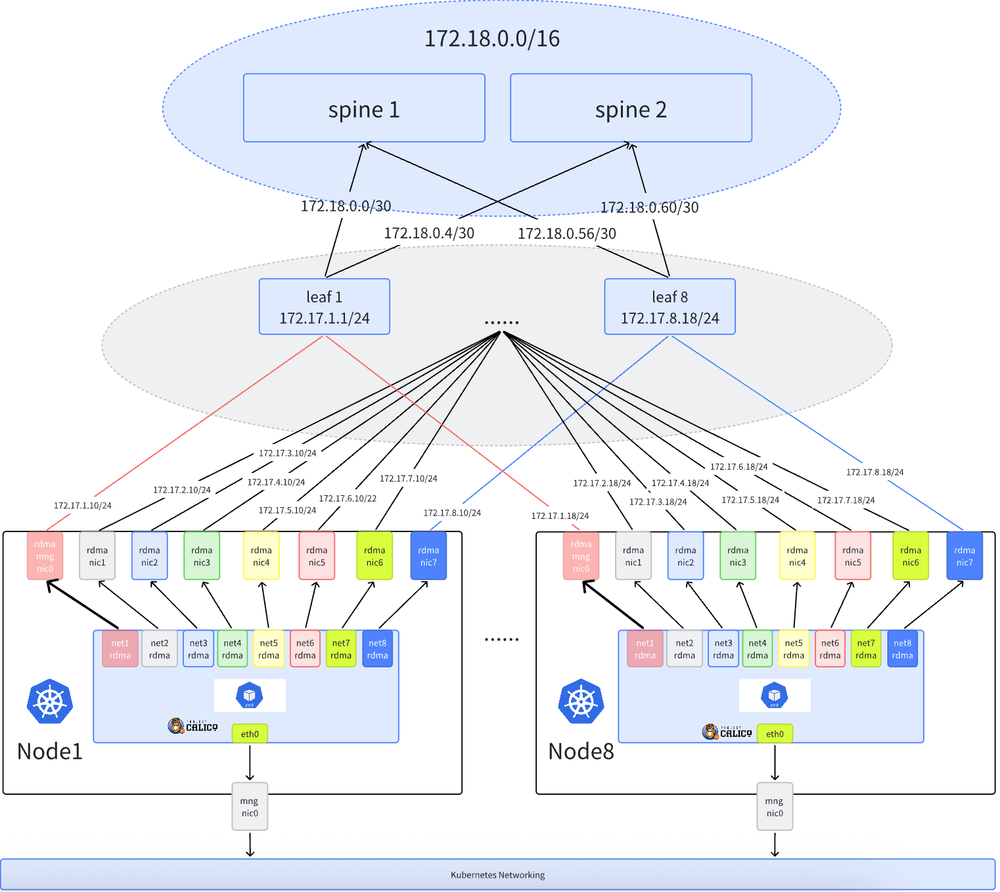

# AI 集群 RDMA 网络（总览）

**简体中文** | [**English**](./index.md)

## 介绍

本节介绍在建设 AI 集群场景下，Spiderpool 如何给容器提供 RDMA 通信能力，它适用在 RoCE 和 Infiniband 网络场景下。

### 为什么 AI 集群需要 RDMA 网络？

在大规模 AI 训练场景中，GPU 之间需要频繁交换大量数据（如梯度同步、模型参数更新等）。传统的 TCP/IP 网络存在以下问题：

- **高延迟**：数据需要经过内核协议栈处理，增加了传输延迟
- **高 CPU 开销**：数据拷贝和协议处理消耗大量 CPU 资源
- **带宽瓶颈**：难以充分利用高速网络硬件的带宽能力

RDMA（Remote Direct Memory Access）技术通过以下特性解决了这些问题：

- **零拷贝**：数据直接在应用内存和网卡之间传输，无需内核参与
- **内核旁路**：绕过操作系统内核，大幅降低延迟
- **硬件卸载**：协议处理由网卡硬件完成，释放 CPU 资源
- **高带宽低延迟**：可实现微秒级延迟和数百 Gbps 的带宽

## 两种 RDMA 协议

在 AI 集群中，RDMA 常见有两种网络协议：**RoCE** 和 **Infiniband**。

| 比较维度 | RoCE | Infiniband |
| :--- | :--- | :--- |
| 承载网络 | 基于以太网（Ethernet） | 基于 Infiniband 结构网络 |
| 网络标识 | 通常依赖 IP 规划（与以太网子网、路由策略强相关） | 可以只依赖 LID 通信；也可选配 IP 统一管理 |
| 典型前置依赖 | 以太网侧常配合 DCB / PFC / ECN 等能力以保证低丢包 | 依赖 Subnet Manager（例如 OpenSM）进行子网管理 |
| 适用场景倾向 | 更容易与现有以太网数据中心融合，运维门槛相对较低 | 更偏 HPC/AI 专用高性能网络，端到端一致性要求更强 |
| 支持的生态 | 以太网与云原生生态成熟，主流网卡/交换机厂商与 Linux/Kubernetes 网络栈普遍支持 | 在 Kubernetes/容器网络场景下生态相对集中，目前主要由 NVIDIA（Mellanox）体系提供端到端支持 |
| Spiderpool 方案匹配 | 支持 Macvlan（共享）和 SR-IOV（隔离）两种方案 | 仅支持 SR-IOV（隔离）方案 |

## 两种 RDMA 方案

Spiderpool 支持两种 RDMA 方案：**共享 RDMA** 和 **隔离 RDMA**。

### 共享 RDMA 方案（Macvlan）

基于 [RDMA shared device plugin](https://github.com/Mellanox/k8s-rdma-shared-dev-plugin)，给容器插入 Macvlan 接口，能够把 master 接口的 RDMA 设备共享给容器使用。

- **RDMA 子系统模式**：共享模式（shared）
- **CNI**：Macvlan CNI
- **适用网络**：仅 RoCE

### 隔离 RDMA 方案（SR-IOV）

基于 [sriov-network-operator](https://github.com/k8snetworkplumbingwg/sriov-network-operator)，为容器提供基于 SR-IOV 接口的独立 RDMA 设备。

- **RDMA 子系统模式**：独占模式（exclusive）
- **CNI**：
  - RoCE 网络：[SR-IOV CNI](https://github.com/k8snetworkplumbingwg/sriov-cni)
  - Infiniband 网络：[IB-SRIOV CNI](https://github.com/k8snetworkplumbingwg/ib-sriov-cni)
- **适用网络**：RoCE 和 Infiniband

## 隔离与共享 RDMA 方案对比

| 比较维度     | Macvlan 共享 RDMA 方案                  | SR-IOV CNI 隔离 RDMA 方案          |
| ------------| ------------------------------------- | --------------------------------- |
| 网络隔离      | 所有容器共享 RDMA 设备，隔离性较差        | 容器独享 RDMA 设备，隔离性较好        |
| 性能         | 性能较高                               | 硬件直通，性能最优                   |
| 资源利用率    | 资源利用率较高                          | 较低，受硬件支持的 VFs 数量限制       |
| 配置复杂度    | 配置相对简单                            | 配置较为复杂，需要硬件支持和配置       |
| 兼容性       | 兼容性较好，适用于大多数环境               | 依赖硬件支持，兼容性较差              |
| 适用场景      | 适用于大多数场景，包括裸金属，虚拟机等      | 只适用于裸金属，不适用于虚机场景      |
| 成本         | 成本较低，因为不需要额外的硬件支持          | 成本较高，需要支持 SR-IOV 的硬件设备   |
| 支持 RDMA 协议 | 支持 RoCE 协议，不支持 Infiniband 协议   | 支持 RoCE 和 Infiniband 协议        |

## RDMA 组网模式

下面介绍几种 RDMA 网络的组网方案:

### 共享子网组网方案（RoCE）



集群的网络规划如下：

1. 在节点的 eth0 网卡上运行 calico CNI，来承载 kubernetes 流量。AI workload 将会被分配一个 calico 的缺省网卡，进行控制面通信。

2. 节点上使用具备 RDMA 功能的 Mellanox ConnectX5 网卡来承载 AI 计算的 RDMA 流量，网卡接入到 rail optimized 网络中。AI workload 将会被额外分配所有 RDMA 网卡的虚拟化接口（Macvlan 或 SR-IOV），确保 GPU 的高速网络通信。

3. 所有节点的相同轨道网卡使用相同子网。例如，所有节点的 rail1 网卡都使用 172.17.1.0/24 子网。

该组网方式适合 Macvlan 和 SR-IOV CNI 方案。

### 独享子网组网方案（RoCE）

在一些大规模 AI 集群中，由于 IP 地址资源的限制，并不能为每个轨道提供独立的大子网。只能将有限的子网拆分为更小的子网，给不同节点的不同轨道网卡使用。此方案下，IP 地址得到更充分的利用，每个节点的每个轨道都能获得独立的子网。 LEAF 交换机会配置路由聚合，确保 RDMA 流量得到高效转发。

假设环境为:

- 一个 16 位掩码的 IP 网段: 172.17.0.0/16
- 共计 8 个节点，每个节点 8 张 RDMA 网卡

根据实际规划大概每个节点每个轨道网卡可承载 30 个 Pod 的规划。我们只需要从 172.17.0.0/16 取出部分 IP 地址： 172.17.0.0 - 172.17.7.255 作为 RDMA 子网规划。然后拆分 8 个小子网，供 8 个轨道使用。比如 1 号轨道的网卡从 172.17.0.0/24 中分配。然后再将 172.17.0.0/24 分为 8 个节点使用，这样每个节点的每个轨道都得到独立的子网使用。比如:

- 节点 node1 的 1 号轨道网卡使用 172.17.0.0/27 子网。
- ...
- 节点 node8 的 1 号轨道网卡使用 172.17.0.224/27 子网。

> 注意：第一个 RDMA 网卡用于承接 RDMA 控制面通信，其他网卡用于承载 AI 计算的 RDMA 流量。


### Infiniband 组网方案


Infiniband 组网方案特点：

1. 每个节点有 8 张 Infiniband 网卡（ib0-ib7），至少一张其他网卡用于承载集群管理或存储流量（eth0）。
2. Infiniband 网络中不强制要求 IB 网卡配置 IP 地址，每个网卡拥有独一无二的 LID（通过 Subnet Manager 管理），可直接通过 LID 通信。
3. 在常见的 IB 网络规划中，仍会为每个 IB 网卡配置 IP 地址，方便统一管理。例如：所有节点的 IB 网卡 IP 地址都从 172.17.0.0/16 子网分配。

## 环境要求

- 参考 [Spiderpool安装要求](./../system-requirements-zh_CN.md)
- 主机上准备好 Helm 二进制
- 安装好 Kubernetes 集群，kubelet 工作在主机 eth0 网卡上
- 主机具备 RDMA 能力的网卡，如 Mellanox ConnectX5 网卡
- Infiniband 网络场景下，确保 OpenSM 子网管理器工作正常
- 安装 Calico 作为集群的缺省 CNI

  如果未安装，可参考 [官方文档](https://docs.tigera.io/calico/latest/getting-started/kubernetes/) 或参考以下命令安装：

  ```shell
  $ kubectl apply -f https://github.com/projectcalico/calico/blob/master/manifests/calico.yaml
  $ kubectl wait --for=condition=ready -l k8s-app=calico-node  pod -n kube-system 
  # set calico to work on host eth0 
  $ kubectl set env daemonset -n kube-system calico-node IP_AUTODETECTION_METHOD=kubernetes-internal-ip
  # set calico to work on host eth0 
  $ kubectl set env daemonset -n kube-system calico-node IP6_AUTODETECTION_METHOD=kubernetes-internal-ip  
  ```

## 主机准备

### 1. 安装 RDMA 网卡驱动，然后重启主机（这样才能看到网卡）

   传统基于 MLNX_OFED 的驱动安装方式自 2024 年 10 月起已经停止维护，未来将被移除。所有新功能都会迁移到 [NVIDIA-DOCA](https://docs.nvidia.com/networking/dpu-doca/index.html#doca) 中, 推荐使用 NVIDIA DOCA-OFED 方式安装:

   前往 [NVIDIA-DOCA 下载页面](https://developer.nvidia.com/doca-downloads) 获取主机系统对应的 DOCA 版本, 如对于 Ubuntu 22.04 系统:

   ```shell
   sudo wget https://www.mellanox.com/downloads/DOCA/DOCA_v3.1.0/host/doca-host_3.1.0-091000-25.07-ubuntu2204_amd64.deb
   sudo dpkg -i doca-host_3.1.0-091000-25.07-ubuntu2204_amd64.deb
   sudo apt-get update
   sudo apt-get -y install doca-ofed
   ```

   对于 Mellanox 网卡，也可基于容器化安装驱动，实现对集群主机上所有 Mellanox 网卡批量安装驱动，运行如下命令，注意的是，该运行过程中需要访问因特网获取一些安装包。当所有的 ofed pod 进入 ready 状态，表示主机上已经完成了 OFED driver 安装。

   ```shell
   $ helm repo add spiderchart https://spidernet-io.github.io/charts
   $ helm repo update
   $ helm search repo ofed

   # pelase replace the following values with your actual environment
   # for china user, it could set `--set image.registry=nvcr.m.daocloud.io` to use a domestic registry
   $ helm install ofed-driver spiderchart/ofed-driver -n kube-system \
         --set image.OSName="ubuntu" \
         --set image.OSVer="22.04" \
         --set image.Arch="amd64"
   ```

   > 若希望 RDMA 系统工作在独占模式下，必须至少满足以下条件之一： (1） 基于 5.3.0 或更新版本的 Linux 内核，系统中加载的 RDMA 模块，rdma 核心包提供了在系统启动时自动加载相关模块的方法 (2） 需要 Mellanox OFED 4.7 版或更新版本。在这种情况下，不需要使用基于 5.3.0 或更新版本的内核。

### 2. 设置 RDMA 子系统模式

RDMA 子系统支持两种模式，需要根据选择的方案进行配置：

#### 共享 RDMA 方案（Macvlan）：保持 shared 模式

```shell
# 查询当前模式（Linux RDMA 子系统默认工作在 shared 模式）：
$ rdma system
   netns shared copy-on-fork on
```

共享方案使用默认的 shared 模式，无需修改。

#### 隔离 RDMA 方案（SR-IOV）：设置为 exclusive 模式

SR-IOV 场景需要设置主机上的 RDMA 子系统为 exclusive 模式，使得容器能够独立使用 RDMA 设备，避免与其他容器共享。

```shell
# 查询当前模式：
$ rdma system
   netns shared copy-on-fork on

# 持久化配置，重启后生效
$ echo "options ib_core netns_mode=0" >> /etc/modprobe.d/ib_core.conf

# 切换到 exclusive 模式（如果设置失败，请重启主机）
$ rdma system set netns exclusive

# 验证切换成功
$ rdma system
   netns exclusive copy-on-fork on
```

### 3. 设置网卡的 RDMA 工作模式（ Infiniband or ethernet ）

确认网卡支持的工作模式：本示例环境中，宿主机上接入了 mellanox ConnectX 5 VPI 网卡，查询 RDMA 设备，确认网卡驱动安装完成

```shell
$ rdma link
      link mlx5_0/1 state ACTIVE physical_state LINK_UP netdev ens6f0np0
      link mlx5_1/1 state ACTIVE physical_state LINK_UP netdev ens6f1np1
      ....... 
```

确认网卡的工作模式，如下输出表示网卡工作在 Ethernet 模式下，可实现 RoCE 通信

```shell
$ ibstat mlx5_0 | grep "Link layer"
       Link layer: Ethernet
```

如下输出表示网卡工作在 Infiniband 模式下，可实现 Infiniband 通信

```shell
$ ibstat mlx5_0 | grep "Link layer"
       Link layer: InfiniBand
```

如果网卡没有工作在预期的模式下，请输入如下命令，确认网卡支持配置 LINK_TYPE 参数，如果没有该参数，请更换支持的网卡型号

```shell
$ mst start

# check the card's PCIE 
$ lspci -nn | grep Mellanox
86:00.0 Infiniband controller [0207]: Mellanox Technologies MT27800 Family [ConnectX-5] [15b3:1017]
86:00.1 Infiniband controller [0207]: Mellanox Technologies MT27800 Family [ConnectX-5] [15b3:1017]
....... 

# check whether the network card supports parameters LINK_TYPE 
$ mlxconfig -d 86:00.0  q | grep LINK_TYPE
LINK_TYPE_P1                                IB(1)
```

3.2 批量设置网卡的工作模式：获取 [批量设置脚本](https://github.com/spidernet-io/spiderpool/blob/main/tools/scripts/setNicRdmaMode.sh)，按照如下设置后，请重启主机

```shell
$ chmod +x ./setNicRdmaMode.sh

# 批量查询所有 rdma 网卡工作在 ib 或者 eth 模式下
$ ./setNicRdmaMode.sh q

# 1. 如果配置所有网卡为 infiniband 或 roce 模式
# 把所有 rdma 网卡切换到 eth 模式下
$ RDMA_MODE="roce" ./setNicRdmaMode.sh

# 把所有 rdma 网卡切换到 ib 模式下
$ RDMA_MODE="infiniband" ./setNicRdmaMode.sh

# 2. 如果需要为 GPU 和非 GPU 网卡分别配置不同模式
# 基于 nvidia-smi 自动查询并配置 GPU 网卡的模式
$ GPU_RDMA_MODE="infiniband" ./setNicRdmaMode.sh

# 基于 nvidia-smi 自动查询并配置 GPU 和非 GPU 亲和的网卡
$ GPU_RDMA_MODE="infiniband" OTHER_RDMA_MODE="roce" ./setNicRdmaMode.sh
```  

如果批量切换后网卡模式不生效，需要重启主机。

### 4. 为所有的 RDMA 网卡，设置 ip 地址、MTU 和 策略路由等

- Roce 组网方案下，RDMA 流量需要通过以太网进行传输，linux 主机默认只有一个缺省路由，在多网卡场景下，需要为不同网卡设置策略默认路由，以确保 hostnetwork 模式下的任务能正常运行 All-to-All 等通信，但不同组网方案配置细节有所差异。
- Infiniband 组网方案下，RDMA 流量不需要通过以太网传输，因此不需要额外配置策略路由。
- 无论 RoCE 还是 Infiniband，通常交换机和主机网卡都会工作在较大的 MTU 参数下，以提高性能。

首先获取 [ubuntu 网卡配置脚本:](https://github.com/spidernet-io/spiderpool/blob/main/tools/scripts/setNicAddr.sh)

```shell
$ chmod +x ./setNicAddr.sh
```

根据组网方案，参考以下命令执行配置

#### 4.1 RoCE 组网场景

- 对于共享子网方案

   ```shell
   $ chmod +x ./setNicAddr.sh

   # 对于共享子网组网方案，设置网卡
   $ INTERFACE="eno3np2" IPV4_IP="172.16.0.10/24"  IPV4_GATEWAY="172.16.0.1" \
         MTU="4200" ENABLE_POLICY_ROUTE="true" ./setNicAddr.sh

   # 以 eno3np2 为例，查看网卡 ip 和 mtu 是否预期设置
   $ ip a s eno3np2
   4: eno3np2: <BROADCAST,MULTICAST,UP,LOWER_UP> mtu 4200 qdisc mq state UP group default qlen 1000
      link/ether 38:68:dd:59:44:4a brd ff:ff:ff:ff:ff:ff
      altname enp8s0f2np2
      inet 172.16.0.10/24 brd 172.16.0.255 scope global eno3np2
         valid_lft forever preferred_lft forever
      inet6 fe80::3a68:ddff:fe59:444a/64 scope link proto kernel_ll
         valid_lft forever preferred_lft forever 

   # 检查当前网卡是否正确设置策略路由: 确保从该网卡发出的流量需要从各自的策略路由表项转发：
   $ ip rule
   0:  from all lookup local
   32763:  from 172.16.0.10 lookup 152 proto static
   32766:  from all lookup main
   32767:  from all lookup default

   $ ip rou show table 152
   default via 172.16.0.1 dev eno3np2 proto static 
   ```

- 对于独享子网方案

   必须选择一张网卡（一般为节点的 1 号轨道的 RDMA 网卡）作为 RDMA 子网路由的网卡，需要设置：`ENABLE_RDMA_DEFAULT_ROUTE="true" RDMA_SUBNET="172.16.0.0/16"`，对于其它网卡不需要配置 RDMA 子网路由。

  - ENABLE_RDMA_DEFAULT_ROUTE="true": 表示该网卡将作为 RDMA 子网路由的网卡
  - RDMA_SUBNET="172.16.0.0/16": 表示 RDMA 网络的子网

   对于 1 号轨道的网卡，设置如下：

   ```shell
   $ INTERFACE="eno3np2" ENABLE_RDMA_DEFAULT_ROUTE="true" RDMA_SUBNET="172.16.0.0/16" IPV4_IP="172.16.0.10/24" IPV4_GATEWAY="172.16.0.1" ./setNicAddr.sh
   ```

   对于非 1 号轨道的网卡，只需要配置 IP 地址，设置如下：

   ```shell
   $ INTERFACE="eno3np2" IPV4_IP="172.16.0.10/24" ENABLE_POLICY_ROUTE="true" IPV4_GATEWAY="172.16.0.1" ./setNicAddr.sh
   ```

   检查 IP 地址及 MTU 配置:

   ```shell
   # 以 eno3np2 为例，查看网卡 ip 和 mtu 是否预期设置
   $ ip a s eno3np2
   4: eno3np2: <BROADCAST,MULTICAST,UP,LOWER_UP> mtu 4200 qdisc mq state UP group default qlen 1000
      link/ether 38:68:dd:59:44:4a brd ff:ff:ff:ff:ff:ff
      altname enp8s0f2np2
      inet 172.16.0.10/24 brd 172.16.0.255 scope global eno3np2
         valid_lft forever preferred_lft forever
      inet6 fe80::3a68:ddff:fe59:444a/64 scope link proto kernel_ll
         valid_lft forever preferred_lft forever 
   ```

   检查当前网卡是否正确设置策略路由: 确保从该网卡发出的流量需要从各自的策略路由表项转发
   ：

   ```
   $ ip rule
   0:  from all lookup local
   32763:  from 172.16.0.10 lookup 152 proto static
   32766:  from all lookup main
   32767:  from all lookup default

   $ ip rou show table 152
   default via 172.16.0.1 dev eno3np2 proto static
   ``` 

   如果是第一张网卡，检查 RDMA 子网路由是否配置成功，并从当前网卡转发：

   ```
   $ ip r
   ...
   172.16.0.0/16 via 172.16.0.1 dev eno3np2
   ...
   ```

对于两种方案： 多 RDMA 网卡时可能访问集群流量的数据包（比如 Calico）的源 IP 被 Linux 随机选择到了 RDMA 网卡的 IP 地址上，导致访问失败。 所以我们需要保证非 RDMA 流量不需要从 RDMA 网卡转发：

获取[配置脚本](https://github.com/spidernet-io/spiderpool/blob/main/tools/scripts/setRdmaRule.sh), 执行以下命令:

```shell
$ chmod +x ./setRdmaRule.sh
$ RDMA_CIDR=172.16.0.0/16 ./setRdmaRule.sh
```

> RDMA_CIDR 表示 RDMA 网络的子网

执行完成后检查 ip rule 是否预期设置:

```shell
$ ip rule
0:  from all lookup local
32762:  not to 172.16.0.0/16 lookup main proto static
32763:  from 172.16.0.10 lookup 152 proto static
32766:  from all lookup main
32767:  from all lookup default
```

#### 4.2 Infiniband 组网场景

该模式下，不需要设置策略路由，只需要配置 IP 地址即可。但注意配置 IP 前，需要确保内核模块: `ib_ipoib` 已加载。

```shell
$ lsmod | grep ib_ipoib
```

如果未加载，需要执行加载:

```shell
$ modprobe ib_ipoib
```

确认加载完成后，使用 setNicAddr.sh 脚本为所有 IB 网卡配置 IP 及 MTU。下面以 ib0 网卡为例：

```shell
$ INTERFACE="ib0" IPV4_IP="172.16.0.10/24"  MTU="4200" ./setNicAddr.sh
```

配置完成后，可以验证网卡是否配置成功：

   ```shell
   $ ip a s ib0
   4: ib0: <BROADCAST,MULTICAST,UP,LOWER_UP> mtu 4200 qdisc mq state UP group default qlen 1000
      link/ether 38:68:dd:59:44:4a brd ff:ff:ff:ff:ff:ff
      altname enp8s0f2np2
      inet 172.16.0.10/24 brd 172.16.0.255 scope global ib0
         valid_lft forever preferred_lft forever
      inet6 fe80::3a68:ddff:fe59:444a/64 scope link proto kernel_ll
         valid_lft forever preferred_lft forever 
   ```

### 5.（仅 RoCE）配置无损网络

在高性能网络场景下，RDMA 网络对于丢包非常敏感，一旦发生丢包重传，性能会急剧下降。因此要使得 RDMA 网络性能不受影响，丢包率必须保证在 1e-05（十万分之一）以下，最好为零丢包。对于 Roce 网络，可通过 PFC + ECN 机制来保障网络传输过程不丢包。

可参考 [配置 RDMA 无损网络](../../roce-qos-zh_CN.md)

> 配置无损网络要求必须在 RDMA Roce 网络环境下，不能是 Infiniband
> 配置无损网络必须要求交换机支持 PFC + ECN 机制，并且配置与主机侧对齐，否则不能工作

### 6.（可选）开启 GPUDirect RDMA

在安装或使用 [gpu-operator](https://github.com/NVIDIA/gpu-operator) 过程中:

1. 开启 helm 安装选项: `--set driver.rdma.enabled=true --set driver.rdma.useHostMofed=true`，gpu-operator 会安装 [nvidia-peermem](https://network.nvidia.com/products/GPUDirect-RDMA/) 内核模块，启用 GPUDirect RMDA 功能，加速 GPU 和 RDMA 网卡之间的转发性能。可在主机上输入如下命令，确认安装成功的内核模块

```shell
$ lsmod | grep nvidia_peermem
nvidia_peermem         16384  0
```

1. 开启 helm 安装选项: `--set gdrcopy.enabled=true`，gpu-operator 会安装 [gdrcopy](https://developer.nvidia.com/gdrcopy) 内核模块，加速 GPU 显存 和 CPU 内存 之间的转发性能。可在主机上输入如下命令，确认安装成功的内核模块

```shell
$ lsmod | grep gdrdrv
gdrdrv                 24576  0
```

1. 禁用 PCI 访问控制服务 (ACS) 以支持 GPUDirect RDMA

```shell
sudo lspci -vvv | grep ACSCtl  
```

如果输出显示 "SrcValid+", 表示 ACS 可能被启用。为了使 GPUDirect RDMA 正常工作，需要禁用 PCI 访问控制服务 (ACS)。可通过 BIOS 禁用 IO 虚拟化或 VT-d 来实现。对于 Broadcom PLX 设备，也可以通过操作系统禁用，但需要在每次重启后重新执行。以下是一件关闭 ACS 脚本，但系统重启会失效:

```shell
for BDF in `lspci -d "*:*:*" | awk '{print $1}'`; do
  # skip if it doesn't support ACS
  sudo setpci -v -s ${BDF} ECAP_ACS+0x6.w > /dev/null 2>&1
  if [ $? -ne 0 ]; then
    continue
  fi
  sudo setpci -v -s ${BDF} ECAP_ACS+0x6.w=0000
done
```

更多信息请参考 [NVIDIA NCCL 故障排除指南](https://docs.nvidia.com/deeplearning/nccl/user-guide/docs/troubleshooting.html#pci-access-control-services-acs)

## 安装 Spiderpool

根据选择的 RDMA 方案，安装 Spiderpool 时需要启用不同的组件。

### 共享 RDMA 方案（Macvlan）

```shell
helm repo add spiderpool https://spidernet-io.github.io/spiderpool
helm repo update spiderpool
helm install spiderpool spiderpool/spiderpool --create-namespace -n spiderpool \
    --set rdma.rdmaSharedDevicePlugin.install=true
```

### 隔离 RDMA 方案（SR-IOV）

```shell
helm repo add spiderpool https://spidernet-io.github.io/spiderpool
helm repo update spiderpool
helm install spiderpool spiderpool/spiderpool --create-namespace -n spiderpool \
    --set sriov.install=true
```

> - 如果您是中国用户，可以指定参数 `--set global.imageRegistryOverride=ghcr.m.daocloud.io` 来使用国内的镜像源。
> - 设置 `--set spiderpoolAgent.prometheus.enabled --set spiderpoolAgent.prometheus.enabledRdmaMetric=true` 和 `--set grafanaDashboard.install=true` 命令行参数可以开启 RDMA metrics exporter 和 Grafana dashboard，更多可以查看 [RDMA metrics](../../rdma-metrics.md)。

## 下一步

Spiderpool 安装完成之后，接下来需要配置 CNI 和创建 Spiderpool 资源。根据选择的方案，请参考对应的详细配置文档：

### 共享 RDMA 方案（Macvlan）

- [AI Cluster With Macvlan（RoCE）](./get-started-macvlan-zh_CN.md)

### 隔离 RDMA 方案（SR-IOV）

- [AI Cluster With SR-IOV（RoCE）](./get-started-sriov-roce-zh_CN.md)
- [AI Cluster With SR-IOV（Infiniband）](./get-started-sriov-infiniband-zh_CN.md)
