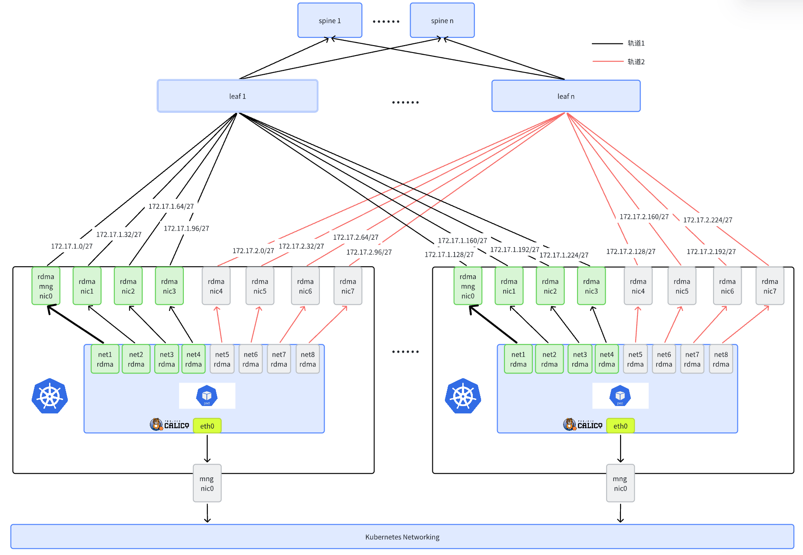

# AI Cluster RDMA Networking (Overview)

**English** | [**简体中文**](./index-zh_CN.md)

## Introduction

This section introduces how Spiderpool provides RDMA communication capabilities to containers in AI cluster scenarios, applicable to both RoCE and InfiniBand network environments.

### Why do AI clusters need RDMA networking?

In large-scale AI training scenarios, GPUs frequently exchange massive amounts of data (for example, gradient synchronization and model parameter updates). Traditional TCP/IP networks usually face these issues:

- **High latency**: data passes through the kernel protocol stack
- **High CPU overhead**: extra copies and protocol processing consume CPU resources
- **Bandwidth bottlenecks**: hard to fully utilize high-speed network hardware

RDMA (Remote Direct Memory Access) solves these problems with:

- **Zero-copy** transfers between application memory and the NIC
- **Kernel bypass** to reduce latency
- **Hardware offload** to reduce CPU overhead
- **High bandwidth and low latency** for scale-out training

### Benefits of RDMA networking

| Benefit | Description |
| :--- | :--- |
| Faster training | Reduce GPU communication time and improve throughput |
| Better resource utilization | Reduce CPU overhead, leaving more resources for compute |
| Better scalability | Efficient inter-node communication at large scale |
| Better cost efficiency | Better training performance under the same hardware |

## Two RDMA protocols

In AI clusters, RDMA is commonly deployed with two networking protocols: **RoCE** and **InfiniBand**.

| Dimension | RoCE | InfiniBand |
| :--- | :--- | :--- |
| Underlay network | Ethernet | InfiniBand fabric |
| Network identity | Usually IP-based planning (tightly coupled with subnets/routing) | Can communicate via LID only; IP can also be configured for unified management |
| Typical prerequisites | Often paired with DCB/PFC/ECN to reduce packet loss on Ethernet | Requires a Subnet Manager (for example OpenSM) |
| Best-fit scenarios | Easier to integrate into existing Ethernet datacenters | More HPC/AI dedicated, stronger end-to-end fabric consistency assumptions |
| Ecosystem support | Mature cloud-native ecosystem, broadly supported by NIC/switch vendors and Linux/Kubernetes networking stack | More concentrated in Kubernetes/container scenarios, currently mainly supported end-to-end by the NVIDIA (Mellanox) stack |
| Spiderpool solution mapping | Both Macvlan (shared) and SR-IOV (isolated) | SR-IOV (isolated) only |

## Two RDMA System Mode

Spiderpool supports two RDMA solutions: **shared RDMA** and **isolated RDMA**.

### Shared RDMA solution (Macvlan)

Based on [RDMA shared device plugin](https://github.com/Mellanox/k8s-rdma-shared-dev-plugin), it inserts Macvlan interfaces into containers and allows containers to share the RDMA device of the master interface.

- **RDMA subsystem mode**: shared mode
- **CNI**: Macvlan CNI
- **Applicable networks**: RoCE only

### Isolated RDMA solution (SR-IOV)

Based on [sriov-network-operator](https://github.com/k8snetworkplumbingwg/sriov-network-operator), it provides independent RDMA devices to containers via SR-IOV interfaces.

- **RDMA subsystem mode**: exclusive mode
- **CNI**:
  - RoCE networks: [SR-IOV CNI](https://github.com/k8snetworkplumbingwg/sriov-cni)
  - InfiniBand networks: [IB-SRIOV CNI](https://github.com/k8snetworkplumbingwg/ib-sriov-cni)
- **Applicable networks**: RoCE and InfiniBand

## Comparison: isolated vs shared RDMA

| Dimension | Macvlan shared RDMA | SR-IOV isolated RDMA |
| :--- | :--- | :--- |
| Network isolation | All containers share RDMA devices, weaker isolation | Each container has dedicated RDMA devices, better isolation |
| Performance | High performance | Hardware passthrough, best performance |
| Resource utilization | Higher | Lower, limited by VF count |
| Configuration complexity | Relatively simple | More complex, needs hardware support |
| Compatibility | Good, works in most environments | Hardware-dependent, limited compatibility |
| Applicable scenarios | Most scenarios including bare metal and VMs | Bare metal only, not for VMs |
| Cost | Lower, no extra HW requirements | Higher, SR-IOV capable NICs required |
| RDMA protocol support | RoCE only, no InfiniBand | Both RoCE and InfiniBand |

## RDMA networking modes

The following describes several common RDMA networking modes.

### Shared subnet mode (RoCE)


Network planning:

1. Run calico CNI on `eth0` to carry Kubernetes traffic. AI workloads get a default calico interface for control-plane communication.
2. Use Mellanox ConnectX5 (or other RDMA-capable NICs) for AI RDMA traffic, connected to a rail-optimized network. AI workloads get extra virtual interfaces (Macvlan or SR-IOV) on all RDMA NICs for high-speed GPU communication.
3. All nodes’ NICs on the same rail use the same subnet. For example, all nodes’ rail1 NICs use `172.17.1.0/24`.

### Exclusive subnet mode (RoCE)

In some large-scale AI clusters, due to IP address limitations, it may not be possible to allocate a dedicated large subnet for each rail. In this case, you can split a larger subnet into smaller ones and assign them to different rails on different nodes. This improves IP utilization: each node can still have an exclusive subnet for each rail NIC. Leaf switches can use route aggregation to ensure RDMA traffic is forwarded efficiently.

Assume the environment:

- A 16-bit network: `172.17.0.0/16`
- 8 nodes in total, each node has 8 RDMA NICs

Based on the actual planning, each node's network interface card on each track can support approximately 32 Pods. We only need to allocate a portion of IP addresses from the 172.17.0.0/16 range: 172.17.0.0 - 172.17.7.255 as the IP planning. Then, we divide this into 8 subnets for 8 tracks. For example, the network interface for Track 1 is allocated from 172.17.0.0/24. Next, we split 172.17.0.0/24 into 8 subnets for use by 8 nodes. This ensures each node's track receives an independent subnet. For example:

- Node `node1` rail 1 uses `172.17.0.0/27`.
- ...
- Node `node8` rail 1 uses `172.17.0.224/27`.

> Note: the first RDMA NIC is used for RDMA control-plane communication. Other NICs are used for AI RDMA traffic.



### InfiniBand mode


InfiniBand networking characteristics:

1. Each node has 8 InfiniBand NICs (`ib0-ib7`) and at least one additional NIC for management or storage traffic (`eth0`), and `eth0` must have an IP address.
2. In InfiniBand networks, it is not mandatory to configure IP addresses on IB NICs. Each NIC has a unique LID (managed by Subnet Manager) and can communicate directly via LID.
3. In many deployments, IP addresses are still configured on IB NICs for easier management. For example, allocate all IB NIC IPs from the same subnet such as `172.17.0.0/16`.

## Requirements

- Refer to [Spiderpool Installation Requirements](./../system-requirements.md)
- Helm binary is installed on the host
- Kubernetes cluster is installed, and kubelet works on host `eth0`
- RDMA-capable NICs (for example Mellanox ConnectX5)
- For InfiniBand networks, ensure the OpenSM subnet manager is working properly
- Install Calico as the default CNI

  If not installed, refer to the [official documentation](https://docs.tigera.io/calico/latest/getting-started/kubernetes/) or install with:

  ```shell
  $ kubectl apply -f https://github.com/projectcalico/calico/blob/master/manifests/calico.yaml
  $ kubectl wait --for=condition=ready -l k8s-app=calico-node  pod -n kube-system 
  # set calico to work on host eth0 
  $ kubectl set env daemonset -n kube-system calico-node IP_AUTODETECTION_METHOD=kubernetes-internal-ip
  # set calico to work on host eth0 
  $ kubectl set env daemonset -n kube-system calico-node IP6_AUTODETECTION_METHOD=kubernetes-internal-ip  
  ```

## Host preparation

### 1. Install RDMA NIC driver and reboot the host

The traditional MLNX_OFED installation has been deprecated since October 2024 and will be removed in the future. New features are being migrated to [NVIDIA-DOCA](https://docs.nvidia.com/networking/dpu-doca/index.html#doca). It is recommended to use NVIDIA DOCA-OFED.

Download the DOCA package for your OS from [NVIDIA-DOCA download page](https://developer.nvidia.com/doca-downloads). For Ubuntu 22.04:

```shell
sudo wget https://www.mellanox.com/downloads/DOCA/DOCA_v3.1.0/host/doca-host_3.1.0-091000-25.07-ubuntu2204_amd64.deb
sudo dpkg -i doca-host_3.1.0-091000-25.07-ubuntu2204_amd64.deb
sudo apt-get update
sudo apt-get -y install doca-ofed
```

For Mellanox NICs, you can also install OFED drivers in a containerized way:

```shell
$ helm repo add spiderchart https://spidernet-io.github.io/charts
$ helm repo update
$ helm search repo ofed

# pelase replace the following values with your actual environment
# for china user, it could set `--set image.registry=nvcr.m.daocloud.io` to use a domestic registry
$ helm install ofed-driver spiderchart/ofed-driver -n kube-system \
      --set image.OSName="ubuntu" \
      --set image.OSVer="22.04" \
      --set image.Arch="amd64"
```

> To run the RDMA subsystem in exclusive mode, you must satisfy at least one of the following: (1) Linux kernel 5.3.0+ with RDMA modules loaded, or (2) Mellanox OFED 4.7+.

### 2. Set RDMA subsystem mode

The RDMA subsystem supports two modes. Choose the mode based on the solution you use.

#### Shared RDMA solution (Macvlan): keep shared mode

```shell
# Check current mode (default is shared mode):
$ rdma system
   netns shared copy-on-fork on
```

Shared RDMA solution uses the default shared mode and does not require changes.

#### Isolated RDMA solution (SR-IOV): set exclusive mode

For SR-IOV scenarios, set the RDMA subsystem to exclusive mode so containers can use RDMA devices independently.

```shell
# Check current mode:
$ rdma system
   netns shared copy-on-fork on

# Persist the config (effective after reboot)
$ echo "options ib_core netns_mode=0" >> /etc/modprobe.d/ib_core.conf

# Switch to exclusive mode (reboot the host if it fails)
$ rdma system set netns exclusive

# Verify
$ rdma system
   netns exclusive copy-on-fork on
```

If the `rdma system` setting does not take effect after reboot, it means that `ib_core` is loaded early during system startup. In this case, after modifying the `.conf` file, you need to regenerate the initramfs with `update-initramfs -u`, and then execute `reboot`.

### 3. Set NIC RDMA working mode (InfiniBand or Ethernet)

Query RDMA devices to confirm driver installation:

```shell
$ rdma link
      link mlx5_0/1 state ACTIVE physical_state LINK_UP netdev ens6f0np0
      link mlx5_1/1 state ACTIVE physical_state LINK_UP netdev ens6f1np1
      ....... 
```

Check NIC link layer:

```shell
$ ibstat mlx5_0 | grep "Link layer"
       Link layer: Ethernet
```

```shell
$ ibstat mlx5_0 | grep "Link layer"
       Link layer: InfiniBand
```

If the NIC is not in the expected mode, verify LINK_TYPE support:

```shell
$ mst start

# check the card's PCIE 
$ lspci -nn | grep Mellanox
86:00.0 Infiniband controller [0207]: Mellanox Technologies MT27800 Family [ConnectX-5] [15b3:1017]
86:00.1 Infiniband controller [0207]: Mellanox Technologies MT27800 Family [ConnectX-5] [15b3:1017]
....... 

# check whether the network card supports parameters LINK_TYPE 
$ mlxconfig -d 86:00.0  q | grep LINK_TYPE
LINK_TYPE_P1                                IB(1)
```

Batch switch NIC mode: get the [batch switch script](https://github.com/spidernet-io/spiderpool/blob/main/tools/scripts/setNicRdmaMode.sh) and reboot the host after switching.

```shell
$ chmod +x ./setNicRdmaMode.sh

# Query all rdma NICs working mode
$ ./setNicRdmaMode.sh q

# Switch all RDMA NICs to Ethernet (RoCE) mode
$ RDMA_MODE="roce" ./setNicRdmaMode.sh

# Switch all RDMA NICs to InfiniBand mode
$ RDMA_MODE="infiniband" ./setNicRdmaMode.sh

# Automatically configure GPU-affinity NICs via nvidia-smi
$ GPU_RDMA_MODE="infiniband" ./setNicRdmaMode.sh

# Configure GPU and non-GPU affinity NICs separately
$ GPU_RDMA_MODE="infiniband" OTHER_RDMA_MODE="roce" ./setNicRdmaMode.sh
```  

### 4. Configure IP address, MTU, and policy routing for RDMA NICs

- In RoCE mode, RDMA traffic is transmitted over Ethernet. Linux has only one default route by default; in multi-NIC scenarios you need policy routing, and the details differ by networking mode.
- In InfiniBand mode, RDMA traffic does not go through Ethernet, so policy routing is not required.
- For both RoCE and InfiniBand, MTU is typically configured to a larger value for better performance.

Get the script: [setNicAddr.sh](https://github.com/spidernet-io/spiderpool/blob/main/tools/scripts/setNicAddr.sh)

```shell
$ chmod +x ./setNicAddr.sh
```

#### 4.1 RoCE

- Shared subnet mode:

   ```shell
   $ chmod +x ./setNicAddr.sh

   $ INTERFACE="eno3np2" IPV4_IP="172.16.0.10/24"  IPV4_GATEWAY="172.16.0.1" \
         MTU="4200" ENABLE_POLICY_ROUTE="true" ./setNicAddr.sh
   ```

- Exclusive subnet mode:

   You must select one NIC (usually the node’s rail-1 RDMA NIC) as the RDMA subnet route NIC and set `ENABLE_RDMA_DEFAULT_ROUTE="true" RDMA_SUBNET="172.16.0.0/16"`. Other NICs do not need the RDMA subnet route.

   ```shell
   $ INTERFACE="eno3np2" ENABLE_RDMA_DEFAULT_ROUTE="true" RDMA_SUBNET="172.16.0.0/16" IPV4_IP="172.16.0.10/24" IPV4_GATEWAY="172.16.0.1" ./setNicAddr.sh
   ```

For both modes, ensure non-RDMA traffic does not go through RDMA NICs:

Get the script: [setRdmaRule.sh](https://github.com/spidernet-io/spiderpool/blob/main/tools/scripts/setRdmaRule.sh)

```shell
$ chmod +x ./setRdmaRule.sh
$ RDMA_CIDR=172.16.0.0/16 ./setRdmaRule.sh
```

> `RDMA_CIDR` is the RDMA subnet.

#### 4.2 InfiniBand

In this mode, policy routing is not needed and only IP configuration is required. Before configuring IP, ensure the kernel module `ib_ipoib` is loaded.

```shell
$ lsmod | grep ib_ipoib
```

If not loaded:

```shell
$ modprobe ib_ipoib
```

Then configure IP and MTU for all IB NICs, for example `ib0`:

```shell
$ INTERFACE="ib0" IPV4_IP="172.16.0.10/24"  MTU="4200" ./setNicAddr.sh
```

### 5. (RoCE only) Configure lossless network

In high-performance networking scenarios, RDMA is highly sensitive to packet loss. For RoCE networks, you can use PFC + ECN to achieve lossless.

Refer to [Configuring RDMA lossless network](../../roce-qos.md)

> This requires an RDMA RoCE environment (not InfiniBand), and requires switches to support PFC + ECN and be configured consistently with the hosts.

### 6. (Optional) Enable GPUDirect RDMA

During installation or use of [gpu-operator](https://github.com/NVIDIA/gpu-operator):

1. Enable helm options: `--set driver.rdma.enabled=true --set driver.rdma.useHostMofed=true`. gpu-operator installs [nvidia-peermem](https://network.nvidia.com/products/GPUDirect-RDMA/) to enable GPUDirect RDMA.

```shell
$ lsmod | grep nvidia_peermem
nvidia_peermem         16384  0
```

1. Enable helm option: `--set gdrcopy.enabled=true`. gpu-operator installs [gdrcopy](https://developer.nvidia.com/gdrcopy) to speed up GPU-memory and CPU-memory transfers.

```shell
$ lsmod | grep gdrdrv
gdrdrv                 24576  0
```

1. Disable PCI Access Control Services (ACS) for GPUDirect RDMA

```shell
sudo lspci -vvv | grep ACSCtl  
```

If the output shows "SrcValid+", ACS may be enabled. To make GPUDirect RDMA work, disable ACS via BIOS (disable IO virtualization or VT-d). For Broadcom PLX devices, you may disable ACS via OS but it needs to be re-run after reboot. The following script disables ACS but will not persist after reboot:

```shell
for BDF in `lspci -d "*:*:*" | awk '{print $1}'`; do
  # skip if it doesn't support ACS
  sudo setpci -v -s ${BDF} ECAP_ACS+0x6.w > /dev/null 2>&1
  if [ $? -ne 0 ]; then
    continue
  fi
  sudo setpci -v -s ${BDF} ECAP_ACS+0x6.w=0000
done
```

For more information, refer to [NVIDIA NCCL Troubleshooting Guide](https://docs.nvidia.com/deeplearning/nccl/user-guide/docs/troubleshooting.html#pci-access-control-services-acs)

## Install Spiderpool

Enable different components based on the RDMA solution.

### Shared RDMA solution (Macvlan)

```shell
helm repo add spiderpool https://spidernet-io.github.io/spiderpool
helm repo update spiderpool
helm install spiderpool spiderpool/spiderpool --create-namespace -n spiderpool \
    --set rdma.rdmaSharedDevicePlugin.install=true
```

### Isolated RDMA solution (SR-IOV)

```shell
helm repo add spiderpool https://spidernet-io.github.io/spiderpool
helm repo update spiderpool
helm install spiderpool spiderpool/spiderpool --create-namespace -n spiderpool \
    --set sriov.install=true
```

> - For China users, set `--set global.imageRegistryOverride=ghcr.m.daocloud.io` to use a domestic registry.
> - Set `--set spiderpoolAgent.prometheus.enabled --set spiderpoolAgent.prometheus.enabledRdmaMetric=true` and `--set grafanaDashboard.install=true` to enable RDMA metrics exporter and Grafana dashboard. See [RDMA metrics](../../rdma-metrics.md).

## Next steps

After installing Spiderpool, configure CNI and create Spiderpool resources. Choose the corresponding detailed document:

### Shared RDMA solution (Macvlan)

- [AI Cluster With Macvlan (RoCE)](./get-started-macvlan.md)

### Isolated RDMA solution (SR-IOV)

- [AI Cluster With SR-IOV (RoCE)](./get-started-sriov-roce.md)
- [AI Cluster With SR-IOV (InfiniBand)](./get-started-sriov-infiniband.md)
