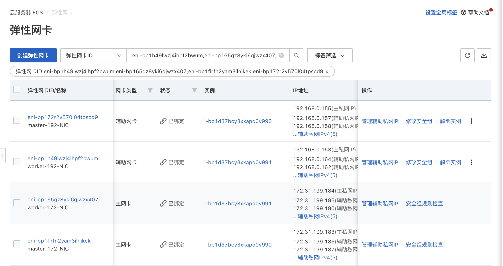

# 阿里云环境运行

**简体中文** | [**English**](./get-started-alibaba.md)

## 介绍

当前公有云厂商众多，如：阿里云、华为云、腾讯云、AWS 等，但当前开源社区的主流 CNI 插件难以以 Underlay 网络方式运行其上，只能使用每个公有云厂商的专有 CNI 插件，没有统一的公有云 Underlay 解决方案。本文将介绍一种适用于任意的公有云环境中的 Underlay 网络解决方案：[Spiderpool](../../../README-zh_CN.md) ，尤其是在混合云场景下，统一的 CNI 方案能够便于多云管理。

## 项目功能

Spiderpool 的节点拓扑功能可以将 IPPool 与每个节点的每个网卡的可用 IP 形成绑定，同时还具备解决 MAC 地址合法性等功能。

Spiderpool 能基于 IPVlan Underlay CNI 在阿里云环境上运行，并保证集群的东西向与南北向流量均正常，它的实现原理如下：

1. 公有云下使用 Underlay 网络，但公有云的每个云服务器的每张网卡只能分配有限的 IP 地址，当应用运行在某个云服务器上时，需要同步获取到 VPC 网络中分配给该云服务器不同网卡的合法 IP 地址，才能实现通信。根据上述分配 IP 的特点，Spiderpool 的 CRD：`SpiderIPPool` 可以设置 nodeName，multusName 实现节点拓扑的功能，通过 IP 池与节点、IPvlan Multus 配置的亲和性，能最大化的利用与管理节点可用的 IP 地址，给应用分配到合法的 IP 地址，让应用在 VPC 网络内自由通信，包括 Pod 与 Pod 通信，Pod 与云服务器通信等。

2. 公有云的 VPC 网络中，处于网络安全管控和数据包转发的原理，当网络数据报文中出现 VPC 网络未知的 MAC 和 IP 地址时，它无法得到正确的转发。例如，基于 Macvlan 和 OVS 原理的 Underlay CNI 插件，Pod 网卡中的 MAC 地址是新生成的，会导致 Pod 无法通信。针对该问题，Spiderpool 可搭配 [IPVlan](https://www.cni.dev/plugins/current/main/ipvlan/) CNI 进行解决。IPVlan 基于三层网络，无需依赖二层广播，并且不会重新生成 Mac 地址，与父接口保持一致，因此通过 IPvlan 可以解决公有云中关于 MAC 地址合法性的问题。

## 实施要求

1. [安装要求](./../system-requirements-zh_CN.md)

2. 使用 IPVlan 做集群 CNI 时，系统内核版本必须大于 4.2。

3. 已安装 [Helm](https://helm.sh/docs/intro/install/)。

## 步骤

### 阿里云环境

- 准备一套阿里云环境，给虚拟机分配 2 个网卡，每张网卡均分配一些辅助私网 IP，如图：

    
  
    > - 实例（虚拟机）是能够为您的业务提供计算服务的最小单位，不同的实例规格可创建网卡数和每张网卡可分配的辅助 IP 数存在差异，根据业务场景和使用场景，参考阿里云[实例规格族](https://help.aliyun.com/zh/ecs/user-guide/overview-of-instance-families#concept-sx4-lxv-tdb)选择对应规格进行创建实例。
    > - 如果有 IPv6 的需求，可以参考阿里云[配置 IPv6 地址](https://help.aliyun.com/zh/ecs/user-guide/configure-ipv6-addresses/?spm=a2c4g.11186623.0.0.21ee48beYHt7ZW)。

- 使用上述配置的虚拟机，搭建一套 Kubernetes 集群，节点的可用 IP 及集群网络拓扑图如下：

    

### 安装 Spiderpool

通过 helm 安装 Spiderpool。

```bash
helm repo add spiderpool https://spidernet-io.github.io/spiderpool

helm repo update spiderpool

helm install spiderpool spiderpool/spiderpool --namespace kube-system --set ipam.enableStatefulSet=false --set multus.multusCNI.defaultCniCRName="ipvlan-eth0" 
```

> 如果您的集群未安装 IPVlan, 你可以通过指定 Helm 参数 `--set plugins.installCNI=true` 安装 IPVlan。
>
> 如果您使用的是中国大陆的云厂商服务器，可以指定参数 `--set global.imageRegistryOverride=ghcr.m.daocloud.io` ，以帮助您更快的拉取镜像。
>
> Spiderpool 可以为控制器类型为：`Statefulset` 的应用副本固定 IP 地址。在公有云的 Underlay 网络场景中，云主机只能使用限定的 IP 地址，当 StatefulSet 类型的应用副本漂移到其他节点，但由于原固定的 IP 在其他节点是非法不可用的，新的 Pod 将出现网络不可用的问题。对此场景，将 `ipam.enableStatefulSet` 设置为 `false`，禁用该功能。
>
> 通过 `multus.multusCNI.defaultCniCRName` 指定 multus 默认使用的 CNI 的 NetworkAttachmentDefinition 实例名。如果 `multus.multusCNI.defaultCniCRName` 选项不为空，则安装后会自动生成一个数据为空的 NetworkAttachmentDefinition 对应实例。如果 `multus.multusCNI.defaultCniCRName` 选项为空，会尝试通过 /etc/cni/net.d 目录下的第一个 CNI 配置来创建对应的 NetworkAttachmentDefinition 实例，否则会自动生成一个名为 `default` 的 NetworkAttachmentDefinition 实例，以完成 multus 的安装。

### 安装 CNI 配置

Spiderpool 为简化书写 JSON 格式的 Multus CNI 配置，它提供了 SpiderMultusConfig CR 来自动管理 Multus NetworkAttachmentDefinition CR。如下是创建 IPvlan SpiderMultusConfig 配置的示例：

```shell
IPVLAN_MASTER_INTERFACE0="eth0"
IPVLAN_MULTUS_NAME0="ipvlan-$IPVLAN_MASTER_INTERFACE0"
IPVLAN_MASTER_INTERFACE1="eth1"
IPVLAN_MULTUS_NAME1="ipvlan-$IPVLAN_MASTER_INTERFACE1"

cat <<EOF | kubectl apply -f -
apiVersion: spiderpool.spidernet.io/v2beta1
kind: SpiderMultusConfig
metadata:
  name: ${IPVLAN_MULTUS_NAME0}
  namespace: kube-system
spec:
  cniType: ipvlan
  enableCoordinator: true
  ipvlan:
    master:
    - ${IPVLAN_MASTER_INTERFACE0}
---
apiVersion: spiderpool.spidernet.io/v2beta1
kind: SpiderMultusConfig
metadata:
  name: ${IPVLAN_MULTUS_NAME1}
  namespace: kube-system
spec:
  cniType: ipvlan
  enableCoordinator: true
  ipvlan:
    master:
    - ${IPVLAN_MASTER_INTERFACE1}
EOF
```

在本文示例中，使用如上配置，创建如下的两个 IPvlan SpiderMultusConfig，将基于它们自动生成的 Multus NetworkAttachmentDefinition CR，它们分别对应了宿主机的 `eth0` 与 `eth1` 网卡。

```bash
~# kubectl get spidermultusconfigs.spiderpool.spidernet.io -n kube-system
NAME          AGE
ipvlan-eth0   10m
ipvlan-eth1   10m

~# kubectl get network-attachment-definitions.k8s.cni.cncf.io -n kube-system
NAME          AGE
ipvlan-eth0   10m
ipvlan-eth1   10m
```

### 创建 IPPools

Spiderpool 的 CRD：`SpiderIPPool` 提供了 `nodeName`、`multusName` 与 `ips` 字段：

- `nodeName`：当 `nodeName` 不为空时，Pod 在某个节点上启动，并尝试从 SpiderIPPool 分配 IP 地址, 若 Pod 所在节点符合该 `nodeName`，则能从该 SpiderIPPool 中成功分配出 IP，若 Pod 所在节点不符合 `nodeName`，则无法从该 SpiderIPPool 中分配出 IP。当 `nodeName` 为空时，Spiderpool 对 Pod 不实施任何分配限制。

- `multusName`：Spiderpool 通过该字段与 Multus CNI 深度结合以应对多网卡场景。当 `multusName` 不为空时，SpiderIPPool 会使用对应的 Multus CR 实例为 Pod 配置网络，若 `multusName` 对应的 Multus CR 不存在，那么 Spiderpool 将无法为 Pod 指定 Multus CR。当 `multusName` 为空时，Spiderpool 对 Pod 所使用的 Multus CR 不作限制。

- `spec.ips`：该字段的值必须设置。由于阿里云限制了节点可使用的 IP 地址，故该值的范围必须在 `nodeName` 对应主机的辅助私网 IP 范围内，您可以从阿里云的弹性网卡界面获取。

依据如上所述，使用如下的 Yaml，为每个节点的每张网卡( eth0、eth1 )分别创建了一个 SpiderIPPool，它们将为不同节点上的 Pod 提供 IP 地址。

```shell
~# cat <<EOF | kubectl apply -f -
apiVersion: spiderpool.spidernet.io/v2beta1
kind: SpiderIPPool
metadata:
  name: master-172
spec:
  default: true
  ips:
  - 172.31.199.185-172.31.199.189
  subnet: 172.31.192.0/20
  gateway: 172.31.207.253
  nodeName:
  - master
  multusName:
  - kube-system/ipvlan-eth0
---
apiVersion: spiderpool.spidernet.io/v2beta1
kind: SpiderIPPool
metadata:
  name: master-192
spec:
  default: true
  ips:
  - 192.168.0.156-192.168.0.160
  subnet: 192.168.0.0/24
  gateway: 192.168.0.253
  nodeName:
  - master
  multusName:
  - kube-system/ipvlan-eth1
---
apiVersion: spiderpool.spidernet.io/v2beta1
kind: SpiderIPPool
metadata:
  name: worker-172
spec:
  default: true
  ips:
  - 172.31.199.190-172.31.199.194
  subnet: 172.31.192.0/20
  gateway: 172.31.207.253
  nodeName:
  - worker
  multusName:
  - kube-system/ipvlan-eth0
---
apiVersion: spiderpool.spidernet.io/v2beta1
kind: SpiderIPPool
metadata:
  name: worker-192
spec:
  default: true
  ips:
  - 192.168.0.161-192.168.0.165
  subnet: 192.168.0.0/24
  gateway: 192.168.0.253
  nodeName:
  - worker
  multusName:
  - kube-system/ipvlan-eth1
EOF
```

### 创建应用

以下的示例 Yaml 中，会创建 2 组 DaemonSet 应用和 1 个 `type` 为 ClusterIP 的 service ，其中：

- `v1.multus-cni.io/default-network`：用于指定应用所使用的子网，示例中的应用分别使用了不同的子网。

```shell
cat <<EOF | kubectl create -f -
apiVersion: apps/v1
kind: DaemonSet
metadata:
  labels:
    app: test-app-1
  name: test-app-1
  namespace: default
spec:
  selector:
    matchLabels:
      app: test-app-1
  template:
    metadata:
      labels:
        app: test-app-1
      annotations:
        v1.multus-cni.io/default-network: kube-system/ipvlan-eth0
    spec:
      containers:
      - image: busybox
        command: ["sleep", "3600"]
        imagePullPolicy: IfNotPresent
        name: test-app-1
        ports:
        - name: http
          containerPort: 80
          protocol: TCP
---
apiVersion: apps/v1
kind: DaemonSet
metadata:
  labels:
    app: test-app-2
  name: test-app-2
  namespace: default
spec:
  selector:
    matchLabels:
      app: test-app-2
  template:
    metadata:
      labels:
        app: test-app-2
      annotations:
        v1.multus-cni.io/default-network: kube-system/ipvlan-eth1
    spec:
      containers:
      - image: nginx
        imagePullPolicy: IfNotPresent
        name: test-app-2
        ports:
        - name: http
          containerPort: 80
          protocol: TCP
---
apiVersion: v1
kind: Service
metadata:
  name: test-svc
  labels:
    app: test-app-2
spec:
  type: ClusterIP
  ports:
    - port: 80
      protocol: TCP
      targetPort: 80
  selector:
    app: test-app-2
EOF
```

查看 Pod 运行状态：

```bash
~# kubectl get po -owide
NAME                READY   STATUS    RESTARTS   AGE   IP               NODE      NOMINATED NODE   READINESS GATES
test-app-1-ddlx7    1/1     Running   0          16s   172.31.199.187   master    <none>           <none>
test-app-1-jpfkj    1/1     Running   0          16s   172.31.199.193   worker    <none>           <none>
test-app-2-qbhwx    1/1     Running   0          12s   192.168.0.160    master    <none>           <none>
test-app-2-r6gwx    1/1     Running   0          12s   192.168.0.161    worker    <none>           <none>
```

Spiderpool 自动为应用分配 IP 地址，应用的 IP 均在期望的 IP 池内：

```bash
~# kubectl get spiderippool
NAME         VERSION   SUBNET            ALLOCATED-IP-COUNT   TOTAL-IP-COUNT   DEFAULT
master-172   4         172.31.192.0/20   1                    5                true
master-192   4         192.168.0.0/24    1                    5                true
worker-172   4         172.31.192.0/20   1                    5                true
worker-192   4         192.168.0.0/24    1                    5                true
```

### 测试集群东西向连通性

- 测试 Pod 与宿主机的通讯情况：

    ```bash
    ~# kubectl get nodes -owide
    NAME     STATUS   ROLES           AGE     VERSION   INTERNAL-IP      EXTERNAL-IP   OS-IMAGE                KERNEL-VERSION              CONTAINER-RUNTIME
    master   Ready    control-plane   2d12h   v1.27.3   172.31.199.183   <none>        CentOS Linux 7 (Core)   6.4.0-1.el7.elrepo.x86_64   containerd://1.7.1
    worker   Ready    <none>          2d12h   v1.27.3   172.31.199.184   <none>        CentOS Linux 7 (Core)   6.4.0-1.el7.elrepo.x86_64   containerd://1.7.1

    ~# kubectl exec -ti test-app-1-ddlx7 -- ping 172.31.199.183 -c 2
    PING 172.31.199.183 (172.31.199.183): 56 data bytes
    64 bytes from 172.31.199.183: seq=0 ttl=64 time=0.088 ms
    64 bytes from 172.31.199.183: seq=1 ttl=64 time=0.054 ms

    --- 172.31.199.183 ping statistics ---
    2 packets transmitted, 2 packets received, 0% packet loss
    round-trip min/avg/max = 0.054/0.071/0.088 ms
    ```

- 测试 Pod 与跨节点、跨子网 Pod 的通讯情况

    ```shell
    ~# kubectl exec -ti test-app-1-ddlx7 -- ping 172.31.199.193 -c 2
    PING 172.31.199.193 (172.31.199.193): 56 data bytes
    64 bytes from 172.31.199.193: seq=0 ttl=64 time=0.460 ms
    64 bytes from 172.31.199.193: seq=1 ttl=64 time=0.210 ms

    --- 172.31.199.193 ping statistics ---
    2 packets transmitted, 2 packets received, 0% packet loss
    round-trip min/avg/max = 0.210/0.335/0.460 ms

    ~# kubectl exec -ti test-app-1-ddlx7 -- ping 192.168.0.161 -c 2
    PING 192.168.0.161 (192.168.0.161): 56 data bytes
    64 bytes from 192.168.0.161: seq=0 ttl=64 time=0.408 ms
    64 bytes from 192.168.0.161: seq=1 ttl=64 time=0.194 ms

    --- 192.168.0.161 ping statistics ---
    2 packets transmitted, 2 packets received, 0% packet loss
    round-trip min/avg/max = 0.194/0.301/0.408 ms
    ```

- 测试 Pod 与 ClusterIP 的通讯情况：

    ```bash
    ~# kubectl get svc test-svc
    NAME       TYPE        CLUSTER-IP      EXTERNAL-IP   PORT(S)   AGE
    test-svc   ClusterIP   10.233.23.194   <none>        80/TCP    26s

    ~# kubectl exec -ti test-app-2-qbhwx -- curl 10.233.23.194 -I
    HTTP/1.1 200 OK
    Server: nginx/1.10.1
    Date: Fri, 21 Jul 2023 06:45:56 GMT
    Content-Type: text/html
    Content-Length: 4086
    Last-Modified: Fri, 21 Jul 2023 06:38:41 GMT
    Connection: keep-alive
    ETag: "64ba27f1-ff6"
    Accept-Ranges: bytes
    ```

### 测试集群南北向连通性

#### 集群内的 Pod 流量出口访问

- 阿里云的 NAT 网关能实现为 VPC 环境下构建一个公网或私网流量的出入口。通过 NAT 网关，实现集群的流量出口访问。参考 [NAT 网关文档](https://help.aliyun.com/product/44413.html?spm=a2c4g.86456.0.0.5ccf56b5vsa5M4) 创建 NAT 网关，如图：

    

- 测试集群内 Pod 的流量出口访问

    ```bash
    ~# kubectl exec -ti test-app-2-qbhwx -- curl www.baidu.com -I
    HTTP/1.1 200 OK
    Accept-Ranges: bytes
    Cache-Control: private, no-cache, no-store, proxy-revalidate, no-transform
    Connection: keep-alive
    Content-Length: 277
    Content-Type: text/html
    Date: Fri, 21 Jul 2023 08:42:17 GMT
    Etag: "575e1f60-115"
    Last-Modified: Mon, 13 Jun 2016 02:50:08 GMT
    Pragma: no-cache
    Server: bfe/1.0.8.18
    ```

- 如果希望通过 IPv6 地址实现集群内 Pod 的流量出口访问，你需要通过 IPv6 网关，为 Pod 所分配到的 IPv6 地址 `开通公网带宽`，将私网 IPv6 转换为公网 IPv6 地址。配置如下。

    

    测试 IPv6 访问如下：

    ```bash
    ~# kubectl exec -ti test-app-2-qbhwx -- ping -6 aliyun.com -c 2
    PING aliyun.com (2401:b180:1:60::6): 56 data bytes
    64 bytes from 2401:b180:1:60::6: seq=0 ttl=96 time=6.058 ms
    64 bytes from 2401:b180:1:60::6: seq=1 ttl=96 time=6.079 ms

    --- aliyun.com ping statistics ---
    2 packets transmitted, 2 packets received, 0% packet loss
    round-trip min/avg/max = 6.058/6.068/6.079 ms
    ```

#### 负载均衡流量入口访问

##### 部署 Cloud Controller Manager

CCM（Cloud Controller Manager）是阿里云提供的一个用于 Kubernetes 与阿里云基础产品进行对接的组件，本文中通过该组件结合阿里云基础设施完成负载均衡的流量入口访问。参考下列步骤与 [CCM 文档](https://github.com/kubernetes/cloud-provider-alibaba-cloud/blob/master/docs/getting-started.md) 完成 CCM 的部署。

1. 集群节点配置 `providerID`

    务必在集群中的每个节点上，分别执行如下命令，从而获取每个节点各自的 `providerID`。<http://100.100.100.200/latest/meta-data> 是阿里云 CLI 提供获取实例元数据的 API 入口，在下列示例中无需修改它。更多用法可参考[实例元数据](https://help.aliyun.com/document_detail/49150.html?spm=a2c4g.170249.0.0.3ffc59d7JhEqHl)

    ```bash
    ~# META_EP=http://100.100.100.200/latest/meta-data
    ~# provider_id=`curl -s $META_EP/region-id`.`curl -s $META_EP/instance-id`
    ~# echo $provider_id
    cn-hangzhou.i-bp17345hor9*******
    ```

    在集群的 `master` 节点通过 `kubectl patch` 命令为集群中的 `每个节点` 补充各自的 `providerID`，该步骤必须被执行，否则对应节点的 CCM Pod 将无法运行。

    ```bash
    ~# kubectl get nodes
    ~# kubectl patch node <NODE_NAME> -p '{"spec":{"providerID": "<provider_id>"}}' # 将 <NODE_NAME> 与 <provider_id> 替换为对应值。
    ```

2. 创建阿里云的 RAM 用户，并授权。

    RAM 用户是 RAM 中的一种实体身份，代表需要访问阿里云的人员或应用程序。通过参阅 [RAM 访问控制](https://help.aliyun.com/zh/ram/user-guide/overview-of-ram-users?spm=a2c4g.11186623.0.0.213e6806eeXInD)创建 RAM 用户，并授于需要访问资源的权限。

    为确保后续步骤中所使用的 RAM 用户具备足够的权限，请与本文保持一致，给予 RAM 用户 `AdministratorAccess` 和 `AliyunSLBFullAccess` 权限。

3. 获取 RAM 用户的 AccessKey & AccessKeySecret

    登录 RAM 用户，访问 [用户中心](https://usercenter.console.aliyun.com/#/manage/ak)，获取对应 RAM 用的 AccessKey & AccessKeySecret。

4. 创建 CCM 的 Cloud ConfigMap。

    将步骤 3 获取的 AccessKey & AccessKeySecret，参考下列方式写入环境变量。

    ```bash
    ~# export ACCESS_KEY_ID=LTAI********************
    ~# export ACCESS_KEY_SECRET=HAeS**************************
    ```

    执行如下命令，完成创建 cloud-config。

    ```bash
    accessKeyIDBase64=`echo -n "$ACCESS_KEY_ID" |base64 -w 0`
    accessKeySecretBase64=`echo -n "$ACCESS_KEY_SECRET"|base64 -w 0`

    cat <<EOF | kubectl apply -f -
    apiVersion: v1
    kind: ConfigMap
    metadata:
      name: cloud-config
      namespace: kube-system
    data:
      cloud-config.conf: |-
        {
            "Global": {
                "accessKeyID": "$accessKeyIDBase64",
                "accessKeySecret": "$accessKeySecretBase64"
            }
        }
    EOF
    ```

5. 获取 Yaml ，并通过 `kubectl apply -f cloud-controller-manager.yaml` 方式安装 CCM，本文中安装的版本为 v2.5.0

    - 使用如下命令，获取 cloud-controller-manager.yaml，并替换其中 `<<cluster_cidr>>` 为您真实集群的 cluster CIDR ；您可以通过`kubectl cluster-info dump | grep -m1 cluster-cidr` 命令查看集群的 cluster CIDR 。

    ```bash
    ~# wget https://raw.githubusercontent.com/spidernet-io/spiderpool/main/docs/example/alicloud-ccm/cloud-controller-manager.yaml
    ~# kubectl apply -f cloud-controller-manager.yaml
    ```

6. 检查 CCM 安装完成。

    ```bash
    ~# kubectl get po -n kube-system | grep cloud-controller-manager
    NAME                                     READY   STATUS      RESTARTS        AGE
    cloud-controller-manager-72vzr           1/1     Running     0               27s
    cloud-controller-manager-k7jpn           1/1     Running     0               27s
    ```

##### 为应用创建 Loadbalancer 负载均衡访问入口

如下的 Yaml 将创建 `spec.type` 为 `LoadBalancer` 的 2 组 service，一组为 tcp （四层负载均衡），一组为 http （七层负载均衡）。

- `service.beta.kubernetes.io/alibaba-cloud-loadbalancer-protocol-port`：CCM 提供的创建七层负载均衡注解。可以通过它自定义暴露端口。更多用法参考 [CCM 使用文档](https://github.com/kubernetes/cloud-provider-alibaba-cloud/blob/master/docs/usage.md) 。

- `.spec.externalTrafficPolicy`：表示此 Service 是否希望将外部流量路由到节点本地或集群范围的端点。它有两个可用选项：Cluster（默认）和 Local。将`.spec.externalTrafficPolicy` 设置为 `Local`，可以保留客户端源 IP，但公有云自建集群在这种模式下使用平台的 Loadbalancer 组件进行 nodePort 转发时，会出现访问不通。针对该问题 Spiderpool 提供了 coordinator 插件，该插件通过 iptables 在数据包中打标记，确认从 veth0 进入的数据的回复包仍从 veth0 转发，进而解决在该模式下 nodeport 访问不通的问题。

```bash
~# cat <<EOF | kubectl apply -f -
apiVersion: v1
kind: Service
metadata:
  name: tcp-service
  namespace: default
spec:
  externalTrafficPolicy: Local
  ports:
  - name: tcp
    port: 999
    protocol: TCP
    targetPort: 80
  selector:
    app: test-app-2
  type: LoadBalancer
---
apiVersion: v1
kind: Service
metadata:
  annotations:
    service.beta.kubernetes.io/alibaba-cloud-loadbalancer-protocol-port: "http:80"
  name: http-service
  namespace: default
spec:
  externalTrafficPolicy: Local
  ports:
  - port: 80
    protocol: TCP
    targetPort: 80
  selector:
    app: test-app-2
  type: LoadBalancer
EOF
```

创建完成后，您可以查看到如下内容：

```bash
~# kubectl get svc |grep service
NAME           TYPE           CLUSTER-IP      EXTERNAL-IP      PORT(S)         AGE
http-service   LoadBalancer   10.233.1.108    121.41.165.119   80:30698/TCP    11s
tcp-service    LoadBalancer   10.233.4.245    47.98.137.75     999:32635/TCP   15s
```

CCM 将自动在 IaaS 层创建四层与七层的负载均衡器，可以通过阿里云界面进行查看，如下：


##### 验证负载均衡流量入口访问

在公网的机器上，通过负载均衡器的`公网 IP + 端口`实现流量入口访问

```bash
# 访问四层负载均衡
$ curl 47.98.137.75:999 -I
HTTP/1.1 200 OK
Server: nginx/1.25.1
Date: Sun, 30 Jul 2023 09:12:46 GMT
Content-Type: text/html
Content-Length: 615
Last-Modified: Tue, 13 Jun 2023 15:08:10 GMT
Connection: keep-alive
ETag: "6488865a-267"
Accept-Ranges: bytes

# 访问七层负载均衡
$ curl 121.41.165.119:80 -I
HTTP/1.1 200 OK
Date: Sun, 30 Jul 2023 09:13:17 GMT
Content-Type: text/html
Content-Length: 615
Connection: keep-alive
Last-Modified: Tue, 13 Jun 2023 15:08:10 GMT
ETag: "6488865a-267"
Accept-Ranges: bytes
```

> 阿里云的 CCM 实现负载均衡流量的入口访问时，其不支持后端 `service` 的 `spec.ipFamilies` 设置为 IPv6 。

```bash
~# kubectl describe svc lb-ipv6
...
Events:
  Type     Reason                  Age                   From            Message
  ----     ------                  ----                  ----            -------
  Warning  SyncLoadBalancerFailed  3m5s (x37 over 159m)  nlb-controller  Error syncing load balancer [nlb-rddqbe6gnp9jil4i15]: Message: code: 400, The operation is not allowed because of ServerGroupNotSupportIpv6.
```

## 总结

Spiderpool 能够运行在阿里云集群中，并且可以保证集群的东西向与南北向流量均正常。
