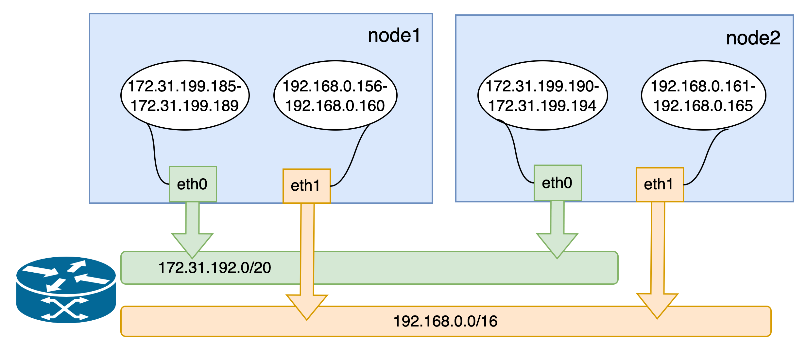

# Running On Alibaba Cloud

**English** | [**简体中文**](./get-started-alibaba-zh_CN.md)

## Introduction

With a multitude of public cloud providers available, such as Alibaba Cloud, Huawei Cloud, Tencent Cloud, AWS, and more, it can be challenging to use mainstream open-source CNI plugins to operate on these platforms using Underlay networks. Instead, one has to rely on proprietary CNI plugins provided by each cloud vendor, leading to a lack of standardized Underlay solutions for public clouds. This page introduces [Spiderpool](../../../README.md), an Underlay networking solution designed to work seamlessly in any public cloud environment. A unified CNI solution offers easier management across multiple clouds, particularly in hybrid cloud scenarios.

## Features

Spiderpool's node topology function can bind IP pools to the available IPs of each network card on each node, and also achieve the validity of MAC addresses.

Spiderpool can run on the Alibaba Cloud environment based on IPVlan Underlay CNI, and ensures that the east-west and north-south traffic of the cluster are normal. Its implementation principle is as follows:

1. When using Underlay networks in a public cloud environment, each network interface of a cloud server can only be assigned a limited number of IP addresses. To enable communication when an application runs on a specific cloud server, it needs to obtain the valid IP addresses allocated to different network interfaces within the VPC network. To address this IP allocation requirement, Spiderpool introduces a CRD named `SpiderIPPool`. By configuring the nodeName and multusName fields in `SpiderIPPool`, it enables node topology functionality. Spiderpool leverages the affinity between the IP pool and nodes, as well as the affinity between the IP pool and IPvlan Multus, facilitating the utilization and management of available IP addresses on the nodes. This ensures that applications are assigned valid IP addresses, enabling seamless communication within the VPC network, including communication between Pods and also between Pods and cloud servers.

2. In a public cloud VPC network, network security controls and packet forwarding principles dictate that when network data packets contain MAC and IP addresses unknown to the VPC network, correct forwarding becomes unattainable. This issue arises in scenarios where Macvlan or OVS based Underlay CNI plugins generate new MAC addresses for Pod NICs, resulting in communication failures among Pods. To address this challenge, Spiderpool offers a solution in conjunction with [IPVlan CNI](https://www.cni.dev/plugins/current/main/ipvlan/). The IPVlan CNI operates at the L3 of the network, eliminating the reliance on L2 broadcasts and avoiding the generation of new MAC addresses. Instead, it maintains consistency with the parent interface. By incorporating IPVlan, the legitimacy of MAC addresses in a public cloud environment can be effectively resolved.

## Prerequisites

1. [System requirements](./../system-requirements.md)

2. The system kernel version must be greater than 4.2 when using IPVlan as the cluster's CNI.

3. [Helm](https://helm.sh/docs/intro/install/) is installed.

## Steps

### Alibaba Cloud Environment

- Prepare an Alibaba Cloud environment with virtual machines that have 2 network interfaces. Assign a set of auxiliary private IP addresses to each network interface, as shown in the picture:

    

    > - An instance (virtual machine) is the smallest unit that can provide computing services for your business. Different instance specifications vary in the number of network cards that can be created and the number of auxiliary IPs that can be assigned to each network card. For more information on specific business and usage scenarios, refer to Alibaba Cloud [Instance Specification Family](https://help.aliyun.com/zh/ecs/user-guide/overview-of-instance-families#concept-sx4-lxv-tdb) to select the corresponding specification to create an instance.
    > - If you have IPv6 requirements, you can refer to Alibaba Cloud [Configuring IPv6 Addresses](https://help.aliyun.com/zh/ecs/user-guide/configure-ipv6-addresses/?spm=a2c4g.11186623.0.0.21ee48beYHt7ZW).

- Utilize the configured VMs to build a Kubernetes cluster. The available IP addresses for the nodes and the network topology of the cluster are depicted below:

    

### Install Spiderpool

Install Spiderpool via helm:

```bash
helm repo add spiderpool https://spidernet-io.github.io/spiderpool

helm repo update spiderpool

helm install spiderpool spiderpool/spiderpool --namespace kube-system --set ipam.enableStatefulSet=false --set multus.multusCNI.defaultCniCRName="ipvlan-eth0"
```

> If IPVlan is not installed in your cluster, you can specify the Helm parameter `--set plugins.installCNI=true` to install IPVlan in your cluster.
>
> If you are using a cloud server from a Chinese mainland cloud provider, you can enhance image pulling speed by specifying the parameter `--set global.imageRegistryOverride=ghcr.m.daocloud.io`.
>
> Spiderpool allows for fixed IP addresses for application replicas with a controller type of `StatefulSet`. However, in the underlay network scenario of public clouds, cloud instances are limited to using specific IP addresses. When StatefulSet replicas migrate to different nodes, the original fixed IP becomes invalid and unavailable on the new node, causing network unavailability for the new Pods. To address this issue, set `ipam.enableStatefulSet` to `false` to disable this feature.
>
> Specify the name of the NetworkAttachmentDefinition instance for the default CNI used by Multus via `multus.multusCNI.defaultCniCRName`. If the `multus.multusCNI.defaultCniCRName` option is provided, an empty NetworkAttachmentDefinition instance will be automatically generated upon installation. Otherwise, Multus will attempt to create a NetworkAttachmentDefinition instance based on the first CNI configuration found in the /etc/cni/net.d directory. If no suitable configuration is found, a NetworkAttachmentDefinition instance named `default` will be created to complete the installation of Multus.

### Install CNI

To simplify the creation of JSON-formatted Multus CNI configurations, Spiderpool offers the SpiderMultusConfig CR to automatically manage Multus NetworkAttachmentDefinition CRs. Here is an example of creating an IPvlan SpiderMultusConfig configuration:

```shell
IPVLAN_MASTER_INTERFACE0="eth0"
IPVLAN_MULTUS_NAME0="ipvlan-$IPVLAN_MASTER_INTERFACE0"
IPVLAN_MASTER_INTERFACE1="eth1"
IPVLAN_MULTUS_NAME1="ipvlan-$IPVLAN_MASTER_INTERFACE1"

cat <<EOF | kubectl apply -f -
apiVersion: spiderpool.spidernet.io/v2beta1
kind: SpiderMultusConfig
metadata:
  name: ${IPVLAN_MULTUS_NAME0}
  namespace: kube-system
spec:
  cniType: ipvlan
  enableCoordinator: true
  ipvlan:
    master:
    - ${IPVLAN_MASTER_INTERFACE0}
---
apiVersion: spiderpool.spidernet.io/v2beta1
kind: SpiderMultusConfig
metadata:
  name: ${IPVLAN_MULTUS_NAME1}
  namespace: kube-system
spec:
  cniType: ipvlan
  enableCoordinator: true
  ipvlan:
    master:
    - ${IPVLAN_MASTER_INTERFACE1}
EOF
```

This case uses the given configuration to create two IPvlan SpiderMultusConfig instances. These instances will automatically generate corresponding Multus NetworkAttachmentDefinition CRs for the host's `eth0` and `eth1` network interfaces.

```bash
~# kubectl get spidermultusconfigs.spiderpool.spidernet.io -n kube-system
NAME          AGE
ipvlan-eth0   10m
ipvlan-eth1   10m

~# kubectl get network-attachment-definitions.k8s.cni.cncf.io -n kube-system
NAME          AGE
ipvlan-eth0   10m
ipvlan-eth1   10m
```

### Create IP Pools

The Spiderpool's CRD, `SpiderIPPool`, introduces the following fields: `nodeName`, `multusName`, and `ips`:

- `nodeName`: when `nodeName` is not empty, Pods are scheduled on a specific node and attempt to acquire an IP address from the corresponding SpiderIPPool. If the Pod's node matches the specified `nodeName`, it successfully obtains an IP. Otherwise, it cannot obtain an IP from that SpiderIPPool. When `nodeName` is empty, Spiderpool does not impose any allocation restrictions on the Pod.

- `multusName`：Spiderpool integrates with Multus CNI to cope with cases involving multiple network interface cards. When `multusName` is not empty, SpiderIPPool utilizes the corresponding Multus CR instance to configure the network for the Pod. If the Multus CR specified by `multusName` does not exist, Spiderpool cannot assign a Multus CR to the Pod. When `multusName` is empty, Spiderpool does not impose any restrictions on the Multus CR used by the Pod.

- `spec.ips`：this field must not be empty. Due to Alibaba Cloud's limitations on available IP addresses for nodes, the specified range of values must fall within the auxiliary private IP range of the host associated with the specified `nodeName`. You can obtain this information from the Elastic Network Interface page in the Alibaba Cloud console.

Based on the provided information, use the following YAML configuration to create a SpiderIPPool for each network interface (eth0 and eth1) on every node. These SpiderIPPools will assign IP addresses to Pods running on different nodes.

```shell
~# cat <<EOF | kubectl apply -f -
apiVersion: spiderpool.spidernet.io/v2beta1
kind: SpiderIPPool
metadata:
  name: master-172
spec:
  default: true
  ips:
  - 172.31.199.185-172.31.199.189
  subnet: 172.31.192.0/20
  gateway: 172.31.207.253
  nodeName:
  - master
  multusName:
  - kube-system/ipvlan-eth0
---
apiVersion: spiderpool.spidernet.io/v2beta1
kind: SpiderIPPool
metadata:
  name: master-192
spec:
  default: true
  ips:
  - 192.168.0.156-192.168.0.160
  subnet: 192.168.0.0/24
  gateway: 192.168.0.253
  nodeName:
  - master
  multusName:
  - kube-system/ipvlan-eth1
---
apiVersion: spiderpool.spidernet.io/v2beta1
kind: SpiderIPPool
metadata:
  name: worker-172
spec:
  default: true
  ips:
  - 172.31.199.190-172.31.199.194
  subnet: 172.31.192.0/20
  gateway: 172.31.207.253
  nodeName:
  - worker
  multusName:
  - kube-system/ipvlan-eth0
---
apiVersion: spiderpool.spidernet.io/v2beta1
kind: SpiderIPPool
metadata:
  name: worker-192
spec:
  default: true
  ips:
  - 192.168.0.161-192.168.0.165
  subnet: 192.168.0.0/24
  gateway: 192.168.0.253
  nodeName:
  - worker
  multusName:
  - kube-system/ipvlan-eth1
EOF
```

### Create Applications

In the following example YAML, there are 2 sets of DaemonSet applications and 1 service with a type of ClusterIP:

- `v1.multus-cni.io/default-network`: specify the subnet that each application will use. In the example, the applications are assigned different subnets.

```shell
cat <<EOF | kubectl create -f -
apiVersion: apps/v1
kind: DaemonSet
metadata:
  labels:
    app: test-app-1
  name: test-app-1
  namespace: default
spec:
  selector:
    matchLabels:
      app: test-app-1
  template:
    metadata:
      labels:
        app: test-app-1
      annotations:
        v1.multus-cni.io/default-network: kube-system/ipvlan-eth0
    spec:
      containers:
      - image: busybox
        command: ["sleep", "3600"]
        imagePullPolicy: IfNotPresent
        name: test-app-1
        ports:
        - name: http
          containerPort: 80
          protocol: TCP
---
apiVersion: apps/v1
kind: DaemonSet
metadata:
  labels:
    app: test-app-2
  name: test-app-2
  namespace: default
spec:
  selector:
    matchLabels:
      app: test-app-2
  template:
    metadata:
      labels:
        app: test-app-2
      annotations:
        v1.multus-cni.io/default-network: kube-system/ipvlan-eth1
    spec:
      containers:
      - image: nginx
        imagePullPolicy: IfNotPresent
        name: test-app-2
        ports:
        - name: http
          containerPort: 80
          protocol: TCP
---
apiVersion: v1
kind: Service
metadata:
  name: test-svc
  labels:
    app: test-app-2
spec:
  type: ClusterIP
  ports:
    - port: 80
      protocol: TCP
      targetPort: 80
  selector:
    app: test-app-2
EOF
```

Check the status of the running Pods:

```bash
~# kubectl get po -owide
NAME                READY   STATUS    RESTARTS   AGE   IP               NODE      NOMINATED NODE   READINESS GATES
test-app-1-ddlx7    1/1     Running   0          16s   172.31.199.187   master    <none>           <none>
test-app-1-jpfkj    1/1     Running   0          16s   172.31.199.193   worker    <none>           <none>
test-app-2-qbhwx    1/1     Running   0          12s   192.168.0.160    master    <none>           <none>
test-app-2-r6gwx    1/1     Running   0          12s   192.168.0.161    worker    <none>           <none>
```

Spiderpool automatically assigns IP addresses to the applications, ensuring that the assigned IPs are within the expected IP pool.

```bash
~# kubectl get spiderippool
NAME         VERSION   SUBNET            ALLOCATED-IP-COUNT   TOTAL-IP-COUNT   DEFAULT
master-172   4         172.31.192.0/20   1                    5                true
master-192   4         192.168.0.0/24    1                    5                true
worker-172   4         172.31.192.0/20   1                    5                true
worker-192   4         192.168.0.0/24    1                    5                true
```

### Test East-West Connectivity

- Test communication between Pods and their hosts:

    ```bash
    ~# kubectl get nodes -owide
    NAME     STATUS   ROLES           AGE     VERSION   INTERNAL-IP      EXTERNAL-IP   OS-IMAGE                KERNEL-VERSION              CONTAINER-RUNTIME
    master   Ready    control-plane   2d12h   v1.27.3   172.31.199.183   <none>        CentOS Linux 7 (Core)   6.4.0-1.el7.elrepo.x86_64   containerd://1.7.1
    worker   Ready    <none>          2d12h   v1.27.3   172.31.199.184   <none>        CentOS Linux 7 (Core)   6.4.0-1.el7.elrepo.x86_64   containerd://1.7.1

    ~# kubectl exec -ti test-app-1-ddlx7 -- ping 172.31.199.183 -c 2
    PING 172.31.199.183 (172.31.199.183): 56 data bytes
    64 bytes from 172.31.199.183: seq=0 ttl=64 time=0.088 ms
    64 bytes from 172.31.199.183: seq=1 ttl=64 time=0.054 ms

    --- 172.31.199.183 ping statistics ---
    2 packets transmitted, 2 packets received, 0% packet loss
    round-trip min/avg/max = 0.054/0.071/0.088 ms
    ```

- Test communication between Pods across different nodes and subnets:

    ```shell
    ~# kubectl exec -ti test-app-1-ddlx7 -- ping 172.31.199.193 -c 2
    PING 172.31.199.193 (172.31.199.193): 56 data bytes
    64 bytes from 172.31.199.193: seq=0 ttl=64 time=0.460 ms
    64 bytes from 172.31.199.193: seq=1 ttl=64 time=0.210 ms

    --- 172.31.199.193 ping statistics ---
    2 packets transmitted, 2 packets received, 0% packet loss
    round-trip min/avg/max = 0.210/0.335/0.460 ms

    ~# kubectl exec -ti test-app-1-ddlx7 -- ping 192.168.0.161 -c 2
    PING 192.168.0.161 (192.168.0.161): 56 data bytes
    64 bytes from 192.168.0.161: seq=0 ttl=64 time=0.408 ms
    64 bytes from 192.168.0.161: seq=1 ttl=64 time=0.194 ms

    --- 192.168.0.161 ping statistics ---
    2 packets transmitted, 2 packets received, 0% packet loss
    round-trip min/avg/max = 0.194/0.301/0.408 ms
    ```

- Test communication between Pods and ClusterIP services:

    ```bash
    ~# kubectl get svc test-svc
    NAME       TYPE        CLUSTER-IP      EXTERNAL-IP   PORT(S)   AGE
    test-svc   ClusterIP   10.233.23.194   <none>        80/TCP    26s

    ~# kubectl exec -ti test-app-2-qbhwx -- curl 10.233.23.194 -I
    HTTP/1.1 200 OK
    Server: nginx/1.10.1
    Date: Fri, 21 Jul 2023 06:45:56 GMT
    Content-Type: text/html
    Content-Length: 4086
    Last-Modified: Fri, 21 Jul 2023 06:38:41 GMT
    Connection: keep-alive
    ETag: "64ba27f1-ff6"
    Accept-Ranges: bytes
    ```

### Test North-South Connectivity

#### Test egress traffic from Pods to external destinations

- Alibaba Cloud's NAT Gateway provides an ingress and egress gateway for public or private network traffic within a VPC environment. By utilizing NAT Gateway, the cluster can have egress connectivity. Please refer to [the NAT Gateway documentation](https://www.alibabacloud.com/help/en/nat-gateway?spm=a2c63.p38356.0.0.1b111b76Rn9rPa) for creating a NAT Gateway as depicted in the picture:

    

- Test egress traffic from Pods

    ```bash
    ~# kubectl exec -ti test-app-2-qbhwx -- curl www.baidu.com -I
    HTTP/1.1 200 OK
    Accept-Ranges: bytes
    Cache-Control: private, no-cache, no-store, proxy-revalidate, no-transform
    Connection: keep-alive
    Content-Length: 277
    Content-Type: text/html
    Date: Fri, 21 Jul 2023 08:42:17 GMT
    Etag: "575e1f60-115"
    Last-Modified: Mon, 13 Jun 2016 02:50:08 GMT
    Pragma: no-cache
    Server: bfe/1.0.8.18
    ```

- If you want to access the traffic egress of Pods in the cluster through IPv6 addresses, you need to activate public network bandwidth for the IPv6 address assigned to the Pod through the IPv6 gateway and convert the private IPv6 to a public IPv6 address. The configuration is as follows.

    

    Test Pod egress traffic over IPv6:

    ```bash
    ~# kubectl exec -ti test-app-2-qbhwx -- ping -6 aliyun.com -c 2
    PING aliyun.com (2401:b180:1:60::6): 56 data bytes
    64 bytes from 2401:b180:1:60::6: seq=0 ttl=96 time=6.058 ms
    64 bytes from 2401:b180:1:60::6: seq=1 ttl=96 time=6.079 ms

    --- aliyun.com ping statistics ---
    2 packets transmitted, 2 packets received, 0% packet loss
    round-trip min/avg/max = 6.058/6.068/6.079 ms
    ```

#### Load Balancer Traffic Ingress Access

##### Deploy Cloud Controller Manager

Cloud Controller Manager (CCM) is an Alibaba Cloud's component that enables integration between Kubernetes and Alibaba Cloud services. We will use CCM along with Alibaba Cloud infrastructure to facilitate load balancer traffic ingress access. Follow the steps below and refer to [the CCM documentation](https://github.com/kubernetes/cloud-provider-alibaba-cloud/blob/master/docs/getting-started.md) for deploying CCM.

1. Configure `providerID` on Cluster Nodes

    On each node in the cluster, run the following command to obtain the `providerID` for each node. <http://100.100.100.200/latest/meta-data> is the API entry point provided by Alibaba Cloud CLI for retrieving instance metadata. You don't need to modify it in the provided example. For more information, please refer to [ECS instance metadata](https://www.alibabacloud.com/help/en/ecs/user-guide/overview-of-ecs-instance-metadata?spm=a2c63.p38356.0.0.1c3c592dPUwXMN).

    ```bash
    ~# META_EP=http://100.100.100.200/latest/meta-data
    ~# provider_id=`curl -s $META_EP/region-id`.`curl -s $META_EP/instance-id`
    ~# echo $provider_id
    cn-hangzhou.i-bp17345hor9*******
    ```

    On the `master` node of the cluster, use the `kubectl patch` command to add the `providerID` for each node in the cluster. This step is necessary to ensure the proper functioning of the CCM Pod on each corresponding node. Failure to run this step will result in the CCM Pod being unable to run correctly.

    ```bash
    ~# kubectl get nodes
    ~# kubectl patch node <NODE_NAME> -p '{"spec":{"providerID": "<provider_id>"}}' # Replace <NODE_NAME> and <provider_id> with corresponding values.
    ```

2. Create an Alibaba Cloud RAM user and grant authorization.

    A RAM user is an entity within Alibaba Cloud's Resource Access Management (RAM) that represents individuals or applications requiring access to Alibaba Cloud resources. Refer to [Overview of RAM users](https://www.alibabacloud.com/help/en/ram/user-guide/overview-of-ram-users?spm=a2c63.p38356.0.0.435a7b9fxy619R) to create a RAM user and assign the necessary permissions for accessing resources.

    To ensure that the RAM user used in the subsequent steps has sufficient privileges, grant the `AdministratorAccess` and `AliyunSLBFullAccess` permissions to the RAM user, following the instructions provided here.

3. Obtain the AccessKey & AccessKeySecret for the RAM user.

    Log in to the RAM User account and go to [User Center](https://account.alibabacloud.com/login/login.htm?spm=5176.12901015-2.0.0.36cb525cXk2SG0) to retrieve the corresponding AccessKey & AccessKeySecret for the RAM User.

4. Create the Cloud ConfigMap for CCM.

    Use the following method to write the AccessKey & AccessKeySecret obtained in step 3 as environment variables.

    ```bash
    ~# export ACCESS_KEY_ID=LTAI********************
    ~# export ACCESS_KEY_SECRET=HAeS**************************
    ```

    Run the following command to create cloud-config:

    ```bash
    accessKeyIDBase64=`echo -n "$ACCESS_KEY_ID" |base64 -w 0`
    accessKeySecretBase64=`echo -n "$ACCESS_KEY_SECRET"|base64 -w 0`

    cat <<EOF | kubectl apply -f -
    apiVersion: v1
    kind: ConfigMap
    metadata:
      name: cloud-config
      namespace: kube-system
    data:
      cloud-config.conf: |-
        {
            "Global": {
                "accessKeyID": "$accessKeyIDBase64",
                "accessKeySecret": "$accessKeySecretBase64"
            }
        }
    EOF
    ```

5. Retrieve the YAML file and install CCM by running the command `kubectl apply -f cloud-controller-manager.yaml`. The version of CCM being installed here is v2.5.0.

    - Use the following command to obtain the cloud-controller-manager.yaml file and replace `<<cluster_cidr>>` with the actual cluster CIDR; You can view the cluster CIDR of the cluster through the `kubectl cluster-info dump | grep -m1 cluster-cidr` command.

    ```bash
    ~# wget https://raw.githubusercontent.com/spidernet-io/spiderpool/main/docs/example/alicloud-ccm/cloud-controller-manager.yaml
    ~# kubectl apply -f cloud-controller-manager.yaml
    ```

6. Verify if CCM is installed.

    ```bash
    ~# kubectl get po -n kube-system | grep cloud-controller-manager
    NAME                                     READY   STATUS      RESTARTS        AGE
    cloud-controller-manager-72vzr           1/1     Running     0               27s
    cloud-controller-manager-k7jpn           1/1     Running     0               27s
    ```

##### Create Load Balancer Ingress for Applications

The following YAML will create two sets of services, one for TCP (layer 4 load balancing) and one for HTTP (layer 7 load balancing), with `spec.type` set to `LoadBalancer`.

- `service.beta.kubernetes.io/alibaba-cloud-loadbalancer-protocol-port`: this annotation provided by CCM allows you to customize the exposed ports for layer 7 load balancing. For more information, refer to [the CCM Usage Documentation](https://github.com/kubernetes/cloud-provider-alibaba-cloud/blob/master/docs/usage.md).

- `.spec.externalTrafficPolicy`: indicates whether the service prefers to route external traffic to local or cluster-wide endpoints. It has two options: Cluster (default) and Local. Setting `.spec.externalTrafficPolicy` to `Local` preserves the client source IP. However, when a self-built public cloud cluster uses the platform's Loadbalancer component for nodePort forwarding in this mode, access will be blocked. In response to this problem, Spiderpool provides the coordinator plug-in, which uses iptables to mark the data packets to confirm that the reply packets of data entering from veth0 are still forwarded from veth0, thus solving the problem of nodeport being unable to access in this mode.

```bash
~# cat <<EOF | kubectl apply -f -
apiVersion: v1
kind: Service
metadata:
  name: tcp-service
  namespace: default
spec:
  externalTrafficPolicy: Local
  ports:
  - name: tcp
    port: 999
    protocol: TCP
    targetPort: 80
  selector:
    app: test-app-2
  type: LoadBalancer
---
apiVersion: v1
kind: Service
metadata:
  annotations:
    service.beta.kubernetes.io/alibaba-cloud-loadbalancer-protocol-port: "http:80"
  name: http-service
  namespace: default
spec:
  externalTrafficPolicy: Local
  ports:
  - port: 80
    protocol: TCP
    targetPort: 80
  selector:
    app: test-app-2
  type: LoadBalancer
EOF
```

After the creation is complete, you can view the following:

```bash
~# kubectl get svc |grep service
NAME           TYPE           CLUSTER-IP      EXTERNAL-IP      PORT(S)         AGE
http-service   LoadBalancer   10.233.1.108    121.41.165.119   80:30698/TCP    11s
tcp-service    LoadBalancer   10.233.4.245    47.98.137.75     999:32635/TCP   15s
```

CCM will automatically create layer 4 and layer 7 load balancers at its IaaS services. You can easily access and manage them through the Alibaba Cloud console, as shown below:


##### Verify Load Balancer Traffic Ingress Access

On a public machine, access the load balancer's public IP + port to test the traffic ingress:

```bash
# Access layer 4 load balancing
$ curl 47.98.137.75:999 -I
HTTP/1.1 200 OK
Server: nginx/1.25.1
Date: Sun, 30 Jul 2023 09:12:46 GMT
Content-Type: text/html
Content-Length: 615
Last-Modified: Tue, 13 Jun 2023 15:08:10 GMT
Connection: keep-alive
ETag: "6488865a-267"
Accept-Ranges: bytes

# Access layer 7 load balancing
$ curl 121.41.165.119:80 -I
HTTP/1.1 200 OK
Date: Sun, 30 Jul 2023 09:13:17 GMT
Content-Type: text/html
Content-Length: 615
Connection: keep-alive
Last-Modified: Tue, 13 Jun 2023 15:08:10 GMT
ETag: "6488865a-267"
Accept-Ranges: bytes
```

> Alibaba Cloud's CCM implements ingress access for load balancing traffic, and it does not support setting the `spec.ipFamilies` of the backend service to IPv6.

```bash
~# kubectl describe svc lb-ipv6
...
Events:
  Type     Reason                  Age                   From            Message
  ----     ------                  ----                  ----            -------
  Warning  SyncLoadBalancerFailed  3m5s (x37 over 159m)  nlb-controller  Error syncing load balancer [nlb-rddqbe6gnp9jil4i15]: Message: code: 400, The operation is not allowed because of ServerGroupNotSupportIpv6.
```

## Summary

Spiderpool is successfully running in an Alibaba Cloud cluster, ensuring normal east-west and north-south traffic.
