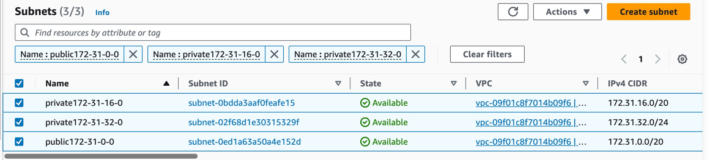
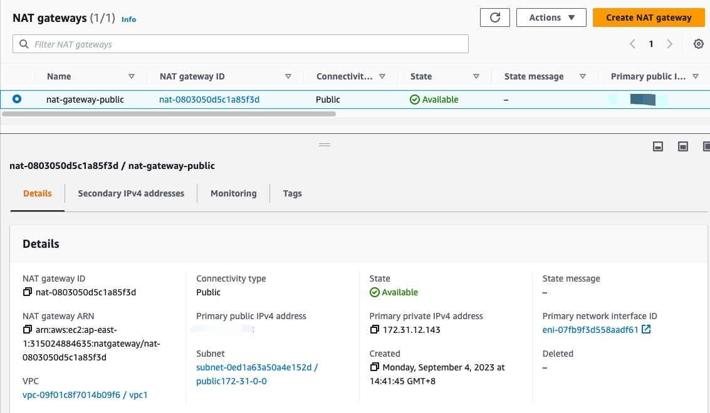
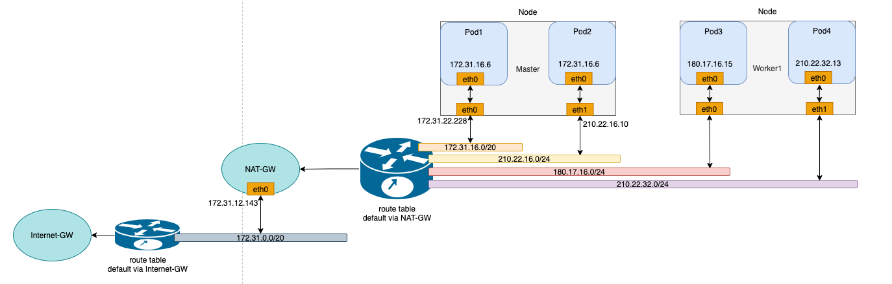

# Running On AWS

**English** | [**简体中文**](./get-started-aws-zh_CN.md)

## Introduction

With a multitude of public cloud providers available, such as Alibaba Cloud, Huawei Cloud, Tencent Cloud, AWS, and more, it can be challenging to use mainstream open-source CNI plugins to operate on these platforms using underlay networks. Instead, one has to rely on proprietary CNI plugins provided by each cloud vendor, leading to a lack of standardized underlay solutions for public clouds. This page introduces [Spiderpool](../../../README.md), an underlay networking solution designed to work seamlessly in any public cloud environment. A unified CNI solution offers easier management across multiple clouds, particularly in hybrid cloud scenarios.

## Why Spiderpool

- [Spiderpool](../../readme.md) is an underlay and RDMA network solution for the Kubernetes. It enhances the capabilities of Macvlan CNI, IPvlan CNI, SR-IOV CNI fulfills various networking needs, and supports to run on **bare metal, virtual machine, and public cloud environments**. Spiderpool delivers exceptional network performance.

- [aws-vpc-cni](https://github.com/aws/amazon-vpc-cni-k8s) Networking plugin for pod networking in Kubernetes using Elastic Network Interfaces on AWS.

aws-vpc-cni is an underlay network solution provided by AWS for public cloud, but it cannot meet complex network requirements. The following is a comparison of some functions between spiderpool and aws-cni. The related functions of Spiderpool will be demonstrated in subsequent chapters：

| Feature comparison                          | aws-vpc-cni                                                                      |         Spiderpool + IPvlan                      |
|------------------------------------------- | ------------------------------------------------------------------------------ | ------------------------------------------------ |
| Multiple Underlay NICs                     | ❌                                                                             | ✅ (Multiple Underlay NICs across subnets)       |
| Custom routing                             | ❌                                                                             | ✅ [route](../../route.md)                       |
| Dual CNI collaboration                     | Supports multiple CNI NIC but does not support routing coordination            | ✅ support [rdma](../../rdma-roce.md)            |
| network policy                             | ✅ [aws-network-policy-agent](https://github.com/aws/aws-network-policy-agent) | ✅ [cilium-chaining](../../cilium-chaining.md)   |
| clusterIP                                  | ✅ (kube-proxy)                                                                | ✅ (kube-proxy and ebpf two methods)             |
| Bandwidth                                  | ❌                                                                             | ✅ [Bandwidth management](../../ipvlan_bandwidth.md)  |
| metrics                                    | ✅                                                                             | ✅                                               |
| Dual stack                                 | IPv4 only, IPv6 only, dual stack is not supported                              | IPv4 only, IPv6 only, dual stack                 |
| Observability                              | ❌                                                                             | ✅(with cilium hubble, kernel>=4.19.57)          |
| Multi-cluster                              | ❌                                                                             | ✅ [Submariner](../../submariner.md)             |
| Paired with AWS layer 4/7 load balancing   | ✅                                                                             | ✅                                               |
| Kernel limit                               | None                                                                           | >= 4.2 (IPvlan kernel limit)                     |
| Forwarding principle                       | underlay pure routing layer 3 forwarding                                       | IPvlan layer 2                                   |
| multicast                                  | ❌                                                                             | ✅                                               |
| Cross vpc access                           | ✅                                                                             | ✅                                               |

## Features

Spiderpool can operate in public cloud environments using the ipvlan underlay CNI and provide features such as node topology and MAC address validity resolution. Here is how it works:

1. When using underlay networks in a public cloud environment, each network interface of a cloud server can only be assigned a limited number of IP addresses. To enable communication when an application runs on a specific cloud server, it needs to obtain the valid IP addresses allocated to different network interfaces within the VPC network. To address this IP allocation requirement, Spiderpool introduces a CRD named `SpiderIPPool`. By configuring the nodeName and multusName fields in `SpiderIPPool`, it enables node topology functionality. Spiderpool leverages the affinity between the IP pool and nodes, as well as the affinity between the IP pool and ipvlan Multus, facilitating the utilization and management of available IP addresses on the nodes. This ensures that applications are assigned valid IP addresses, enabling seamless communication within the VPC network, including communication between Pods and also between Pods and cloud servers.

2. In a public cloud VPC network, network security controls and packet forwarding principles dictate that when network data packets contain MAC and IP addresses unknown to the VPC network, correct forwarding becomes unattainable. This issue arises in scenarios where Macvlan or OVS based underlay CNI plugins generate new MAC addresses for Pod NICs, resulting in communication failures among Pods. To address this challenge, Spiderpool offers a solution in conjunction with [ipvlan CNI](https://www.cni.dev/plugins/current/main/ipvlan/). The ipvlan CNI operates at the L3 of the network, eliminating the reliance on L2 broadcasts and avoiding the generation of new MAC addresses. Instead, it maintains consistency with the parent interface. By incorporating ipvlan, the legitimacy of MAC addresses in a public cloud environment can be effectively resolved.

## Prerequisites

1. [System requirements](./../system-requirements.md)

2. The system kernel version must be greater than 4.2 when using ipvlan as the cluster's CNI.

3. [Helm](https://helm.sh/docs/intro/install/) is installed.

4. Understand the basics of [AWS VPC Public and Private Subnets](https://docs.aws.amazon.com/vpc/latest/userguide/configure-subnets.html).

    In an AWS VPC, a subnet is categorized as a *public subnet* if it has an outbound route configured with the Internet Gateway as the next hop for destinations 0.0.0.0/0 or ::/0. Otherwise, a subnet is considered a *private subnet* if it lacks this specific outbound routing configuration.

    

## Steps

### AWS Environment

1. Create a public subnet and multiple private subnets within a VPC, and deploy virtual machines in the private subnets as shown in the following picture:

    > We will create one public subnet and two private subnets within the same VPC. Each private subnet should be deployed in a different availability zone. A EC2 instance as a jump server will be created in the public subnet for secure access. Additionally, two AWS EC2 instances will be created in the respective different private subnets to set up the Kubernetes cluster.

    

2. Bind IPv4 and IPv6 addresses to the network interface when creating an instance, as the picture below:

    

3. Bind [IP prefix delegation](https://docs.aws.amazon.com/AWSEC2/latest/UserGuide/ec2-prefix-eni.html) to each network interface of the instances in which we can use it to allocate IP address for pod:

    > IP prefix delegation just like the secondary IP address that could bind a CIDR range for instance. The number of IP prefix delegation can be referenced from [AWS EC2 instance specifications](https://docs.aws.amazon.com/AWSEC2/latest/UserGuide/using-eni.html). The instance can bind the same number of prefix delegations as the number of secondary IPs that can be bound to the instance's network interface. In this example, we choose to bind 1 network interface and 1 IP prefix delegation to the instance.

    

    ```shell
    | Node    | ens5 primary IP | ens5 secondary IPs        | ens6 primary IP | ens6 secondary IPs        |  
    |---------|-----------------|---------------------------|-----------------|---------------------------|
    | master  | 172.31.22.228   | 172.31.16.4-172.31.16.8   | 210.22.16.10    | 210.22.16.11-210.22.16.15 |
    | worker1 | 180.17.16.17    | 180.17.16.11-180.17.16.15 | 210.22.32.10    | 210.22.32.11-210.22.32.15 |
    ```

4. Create an AWS NAT gateway to allow instances in the VPC's private subnets to connect to external services. The NAT gateway serves as an outbound traffic gateway for the cluster. Follow the [NAT gateway documentation](https://docs.aws.amazon.com/vpc/latest/userguide/vpc-nat-gateway.html) to create a NAT gateway:

    > Create a NAT gateway in the public subnet, `public-172-31-0-0`, and configure the route table of the private subnets to set the next-hop of the outbound route 0.0.0.0/0 to NAT gateway. (IPv6 addresses provided by AWS are globally unique and can access the internet directly via the Internet Gateway).

    

    

5. Use the configured virtual machines to establish a Kubernetes cluster. The available IP addresses for the nodes and the network topology diagram of the cluster are shown below:

    

### Install Spiderpool

Install Spiderpool via helm:

```shell
helm repo add spiderpool https://spidernet-io.github.io/spiderpool

helm repo update spiderpool

helm install spiderpool spiderpool/spiderpool --namespace kube-system --set ipam.enableStatefulSet=false --set multus.multusCNI.defaultCniCRName="ipvlan-ens5"
```

> - If you are using a cloud server from a Chinese mainland cloud provider, you can enhance image pulling speed by specifying the parameter `--set global.imageRegistryOverride=ghcr.m.daocloud.io`.
>
> - Spiderpool allows for fixed IP addresses for application replicas with a controller type of `StatefulSet`. However, in the underlay network scenario of public clouds, cloud instances are limited to using specific IP addresses. When StatefulSet replicas migrate to different nodes, the original fixed IP becomes invalid and unavailable on the new node, causing network unavailability for the new Pods. To address this issue, set `ipam.enableStatefulSet` to `false` to disable this feature.
>
> - Specify the name of the NetworkAttachmentDefinition instance for the default CNI used by Multus via `multus.multusCNI.defaultCniCRName`. If the `multus.multusCNI.defaultCniCRName` option is provided, an empty NetworkAttachmentDefinition instance will be automatically generated upon installation. Otherwise, Multus will attempt to create a NetworkAttachmentDefinition instance based on the first CNI configuration found in the /etc/cni/net.d directory. If no suitable configuration is found, a NetworkAttachmentDefinition instance named `default` will be created to complete the installation of Multus.

### Install CNI

To simplify the creation of JSON-formatted Multus CNI configurations, Spiderpool offers the SpiderMultusConfig CR to automatically manage Multus NetworkAttachmentDefinition CRs. Based on the network interface configuration created during the process of setting up the AWS EC2 instances, here is an example configuration of SpiderMultusConfig for each network interface used to run ipvlan CNI:

```shell
IPVLAN_MASTER_INTERFACE="ens5"
IPVLAN_MULTUS_NAME="ipvlan-$IPVLAN_MASTER_INTERFACE"

cat <<EOF | kubectl apply -f -
apiVersion: spiderpool.spidernet.io/v2beta1
kind: SpiderMultusConfig
metadata:
  name: ${IPVLAN_MULTUS_NAME}
  namespace: kube-system
spec:
  cniType: ipvlan
  ipvlan:
    master:
    - ${IPVLAN_MASTER_INTERFACE}
EOF
```

This case uses the given configuration to create one ipvlan SpiderMultusConfig instances. This resource will automatically generate corresponding Multus NetworkAttachmentDefinition CR for the host's `eth5` network interface.

```bash
~# kubectl get spidermultusconfigs.spiderpool.spidernet.io -A
NAMESPACE         NAME                AGE
kube-system       ipvlan-ens5         8d

~# kubectl get network-attachment-definitions.k8s.cni.cncf.io -A
NAMESPACE         NAME                AGE
kube-system       ipvlan-ens5         8d
```

### Create IP Pools

The Spiderpool's CRD, `SpiderIPPool`, introduces the following fields: `nodeName`, `multusName`, and `ips`:

- `nodeName`: when `nodeName` is not empty, Pods are scheduled on a specific node and attempt to acquire an IP address from the corresponding SpiderIPPool. If the Pod's node matches the specified `nodeName`, it successfully obtains an IP. Otherwise, it cannot obtain an IP from that SpiderIPPool. When `nodeName` is empty, Spiderpool does not impose any allocation restrictions on the Pod.

- `multusName`：Spiderpool integrates with Multus CNI to cope with cases involving multiple network interface cards. When `multusName` is not empty, SpiderIPPool utilizes the corresponding Multus CR instance to configure the network for the Pod. If the Multus CR specified by `multusName` does not exist, Spiderpool cannot assign a Multus CR to the Pod. When `multusName` is empty, Spiderpool does not impose any restrictions on the Multus CR used by the Pod.

- `spec.ips`: based on the information provided about the network interfaces and IP prefix delegation addresses of the AWS EC2 instances, the specified range of values must fall within the auxiliary private IP range of the host associated with the specified `nodeName`. Each value should correspond to a unique instance network interface.

Taking into account the network interfaces and associated IP prefix delegation information for each instance in the [AWS environment](./get-started-aws.md#aws-environment), the following YAML is used to create IPv4 and IPv6 SpiderIPPool resources for network interface `ens5` on each node. These pools will provide IP addresses for Pods on different nodes:

```shell
~# cat <<EOF | kubectl apply -f -
apiVersion: spiderpool.spidernet.io/v2beta1
kind: SpiderIPPool
metadata:
  name: master-v4
spec:
  subnet: 172.31.16.0/20
  ips:
    - 172.31.28.16-172.31.28.31
  gateway: 172.31.16.1
  default: true
  nodeName: ["master"]
  multusName: ["kube-system/ipvlan-ens5"]
---
apiVersion: spiderpool.spidernet.io/v2beta1
kind: SpiderIPPool
metadata:
  name: master-v6
spec:
  subnet: 2406:da1e:c4:ed01::/64
  ips:
    - 2406:da1e:c4:ed01:c57d::0-2406:da1e:c4:ed01:c57d::f
  gateway: 2406:da1e:c4:ed01::1
  default: true
  nodeName: ["master"]
  multusName: ["kube-system/ipvlan-ens5"]
---
apiVersion: spiderpool.spidernet.io/v2beta1
kind: SpiderIPPool
metadata:
  name: worker1-v4
spec:
  subnet: 172.31.32.0/24
  ips:
    - 172.31.32.176-172.31.32.191
  gateway: 172.31.32.1
  default: true
  nodeName: ["worker1"]
  multusName: ["kube-system/ipvlan-ens5"]
---
apiVersion: spiderpool.spidernet.io/v2beta1
kind: SpiderIPPool
metadata:
  name: worker1-v6
spec:
  subnet: 2406:da1e:c4:ed02::/64
  ips:
    - 2406:da1e:c4:ed02:7a2e::0-2406:da1e:c4:ed02:7a2e::f
  gateway: 2406:da1e:c4:ed02::1
  default: true
  nodeName: ["worker1"]
  multusName: ["kube-system/ipvlan-ens5"]
EOF
```

### Create Applications

The following YAML example creates a Deployment application with the following configuration:

- `v1.multus-cni.io/default-network`: specify the CNI configuration for the application. In this example, the application is configured to use the ipvlan configuration associated with the `ens5` interface of the host machine. The subnet is selected automatically according to the default SpiderIPPool resource.

```shell
cat <<EOF | kubectl create -f -
apiVersion: apps/v1
kind: Deployment
metadata:
  name: nginx-lb
spec:
  selector:
    matchLabels:
      run: nginx-lb
  replicas: 2
  template:
    metadata:
      annotations:
        v1.multus-cni.io/default-network: "kube-system/ipvlan-ens5"
      labels:
        run: nginx-lb
    spec:
      containers:
      - name: nginx-lb
        image: nginx
        ports:
        - containerPort: 80
EOF
```

By checking the running status of the Pods, you can observe that one Pod is running on each node, and the Pods are assigned the IP prefix delegation addresses of the first network interface of their respective host machines:

```shell
~# kubectl get po -o wide
NAME                        READY   STATUS    RESTARTS   AGE   IP              NODE      NOMINATED NODE   READINESS GATES
nginx-lb-64fbbb5fd8-q5wjm   1/1     Running   0          10s   172.31.32.184   worker1   <none>           <none>
nginx-lb-64fbbb5fd8-wkzf6   1/1     Running   0          10s   172.31.28.31    master    <none>           <none>
```

### Test East-West Connectivity

- Test communication between Pods and their hosts:

> export NODE_MASTER_IP=172.31.18.11  
> export NODE_WORKER1_IP=172.31.32.18  
> ~# kubectl exec -it nginx-lb-64fbbb5fd8-wkzf6 -- ping -c 1 ${NODE_MASTER_IP}  
> ~# kubectl exec -it nginx-lb-64fbbb5fd8-q5wjm -- ping -c 1 ${NODE_WORKER1_IP}

- Test communication between Pods across different nodes and subnets:

> ~# kubectl exec -it nginx-lb-64fbbb5fd8-wkzf6 -- ping -c 1 172.31.32.184  
> ~# kubectl exec -it nginx-lb-64fbbb5fd8-wkzf6 -- ping6 -c 1 2406:da1e:c4:ed02:7a2e::d

- Test communication between Pods and ClusterIP:

> ~# kubectl exec -it nginx-lb-64fbbb5fd8-wkzf6 -- curl -I ${CLUSTER_IP}

### Test North-South Connectivity

#### Test egress traffic from Pods to external destinations

With the [AWS NAT gateway](./get-started-aws.md#aws-environment) created in the previous section, our VPC's private network can now be accessed from the internet.

```bash
kubectl exec -it nginx-lb-64fbbb5fd8-wkzf6 -- curl -I www.baidu.com
```

#### Load Balancer Ingress Access (Optional)

##### Deploy AWS Load Balancer Controller

The AWS Load Balancer product offers two modes: NLB (Network Load Balancer) and ALB (Application Load Balancer), corresponding to Layer 4 and Layer 7, respectively. The aws-load-balancer-controller is an AWS-provided component that integrates Kubernetes with AWS Load Balancer, enabling Kubernetes Service LoadBalancer and Ingress functionality. We will use this component to facilitate load balancing ingress access with AWS infrastructure. The installation demo is based on version `v2.6`. You can follow the steps below and refer to the [aws-load-balancer-controller documentation](https://kubernetes-sigs.github.io/aws-load-balancer-controller/v2.6/) for aws-load-balancer-controller deployment:

1. Configure `providerID` for cluster nodes.

    It is necessary to set the `providerID` for each Node in Kubernetes. You can achieve this in either of the following ways:

    - Find the Instance ID for each instance directly in the AWS EC2 dashboard.
    - Use the AWS CLI to query the Instance ID: `aws ec2 describe-instances --query 'Reservations[*].Instances[*].{Instance:InstanceId}'`.

2. Add necessary IAM role policy for AWS EC2 instances

    > 1. The aws-load-balancer-controller runs on each node and requires access to AWS NLB/ALB APIs. Therefore, it needs authorization to make requests related to NLB/ALB through AWS IAM. As we are deploying a self-managed cluster, we need to leverage the IAM Role of the nodes themselves to grant this authorization. For more details, refer to the [aws-load-balancer-controller IAM](https://kubernetes-sigs.github.io/aws-load-balancer-controller/v2.6/).
    > 2. `curl -o iam-policy.json https://raw.githubusercontent.com/kubernetes-sigs/aws-load-balancer-controller/v2.6.0/docs/install/iam_policy.json`
    > 3. Create a new policy in the AWS IAM Dashboard by using the obtained JSON content and associate it with the IAM Role of your virtual machine instance.

    

    

3. Create a public subnet for the availability zone where your AWS EC2 instances are located and apply an auto-discoverable tag.

    - For ALB, you need at least two subnets across different availability zones. For NLB, at least one subnet is required. Refer to the [Subnet Discovery](https://kubernetes-sigs.github.io/aws-load-balancer-controller/v2.6/deploy/subnet_discovery/) for more details.
    - To enable LB with public access, add the `kubernetes.io/role/elb:1` tag to the public subnet in the availability zone where the instances reside. Regarding cross-VPC access for LB, create a private subnet and apply the `kubernetes.io/role/internal-elb:1` tag. Use the [AWS environment](./get-started-aws.md#aws-environment) to create the necessary subnets:

      > - To create a public subnet for an internet-exposed load balancer, go to the AWS VPC Dashboard, select "Create subnet" in the Subnets section, and choose the same availability zone as the EC2 instance, and associate the subnet with the Main route table (make sure the default 0.0.0.0/0 route in the Main route table has the Internet Gateway as the next hop; if not, create this route rule).
      > - Create a new route table in the AWS VPC Dashboard and configure the 0.0.0.0/0 route with the NAT Gateway as the next hop, and the ::/0 route with the Internet Gateway as the next hop.
      > - To create a private subnet for LB with cross-VPC access, go to the AWS VPC Dashboard Subnets section, select "Create subnet," choose the same availability zone as the EC2 instance, and associate it with the route table created in the previous step.

4. Install aws-load-balancer-controller v2.6 using Helm.

    ```shell
    helm repo add eks https://aws.github.io/eks-charts
    
    kubectl apply -k "github.com/aws/eks-charts/stable/aws-load-balancer-controller//crds?ref=master"
    
    helm install aws-load-balancer-controller eks/aws-load-balancer-controller -n kube-system --set clusterName=<cluster-name>
    ```

5. Check if  aws-load-balancer-controller has been installed already

    ```shell
    ~# kubectl get po -n kube-system | grep aws-load-balancer-controller
    NAME                                            READY   STATUS    RESTARTS       AGE
    aws-load-balancer-controller-5984487f57-q6qcq   1/1     Running   0              30s
    aws-load-balancer-controller-5984487f57-wdkxl   1/1     Running   0              30s
    ```

##### Create a LoadBalancer for Application Access

To provide access to the application created in the previous section [Create Applications](./get-started-aws.md#create-applications), we will create a Kubernetes Service of type LoadBalancer. If you have a dual-stack requirement, add the annotation  `service.beta.kubernetes.io/aws-load-balancer-ip-address-type: dualstack`:

```shell
cat <<EOF | kubectl create -f -
apiVersion: v1
kind: Service
metadata:
  name: nginx-svc-lb
  labels:
    run: nginx-lb
  annotations:
    service.beta.kubernetes.io/aws-load-balancer-nlb-target-type: ip
    service.beta.kubernetes.io/aws-load-balancer-scheme: internet-facing
    service.beta.kubernetes.io/aws-load-balancer-target-group-attributes: preserve_client_ip.enabled=true
    # service.beta.kubernetes.io/aws-load-balancer-ip-address-type: dualstack
spec:
  type: LoadBalancer
  ports:
  - port: 80
    protocol: TCP
  selector:
    run: nginx-lb
EOF
```


As shown in the AWS EC2 Load Balancing dashboard, an NLB has been created and is accessible.

> - NLB also supports creating LB in instance mode by just modifying the annotation `service.beta.kubernetes.io/aws-load-balancer-nlb-target-type`. However, instance mode does not support node drift when using `service.spec.externalTraffic=Local`, so it is not recommended.
> - Use the annotation `service.beta.kubernetes.io/load-balancer-source-ranges` to restrict the source IP addresses that can access the NLB. This feature is associated with the annotation `service.beta.kubernetes.io/aws-load-balancer-ip-address-type`. If the default mode is IPv4, the value is `0.0.0.0/0`. For dualstack, the default is `0.0.0.0/0, ::/0`.
> - Use the annotation `service.beta.kubernetes.io/aws-load-balancer-scheme` to specify whether the NLB should be exposed for public access or restricted to cross-VPC communication. The default value is `internal` for cross-VPC communication.
> - The annotation `service.beta.kubernetes.io/aws-load-balancer-target-group-attributes: preserve_client_ip.enabled=true` enables client source IP preservation ability.

##### Create an Ingress for Application Access

Next, we will create a Kubernetes Ingress resource. If you have a dual-stack requirement, add the annotation `alb.ingress.kubernetes.io/ip-address-type: dualstack`:

```shell
apiVersion: apps/v1
kind: Deployment
metadata:
  name: nginx-ingress
spec:
  selector:
    matchLabels:
      run: nginx-ingress
  replicas: 2
  template:
    metadata:
      annotations:
        v1.multus-cni.io/default-network: "kube-system/ipvlan-ens5"
      labels:
        run: nginx-ingress
    spec:
      containers:
      - name: nginx-ingress
        image: nginx
        ports:
        - containerPort: 80
---
apiVersion: v1
kind: Service
metadata:
  name: nginx-svc-ingress
  labels:
    run: nginx-ingress
spec:
  type: NodePort
  ports:
  - port: 80
    protocol: TCP
  selector:
    run: nginx-ingress
---
apiVersion: apps/v1
kind: Deployment
metadata:
  name: echoserver
spec:
  selector:
    matchLabels:
      app: echoserver
  replicas: 2
  template:
    metadata:
      annotations:
        v1.multus-cni.io/default-network: "kube-system/ipvlan-ens5"
      labels:
        app: echoserver
    spec:
      containers:
      - image: k8s.gcr.io/e2e-test-images/echoserver:2.5
        imagePullPolicy: Always
        name: echoserver
        ports:
        - containerPort: 8080
---
apiVersion: v1
kind: Service
metadata:
  name: echoserver
spec:
  ports:
    - port: 80
      targetPort: 8080
      protocol: TCP
  type: NodePort
  selector:
    app: echoserver
---
apiVersion: networking.k8s.io/v1
kind: Ingress
metadata:
  name: k8s-app-ingress
  annotations:
    alb.ingress.kubernetes.io/target-type: ip
    alb.ingress.kubernetes.io/scheme: internet-facing
    # alb.ingress.kubernetes.io/ip-address-type: dualstack
spec:
  ingressClassName: alb
  rules:
    - http:
        paths:
          - path: /
            pathType: Exact
            backend:
              service:
                name: nginx-svc-ingress
                port:
                  number: 80
    - http:
        paths:
          - path: /echo
            pathType: Exact
            backend:
              service:
                name: echoserver
                port:
                  number: 80
```


As shown in the AWS EC2 Load Balancing dashboard, an ALB has been created and is accessible.

> - ALB also supports creating LB in instance mode by just modifying the annotation `alb.ingress.kubernetes.io/target-type`. However, instance mode does not support node drift when using `service.spec.externalTraffic=Local`, so it is not recommended.
> - When using ALB in instance mode, specify the service as NodePort mode.
> - Use the annotation `alb.ingress.kubernetes.io/inbound-cidrs` to restrict the source IP addresses that can access the NLB. This feature is associated with the annotation `alb.ingress.kubernetes.io/ip-address-type`. If the default mode is IPv4, the value is `0.0.0.0/0`. For dualstack, the default is `0.0.0.0/0, ::/0`.
> - Use the annotation `alb.ingress.kubernetes.io/scheme` to specify whether the ALB should be exposed for public access or restricted to cross-VPC communication. The default value is `internal` for cross-VPC communication.
> - To integrate multiple Ingress resources and share the same entry point, configure the annotation `alb.ingress.kubernetes.io/group.name` to specify a name. Ingress resources without this annotation are treated as an "implicit IngressGroup" composed by the Ingress itself.
> - To specify the host for the Ingress, refer to[Configuring externalDNS](https://kubernetes-sigs.github.io/aws-load-balancer-controller/v2.6/guide/integrations/external_dns/) to enable it.
