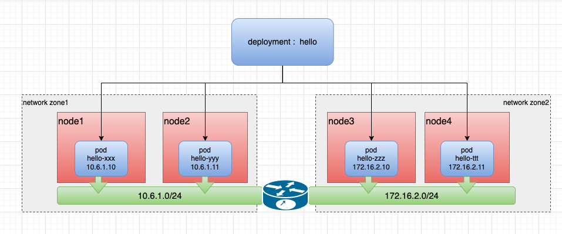

# 云原生 Spiderpool：基于跨越网络区域的 IP 分配

[**English**](./ip-allocation-across-networks.md) | **简体中文**

Underlay 网络是底层基础网络，具有低延迟、可靠、安全等特性。这些特性能满足一些延时敏感的应用业务需求、提供优质的用户体验以及有效管理和保护网络资源，通常应用在延时敏感、防火墙安全管控中。

## 跨越网络区域的 IP 地址分配需求

- 延时敏感的应用：某些特定行业或应用（如金融交易、实时视频传输等）对网络延迟非常敏感。在这种情况下，Underlay 网络可以提供更低的延迟，通过直接控制物理和链路层的连接来减少数据传输的时间。这种低延迟的特性使得 Underlay 网络成为满足这些应用需求的理想选择。

- 防火墙安全管控：在集群中，防火墙通常用于管理南北向通信，即集群内部和外部网络之间的通信。为了实现安全管控，防火墙需要对通信流量进行检查和过滤，并对出口通信进行限制。在这种情况下，通过 Underlay 网络的 IPAM 对应用固定出口 IP 地址，可以更好地管理和控制集群与外部网络之间的通信，提高网络的安全性。

随着数据中心私有云的不断普及，Underlay 网络作为数据中心网络架构的重要组成部分，已经被广泛应用于数据中心的网络架构中，以提供更高效的网络传输和更好的网络拓扑管理能力。

## 跨网络区域的 IP 地址分配需求

笔者最近在使用 Underlay 网络时，遇到了这样的场景：有一个集群，但集群的节点分布在不同地区或数据中心，一些节点的区域只能使用子网 10.6.1.0/24，一些节点的区域只能使用子网 172.16.2.0/24， 在此背景下，当一个应用跨子网部署副本时，要求 IPAM 能够在不同的节点上，为同一个应用下的不同 Pod 分配出与子网匹配的 IP 地址，且能正确运行。对此，希望能通过 IP 地址管理（IPAM）实现跨网络区域的 IP 分配，为应用程序提供灵活的部署和扩展性。

该场景的网络拓扑图如下：



通过上述场景，在 Underlay 网络下，同一应用的不同副本之间实现跨域网络的 IP 地址分配是生产场景中常见且需要去解决的需求。开源社区中的一个 Kubernetes 的 IPAM 插件项目：Spiderpool，带来一种全新的解决方案，它可以灵活而智能地实现跨网络区域的 IP 分配，一起来了解一下。

## 全新解决方案：Spiderpool

[Spiderpool](https://github.com/spidernet-io/spiderpool) 是一个 Kubernetes 的 IPAM 插件项目，其主要针对于 Underlay 网络的 IP 地址管理需求而设计，能够为任何兼容第三方 IPAM 插件的 CNI 项目所使用。而基于跨越网络区域的 IP 分配是 Spiderpool 的一个重要功能支持，同时它还包括应用 IP 地址固定、IP 地址自动弹性扩缩容、多网卡、双栈支持等特点。更多说明参考 [Spiderpool 功能](https://github.com/spidernet-io/spiderpool/blob/main/README-zh_CN.md) 介绍。

## 环境

为演示 Spiderpool 的跨网络区域分配 IP 的能力，笔者准备了一套跨网络区域的集群，并为节点打上可用的子网标签，以下是所使用的集群信息：

```shell
~# kubectl get nodes -owide
NAME                STATUS   ROLES           AGE  VERSION   INTERNAL-IP   EXTERNAL-IP
controller-node-1   Ready    control-plane   1h   v1.25.3   10.6.168.71   <none>
worker-node-1       Ready    <none>          1h   v1.25.3   10.7.168.73   <none>        

~# kubectl get nodes --show-labels
NAME                STATUS   ROLES                  AGE  VERSION   LABELS
controller-node-1   Ready    control-plane,master   1h   v1.25.3   node-subnet=subnet-6, ...
worker-node-1       Ready    <none>                 1h   v1.25.3   node-subnet=subnet-7, ...
```

以下是笔者集群的网络拓扑图：


## 安装

根据 [Spiderpool 的官方文档](https://github.com/spidernet-io/spiderpool/blob/main/docs/usage/get-started-macvlan-zh_CN.md) 搭建了一套 Multus 、Macvlan、Veth 、Spiderpool 的环境，以下是根据自身环境已创建的 SpiderSubnet 实例：

```bash
~# kubectl get spidersubnet
NAME       VERSION   SUBNET        ALLOCATED-IP-COUNT   TOTAL-IP-COUNT
subnet-6   4         10.6.0.0/16   0                    10
subnet-7   4         10.7.0.0/16   0                    10
```

以下示例中将会创建 Multus 的 network-attachment-definition 配置: macvlan-conf，其中：

- `master`：在此示例用接口 `ens192` 作为 master 的参数，注意的是跨网络区的不同节点的接口名称需一致，此参数应与集群节点上的接口名称匹配

```shell
cat <<EOF | kubectl apply -f -
apiVersion: k8s.cni.cncf.io/v1
kind: NetworkAttachmentDefinition
metadata:
  name: macvlan-conf
  namespace: kube-system
spec:
  config: |-
    {
        "cniVersion": "0.3.1",
        "name": "macvlan-conf",
        "plugins": [
            {
                "type": "macvlan",
                "master": "ens192",
                "mode": "bridge",
                "ipam": {
                    "type": "spiderpool"
                }
            },{
                  "type": "veth",
                  "service_cidr": ["10.233.0.0/18"]
              }
        ]
    }
EOF
```

## 创建 IPPools

Spiderpool 的 CRD：SpiderIPPool 提供了 nodeAffinity 字段，当 Pod 在某个节点上启动，尝试从 SpiderIPPool 分配 IP 时，若 Pod 所在节点符合该 nodeAffinity 设置，则能从该 SpiderIPPool 中成功分配出 IP，否则无法从该 SpiderIPPool 中分配出 IP。

依据如上所述，使用如下的 Yaml，创建 2 个 SpiderIPPool，它们将为不同节点上的 Pod 提供 IP 地址。

```bash
~# cat <<EOF | kubectl apply -f -
apiVersion: spiderpool.spidernet.io/v2beta1
kind: SpiderIPPool
metadata:
  name: test-ippool-6
spec:
  subnet: 10.6.0.0/16
  ips:
    - 10.6.168.60-10.6.168.69
  gateway: 10.6.0.1
  nodeAffinity:
    matchExpressions:
    - {key: node-subnet, operator: In, values: [subnet-6]}
---
apiVersion: spiderpool.spidernet.io/v2beta1
kind: SpiderIPPool
metadata:
  name: test-ippool-7
spec:
  subnet: 10.7.0.0/16
  ips:
    - 10.7.168.60-10.7.168.69
  gateway: 10.7.0.1
  nodeAffinity:
    matchExpressions:
    - {key: node-subnet, operator: In, values: [subnet-7]}
EOF
```

## 创建应用

以下的示例 Yaml 会创建一个 daemonSet 应用，其中：

- `ipam.spidernet.io/ippool`：用于指定 Spiderpool 的 IP 池，可以设置多个 IP 池用作备选池，Spiderpool 会按照 "IP 池数组" 中元素的顺序依次尝试分配 IP 地址，在节点跨网络区域的场景分配 IP 时，如果应用副本被调度到的节点，符合第一个 IP 池的 _**IPPool.spec.nodeAffinity**_ 注解， Pod 会从该池中获得 IP 分配，如果不满足，Spiderpool 会尝试从备选池中选择 IP 池继续为 Pod 分配 IP ，直到所有备选池全部筛选失败。可以通过[备选池](https://github.com/spidernet-io/spiderpool/blob/main/docs/usage/ippool-multi.md) 了解更多用法。

- `v1.multus-cni.io/default-network`：用于指定 Multus 的 NetworkAttachmentDefinition 配置，会为应用创建一张默认网卡。

```bash
~# cat <<EOF | kubectl apply -f -
apiVersion: apps/v1
kind: DaemonSet
metadata:
  name: test-app
spec:
  selector:
    matchLabels:
      app: test-app
  template:
    metadata:
      annotations:   
        ipam.spidernet.io/subnet: |-
          {
            "ipv4": ["default-v4-subnet"]
          }
        v1.multus-cni.io/default-network: kube-system/macvlan-standalone-vlan0
      labels:
        app: test-app
    spec:
      containers:
      - name: test-app
        image: nginx
        imagePullPolicy: IfNotPresent
        ports:
        - name: http
          containerPort: 80
          protocol: TCP
EOF
```

完成创建后，可以发现 Pod 的 IP 属于 Pod 所在节点的子网内，所对应的 IP 池为应用的不同副本分配了 IP 地址。

```bash
~# kubectl get po -l app=test-app -o wide
NAME             READY   STATUS    RESTARTS   AGE   IP            NODE                NOMINATED NODE   READINESS GATES
test-app-j9ftl   1/1     Running   0          45s   10.6.168.65   controller-node-1   <none>           <none>
test-app-nkq5h   1/1     Running   0          45s   10.7.168.61   worker-node-1       <none>           <none>

~# kubectl get spiderippool
NAME            VERSION   SUBNET        ALLOCATED-IP-COUNT   TOTAL-IP-COUNT   DEFAULT   DISABLE
test-ippool-6   4         10.6.0.0/16   1                    10               false     false
test-ippool-7   4         10.7.0.0/16   1                    10               false     false
```

跨网络区域的 Pod 与 Pod 之间的通讯情况

```bash
~# kubectl exec -ti test-app-j9ftl -- ping 10.7.168.61 -c 2

PING 10.7.168.61 (10.7.168.61) 56(84) bytes of data.
64 bytes from 10.7.168.61: icmp_seq=1 ttl=63 time=1.06 ms
64 bytes from 10.7.168.61: icmp_seq=2 ttl=63 time=0.515 ms

--- 10.7.168.61 ping statistics ---
2 packets transmitted, 2 received, 0% packet loss, time 1002ms
rtt min/avg/max/mdev = 0.515/0.789/1.063/0.274 ms
```

## 结论

经过测试：不同网络区域的 Pod 能够通过 Pod IP、clusterIP、nodePort 等方式通信，Spiderpool 可以很好的实现基于跨越网络区域的 IP 分配需求。
