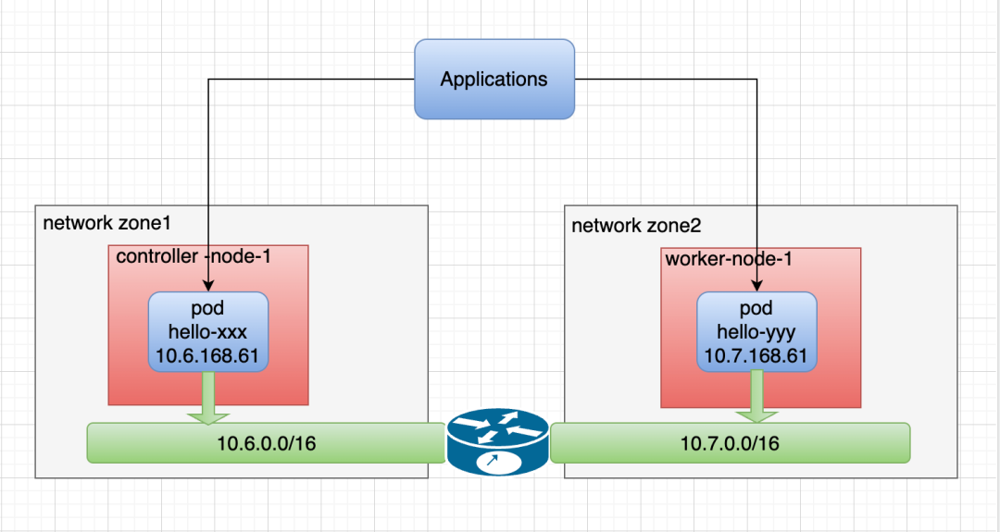

# Cloud-Native Spiderpool: IP Allocation Across Network Zones

**English** | [**简体中文**](./ip-allocation-across-networks-zh_CN.md)

An underlay network, as the name implies, is an underlying network that features low latency, high reliability, and strong security. These characteristics are exactly  what latency-sensitive applications need for optimal user experience, and also facilitate efficient management and protection of network resources. Underlay networks are commonly used for latency-sensitive applications and firewall security control.

* Latency-sensitive applications: applications in specific industries, such as financial trading and real-time video transmission, are highly sensitive to network latency. Underlay networks directly control physical and link-layer connections to reduce data transmission time, providing an ideal solution for these applications.

* Firewall security control and management: firewalls are often used to manage north-south traffic,  namely communication between internal and external networks, by checking, filtering, and restricting communication traffic. IP address management (IPAM) solutions of underlay networks that allocate fixed egress IP addresses for applications can provide better communication management and control between the cluster and external networks, further enhancing overall network security.

The rising popularity of private cloud data centers has made underlay networks  essential components of data center network architecture by offering efficient network transmission and improved network topology management capabilities.

## The Requirements of IP Address Allocation across Network Zones

I recently encountered a scenario while using an underlay network where the nodes of a cluster were distributed across different regions or data centers. Some nodes were restricted to using subnet 10.6.1.0/24 while others could only use subnet 172.16.2.0/24. For an application deploying replicas across subnets, it is essential for IPAM to assign IP addresses that match the subnet for different Pods of the same application on various nodes, ensuring Pods running normally. To achieve this, IPAM must support IP allocation across network zones, enabling flexible deployment and scalability of applications.

The following network topology diagram illustrates this scenario:


Allocating IP addresses across network zones for replicas of the same application is a common production requirement in underlay networks. For this reason, Spiderpool has emerged as an open-source IPAM project for Kubernetes. Spiderpool offers a flexible and intelligent solution for IP allocation across network zones, making it easier to manage IP addresses for applications with replicas distributed across different subnets. Let's dive deeper into Spiderpool.

## A New Solution: Spiderpool

[Spiderpool](https://github.com/spidernet-io/spiderpool) is a Kubernetes IPAM plugin designed to address the specific requirements of underlay networks. It can work with any CNI project that supports third-party IPAM plugins. One of its key features is the ability to allocate IP addresses across network zones, in addition to supporting application IP address fixation, automatic scaling of IP addresses, multiple NICs, and dual-stack. For more information on Spiderpool's capabilities, please refer to the Spiderpool feature [introduction](https://github.com/spidernet-io/spiderpool/blob/main/README-zh_CN.md).

## Demo Environments

To showcase how Spiderpool can allocate IP addresses across network zones, I have prepared a cluster that spans multiple networks and labeled the nodes with available subnet tags. Below is the information about the cluster being used:

```bash
~# kubectl get nodes -owide
NAME                STATUS   ROLES           AGE  VERSION   INTERNAL-IP   EXTERNAL-IP
controller-node-1   Ready    control-plane   1h   v1.25.3   10.6.168.71   <none>
worker-node-1       Ready    <none>          1h   v1.25.3   10.7.168.73   <none>        

~# kubectl get nodes --show-labels
NAME                STATUS   ROLES                  AGE  VERSION   LABELS
controller-node-1   Ready    control-plane,master   1h   v1.25.3   node-subnet=subnet-6, ...
worker-node-1       Ready    <none>                 1h   v1.25.3   node-subnet=subnet-7, ...
```

The cluster's network topology diagram:



## Install

Following the instructions in the [Spiderpool doc](https://github.com/spidernet-io/spiderpool/blob/main/docs/usage/get-started-macvlan-zh_CN.md), I have set up an environment with Multus, Macvlan, Veth, and Spiderpool. The following example demonstrates how SpiderSubnet instances can be created using their own environment:

```bash
~# kubectl get spidersubnet
NAME       VERSION   SUBNET        ALLOCATED-IP-COUNT   TOTAL-IP-COUNT
subnet-6   4         10.6.0.0/16   0                    10
subnet-7   4         10.7.0.0/16   0                    10
```

The configuration for Multus network-attachment-definition named macvlan-conf will be created with the following parameter:

* `master`: the interface `ens192` is used as the parameter for `master` in this case. It is important to note that the interface name must be consistent in all nodes across network zones and match the parameter for `master`.

```bash
cat <<EOF | kubectl apply -f -
apiVersion: k8s.cni.cncf.io/v1
kind: NetworkAttachmentDefinition
metadata:
  name: macvlan-conf
  namespace: kube-system
spec:
  config: |-
    {
        "cniVersion": "0.3.1",
        "name": "macvlan-conf",
        "plugins": [
            {
                "type": "macvlan",
                "master": "ens192",
                "mode": "bridge",
                "ipam": {
                    "type": "spiderpool"
                }
            },{
                  "type": "veth",
                  "service_cidr": ["10.233.0.0/18"]
              }
        ]
    }
EOF
```

## Create IPPools

Spiderpool's CRD: SpiderIPPool contains a `nodeAffinity` field that allows for IP allocation from the  specific SpiderIPPool when a Pod is launched on a node. The Pod will be assigned IPs from the SpiderIPPool only If the node matches the `nodeAffinity` setting.  Otherwise, the IP allocation will fail.

Based on the above, the following YAML can be used to create two SpiderIPPools, each providing IP addresses for Pods on different nodes:

```bash
~# cat <<EOF | kubectl apply -f -
apiVersion: spiderpool.spidernet.io/v2beta1
kind: SpiderIPPool
metadata:
  name: test-ippool-6
spec:
  subnet: 10.6.0.0/16
  ips:
    - 10.6.168.60-10.6.168.69
  gateway: 10.6.0.1
  nodeAffinity:
    matchExpressions:
    - {key: node-subnet, operator: In, values: [subnet-6]}
---
apiVersion: spiderpool.spidernet.io/v2beta1
kind: SpiderIPPool
metadata:
  name: test-ippool-7
spec:
  subnet: 10.7.0.0/16
  ips:
    - 10.7.168.60-10.7.168.69
  gateway: 10.7.0.1
  nodeAffinity:
    matchExpressions:
    - {key: node-subnet, operator: In, values: [subnet-7]}
EOF
```

## Create an Application

The following YAML creates a DaemonSet application with the configurations:

* `ipam.spidernet.io/ippool`: specifies the Spiderpool's IP pools and allows for multiple backup pools. IP address allocation occurs sequentially based on the order of elements in the "IP pool group". If the node where the Pod is scheduled matches the `IPPool.spec.nodeAffinity` annotation of the first IP pool, the Pod will be assigned an IP address from that IP pool. Otherwise, Spiderpool will select an IP pool from the backup pool list until all pools fail. Learn more about using [backup pools](https://github.com/spidernet-io/spiderpool/blob/main/docs/usage/ippool-multi.md).

* `v1.multus-cni.io/default-network`: specifies Multus' NetworkAttachmentDefinition configuration and creates a default NIC for the Pod.

```bash
~# cat <<EOF | kubectl apply -f -
apiVersion: apps/v1
kind: DaemonSet
metadata:
  name: test-app
spec:
  selector:
    matchLabels:
      app: test-app
  template:
    metadata:
      annotations:   
        ipam.spidernet.io/subnet: |-
          {
            "ipv4": ["default-v4-subnet"]
          }
        v1.multus-cni.io/default-network: kube-system/macvlan-standalone-vlan0
      labels:
        app: test-app
    spec:
      containers:
      - name: test-app
        image: nginx
        imagePullPolicy: IfNotPresent
        ports:
        - name: http
          containerPort: 80
          protocol: TCP
EOF
```

After creating an application, it can be observed that each Pod's IP address is assigned from an IP pool belonging to the same subnet as its node.

```bash
~# kubectl get po -l app=test-app -o wide
NAME             READY   STATUS    RESTARTS   AGE   IP            NODE                NOMINATED NODE   READINESS GATES
test-app-j9ftl   1/1     Running   0          45s   10.6.168.65   controller-node-1   <none>           <none>
test-app-nkq5h   1/1     Running   0          45s   10.7.168.61   worker-node-1       <none>           <none>

~# kubectl get spiderippool
NAME            VERSION   SUBNET        ALLOCATED-IP-COUNT   TOTAL-IP-COUNT   DEFAULT   DISABLE
test-ippool-6   4         10.6.0.0/16   1                    10               false     false
test-ippool-7   4         10.7.0.0/16   1                    10               false     false
```

Communication between Pods across network zones:

```bash
~# kubectl exec -ti test-app-j9ftl -- ping 10.7.168.61 -c 2

PING 10.7.168.61 (10.7.168.61) 56(84) bytes of data.
64 bytes from 10.7.168.61: icmp_seq=1 ttl=63 time=1.06 ms
64 bytes from 10.7.168.61: icmp_seq=2 ttl=63 time=0.515 ms

--- 10.7.168.61 ping statistics ---
2 packets transmitted, 2 received, 0% packet loss, time 1002ms
rtt min/avg/max/mdev = 0.515/0.789/1.063/0.274 ms
```

## Conclusion

The test has proved that Pods deployed in different network zones can communicate with each other by utilizing different methods such as Pod IP, clusterIP, and nodePort.  And Spiderpool has demonstrated its effectiveness in fulfilling the IP allocation requirements for these Pods.
