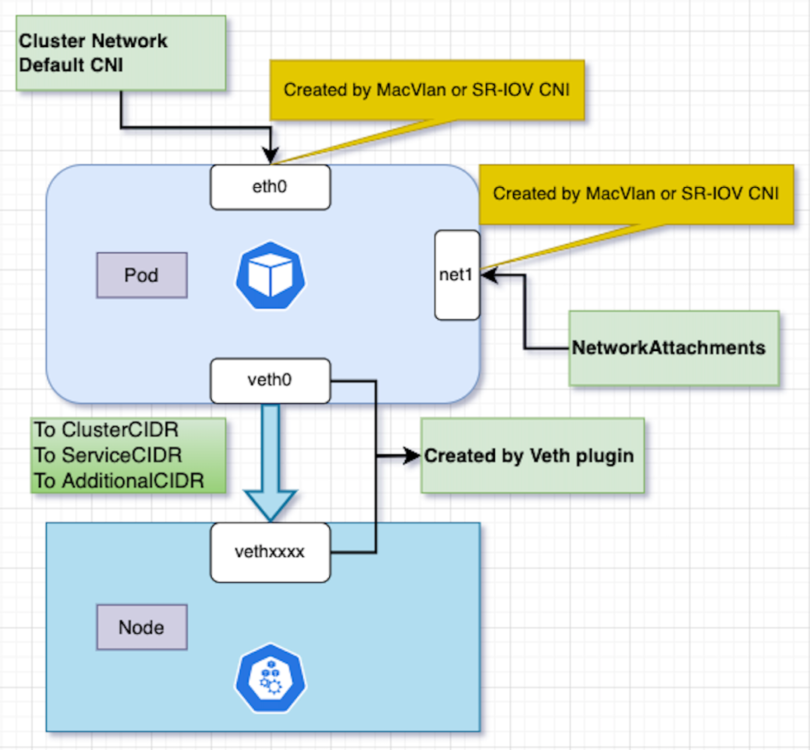

# 云原生网络新玩法：一种支持固定多网卡IP的 underlay 网络解决方案

## Underlay 网络的 IP 需求

随着数据中心私有云的发展，应用希望能直接获取并使用宿主机网络中的 IP 地址，实现在 Underlay 网络下的东西向和南北向通信；同时基于对 IPAM（IP地址管理） 的特殊需求，迫切希望能解决如下的一些诉求：

* Pod 多网卡支持

  1. 为使 Pod 能通达不同的 Underlay 子网，需给应用的不同网卡分配不同子网下的 IP 地址，社区现有的方案配合 Multus 能分配多网卡 IP 地址，但是不能实现多网卡都固定 IP 地址。

  2. 社区现有的多网卡分配 IP 地址方案，还存在多网卡路由协调问题，例如：Pod 的默认路由在网卡 1 上，外部 Client 访问 Pod 网卡 2 的 IP 地址，当外部的源 IP 与 Pod 的网卡 2 不是同网段时，Pod 就会通过默认路由从而走到网卡 1 进行回包，请求向和回复向的转发路径不一致，因此外部的 Client 收不到回包，导致网络不可达。

* 有状态和无状态应用 IP 固定

  1. Pod 的 IP 地址常常受防火墙策略管控，防火墙只会允许特定的 IP 或者 IP 范围内的目标访问，因此 Pod IP 不相对固定，会对防火墙策略的修改产生极大的负担。

  2. 有状态应用的特殊性，不仅要求 Pod 的 IP 范围固定，更要求在 Pod 的生命周期内对 IP 地址的唯一绑定，可以保证应用的可用性、稳定性和可靠性。

  3. 传统微服务应用直接使用 Pod IP 进行微服务注册，对固定 IP 地址的需求。传统应用在云化改造前，是部署在裸金属环境上的，服务之间的网络未引入 NAT 地址转换，微服务架构中需要感知对方的源 IP 或目的 IP。

* 应用固定 IP 地址数量的弹性扩缩容

  1. 应用固定 IP 场景下，IP 地址数量的扩缩容问题。随着应用扩缩容，如果能够实现固定 IP 地址一起扩缩，将避免每次都需要去人工修改 IP 固定池。

  2. 应用固定 IP 场景下，IP 地址数量的冗余问题。应用在滚动更新时，新 Pod 副本先启动，才会删除旧 Pod，在此过程中，如果没有冗余的固定 IP 地址，那么新 Pod 副本会因为缺少新的固定 IP 而启动失败。

开源社区涌现出了一些开源项目，能够提供对接 Underlay 网络的 CNI 方案，但是仍然无法完全满足上述需求：

* Kube-ovn v1.11 能够对接 underlay 网络，为实现固定 IP，必须在 annotation 上 hard code IP 地址，存在以下几个问题：

  * 无法实现 固定 IP 的 CRD 化管理，因此查询 所有的 Pod 不方便，有可能因为运维失误导致出现 IP 冲突。

  * 应用扩缩容时，需要人为添加或删除 annotation 中的 IP 地址。

  * 因为应用的 IP 范围被固定了，在应用滚动发布时，新建的 Pod 可能会面临没有临时的固定 IP 可用。

* Antrea v1.11 能对接 Underlay 网络，不支持 Deployment/Statefulset 类型副本数大于 1 的 IP 地址固定。可参考 [Antrea 文档](https://github.com/antrea-io/antrea/blob/main/docs/antrea-ipam.md#ippool-annotations-on-pod-available-since-antrea-15)。

* Calico 能够通过无隧道模式，配合 BGP 路由发布，实现对接 underlay 网络，但不支持 Deployment/Statefulset 类型的 IP 地址固定。

随着开源社区的不断发展，一个开源项目 SpiderPool 的出现，提供了一种全新的解决方案，能够满足上述应用在 Underlay 网络下的需求，下面一起来了解一下。

## SpiderPool 的 Underlay 解决方案

[SpiderPool](https://spidernet-io.github.io/spiderpool) 是一个 Kubernetes 的 IPAM 插件项目，其主要针对于 Underlay 网络的 IP 地址管理需求而设计，能够为任何兼容第三方 IPAM 插件的 CNI 项目所使用。它克服了 Underlay 网络分配 IP 地址的复杂性，使得 IP 分配的运维工作像一些 Overlay 网络模型一样简单，同时，它拥有应用 IP 地址固定、IP 地址自动弹性扩缩容、 多网卡、双栈支持等特点。更多说明参考 [SpiderPool功能](../../README-zh_CN.md) 介绍。

经过测试，SpiderPool 最大的体验就是：Underlay 网络下 IP 地址的管理能力非常强大，分配固定 IP 从未如此简单！

Spiderpool 可搭配 [Multus](https://github.com/k8snetworkplumbingwg/multus-cni)、[Macvlan](https://github.com/containernetworking/plugins/tree/main/plugins/main/macvlan)、[Calico](https://github.com/projectcalico/calico)、[SRI-OV](https://github.com/k8snetworkplumbingwg/sriov-cni)、[ipvlan](https://github.com/containernetworking/plugins/tree/main/plugins/main/ipvlan)、[vlan](https://github.com/containernetworking/plugins/tree/main/plugins/main/vlan)、[ovs](https://github.com/k8snetworkplumbingwg/ovs-cni)，[Weave](https://github.com/weaveworks/weave) 等多种 CNI 来完成完整的 Underlay 网络解决方案，并且 Spiderpool 还提供一个 [Veth](https://github.com/spidernet-io/plugins) 插件，它能够帮助一些 CNI （例如 Macvlan、SR-IOV 等）解决如下问题：

* 帮助 main CNI 实现 Pod 和宿主机之间的通信，以解决 Pod 访问 clusterIP、Pod 的宿主机健康检查等问题。

* 在 Pod 多网卡场景下，能自动够协调多网卡间的策略路由，解决多网卡通信问题。

本文将以 Multus、Macvlan、Veth、SpiderPool 这套 Underlay 组合方案为例，通过如下网络拓扑图，展示讲解 Pod 多网卡的网络情况。



## 安装

根据 Spiderpool 的 [官方文档](./install/underlay/get-started-macvlan-zh_CN.md) 搭建了一套 Multus 、Macvlan、Veth 、Spiderpool 的环境，以下是笔者根据自身环境已创建的 SpiderSubnet 实例：

```bash
~# kubectl get spidersubnet
NAME                 VERSION   SUBNET        ALLOCATED-IP-COUNT   TOTAL-IP-COUNT
subnet-test-ens192   4         10.6.0.1/16   3                    10
subnet-test-ens224   4         10.7.0.1/16   3                    10
```

笔者的主机上有两张物理网卡，创建两个 Macvlan 的 Multus NetworkAttachmentDefinition 配置，分别用接入 10.6 与 10.7 的 Underlay 子网，以下是已创建的 Multus 的 NetworkAttachmentDefinition 配置：

```bash
~# kubectl get network-attachment-definitions.k8s.cni.cncf.io -n kube-system
NAME                  AGE
macvlan-conf-ens192   10s
macvlan-conf-ens224   21s
```

## 固定多网卡 IP

以下的示例 Yaml 中， 会创建 2 个副本的 Deployment，其中：

* `ipam.spidernet.io/subnets`：用于指定 Spiderpool 的子网，Spiderpool 会自动在该子网中随机选择一些 IP 来创建固定 IP 池，与本应用绑定，实现 IP 固定的效果。因为使用了multus 创建了两张网卡，该 annotation 会为 Pod 创建 2 个属于不同 Underlay 子网的固定 IP 池。

* `ipam.spidernet.io/ippool-ip-number`： 用于指定创建 IP 池 中 的 IP 数量。该 annotation 的写法支持两种方式：一种是数字的方式指定 IP 池的固定数量，例如 `ipam.spidernet.io/ippool-ip-number：1` ；另一种方式是使用加号和数字指定 IP 池的相对数量，例如 `ipam.spidernet.io/ippool-ip-number：+1`，即表示 IP 池中的数量会自动实时保持在应用的副本数的基础上多 1 个 IP，以确保应用在弹性扩缩容时有临时的 IP 可用。

* `v1.multus-cni.io/default-network`：为应用创建一张默认网卡。

* `k8s.v1.cni.cncf.io/networks`: 为应用创建另一张网卡。

```shell
cat <<EOF | kubectl create -f -
apiVersion: apps/v1
kind: Deployment
metadata:
  name: test-app
spec:
  replicas: 2
  selector:
    matchLabels:
      app: test-app
  template:
    metadata:
      annotations:
        ipam.spidernet.io/subnets: |-
         [
            {      
              "interface": "eth0",      
              "ipv4": [       
                "subnet-test-ens192"      
              ]
            },{      
              "interface": "net1",      
              "ipv4": [       
                "subnet-test-ens224"      
              ]
            }
         ]
        ipam.spidernet.io/ippool-ip-number: '+1'
        v1.multus-cni.io/default-network: kube-system/macvlan-conf-ens192
        k8s.v1.cni.cncf.io/networks: kube-system/macvlan-conf-ens224
      labels:
        app: test-app
    spec:
      containers:
      - name: test-app
        image: nginx
        imagePullPolicy: IfNotPresent
        ports:
        - name: http
          containerPort: 80
          protocol: TCP
EOF
```

最终，在 Deployment 创建时，SpiderPool 会随机从指定子网中选择一些 IP 来创建出两个固定 IP 池 与 Deployment Pod 的两张网卡分别形成绑定。

```bash
~# kubectl get spiderippool
NAME                                 VERSION   SUBNET        ALLOCATED-IP-COUNT   TOTAL-IP-COUNT   DEFAULT   DISABLE
auto-test-app-v4-eth0-b1a361c7e9df   4         10.6.0.1/16   2                    3                false     false
auto-test-app-v4-net1-b1a361c7e9df   4         10.7.0.1/16   2                    3                false     false

~# kubectl get spiderippool auto-test-app-v4-eth0-b1a361c7e9df -o jsonpath='{.spec.ips}'
["10.6.168.171-10.6.168.173"]

~# kubectl get spiderippool auto-test-app-v4-net1-b1a361c7e9df -o jsonpath='{.spec.ips}'
["10.7.168.171-10.7.168.173"]

~# kubectl get po -l app=test-app -o wide
NAME                        READY   STATUS    RESTARTS   AGE   IP             NODE    NOMINATED NODE   READINESS GATES
test-app-6f4594ff67-fkqbw   1/1     Running   0          40s   10.6.168.172   node2   <none>           <none>
test-app-6f4594ff67-gwlx8   1/1     Running   0          40s   10.6.168.173   node1   <none>           <none>

~# kubectl exec -ti test-app-6f4594ff67-fkqbw -- ip a
3: eth0@if2: <BROADCAST,MULTICAST,UP,LOWER_UP> mtu 1500 qdisc noqueue state UP group default
    link/ether ae:fa:5e:d9:79:11 brd ff:ff:ff:ff:ff:ff link-netnsid 0
    inet 10.6.168.172/16 brd 10.6.255.255 scope global eth0
       valid_lft forever preferred_lft forever
4: veth0@if13: <BROADCAST,MULTICAST,UP,LOWER_UP> mtu 1500 qdisc noqueue state UP group default
    link/ether 26:6f:22:91:22:f9 brd ff:ff:ff:ff:ff:ff link-netnsid 0
5: net1@if3: <BROADCAST,MULTICAST,UP,LOWER_UP> mtu 1500 qdisc noqueue state UP group default
    link/ether d6:4b:c2:6a:62:0f brd ff:ff:ff:ff:ff:ff link-netnsid 0
    inet 10.7.168.173/16 brd 10.7.255.255 scope global net1
       valid_lft forever preferred_lft forever
```

如下命令展示了 Pod 中的多网卡路由信息，Veth 插件能自动够协调多网卡间的策略路由，解决多网卡间的通信问题。

```bash
~# kubectl exec -ti test-app-6f4594ff67-fkqbw -- ip rule show
0:  from all lookup local
32764:  from 10.7.168.173 lookup 100
32765:  from all to 10.7.168.173/16 lookup 100
32766:  from all lookup main
32767:  from all lookup default

~# kubectl exec -ti test-app-6f4594ff67-fkqbw -- ip r show main
default via 10.6.0.1 dev eth0

~# kubectl exec -ti test-app-6f4594ff67-fkqbw -- ip route show table 100
default via 10.7.0.1 dev net1
10.6.168.123 dev veth0 scope link
10.7.0.0/16 dev net1 proto kernel scope link src 10.7.168.173
10.96.0.0/12 via 10.6.168.123 dev veth0
```

经过多次测试，不断重启 Pod，其 Pod IP 都被固定在两个 IP 池范围内:

```bash
~# kubectl delete po -l app=test-app

~# kubectl get po -l app=test-app -o wide
NAME                        READY   STATUS    RESTARTS   AGE   IP             NODE    NOMINATED NODE   READINESS GATES
test-app-6f4594ff67-5lhgz   1/1     Running   0          8s    10.6.168.171   node1   <none>           <none>
test-app-6f4594ff67-kd99s   1/1     Running   0          8s    10.6.168.173   node2   <none>           <none>

```

## 固定 IP 数量的弹性扩缩容

创建 Deployment 时指定了注解 `ipam.spidernet.io/ippool-ip-number: '+1'`，其表示应用分配到的固定 IP 数量比应用的副本数多 1 个，在应用滚动更新时，能够避免旧 Pod 未删除，新 Pod 没有可用 IP 的问题。

以下演示了扩容场景，将应用的副本数从 2 扩容到 3，应用对应的两个固定 IP 池会自动从 3 个 IP 扩容到 4 个 IP，一直保持一个冗余 IP，符合预期:

```bash
~# kubectl scale deploy test-app --replicas 3

~# kubectl get po -l app=test-app -o wide
NAME                        READY   STATUS    RESTARTS   AGE   IP             NODE    NOMINATED NODE   READINESS GATES
test-app-6f4594ff67-5lhgz   1/1     Running   0          35s   10.6.168.171   node1   <none>           <none>
test-app-6f4594ff67-kd99s   1/1     Running   0          35s   10.6.168.173   node2   <none>           <none>
test-app-6f4594ff67-kxmjd   1/1     Running   0          8s    10.6.168.172   node1   <none>           <none>

~# kubectl get spiderippool
NAME                                 VERSION   SUBNET        ALLOCATED-IP-COUNT   TOTAL-IP-COUNT   DEFAULT   DISABLE
auto-test-app-v4-eth0-b1a361c7e9df   4         10.6.0.1/16   3                    4                false     false
auto-test-app-v4-net1-b1a361c7e9df   4         10.7.0.1/16   3     
```

通过上述操作，SpiderPool 对于应用扩缩容的场景，只需要修改应用的副本数即可。

## Spiderpool 的更多功能

* 手动建池固定 IP。在需要防火墙等手段来精细管控网络安全场景下，网络管理员希望自己来直接指定应用的固定 IP 地址，而不是由 Spiderpool 自动从子网中随机选择 IP 。对此 SpiderPool 提供注解 `ipam.spidernet.io/ippool` 与 `ipam.spidernet.io/ippools` 能手动为应用绑定指定的 IP 池，但手动指定池将不支持自动扩缩容。 参考[手动建池](./ippool-affinity-pod.md)

* 预留 IP。设置全局的 IP 预留，使得集群不会分配出这些 IP 地址，这样能避免与集群外部的已用 IP 冲突，参考 [预留 IP](./reserved-ip.md)。

* 备用 IP 池。应用可设置多个 IP 池，实现 IP 资源的备用效果。可参考 [备用 IP 池](./ippool-multi.md)

* IP 回收。合理的 IP 回收机制设计，可最大保证 IP 资源的可用性。参考[IP 回收机制](./gc-zh_CN.md)

* 分配和释放 IP 地址的高效性能。确保应用的快速发布和删除，保证了集群在容灾场景下的快速恢复。可查看[性能数据](./performance-zh_CH.md)

## 结论

经过测试：Pod 能够通过 Pod IP、clusterIP、nodePort 等方式通信，在 Underlay 网络下，SpiderPool 搭配 Multus 、Macvlan、Veth 能支持多网卡固定 IP 地址的需求，这为解决多网卡固定 IP 地址提供了一种全新的方案。
