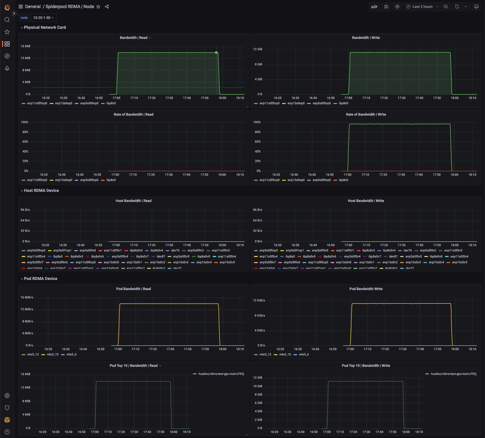

# RDMA 指标

[**English**](./rdma-metrics.md) | **简体中文**

RDMA 是一种高效的网络通信技术，允许一台计算机直接访问另一台计算机的内存，无需操作系统介入，从而减少延迟，提高数据传输速度和效率。RDMA 支持高速数据传输，减少 CPU 负载，非常适用于需要高速网络通信的场景。

在 Kubernetes 集群中，spiderpool CNI 支持 RoCE 和 IB 2 种 RDMA 场景，Pod 可以通过共享和独占的方式使用 RDMA 网卡，用户可以根据需求选择合适的方式来使用 RDMA 网卡。

spiderpool 同时提供了 RDMA exporter 功能和 grafana 监控面板，通过实时监控 Pod/Node RDMA 网络的性能，包括吞吐量、延迟、丢包率等，可以时发现问题并采取措施解决，提高网络的可靠性和性能。

## RDMA 指标的常见场景

1. **性能监控**:
    - **吞吐量**: 测量通过网络传输的数据量。
    - **延迟**: 测量数据从源到目的地的传输时间。
    - **丢包率**: 监控传输过程中丢失的数据包数量。

2. **错误检测**:
    - **传输错误**: 检测数据传输中的错误。
    - **连接失败**: 监控失败的连接尝试和断开连接。

3. **网络健康状况**:
    - **拥塞**: 检测网络拥塞和瓶颈。

## 如何开启

```shell
helm upgrade --install spiderpool spiderpool/spiderpool --reuse-values --wait --namespace spiderpool --create-namespace \
  --set sriov.install=true \
  --set spiderpoolAgent.prometheus.enabled=true \
  --set spiderpoolAgent.prometheus.enabledRdmaMetric=true \
  --set grafanaDashboard.install=true \
  --set spiderpoolAgent.prometheus.serviceMonitor.install=true
```

- 通过设置 `--reuse-values` 重用现有的配置
- 通过设置 `--wait` 等待所有 Pod 运行
- 通过设置 `--namespace` 指定 Helm 安装的命名空间
- 通过设置 `--set sriov.install=true` 开启 SR-IOV, 更多可以参考 [创建集群 - 基于 SR-IOV 技术给容器提供 RDMA 通信能力](./install/ai/index-zh_CN.md).
- 通过设置 `--set spiderpoolAgent.prometheus.enabled` 启用 Prometheus 监控
- 通过设置 `--set spiderpoolAgent.prometheus.enabledRdmaMetric=true`，可以启用 RDMA 指标 exporter
- 通过设置 `--set grafanaDashboard.install=true`，可以启用 GrafanaDashboard 看板（GrafanaDashboard 要求集群安装 [grafana-operator](https://github.com/grafana/grafana-operator)，如果您不使用 grafana-operator，则需要将 charts/spiderpool/files 看板导入到您的 grafana）。

## 指标参考

访问 [Metrics 参考](../reference/metrics.md) 查看指标的详细信息。

## Grafana 监控面板

以下四个监控面板中，RDMA Pod 监控面板仅展示来自 RDMA 隔离子系统中 SR-IOV Pod 的监控数据。而对于采用共享方式的 macVLAN Pod，其 RDMA 网卡数据未纳入该面板。

Grafana RDMA Cluster 监控面板，可以查看当前集群每个节点的 RDMA 监控。


Grafana RDMA Node 监控面板，可以查看每个物理网卡的 RDMA 监控，以及该物理网卡的带宽利用率。同时提供了该节点宿主机的 vf 网卡统计，以及该节点 Pod 使用 RDMA 网卡的监控。


Grafana RDMA Pod 监控面板，可以查看 Pod 里面每张网卡的 RDMA 监控，同时提供了网卡错误统计信息，根据这些信息的统计可以排查问题。


Grafana RDMA Workload 监控面板。在进行 AI 推理和训练时，往往使用 Job, Deployment, KServer 等顶层资源下发 CR 启动一组 Pod 进行训练，可以查看每个顶层资源的 RDMA 监控。 

