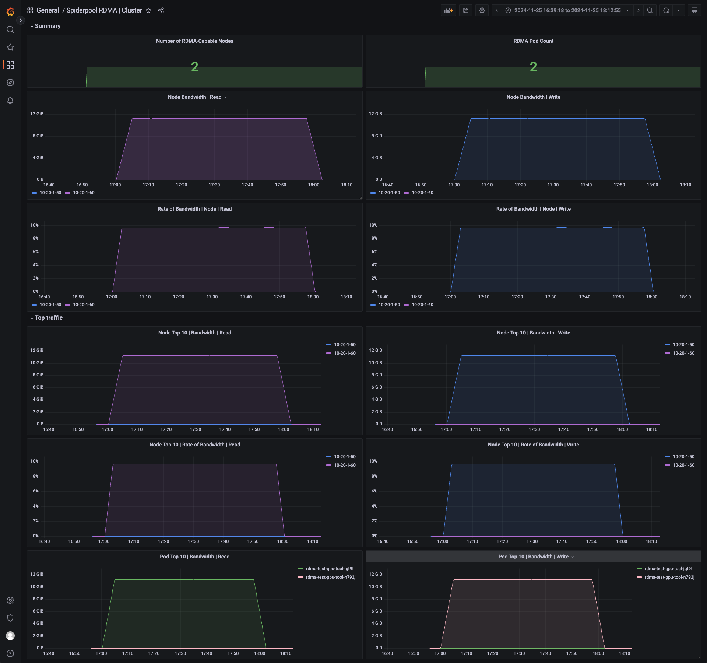
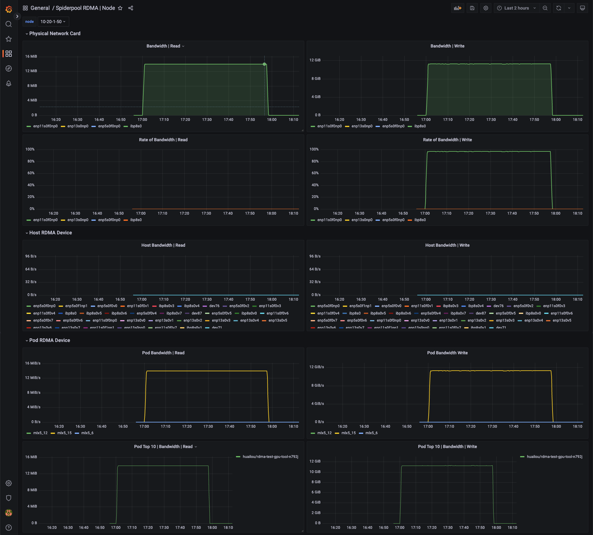
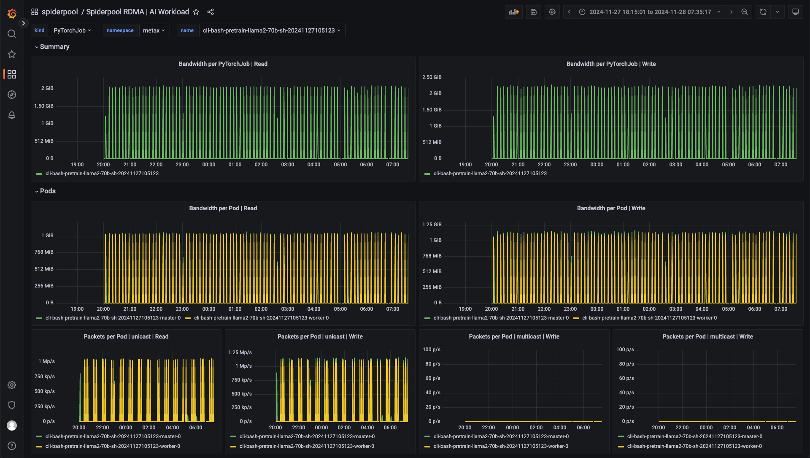

# RDMA Metrics

**English** ｜ [**简体中文**](./rdma-metrics-zh_CN.md)

RDMA is an efficient network communication technology that allows one computer to directly access the memory of another computer without involving the operating system, thus reducing latency and improving data transfer speed and efficiency. RDMA supports high-speed data transmission and reduces CPU load, making it ideal for scenarios requiring high-speed network communication.

In a Kubernetes cluster, the spiderpool CNI supports two RDMA scenarios: RoCE and IB. Pods can use the RDMA network card in either shared or exclusive modes. Users can choose the appropriate method based on their needs for utilizing RDMA network cards.

Spiderpool also provides an RDMA exporter feature and a Grafana monitoring panel. By monitoring the performance of Pod/Node RDMA networks in real-time, including throughput, latency, packet loss rate, etc., issues can be detected and measures taken to improve network reliability and performance.

## Common Scenarios for RDMA Metrics

1. **Performance Monitoring**:
    - **Throughput**: Measures the amount of data transmitted over the network.
    - **Out Of Sequence**: Monitors the statistics of out-of-order packets in the network.
    - **Packet Loss Rate**: Monitors the number of data packets lost during transmission.

2. **Error Detection**:
    - **Transmission Errors**: Detects errors in data transmission.
    - **Connection Failures**: Monitors failed connection attempts and disconnects.

3. **Network Health**:
    - **Congestion**: Detects network congestion and bottlenecks.

## How to Enable

```shell
helm upgrade --install spiderpool spiderpool/spiderpool --reuse-values --wait --namespace spiderpool --create-namespace \
  --set sriov.install=true \
  --set spiderpoolAgent.prometheus.enabled=true \
  --set spiderpoolAgent.prometheus.enabledRdmaMetric=true \
  --set grafanaDashboard.install=true \
  --set spiderpoolAgent.prometheus.serviceMonitor.install=true
```

- Use `--reuse-values` to reuse existing configurations.
- Use `--wait` to wait for all Pods to be running.
- Use `--namespace` to specify the Helm installation namespace.
- Use `--set sriov.install=true` to enable SR-IOV, For more you can refer to [Create a cluster - provide Infiniband and RoCE RDMA network with SR-IOV](./install/ai/get-started-sriov.md).
- Use `--set spiderpoolAgent.prometheus.enabled` to enable Prometheus monitoring.
- Use `--set spiderpoolAgent.prometheus.enabledRdmaMetric=true` to enable the RDMA metric exporter.
- Use `-set grafanaDashboard.install=true` to install Grafana Dashboard (GrafanaDashboard requires the cluster to install [grafana-operator](https://github.com/grafana/grafana-operator), or if you don't use it, you need to import the charts/spiderpool/files dashboard into your grafana).

## Metric Reference

Visit [Metrics Reference](../reference/metrics.md) to view detailed information about the metrics.

## Grafana Monitoring Dashboard

Among the following four monitoring dashboards, the RDMA Pod monitoring dashboard only displays monitoring data from SR-IOV Pods in the RDMA-isolated subsystem. As for macVLAN Pods, which use a shared mode, their RDMA network card data is not included in this dashboard.

The Grafana RDMA Cluster monitoring dashboard provides a view of the RDMA metrics for each node in the current cluster.  


The Grafana RDMA Node monitoring dashboard displays RDMA metrics for each physical NIC (Network Interface Card) and the bandwidth utilization of those NICs. It also includes statistics for VF NICs on the host node and monitoring metrics for Pods using RDMA NICs on that node.  
  

The Grafana RDMA Pod monitoring dashboard provides RDMA metrics for each NIC within a Pod, along with NIC error statistics. These metrics help in troubleshooting issues.  


The Grafana RDMA Workload monitoring dashboard is designed for monitoring RDMA metrics for top-level resources such as Jobs, Deployments, and KServers. These resources typically initiate a set of Pods for AI inference and training tasks.  


## Metrics Description

| Name                       | Description                                                                                                                                                         | Data Source |
|----------------------------|---------------------------------------------------------------------------------------------------------------------------------------------------------------------|-------------|
| rx_write_requests          | The number of received WRITE requests for the associated QPs.                                                                                                       | rdma  cli   |
| rx_read_requests           | The number of received read requests                                                                                                                                | rdma  cli   |
| rx_atomic_requests         | The number of received atomic requests                                                                                                                              | rdma  cli   |
| rx_dct_connect             | The number of received DCT connect requests                                                                                                                         | rdma  cli   |
| out_of_buffer              | The number of out of buffer errors                                                                                                                                  | rdma  cli   |
| out_of_sequence            | The number of out-of-order arrivals                                                                                                                                 | rdma  cli   |
| duplicate_request          | The number of duplicate requests                                                                                                                                    | rdma  cli   |
| rnr_nak_retry_err          | The number of received RNR NAK packets did not exceed the QP retry limit                                                                                            | rdma  cli   |
| packet_seq_err             | The number of packet sequence errors                                                                                                                                | rdma  cli   |
| implied_nak_seq_err        | The number of implied NAK sequence errors                                                                                                                           | rdma  cli   |
| local_ack_timeout_err      | The number of times QP’s ack timer expired for RC, XRC, DCT QPs at the sender side                                                                                  | rdma  cli   |
| resp_local_length_error    | The number of times responder detected local length errors                                                                                                          | rdma  cli   |
| resp_cqe_error             | The number of response CQE errors                                                                                                                                   | rdma  cli   |
| req_cqe_error              | The number of times requester detected CQEs completed with errors                                                                                                   | rdma  cli   |
| req_remote_invalid_request | The number of times requester detected remote invalid request errors                                                                                                | rdma  cli   |
| req_remote_access_errors   | The number of request remote access errors                                                                                                                          | rdma  cli   |
| resp_remote_access_errors  | The number of response remote access errors                                                                                                                         | rdma  cli   |
| resp_cqe_flush_error       | The number of response CQE flush errors                                                                                                                             | rdma  cli   |
| req_cqe_flush_error        | The number of request CQE flush errors                                                                                                                              | rdma  cli   |
| roce_adp_retrans           | The number of RoCE adaptive retransmissions                                                                                                                         | rdma  cli   |
| roce_adp_retrans_to        | The number of RoCE adaptive retransmission timeouts                                                                                                                 | rdma  cli   |
| roce_slow_restart          | The number of RoCE slow restart                                                                                                                                     | rdma  cli   |
| roce_slow_restart_cnps     | The number of times RoCE slow restart generated CNP packets                                                                                                         | rdma  cli   |
| roce_slow_restart_trans    | The number of times RoCE slow restart changed state to slow restart                                                                                                 | rdma  cli   |
| rp_cnp_ignored             | The number of CNP packets received and ignored by the Reaction Point HCA                                                                                            | rdma  cli   |
| rp_cnp_handled             | The number of CNP packets handled by the Reaction Point HCA to throttle the transmission rate                                                                       | rdma  cli   |
| np_ecn_marked_roce_packets | The number of RoCEv2 packets received by the notification point which were marked for experiencing the congestion (ECN bits where ‘11’ on the ingress RoCE traffic) | rdma  cli   |
| np_cnp_sent                | The number of CNP packets sent by the Notification Point when it noticed congestion experienced in the RoCEv2 IP header (ECN bits)                                  | rdma  cli   |
| rx_icrc_encapsulated       | The number of RoCE packets with ICRC errors                                                                                                                         | rdma  cli   |
| vport_speed_mbps           | The speed of the virtual port expressed in megabits per second (Mbps).                                                                                              | ethtool cli |
| rx_discards                | The number of packets discarded by the device.                                                                                                                      | ethtool cli |
| tx_discards                | The number of packets discarded by the device.                                                                                                                      | ethtool cli |
| rx_pause                   | The number of packets dropped by the device.                                                                                                                        | ethtool cli |
| tx_pause                   | The number of packets dropped by the device.                                                                                                                        | ethtool cli |
