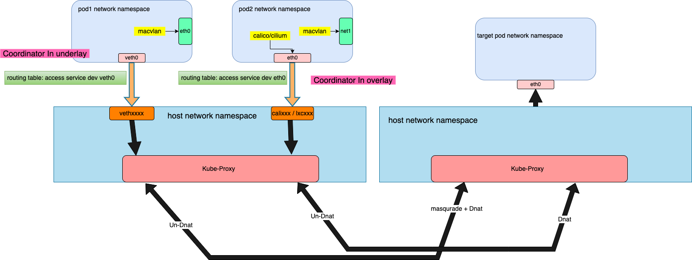

# Access to service for underlay CNI

**English** | [**简体中文**](./underlay_cni_service-zh_CN.md)

## Introduction

At present, most Underlay-type CNIs (such as Macvlan, IPVlan, Sriov-CNI, etc.) In the community are
generally connected to the underlying network, and often do not natively support accessing the Service of the cluster.
This is mostly because underlay Pod access to the Service needs to be forwarded through the gateway of the switch.
However, there is no route to the Service on the gateway, so the packets accessing the Service cannot be routed
correctly, resulting in packet loss.

Spiderpool provides the following two solutions to solve the problem of Underlay CNI accessing Service:

- Use `kube-proxy` to access Service
- Use `cgroup eBPF` to access Service

Both of these ways solve the problem that Underlay CNI cannot access Service, but the implementation principle is
somewhat different.

Below we will introduce these two ways:

## Access service by kube-proxy

Spiderpool has a built-in plugin called `coordinator`, which helps us seamlessly integrate with `kube-proxy` to achieve Underlay CNI access to Service.
Depending on different scenarios, the `coordinator` can run in either `underlay` or `overlay` mode. Although the implementation methods are slightly different,
the core principle is to hijack the traffic of Pods accessing Services onto the host network protocol stack and then forward it through the IPtables rules created by Kube-proxy.

The following is a brief introduction to the data forwarding process flowchart:



### coordinator run in underlay

Under this mode, the coordinator plugin will create a pair of Veth devices, with one end placed in the host and the other end placed in the network namespace of the Pod.
Then set some routing rules inside the Pod to forward access to ClusterIP from the veth device. The coordinator defaults to auto mode, which will automatically determine
whether to run in underlay or overlay mode. You only need to inject an annotation into the Pod: `v1.multus-cni.io/default-network: kube-system/<Multus_CR_NAME>`.

After creating a Pod in Underlay mode, we enter the Pod and check the routing information:

```shell
root@controller:~# kubectl exec -it macvlan-underlay-5496bb9c9b-c7rnp sh
kubectl exec [POD] [COMMAND] is DEPRECATED and will be removed in a future version. Use kubectl exec [POD] -- [COMMAND] instead.
#
# ip a show veth0
5: veth0@if428513: <BROADCAST,MULTICAST,UP,LOWER_UP> mtu 1500 qdisc noqueue state UP group default
    link/ether 4a:fe:19:22:65:05 brd ff:ff:ff:ff:ff:ff link-netnsid 0
    inet6 fe80::48fe:19ff:fe22:6505/64 scope link
       valid_lft forever preferred_lft forever
# ip r
default via 10.6.0.1 dev eth0
10.6.0.0/16 dev eth0 proto kernel scope link src 10.6.212.241
10.6.212.101 dev veth0 scope link
10.233.64.0/18 via 10.6.212.101 dev veth0
```

- **10.6.212.101 dev veth0 scope link**: `10.6.212.101` is the node's IP, which ensure where the Pod access the same node via `veth0`.
- **10.233.64.0/18 via 10.6.212.101 dev veth0**: 10.233.64.0/18 is cluster service subnet, which ensure the Pod access ClusterIP via `veth0`.

This solution heavily relies on the `MASQUERADE` of kube-proxy, otherwise the reply packets will be directly forwarded to the source Pod,
and if they pass through some security devices, the packets will be dropped. Therefore, in some special scenarios, we need to set `masqueradeAll`
of kube-proxy to true.

> By default, the underlay subnet of a Pod is different from the clusterCIDR of the cluster, so there is no need to enable `masqueradeAll`, and access between them will be SNATed.
>
> If the underlay subnet of a Pod is the same as the clusterCIDR of the cluster, then we must set `masqueradeAll` to true.

### coordinator run in overlay

Configuring `coordinator` as Overlay mode can also solve the problem of Underlay CNI accessing Service. The traditional Overlay type (such as [Calico](https://github.com/projectcalico/calico)
and [Cilium](https://github.com/cilium/cilium) etc.) CNI has perfectly solved the access to Service problem. We can use it to help Underlay Pods access Service. We can attach multiple network cards to the Pod,
`eth0` for creating by Overlay CNI, `net1` for creating by Underlay CNI, and set up policy routing table items through `coordinator` to ensure that when a Pod accesses Service, it forwards from `eth0`, and
replies are also forwarded to `eth0`.

> By default, the value of mode is auto(spidercoordinator CR spec.mode is auto), `coordinator` will automatically determine whether the current CNI call is not `eth0`. If it's not, confirm that there is no `veth0` network card in the Pod, then automatically determine it as overlay mode.
>
> In overlay mode, Spiderpool will automatically synchronize the cluster default CNI Pod subnets, which are used to set routes in multi-network card Pods to enable it to communicate normally with Pods created by the default CNI when it accesses Service from `eth0`. This configuration corresponds to `spidercoordinator.spec.podCIDRType`, the default is `auto`, optional values: ["auto","calico","cilium","cluster","none"]
>
> These routes are injected at the start of the Pod, and if the related CIDR changes, it cannot automatically take effect on already running Pods, this requires restarting the Pod to take effect.
>
> For more details, please refer to [CRD-Spidercoordinator](../reference/crd-spidercoordinator.md)

When creating a Pod in Overlay mode and entering the Pod network command space, view the routing information:

```shell
root@controller:~# kubectl exec -it macvlan-overlay-97bf89fdd-kdgrb sh
kubectl exec [POD] [COMMAND] is DEPRECATED and will be removed in a future version. Use kubectl exec [POD] -- [COMMAND] instead.

# ip rule
0: from all lookup local
32765: from 10.6.212.227 lookup 100
32766: from all lookup main
32767: from all lookup default
# ip r
default via 169.254.1.1 dev eth0
10.6.212.102 dev eth0 scope link
10.233.0.0/18 via 10.6.212.102 dev eth0
10.233.64.0/18 via 10.6.212.102 dev eth0
169.254.1.1 dev eth0 scope link
# ip r show table 100
default via 10.6.0.1 dev net1
10.6.0.0/16 dev net1 proto kernel scope link src 10.6.212.227
```

- **32762: from all to 10.233.64.0/18 lookup 100**: Ensure that when Pods access ClusterIP, they go through table 100 and are forwarded out from `eth0`.
- In the default configuration: Except for the default route, all routes are retained in the Main table, but the default route for 'net1' is moved to table 100.

These policy routes ensure that Underlay Pods can also normally access Service in multi-network card scenarios.

## Access service by cgroup eBPF

In Spiderpool, we hijack the traffic of Pods accessing Services through a `coordinator` that forwards it to the host and then through the iptables rules set up by the host's Kube-proxy.
This can solve the problem but may extend the data access path and cause some performance loss.

The open-source CNI project, Cilium, supports replacing the kube-proxy system component entirely with eBPF technology. It can help us resolve Service addresses. When pod accessing a Service,
the Service address will be directly resolved by the eBPF program mounted by Cilium on the target Pod, so that the source Pod can directly initiate access to the target Pod without going through
the host's network protocol stack. This greatly shortens the access path and achieves acceleration in accessing Service. With the power of Cilium, we can also implement acceleration in accessing Service
under the Underlay CNI through it.


After testing, compared with kube-proxy manner, cgroup eBPF solution has [an improvement of the performance Up to 25% on network delay, up to 50% on network throughput](../concepts/io-performance.md) .

The following steps demonstrate how to accelerate access to a Service on a cluster with 2 nodes based on Macvlan CNI + Cilium:

> NOTE: Please ensure that the kernel version of the cluster nodes is at least greater than 4.19

Prepare a cluster without the kube-proxy component installed in advance. If kube-proxy is already installed, you can refer to the following commands to remove the kube-proxy component:

```shell
~# kubectl delete ds -n kube-system kube-proxy
~# # run the command on every node
~# iptables-save | grep -v KUBE | iptables-restore
```

To install the Cilium component, make sure to enable the kube-proxy replacement feature:

```shell
~# helm repo add cilium https://helm.cilium.io
~# helm repo update
~# API_SERVER_IP=<your_api_server_ip>
~# # Kubeadm default is 6443
~# API_SERVER_PORT=<your_api_server_port>
~# helm install cilium cilium/cilium --version 1.14.3 \
  --namespace kube-system \
  --set kubeProxyReplacement=true \
  --set k8sServiceHost=${API_SERVER_IP} \
  --set k8sServicePort=${API_SERVER_PORT}
```

The installation is complete, check the pod's state:

```shell
～# kubectl  get po -n kube-system | grep cilium
cilium-2r6s5                             1/1     Running     0              15m
cilium-lr9lx                             1/1     Running     0              15m
cilium-operator-5ff9f86dfd-lrk6r         1/1     Running     0              15m
cilium-operator-5ff9f86dfd-sb695         1/1     Running     0              15m
```

To install Spiderpool, see [Install](./install/underlay/get-started-macvlan-zh_CN.md) to install Spiderpool:

```shell
~# helm install spiderpool spiderpool/spiderpool -n kube-system \
  --set multus.multusCNI.defaultCniCRName="macvlan-conf" \
  --set  coordinator.podCIDRType=none
```

> set coordinator.podCIDRType=none, the spiderpool will not get the cluster's ServiceCIDR. Service-related routes are also not injected when pods are created.
>
> Access to the Service in this way is entirely dependent on Cilium kube-proxy Replacement.

show the installation of Spiderpool:

```shell
~# kubectl get pod -n kube-system
spiderpool-agent-9sllh                         1/1     Running     0          1m
spiderpool-agent-h92bv                         1/1     Running     0          1m
spiderpool-controller-7df784cdb7-bsfwv         1/1     Running     0          1m
spiderpool-init                                0/1     Completed   0          1m
```

Create a MacVLAN-related Multus configuration and create a companion IPPools resource:

```shell
cat <<EOF | kubectl apply -f -
apiVersion: spiderpool.spidernet.io/v2beta1
kind: SpiderIPPool
metadata:
  name: v4-pool
spec:
  gateway: 172.81.0.1
  ips:
  - 172.81.0.100-172.81.0.120
  subnet: 172.81.0.0/16
---
apiVersion: spiderpool.spidernet.io/v2beta1
kind: SpiderMultusConfig
metadata:
  name: macvlan-ens192
  namespace: kube-system
spec:
  cniType: macvlan
  enableCoordinator: true
  macvlan:
    master:
    - "ens192"
    ippools:
      ipv4: ["v4-pool"]
EOF
```

> needs to ensure that ens192 exists on the cluster nodes
>
> recommends setting enableCoordinator to true, which can resolve issues with pod health detection

Create a set of cross-node DaemonSet apps for testing:

```shell
ANNOTATION_MULTUS="v1.multus-cni.io/default-network: kube-system/macvlan-ens192"
NAME=ipvlan
cat <<EOF | kubectl apply -f -
apiVersion: apps/v1
kind: DaemonSet
metadata:
  name: ${NAME}
  labels:
    app: $NAME
spec:
  selector:
    matchLabels:
      app: $NAME
  template:
    metadata:
      name: $NAME
      labels:
        app: $NAME
      annotations:
        ${ANNOTATION_MULTUS}
    spec:
      containers:
      - name: test-app
        image: nginx
        imagePullPolicy: IfNotPresent
        ports:
        - name: http
          containerPort: 80
          protocol: TCP
---
apiVersion: v1
kind: Service
metadata:
  name: ${NAME}
spec:
  - ports:
    name: http
    port: 80
    protocol: TCP
    targetPort: 80
  selector:
    app: ${NAME}
  type: ClusterIP
EOF
```

Verify the connectivity of the access service and see if the performance is improved:

```shell
~# kubectl exec -it ipvlan-test-55c97ccfd8-kd4vj sh
kubectl exec [POD] [COMMAND] is DEPRECATED and will be removed in a future version. Use kubectl exec [POD] -- [COMMAND] instead.
/ # curl 10.233.42.25 -I
HTTP/1.1 200 OK
Server: nginx
Date: Fri, 20 Oct 2023 07:52:13 GMT
Content-Type: text/html
Content-Length: 4055
Last-Modified: Thu, 02 Mar 2023 10:57:12 GMT
Connection: keep-alive
ETag: "64008108-fd7"
Accept-Ranges: bytes
```

Open another terminal, enter the network space of the pod, and use the `tcpdump` tool to see that when the packet accessing the service is sent from the pod network namespace,
the destination address has been resolved to the target pod address:

```shell
~# tcpdump -nnev -i eth0 tcp and port 80
tcpdump: listening on eth0, link-type EN10MB (Ethernet), capture size 262144 bytes
10.6.185.218.43550 > 10.6.185.210.80: Flags [S], cksum 0x87e7 (incorrect -> 0xe534), seq 1391704016, win 64240, options [mss 1460,sackOK,TS val 2667940841 ecr 0,nop,wscale 7], length 0
10.6.185.210.80 > 10.6.185.218.43550: Flags [S.], cksum 0x9d1a (correct), seq 2119742376, ack 1391704017, win 65160, options [mss 1460,sackOK,TS val 3827707465 ecr 2667940841,nop,wscale 7], length 0 
```

`10.6.185.218` is the IP of the source pod and `10.6.185.210` is the IP of the destination pod. Before and after using the `sockperf` tool to test the Cilium acceleration, the data comparison of pods accessing ClusterIP across nodes is obtained:

|   | latency(usec) | RPS |
|---|---|---|
| with kube-proxy | 36.763 | 72254.34 |
| without kube-proxy | 27.743 | 107066.38 |

According to the results, after Cilium kube-proxy replacement, access to the service is accelerated by about 30%. For more test data, please refer to [Network I/O Performance](../concepts/io-performance.md)

## Conclusion

There are two solutions to the Underlay CNI Access Service. The kube-proxy method is more commonly used and stable, and can be used stably in most environments. cgroup eBPF is an alternative option for Underlay CNI to access the Service and accelerates Service access. Although there are certain restrictions and thresholds for use, it can meet the needs of users in specific scenarios.
